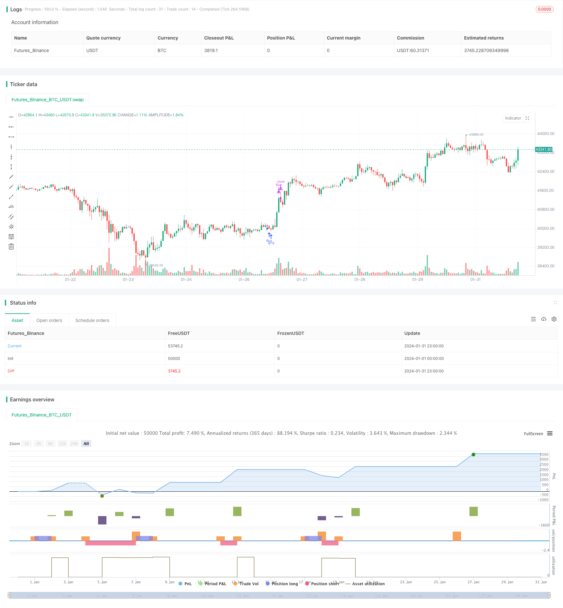

> Name

Quantitative trading strategy EMA-and-RSI-Quantitative-Trading-Strategy based on EMA moving average and RSI indicator
> Author

ChaoZhang

> Strategy Description


[trans]
## Overview
This strategy is called the "double dip strategy". This strategy uses the combination of the EMA moving average system and the RSI indicator to form trading signals, and sets stop loss and take profit conditions to achieve loss control and profit targets. Strategies are suitable for trading BTC/USD and other digital currencies.
## Strategy Principle
This strategy uses the 50-day EMA and the 100-day SMA as its core technical indicators. When the short-term EMA crosses the long-term SMA, a buy signal is generated; when the EMA crosses below the SMA, a sell signal is generated. This is a typical trend following strategy. At the same time, the RSI indicator is used to determine whether the market is overheated or cold. RSI above 70 is an overbought zone, and below 30 is an oversold zone, which can avoid unnecessary pursuit of highs and lows.
The specific trading rules are as follows:
Buy condition: 50-day EMA crosses above 100-day SMA
Sell condition: 50-day EMA crosses below 100-day SMA
Take-profit conditions: Close long orders when RSI is greater than 70; close short orders when RSI is less than 30
## Strategic Advantages
This strategy integrates moving averages, RSI and other indicators to form a relatively stable and reliable trading signal. Compared with a single indicator, multi-indicator integration can filter out some false signals.
EMA responds quickly to price changes, and SMA can suppress short-term noise. The combined use of EMA and SMA balances the sensitivity of the indicator.
The RSI indicator determines the overbought and oversold zones, which helps to grasp the general trend and avoid chasing highs and selling lows.
## Strategy Risk
This strategy relies on indicators to fit historical data, and there is a risk of overfitting. If market conditions change significantly, strategy performance will be affected. In addition, the digital currency market is highly volatile, and it is also difficult to set stop loss points.
How to deal with it:
1. Continue to optimize indicator parameters and improve signal quality
2. Combine more factors to determine trading opportunities
3. Dynamically adjust stop loss levels and optimize stop loss strategies
## Strategy optimization direction
This strategy can be further optimized from the following aspects:
1. Integrate more indicators, such as MACD, Bollinger Bands, etc., to form indicator clusters and enhance the robustness of signals.
2. Try the machine learning model to automatically optimize indicator parameters. At present, parameters rely on empirical value settings, and algorithms such as reinforcement learning and evolutionary optimization can be used to automatically find optimal parameters.
3. Combined with trading volume indicators. Increase transaction volume confirmation to avoid false signals of unlimited breakthroughs.
4. Add an automatic stop-loss strategy to dynamically adjust the stop-loss point by tracking indicators such as volatility.
## Summarize
This strategy integrates EMA, SMA and RSI indicators to form stable trading signals. And set relatively clear stop-profit and stop-loss rules to control capital risks in place. However, there are still problems such as over-fitting and difficulty in setting stop loss points. In the future, improvements will be made in terms of improving signal quality and optimizing stop loss strategies.
||

## Overview  

The strategy is called "Double Moving Average Bottom Pick" strategy. It uses the combination of EMA and RSI indicators to generate trading signals and sets stop loss and take profit conditions to control losses and achieve profit target. The strategy is applicable to trading BTC/USD and other cryptocurrencies.

## Strategy Logic

The core technical indicators of this strategy are 50-day EMA and 100-day SMA. A buy signal is generated when the short-term EMA crosses over the long-term SMA, and a sell signal is generated when the EMA crosses below the SMA. This is a typical trend following strategy. The RSI indicator is also incorporated to gauge whether the market is overbought or oversold. The overbought level is set at 70 and oversold level at 30 to avoid unnecessary chasing high and killing lows.

The specific trading rules are as follows:

Buy Condition: 50-day EMA crosses over 100-day SMA 
Sell Condition: 50-day EMA crosses below 100-day SMA

Take Profit Condition: Close long position when RSI greater than 70; Close short position when RSI less than 30.

## Advantages  

The strategy integrates multiple technical indicators including moving averages and RSI, forming relatively stable and reliable trading signals. Compared with single indicator strategies, the integration of multiple indicators helps filter out some false signals.

EMA responds swiftly to price changes while SMA suppresses short-term noises. The combination balances the sensitivity of the indicators.  

RSI judging overbought/oversold area helps traders grasp the major trend and avoid chasing highs and killing lows.

## Risks   

The strategy relies on fitting indicators to historical data, posing overfitting risks. Significant market regime change can undermine strategy performance. Also, high volatility and difficulty in stop loss point setting in crypto markets remain a practical challenge.

Solutions:
1. Continue parameter tuning and signal quality improvement  
2. Incorporate more factors to evaluate trading opportunities
3. Dynamically adjust stop loss to optimize stop loss strategy

## Optimization Directions 

The strategy can be further enhanced from the following aspects:

1. Integrate more technical indicators like MACD and Bollinger Bands to form an indicator cluster and strengthen signal robustness.  

2. Try machine learning models to auto tune parameters. Currently parameters depend on empirical assumptions. Algorithms like reinforcement learning and evolutionary optimization can find optimized parameters automatically.

3. Incorporate trading volume indicators. Volume confirmation prevents false breakout signals without substantive volume backup.   

4. Build in automated stop loss strategies. By tracking metrics like volatility dynamics, stop loss points can be adjusted dynamically.

## Conclusion   

The strategy consolidates EMA, SMA and RSI to form stable trading signals. Clear take profit and stop loss rules control capital risks. But issues like overfitting, difficulty in stop loss point setting still exist. Future improvements will focus on enhancing signal quality, optimizing stop loss strategies etc.

[/trans]

> Strategy Arguments


|Argument|Default|Description|
|----|----|----|
|v_input_1|14|RSI Length|
|v_input_2|70|Overbought Level|
|v_input_3|30|Oversold Level|


> Source (PineScript)

``` pinescript
/*backtest
start: 2024-01-01 00:00:00
end: 2024-01-31 23:59:59
period: 1h
basePeriod: 15m
exchanges: [{"eid":"Futures_Binance","currency":"BTC_USDT"}]
*/

// This Pine Script™ code is subject to the terms of the Mozilla Public License 2.0 at https://mozilla.org/MPL/2.0/
// © Wallstwizard10

//@version=4
strategy("Estrategia de Trading", overlay=true)

// Definir las EMA y SMA
ema50 = ema(close, 50)
sma100 = sma(close, 100)

// Definir el RSI
rsiLength = input(14, title="RSI Length")
overbought = input(70, title="Overbought Level")
oversold = input(30, title="Oversold Level")
rsi = rsi(close, rsiLength)

// Condiciones de Compra
buyCondition = crossover(ema50, sma100) // EMA de 50 cruza SMA de 100 hacia arriba

// Condiciones de Venta
sellCondition = crossunder(ema50, sma100) // EMA de 50 cruza SMA de 100 hacia abajo

// Salida de Operaciones
exitBuyCondition = rsi >= overbought // RSI en niveles de sobrecompra
exitSellCondition = rsi <= oversold // RSI en niveles de sobreventa

// Lógica de Trading
if (buyCondition)
    strategy.entry("Buy", strategy.long)
    
if (sellCondition)
    strategy.entry("Sell", strategy.short)
    
if (exitBuyCondition)
    strategy.close("Buy")
    
if (exitSellCondition)
    strategy.close("Sell")
```

> Detail

https://www.fmz.com/strategy/443119

> Last Modified

2024-02-29 13:52:20
