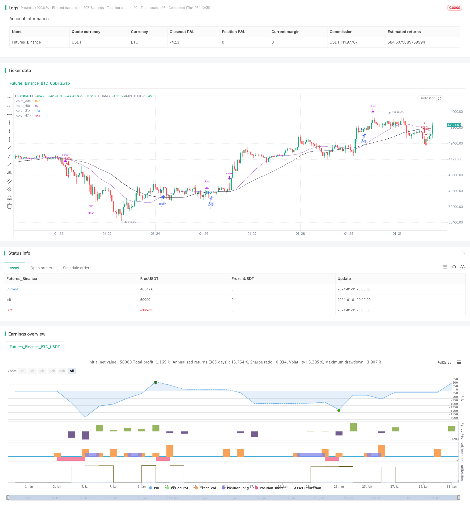

> Name

EMA-RSI-and-MACD-Based-Multi-Timeframe-Trading-Strategy based on EMARSI and MACD
> Author

ChaoZhang

> Strategy Description


[trans]
## Overview
This strategy combines three indicators, the Moving Average (EMA), the Relative Strength Index (RSI) and the Moving Average Convergence and Divergence Index (MACD), to find trading opportunities in multiple time frames and achieve automated trading. This strategy can effectively track market trends and reduce trading risks.
## Strategy Principle
This strategy is mainly implemented based on three indicators: EMA, RSI and MACD. Its transaction logic is as follows:
1. Use the 25-day EMA and the 45-day EMA to form golden crosses and dead crosses as trading signals. Buy when the short-term EMA crosses above the long-term EMA, and sell when the short-term EMA crosses below the long-term EMA.
2. Combine with RSI indicator to avoid false breakthroughs. Only when the RSI is greater than 50, trade the buy signal formed by the golden cross; only when the RSI is less than 50, trade the sell signal formed by the dead cross.
3. Find more trading opportunities under different parameters of the RSI indicator, including RSI>30, RSI<30 and other conditions.
4. The MACD indicator can be used as an auxiliary judgment indicator to confirm the EMA trading signal.
By finding more trading opportunities on different time frames, you can increase your strategy profitability. At the same time, combining multiple indicators can reduce the occurrence of wrong transactions and effectively control risks.
## Strategic Advantages
The biggest advantage of this strategy is that combining multiple indicators and trading within multiple time frames can increase the probability of profit. The main advantages are:
1. Use EMA Golden Cross and Dead Cross to effectively track changes in market trends and capture trading opportunities in a timely manner.
2. The RSI indicator can avoid false breakthroughs and reduce trading risks.
3. Find trading opportunities under multiple RSI parameters, increase the number of entries and increase profits.
4. The MACD indicator can perform secondary verification of EMA trading signals to further reduce risks.
5. Multi-time frame trading, LoginFormationTransactionModelTransactionModel doubles profit opportunities.
## Strategy Risk
This strategy also has certain risks, mainly focusing on the following aspects:
1. There is a time lag in the EMA indicator, and short-term trading opportunities may be missed.
2. In multi-indicator combination trading, improper parameter settings may lead to hyper-optimization.
3. Multi-time frame trading may aggravate losses and requires strict stop loss management.
4. In practice, we need to pay attention to transaction cost control and avoid excessively high frequency transactions.
## Strategy optimization direction
There is room for further optimization of this strategy, mainly focusing on the following aspects:
1. Test and optimize EMA parameters to find the optimal parameter combination.
2. Test the addition of more auxiliary indicators, such as BOLL channel, KD indicator, etc.
3. Add an adaptive stop loss mechanism, which can adjust the stop loss position according to market volatility.
4. Optimize the opening lot size and use different trading lot sizes under different parameters.
5. Optimize the entry condition logic to avoid conflicting signals or increase signal filtering.
## Summarize
This strategy integrates a variety of indicator signals and trades in multiple time periods. It has the ability to track trends and seize short-term opportunities. At the same time, the strict entry filtering mechanism also enables the strategy to have certain risk control capabilities. In general, this strategy has stable returns, has practical application value, and is worth recommending.
||

## Overview

This strategy combines the moving average (EMA), relative strength index (RSI) and moving average convergence divergence (MACD) indicators to find trading opportunities across multiple timeframes and enable automated trading. It can effectively track market trends and reduce trading risks.  

## Strategy Principle  

The strategy is mainly based on the EMA, RSI and MACD indicators. The trading logic is as follows:

1. Use 25-day EMA and 45-day EMA to form golden crosses and death crosses as trading signals. Buy when the short term EMA crosses above the long term EMA, and sell when the short term EMA crosses below the long term EMA.  

2. Incorporate the RSI indicator to avoid false breakouts. Only take buy signals from golden crosses when RSI is greater than 50; only take sell signals from death crosses when RSI is less than 50.

3. Find more trading opportunities under different RSI parameter settings, including RSI>30, RSI<30 etc.  

4. MACD indicator can be used as an auxiliary judgement tool to confirm the EMA trading signals.

By finding more trading chances across different timeframes, the strategy's profitability can be improved. Meanwhile, the integration of multiple indicators helps reduce erroneous trades and effectively control risks.

## Advantages of the Strategy

The biggest strength of this strategy lies in the combination of multiple indicators and trading across timeframes, which improves the odds of winning trades. The main advantages are:

1. EMA crosses can effectively track trend changes in the market and timely capture trading opportunities. 

2. RSI indicator helps avoid false breakouts and reduce trading risks.

3. More entry opportunities via different RSI parameter settings improve profitability. 

4. MACD provides secondary confirmation of EMA signals to further decrease risks.

5. Multi timeframe trading doubles profit making chances.

## Risks of the Strategy  

There are also some risks with this strategy:

1. EMA has lags that may lead to missing short-term trading chances.  

2. Improper parameter tuning in the multi-indicator combo may cause over-optimization.

3. Multi timeframe trading may compound losses, demanding strict stop loss management.  

4. Transaction costs need monitoring in live trading environments to avoid over-trading.

## Optimization Directions

There is room for further optimization of the strategy:

1. Test and optimize EMA parameters for best combination.  

2. Test more auxiliary indicators like BOLL bands, KD etc.

3. Incorporate adaptive stop loss mechanism based on market volatility.

4. Optimize position sizing under different parameter settings.

5. Improve entry logic to eliminate conflicting signals or increase filtering power.

## Conclusion  

This strategy integrates signals across indicators and timeframes, capable of both tracking trends and capturing short-term opportunities. Meanwhile, the strict entry mechanisms also equip the strategy with decent risk control capacities. In general, this is a strategy with stable returns and practical value, worth recommending.

[/trans]


> Source (PineScript)

``` pinescript
/*backtest
start: 2024-01-01 00:00:00
end: 2024-01-31 23:59:59
period: 1h
basePeriod: 15m
exchanges: [{"eid":"Futures_Binance","currency":"BTC_USDT"}]
*/

// This Pine Script™ code is subject to the terms of the Mozilla Public License 2.0 at https://mozilla.org/MPL/2.0/
// © Aqualizer

//@version=5
strategy("Aserin Buy and Sell", overlay=true)

shortSMA = ta.sma(close, 25)
longSMA = ta.sma(close, 45)
rsi = ta.rsi(close, 7)
ta.macd(close,12, 26, 9)
atr = ta.atr(3)
longCondition = ta.crossover(shortSMA, longSMA)
shortCondition = ta.crossunder(shortSMA, longSMA)

if (longCondition)
    strategy.entry("long", strategy.long, 100, when = rsi > 50)
if (shortCondition)
    strategy.entry("short", strategy.short, 100, when = rsi < 50)

if (longCondition)
    strategy.entry("long", strategy.long, 100, when = rsi > 30)
if (shortCondition)
    strategy.entry("short", strategy.short, 100, when = rsi < 30)

if (longCondition)
    strategy.entry("long", strategy.long, 100, when = rsi > 20)
if (shortCondition)
    strategy.entry("short", strategy.short, 100, when = rsi < 50)

plot(shortSMA)
plot(longSMA, color=color.black)

if (longCondition)
    stopLoss = low - atr * 2,45
    takeProfit = high + atr * 2,45
    strategy.entry("long", strategy.long, 1, when = rsi > 30)

    strategy.exit("exit", "long", stop=stopLoss, limit=takeProfit)

if (shortCondition)
    stopLoss = high + atr * 3
    takeProfit = low - atr * 3
    strategy.entry("short", strategy.short, 1, when = rsi < 30)
    strategy.exit("exit", "short", stop=stopLoss, limit=takeProfit)

plot(shortSMA)
plot(longSMA, color=color.black)

```

> Detail

https://www.fmz.com/strategy/442232

> Last Modified

2024-02-20 14:25:24
