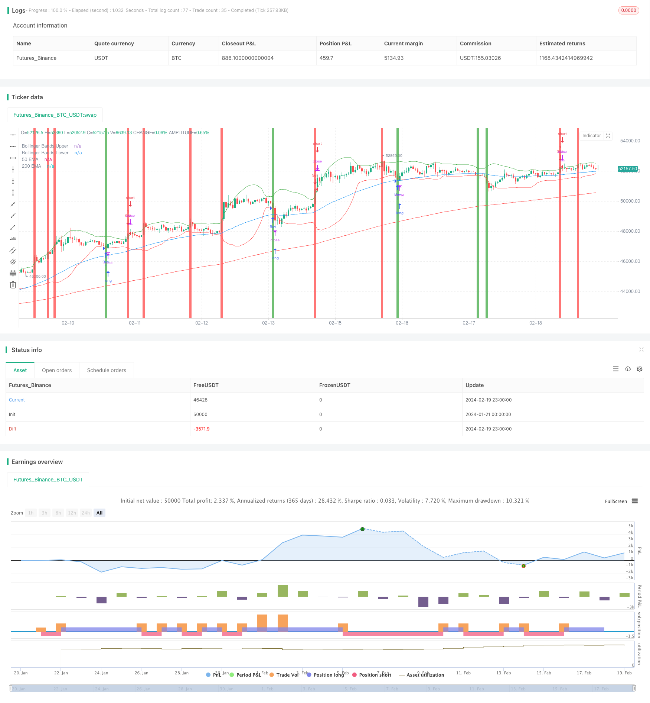

> Name

Reversal-Trading-Strategy-with-EMA-Crossover-and-Bollinger-Bands
> Author

ChaoZhang

> Strategy Description


[trans]
## Overview
This strategy determines the long-term and short-term trends of the stock price by calculating the EMA moving average of two different periods; at the same time, combined with the upper and lower Bollinger Bands, it determines whether the stock price is in an overbought or oversold state, which serves as a signal for entry and exit. It comprehensively uses a variety of technical indicators such as moving averages and Bollinger Bands to determine the market's reversal point, which is a typical trend following and reversal trading strategy.
## Strategy Principle
1. Calculate the fast EMA (50 periods) and the slow EMA (200 periods). When the fast EMA crosses the slow EMA above, it is a long signal, and when the fast EMA crosses below the slow EMA, it is a short signal.
2. Calculate the 20-period upper and lower Bollinger Bands
3. When the price breaks through the upper Bollinger Band, it is considered an overbought signal, and you go short; when the price falls below the lower Bollinger Band, it is considered an oversold signal, and you go long.
4. Based on the golden cross/death cross signals of the EMA moving average and the breakthrough signals of the Bollinger Bands, determine the entry and exit points.
The above are the main methods for this strategy to determine buying and selling points. When the fast EMA crosses the slow EMA, or the stock price falls below the lower Bollinger Band, go long; when the fast EMA crosses the slow EMA, or the stock price breaks through the upper Bollinger Band, go short.
## Advantage Analysis
This is a typical strategy that uses a combination of multiple technical indicators. It takes into account the long-term and short-term trends of stock prices and the overbought and oversold conditions. It has the following main advantages:
1. The golden cross of the moving average can effectively determine the long-term and short-term trends.
2. Bollinger Bands can determine the overbought and oversold areas of prices to prevent chasing highs and selling lows.
3. Combine multiple indicators to be systematic and avoid false signals
4. Backtesting results can be improved through parameter optimization
## Risk Analysis
There are also some risks with this strategy:
1. The EMA moving average is generated delayed and the best entry point may be missed.
2. Improper selection of Bollinger Band width parameters may miss the trend
3. Multiple signal combinations increase the complexity of the strategy
4. Due to changes in the market environment, the parameters are no longer applicable.  
Countermeasures:
1. Optimize parameters and adapt to market environment
2. Add stop loss strategies to control risks
3. Test different EMA and Bollinger Band parameter combinations
4. The strategy can be further optimized, such as combining RSI and other indicators
## Optimization direction
This strategy has strong room for optimization:  
1. The parameters of EMA and Bollinger Bands can test more combinations
2. You can add MACD, KDJ, RSI and other indicators for combination
3. Add trailing stop loss strategy
4. You can test strategies running in different time periods (60 minutes, daily, etc.)
5. More trading signals can be found based on abnormal trading volume
By testing different parameters and indicators and fully backtesting and optimizing the strategy, the stability and profitability of the strategy can be further improved.
## Summary
This strategy is based on the two most important technical indicators, EMA and Bollinger Bands, to determine the long-term and short-term trends of stock prices and overbought and oversold areas, and has strong practicality. By optimizing parameters and combining more indicators, better strategy effects can be obtained. This strategy well embodies the idea of ​​​​quantitative trading strategies, which is to evaluate the market environment, design rules, and optimize strategies. I believe that through continuous testing and improvement, this strategy can become a reliable and stable quantitative trading strategy.
||

## Overview

This strategy calculates two EMA lines with different periods to determine the long-term and short-term trend of the stock price. It also incorporates the upper and lower rails of the Bollinger Bands to judge whether the stock price is in an overbought or oversold state, as signals for entry and exit. It combines multiple technical indicators such as moving averages and Bollinger Bands to locate market reversal points, which belongs to a typical trend-following and reversal trading strategy.  

## Strategy Logic   

1. Calculate the fast EMA (50-period) and slow EMA (200-period). The fast EMA crossing above the slow EMA is a buy signal, while the fast EMA crossing below is a sell signal.

2. Calculate the 20-period Bollinger Bands upper and lower rails.  

3. When the price breaks through the BB upper rail, it is considered an overbought signal to go short. When the price breaks through the BB lower rail, it is considered an oversold signal to go long.

4. Combine the EMA crossovers and BB breakout signals to determine entries and exits.

The above logic is the main way this strategy identifies trading signals. It goes long when the fast EMA crosses over the slow EMA or when the price breaks the BB lower rail. It goes short when the fast EMA crosses below the slow EMA or when the price breaks the BB upper rail.   

## Advantage Analysis

This is a typical strategy combining multiple technical indicators, which considers both long-term and short-term price trends, as well as overbought and oversold conditions. The main advantages are:  

1. EMA crossovers can effectively determine long-term and short-term trends.

2. Bollinger Bands can identify overbought and oversold zones to avoid chasing tops and bottoms.  

3. Combining indicators improves robustness and avoids false signals. 

4. Backtest results can be further enhanced through parameter tuning.

## Risk Analysis   

There are some risks with this strategy:

1. EMA may have lagging effect, missing best entry points.  

2. Improper BB parameter selection may miss trends. 

3. Too many combined signals increases complexity.  

4. Parameters may fail when market regimes change.

Solutions:

1. Optimize parameters adaptive to markets.  

2. Add stop loss to control risks.

3. Test different EMA and BB parameter combinations. 

4. Further enhancements such as combining with RSI.


## Optimization Directions  

There is strong potential to optimize this strategy:

1. Test more EMA and BB parameter combinations. 

2. Incorporate other indicators like MACD, KDJ, RSI.

3. Add trailing stop loss.

4. Test the strategy across different time frames.

5. Combine with unusual volume for more signals.

Through robust backtesting across different parameters and indicators, the strategy can be further improved for stability and profitability.


## Conclusion
This strategy builds upon the two most important technical indicators EMA and Bollinger Bands to identify long-term/short-term trends and overbought/oversold levels, making it highly practical. Further parameter tuning and combining more indicators can lead to better results. It reflects the key idea in quantitative trading strategies to assess the market condition, design rules, and optimize the strategy. With continuous testing and enhancement, this strategy has the potential to become a reliable algorithmic trading system.

[/trans]

> Strategy Arguments


|Argument|Default|Description|
|----|----|----|
|v_input_1|50|Short EMA Period|
|v_input_2|200|Long EMA Period|
|v_input_3|20|Bollinger Bands Length|
|v_input_4|2|Bollinger Bands Multiplier|


> Source (PineScript)

``` pinescript
/*backtest
start: 2024-01-21 00:00:00
end: 2024-02-20 00:00:00
period: 1h
basePeriod: 15m
exchanges: [{"eid":"Futures_Binance","currency":"BTC_USDT"}]
*/

//@version=4
strategy("Reversal Patterns, EMA Crossover, and Bollinger Bands", shorttitle="RP-EMABB", overlay=true)

// Input parameters
emaShortPeriod = input(50, title="Short EMA Period", minval=1)
emaLongPeriod = input(200, title="Long EMA Period", minval=1)
bbLength = input(20, title="Bollinger Bands Length", minval=1)
bbMultiplier = input(2.0, title="Bollinger Bands Multiplier", minval=0.1, maxval=5.0)

// Calculate EMAs
emaShort = ema(close, emaShortPeriod)
emaLong = ema(close, emaLongPeriod)

// Calculate Bollinger Bands
bbUpper = sma(close, bbLength) + bbMultiplier * stdev(close, bbLength)
bbLower = sma(close, bbLength) - bbMultiplier * stdev(close, bbLength)

// EMA Crossover and Crossunder
emaCrossover = crossover(emaShort, emaLong)
emaCrossunder = crossunder(emaShort, emaLong)

// Bollinger Bands Crossing
bbUpperCross = crossover(close, bbUpper)
bbLowerCross = crossunder(close, bbLower)

// Buy and Sell signals
strategy.entry("Buy", strategy.long, when=emaCrossover or bbLowerCross)
strategy.entry("Sell", strategy.short, when=emaCrossunder or bbUpperCross)

// Plot EMAs on the chart
plot(emaShort, color=color.blue, title="50 EMA")
plot(emaLong, color=color.red, title="200 EMA")

// Plot Bollinger Bands
plot(bbUpper, color=color.green, title="Bollinger Bands Upper")
plot(bbLower, color=color.red, title="Bollinger Bands Lower")

// Highlight Buy and Sell signals on the chart
bgcolor(emaCrossover or bbLowerCross ? color.green : na, transp=90)
bgcolor(emaCrossunder or bbUpperCross ? color.red : na, transp=90)

```

> Detail

https://www.fmz.com/strategy/442401

> Last Modified

2024-02-21 16:12:18
