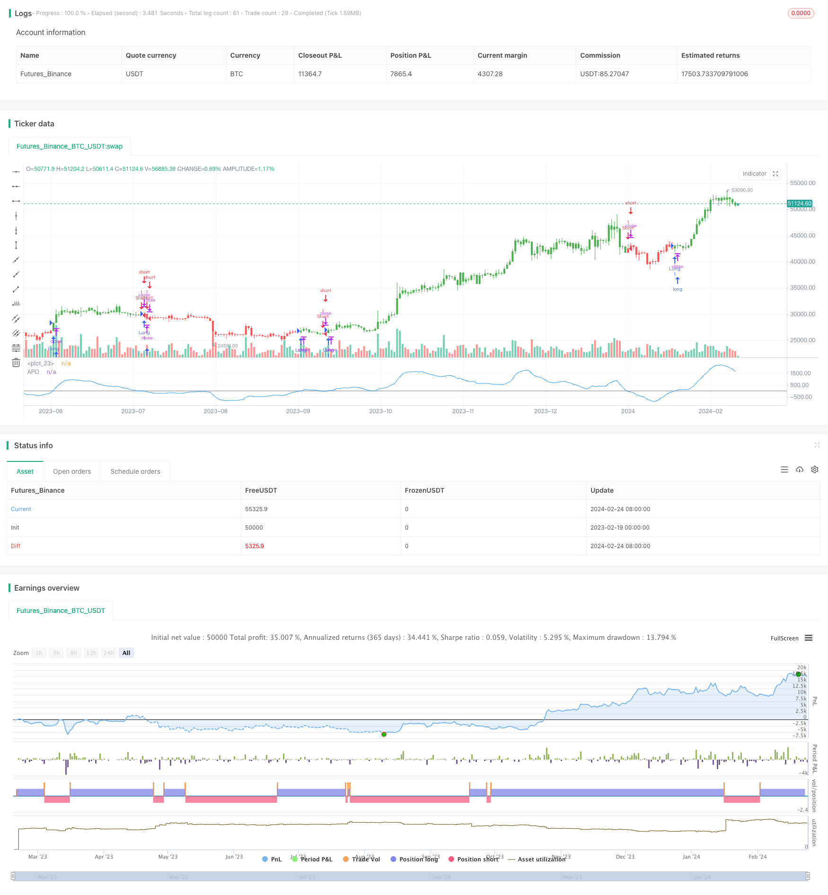

> Name

The-Dual-EMA-Price-Swing-Strategy based on the dual EMA price swing strategy
> Author

ChaoZhang

> Strategy Description


[trans]
### Overview
The double EMA price swing strategy determines the long and short situation and strength of the market by calculating the difference between two EMAs of different periods. When the difference between the fast and slow lines crosses 0, it is a bullish signal. When the difference between the fast and slow lines crosses below 0, it is a bearish signal.
This strategy is simple and easy to use, and it judges the market strength and direction through the difference of EMA. However, there is also a certain lag and the turning point cannot be captured in time.
### Strategy Principles
The core indicator of the double EMA price swing strategy is APO, the Absolute Price Oscillator, which represents the difference between the two EMAs. The calculation formula is as follows:
```
APO = EMA(短期) - EMA(长期)
```

Specifically, the calculation of APO in this strategy is:
```
xShortEMA = ema(收盘价, LengthShortEMA) 

xLongEMA = ema(收盘价, LengthLongEMA)

xAPO = xShortEMA - xLongEMA
```

Among them, LengthShortEMA and LengthLongEMA represent the cycle lengths of short-term and long-term EMA respectively.
Several key judgment rules of APO:
1. When APO crosses 0, it is a bullish signal
2. When APO crosses 0, it is a bearish signal
3. A positive APO indicates that the current situation is bullish.
4. A negative APO indicates a bearish condition.
Based on the real-time value of APO, we can judge the long and short status of the market and the timing of entry.
### Advantage Analysis
The double EMA price swing strategy has the following key advantages:
1. Using exponential moving averages can effectively smooth price data and reduce the impact of noise.
2. The APO indicator combines two EMAs to simultaneously determine price trends and market strength.
3. The strategy signals are simple and clear, easy to judge and implement
4. The EMA cycle can be customized to adapt to different varieties and trading styles.
5. Reverse signals are available, suitable for reverse and short trading
### Risk Analysis
The double EMA price swing strategy also has some risks, mainly reflected in:
1. EMA itself has hysteresis and cannot capture price turning points in time.
2. The default parameters may not be suitable for all varieties, and parameters need to be optimized.
3. Frequent signals and easy to generate false signals
4. Unable to determine the stop loss and take profit positions after entry
5. There is a certain delay and you may miss the best entry opportunity.
These risks can be dealt with and reduced by reasonably stopping losses to reduce single losses; optimizing parameters to adapt to different cycles; combining other indicators to filter signals and improve strategy stability.
### Optimization direction
The double EMA price swing strategy can be optimized mainly from the following directions:
1. Optimize the EMA cycle parameters, test EMA combinations with lengths from 5 to 60, and find the optimal parameters.
2. Add MA, KDJ, MACD and other indicators, set filter conditions to avoid false signals
3. Use Bollinger Bands, KD and other indicators to determine reasonable stop-profit and stop-loss positions
4. Combine with indicators such as trend index to determine price trends and avoid counter-trend transactions
5. Add trading volume indicators to ensure breakthrough signals supported by trading volume
6. Set re-entry conditions to avoid frequent transactions and reduce the number of transactions
### Summarize
To sum up, the double EMA price swing strategy determines the long and short status of the market by calculating the difference APO between the two EMAs. The strategy signal is simple and clear, highly practical, but also has certain drawbacks. We can optimize and improve the stability of the strategy through parameter optimization, new filter conditions, stop loss and take profit settings, etc. This strategy is easy to use and has a lot of room for expansion, making it suitable for quantitative trading beginners to learn and apply.
||

## Overview

The Dual EMA Price Swing strategy judges market sentiment and momentum by calculating the difference between two EMAs of different periods. An up-crossing of the difference value above 0 is a bullish signal. A down-crossing below 0 is a bearish signal.

The strategy is simple and easy to use, judging market momentum and direction through EMA difference. However, it also has some laggingness and cannot timely capture turning points.  

## Principle  

The core indicator of the Dual EMA Price Swing strategy is APO, namely Absolute Price Oscillator, representing the difference between two EMAs. Its formula is:  

```
APO = EMA(short period) − EMA(long period)
```

Specifically, the APO in this strategy is calculated as:

```
xShortEMA = ema(close price, LengthShortEMA)  

xLongEMA = ema(close price, LengthLongEMA)

xAPO = xShortEMA − xLongEMA
```

Where LengthShortEMA and LengthLongEMA represent the cycle lengths of the short-term and long-term EMAs respectively.

Several key judgment rules of APO:

1. An up-crossing of APO above 0 is a bullish signal
2. A down-crossing of APO below 0 is a bearish signal
3. A positive APO indicates a current bull state 
4. A negative APO indicates a current bear state

Determine market sentiment and entry timing based on the real-time value of APO.

## Advantage Analysis 

The Dual EMA Price Swing Strategy has the following main advantages:

1. Using exponential moving average can effectively smooth price data and reduce noise impact
2. The APO indicator combines two EMAs to judge both price trend and market momentum
3. The strategy signal is simple and clear, easy to determine and implement  
4. Customizable EMA cycles adapt to different varieties and trading styles
5. Reversible signals apply to reverse and short trading

## Risk Analysis

The Dual EMA Price Swing Strategy also has some risks, mainly in:

1. EMA itself has laggingness and cannot capture price turning points in time
2. Default parameters may not apply to all varieties, parameters need optimization
3. Frequent signals tend to produce false signals  
4. Unable to determine stop loss and take profit after opening position
5. There is certain lag, possibly missing the best entry timing

We can cope with and reduce these risks by applying reasonable stop loss to reduce single loss; optimizing parameters to adapt cycles; combining other indicators to filter signals and improve strategy stability.

## Optimization Directions

The Dual EMA Price Swing Strategy can be optimized in the following aspects:  

1. Optimize EMA cycle parameters, test combinations of length 5 to 60 to find optimum
2. Add other indicators like MA, KDJ, MACD to set filter conditions and avoid false signals
3. Use Bollinger Bands, KD to determine reasonable stop loss and take profit  
4. Combine trend index to judge price trend, avoid trading against trend
5. Add trading volume indicator to ensure signals with volume support 
6. Set re-entry conditions to reduce transactions and trading frequency

## Conclusion

In summary, the Dual EMA Price Swing Strategy judges market sentiment by calculating the APO difference between two EMAs. The strategy signal is simple and practical, but also has some drawbacks. We can optimize it through parameter tuning, adding filters, setting stops and more. Easy to use for beginners, also with great potential for expansions. Suitable for quant trading learners to study and apply.

[/trans]

> Strategy Arguments


|Argument|Default|Description|
|----|----|----|
|v_input_1|10|LengthShortEMA|
|v_input_2|20|LengthLongEMA|
|v_input_3|false|Trade reverse|


> Source (PineScript)

``` pinescript
/*backtest
start: 2023-02-19 00:00:00
end: 2024-02-25 00:00:00
period: 1d
basePeriod: 1h
exchanges: [{"eid":"Futures_Binance","currency":"BTC_USDT"}]
*/

//@version=2
////////////////////////////////////////////////////////////
//  Copyright by HPotter v1.0 30/05/2017
// The Absolute Price Oscillator displays the difference between two exponential 
// moving averages of a security's price and is expressed as an absolute value.
// How this indicator works
//    APO crossing above zero is considered bullish, while crossing below zero is bearish.
//    A positive indicator value indicates an upward movement, while negative readings 
//      signal a downward trend.
//    Divergences form when a new high or low in price is not confirmed by the Absolute Price 
//      Oscillator (APO). A bullish divergence forms when price make a lower low, but the APO 
//      forms a higher low. This indicates less downward momentum that could foreshadow a bullish 
//      reversal. A bearish divergence forms when price makes a higher high, but the APO forms a 
//      lower high. This shows less upward momentum that could foreshadow a bearish reversal.
//
// You can change long to short in the Input Settings
// Please, use it only for learning or paper trading. Do not for real trading.
////////////////////////////////////////////////////////////
strategy(title="Absolute Price Oscillator (APO) Backtest", shorttitle="APO")
LengthShortEMA = input(10, minval=1)
LengthLongEMA = input(20, minval=1)
reverse = input(false, title="Trade reverse")
hline(0, color=gray, linestyle=line)
xPrice = close
xShortEMA = ema(xPrice, LengthShortEMA)
xLongEMA = ema(xPrice, LengthLongEMA)
xAPO = xShortEMA - xLongEMA
pos = iff(xAPO > 0, 1,
       iff(xAPO < 0, -1, nz(pos[1], 0))) 
possig = iff(reverse and pos == 1, -1,
          iff(reverse and pos == -1, 1, pos))	   
if (possig == 1) 
    strategy.entry("Long", strategy.long)
if (possig == -1)
    strategy.entry("Short", strategy.short)	   	    
barcolor(possig == -1 ? red: possig == 1 ? green : blue )
plot(xAPO, color=blue, title="APO")
```

> Detail

https://www.fmz.com/strategy/442834

> Last Modified

2024-02-26 13:52:41
