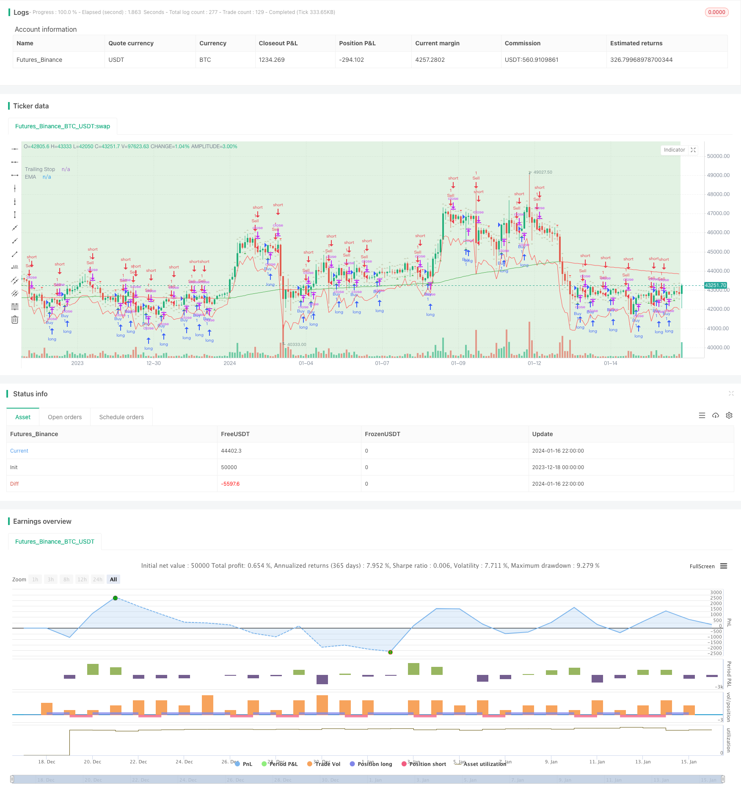

> Name

Trading-Strategy-Based-on-Supply-and-Demand-Zones-with-EMA-and-Trailing-Stop
> Author

ChaoZhang

> Strategy Description


 [trans]
## Overview
This strategy uses supply and demand areas, exponential moving averages (EMA), and average true range (ATR) exponential trailing stops to determine trading signals. Users can adjust EMA parameter settings and visibility of buy and sell signals. The strategy marks supply and demand areas such as Higher Higher (HH), Lower Lower (LL), Lower Higher (LH), and Higher Lower (HL). The third K line confirms the signal and issues the trading order. This script is suitable for backtesting.
## Strategy Principle
### Indicator calculation
**EMA Exponential Moving Average**:
- EMA is calculated based on the closing price of a certain period (default 200).
- EMA formula: \(EMA=(Price_t \times \alpha)+(EMA_{t-1}×(1−\alpha))\), where\(\alpha=\frac{2}{length+1}\).
**ATR average true fluctuation range**:
- ATR is a measure of market volatility, calculated based on the true range of price fluctuations.
- The true fluctuation range is the maximum of the following three:
  - Current high price minus current low price
  - The absolute value of the current high price minus the previous closing price
  - The absolute value of the current lowest price minus the previous closing price
- ATR typical calculation period is 14.
These calculations are used to determine EMA trend judgment and set ATR trailing stops based on market fluctuations. This strategy is designed to provide buy and sell signals based on the relationship between closing prices, EMA and ATR values.
### Judgment of supply and demand areas
The terms "HH" (higher higher), "LL" (lower lower), "HL" (higher lower) and "LH" (lower higher) are used in the strategy to identify different price action patterns, often used in trend analysis:
1. **Higher Higher (HH)**: The current price high is higher than the previous high, indicating potential upward momentum.
2. **Lower Lower (LL)**: The current price low is lower than the previous low, indicating potential downward momentum.
3. **Higher Lower (HL)**: The current price low is higher than the previous low, indicating a potential upward trend continues.
4. **Lower Higher (LH)**: The current price high is lower than the previous high, indicating a potential downward trend continues.
These patterns, used in conjunction with other technical indicators, can identify potential trend reversals or continuations. This strategy uses these patterns to identify opportunities to enter or exit.
### Entry and stop loss exit
**Entry signal**: A buy/sell signal is generated when the closing price of the third K-line is higher/lower than the previous day's highest/lowest price.
**Stop loss method**: Use a certain multiple of the ATR value (default 2 times) as the retreat stop loss point.
## Strategic Advantages
1. Combine trend, reversal, volatility and other factors to comprehensively judge the market and avoid false breakthroughs.
2. Use supply and demand areas to determine key support and resistance.
3. The ATR stop loss system dynamically tracks market fluctuations.
4. Customizable EMA and ATR parameters.
5. Simple entry rules are easy to implement.
## Risk and Optimization
1. To misjudge the risk, the EMA length needs to be appropriately optimized.
2. If the ATR multiple is set too high, there is a risk of chasing the rise and killing the fall.  
3. Consider combining other factors to filter entry signals.
4. You can try a strategy that focuses on trend sniping and supplements supply and demand.
## Summarize
This strategy comprehensively uses a variety of technical indicators and price pattern judgments such as trend, reversal, volatility, etc., and performed well in backtesting. However, the real market is complex and changeable, so it is still necessary to optimize and properly filter entry signals. This strategy is a basic strategy and can be expanded on its basis and combined with other factors or models.
||

## Overview

The strategy utilizes supply and demand zones, Exponential Moving Average (EMA), and Average True Range (ATR) trailing stop for trade signals. Users can adjust EMA settings and signal visibility. The strategy marks Higher High (HH), Lower Low (LL), Lower High (LH), and Higher Low (HL) zones. Signals are shown after the third candle, suitable for backtesting.

## Strategy Logic  

### Indicator Calculations

**Exponential Moving Average (EMA)**:
- EMA is calculated from closing prices over a period (default: 200).  
- Formula: EMA = (Price_t x α) + (EMA_t-1 x (1 - α)), where α = 2/(length + 1)

**Average True Range (ATR)**: 
- ATR measures market volatility from true range of prices.
- True range is the greatest of:
  - Current high minus current low
  - Absolute value of current high minus previous close
  - Absolute value of current low minus previous close  
- ATR typically uses 14 periods.

Used to determine EMA for trend and ATR for volatility-based trailing stop.

### Supply and Demand Zone Identification

It identifies "HH" (Higher High), "LL" (Lower Low), "HL" (Higher Low) and "LH" (Lower High) patterns:

1. **Higher High (HH)**: Current peak > previous peak, upward momentum. 

2. **Lower Low (LL)**: Current trough < previous trough, downward momentum.

3. **Higher Low (HL)**: Current trough > previous trough, upward continuation.  

4. **Lower High (LH)**: Current peak < previous peak, downward continuation.

Used with trends to identify reversals or continuations. 

### Entry and Exit  

**Entry Signal**: Buy/sell on third candle closing above/below previous high/low.

**Exit**: Trailing stop loss based on ATR.

## Advantages  

1. Combines trends, reversals, volatility for robust signals.  
2. Demand/supply zones identify key S/R.
3. Dynamic ATR stop adjusts to volatility.   
4. Customizable parameters.
5. Simple entry rules.

## Risks and Improvements

1. False signals: Optimize EMA length.  
2. High ATR multiplier risks chasing trends.
3. Consider additional filters on entries.
4. Test trend-focused approach.  

## Conclusion  

Combines multiple techniques for decent backtests. Real-world is complex, optimization is key. Basic strategy allows extensions and combinations.
[/trans]

> Strategy Arguments


|Argument|Default|Description|
|----|----|----|
|v_input_1|true|(?Signals)Show Buy Signals|
|v_input_2|true|Show Sell Signals|
|v_input_3|true|(?Zones)Show HL Zone|
|v_input_4|true|Show LH Zone|
|v_input_5|true|Show HH Zone|
|v_input_6|true|Show LL Zone|
|v_input_7|200|(?EMA Settings)EMA Length|
|v_input_8|14|(?Trailing Stop)ATR Length|
|v_input_9|2|ATR Multiplier|


> Source (PineScript)

``` pinescript
/*backtest
start: 2023-12-18 00:00:00
end: 2024-01-17 00:00:00
period: 2h
basePeriod: 15m
exchanges: [{"eid":"Futures_Binance","currency":"BTC_USDT"}]
*/

//@version=5
strategy("Supply and Demand Zones with EMA and Trailing Stop", shorttitle="SD Zones", overlay=true)

showBuySignals = input(true, title="Show Buy Signals", group="Signals")
showSellSignals = input(true, title="Show Sell Signals", group="Signals")
showHLZone = input(true, title="Show HL Zone", group="Zones")
showLHZone = input(true, title="Show LH Zone", group="Zones")
showHHZone = input(true, title="Show HH Zone", group="Zones")
showLLZone = input(true, title="Show LL Zone", group="Zones")

emaLength = input(200, title="EMA Length", group="EMA Settings")
atrLength = input(14, title="ATR Length", group="Trailing Stop")
atrMultiplier = input(2, title="ATR Multiplier", group="Trailing Stop")

// Function to identify supply and demand zones
getZones(src, len, mult) =>
    base = request.security(syminfo.tickerid, "D", close)
    upper = request.security(syminfo.tickerid, "D", high)
    lower = request.security(syminfo.tickerid, "D", low)
    multiplier = request.security(syminfo.tickerid, "D", mult)
    zonetype = base + multiplier * len
    zone = src >= zonetype
    [zone, upper, lower]

// Identify supply and demand zones
[supplyZone, _, _] = getZones(close, high[1] - low[1], 1)
[demandZone, _, _] = getZones(close, high[1] - low[1], -1)

// Plot supply and demand zones
bgcolor(supplyZone ? color.new(color.red, 80) : na)
bgcolor(demandZone ? color.new(color.green, 80) : na)

// EMA with Linear Weighted method
ema = ta.ema(close, emaLength)

// Color code EMA based on its relation to candles
emaColor = close > ema ? color.new(color.green, 0) : close < ema ? color.new(color.red, 0) : color.new(color.yellow, 0)

// Plot EMA
plot(ema, color=emaColor, title="EMA")

// Entry Signal Conditions after the third candle
longCondition = ta.crossover(close, high[1]) and bar_index >= 2
shortCondition = ta.crossunder(close, low[1]) and bar_index >= 2

// Trailing Stop using ATR
atrValue = ta.atr(atrLength)
trailStop = close - atrMultiplier * atrValue

// Strategy Entry and Exit
if (longCondition)
    strategy.entry("Buy", strategy.long)
    strategy.exit("TrailStop", from_entry="Buy", loss=trailStop)

if (shortCondition)
    strategy.entry("Sell", strategy.short)
    strategy.exit("TrailStop", from_entry="Sell", loss=trailStop)

// Plot Entry Signals
plotshape(series=showBuySignals ? longCondition : na, title="Buy Signal", color=color.new(color.green, 0), style=shape.triangleup, location=location.belowbar)
plotshape(series=showSellSignals ? shortCondition : na, title="Sell Signal", color=color.new(color.red, 0), style=shape.triangledown, location=location.abovebar)

// Plot Trailing Stop
plot(trailStop, color=color.new(color.red, 0), title="Trailing Stop")

// Plot HH, LL, LH, and HL zones
plotshape(series=showHHZone and ta.highest(high, 2)[1] and ta.highest(high, 2)[2] ? 1 : na, title="HH Zone", color=color.new(color.blue, 80), style=shape.triangleup, location=location.abovebar)
plotshape(series=showLLZone and ta.lowest(low, 2)[1] and ta.lowest(low, 2)[2] ? 1 : na, title="LL Zone", color=color.new(color.blue, 80), style=shape.triangledown, location=location.belowbar)
plotshape(series=showLHZone and ta.highest(high, 2)[1] and ta.lowest(low, 2)[2] ? 1 : na, title="LH Zone", color=color.new(color.orange, 80), style=shape.triangleup, location=location.abovebar)
plotshape(series=showHLZone and ta.lowest(low, 2)[1] and ta.highest(high, 2)[2] ? 1 : na, title="HL Zone", color=color.new(color.orange, 80), style=shape.triangledown, location=location.belowbar)

```

> Detail

https://www.fmz.com/strategy/439275

> Last Modified

2024-01-18 16:41:16
