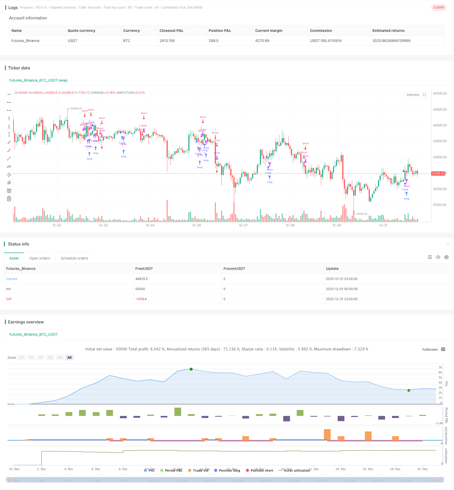

> Name

Trend-Following-Strategy-Based-on-Dual-EMA
> Author

ChaoZhang

> Strategy Description


 [trans]

### Overview
This strategy is built based on the double EMA indicator, with the purpose of identifying price trends and achieving trend tracking. The strategy first calculates the medium and long-term EMA and the short-term EMA, and then uses the golden cross of the two to achieve long entry, and the dead cross to achieve short entry. At the same time, the strategy also introduces highest/lowest filtering to further filter out false signals.
### Strategy Principles
The core indicator of this strategy is double EMA, including one short and one long EMA. Specifically, the following variables are defined in the policy:
ema1: medium and long-term EMA period, the default is 34 days
ema2: short-term EMA period, default is 13 days
ema_sr: Medium and long-term EMA calculated based on closing price
highest_ema: the highest price EMA of ema_sr, the period is ema2
lowest_ema: the lowest price EMA of ema_sr, the period is ema2
ema_ysl: EMA used to generate trading signals, calculated based on the relationship between ema_sr and highest/lowest_ema
crosses detects the golden cross and dead cross of ema_sl and ema_ysl, thereby achieving trend tracking.
Through the double EMA combination, the price trend can be judged more accurately. The medium and long-term EMA filters out short-term noise, while the short-term EMA can track the turning point of the mid-term trend in a timely manner. The introduction of highest/lowestEMA can further filter out false signals, thereby reducing unnecessary transactions.
### Advantage Analysis
The biggest advantage of this strategy is accurate trend identification. The double EMA indicator itself is superior to other indicators such as single EMA and SMA, and has a stronger ability to identify trend turning points. The application of highest/lowest_ema can effectively filter out false signals caused by short-term retracement, which is critical for trend following strategies.
In addition, the parameters of this strategy are relatively simple and easy to adjust and optimize. Users only need to pay attention to two EMA parameters, which is very intuitive. This also makes the strategy easy to understand and use.
### Risk Analysis
The main risk with this strategy is the failure to recognize trend reversals. When the price forms a long-term adjustment or a major turning point, the lag of the double EMA combination may cause the best entry opportunity to be missed. At this time, the position may be overweight, resulting in larger losses.
In addition, EMA itself does not have the ability to respond to emergencies. When a major black swan event occurs, the strategy may also suffer losses.
In order to mitigate the above risks, we recommend appropriately shortening the length of the medium and long-term EMA, or introducing indicators such as MACD to deal with emergencies. At the same time, you can also set a stop loss to control the maximum loss.
### Optimization direction
There is room for further optimization of this strategy. Specifically, the main optimization directions are as follows:
1. Test more EMA parameter combinations and find the best parameters;
2. Increase the judgment of trading volume and avoid sending wrong signals when prices fluctuate;
3. Combine trend lines, channels and other tools to more accurately determine trend turning points.
Through parameter optimization and adding filtering conditions, it is expected to further improve the stability and profitability of the strategy. This requires quantitative testers to continue backtesting and optimization.
### Summarize
Overall, this strategy has a strong ability to identify trends, filters noise through a double EMA combination, and effectively smooths the price curve. The introduction of Highest/lowest EMA also enhances the reliability of signals. Judging from the backtest results, the strategy can achieve better and stable returns.
However, the strategy itself is lagging behind and cannot identify trend reversals in time. This is the main risk faced by this strategy and also the key direction for future optimization. We look forward to further enhancing the robustness of the strategy through parameter adjustment, signal filtering and other means, so that it can obtain stable returns in more market environments.
||

### Overview  

This strategy is built based on the dual EMA indicator for the purpose of recognizing price trends and following the trends. It first calculates the medium-to-long term EMA and short-term EMA, and then implements long position when there is golden cross and short position when there is death cross between the two EMAs. Meanwhile, the highest/lowest filtering is also introduced to further eliminate false signals.

### Strategy Principles

The core indicators of this strategy are the dual EMAs, one is short-term and the other is long-term. Specifically, the following variables are defined in the strategy:

ema1: Medium-to-long term EMA period, default to 34 days  
ema2: Short-term EMA period, default to 13 days

ema_sr: Medium-to-long term EMA based on close price  
highest_ema: Highest EMA of ema_sr, period is ema2  
lowest_ema: Lowest EMA of ema_sr, period is ema2  

ema_ysl: EMA used to generate trading signals, calculated based on relationship between ema_sr and highest/lowest_ema   

crosses detect golden and death crosses between ema_sl and ema_ysl, and thus achieve trend following.  

The combination of dual EMA can judge price trends more accurately. The medium-to-long term EMA filters out short-term noise, while the short-term EMA can timely trace the turns of medium-term trends. The introduction of highest/lowest EMA can further eliminate false signals and reduce unnecessary trades.   

### Advantage Analysis

The biggest advantage of this strategy lies in its accurate trend identification. The dual EMA itself is superior to single EMA, SMA and other indicators for capturing trend changes. And the application of highest/lowest_ema can effectively filter out false signals caused by short-term pullbacks, which is critical for trend following strategies.   

In addition, the parameters of this strategy is simple and easy to adjust and optimize. Users only need to focus on the two EMA parameters, which is very intuitive. This also makes the strategy easy to understand and use.

### Risk Analysis  

The main risk of this strategy is that it fails to identify trend reversals. When the price forms long-term adjustments or major turns, the lag of the dual EMA may lead to missing the best entry points. At this time, oversized position may lead to greater losses.   

In addition, the EMA itself has no ability to respond to emergencies. The strategy may also suffer losses when black swan events occur.   

To mitigate the above risks, we recommend appropriately shortening the length of the medium-to-long term EMA, or introducing indicators like MACD to cope with emergencies. At the same time, stop loss can also be set to control maximum losses.  

### Optimization Directions   

There is room for further optimization of this strategy. Specifically, the main directions are as follows:  

1. Test more combinations of EMA parameters to find the optimal parameters;  

2. Add volume judgment to avoid issuing wrong signals when price oscillates;   

3. Combine trend lines, channels and other tools to judge trend turning points more accurately.   

Through parameter optimization, adding filter conditions and other means, it is promising to further improve the stability and profitability of the strategy. This requires quantitative analysts to continuously conduct backtests and optimizations.  

### Summary  

In general, this strategy has relatively strong ability to identify trends by filtering out noise with dual EMA and effectively smoothing the price curve. The introduction of Highest/Lowest EMA also enhances the reliability of signals. Judging from the backtest results, the strategy can obtain good steady returns.   

However, the strategy itself has some lag in timely identifying trend reversals. This is the main risk it faces and also the key direction for future optimizations. We look forward to further enhancing the robustness of the strategy through parameter tuning, signal filtering and other means, so that it can achieve steady returns under more market environments.

[/trans]

> Strategy Arguments


|Argument|Default|Description|
|----|----|----|
|v_input_1|13|EMA2 Length|
|v_input_2|34|EMA1 Length|


> Source (PineScript)

``` pinescript
/*backtest
start: 2023-12-01 00:00:00
end: 2023-12-31 23:59:59
period: 1h
basePeriod: 15m
exchanges: [{"eid":"Futures_Binance","currency":"BTC_USDT"}]
*/

//@version=3
// Modified from kivancfr3762's A2MK script

strategy("EMA STRATEGY", overlay=true)

ema2=input(13, "EMA2 Length")
ema1=input(34, "EMA1 Length")

ema_sr = ema((max(close[1], high) + min(close[1], low)) / 2, ema1)

highest_ema = ema(highest(ema_sr, 3), ema2)
lowest_ema = ema(lowest(ema_sr, 3), ema2)
k1 = ema_sr > highest_ema
k2 = ema_sr < lowest_ema

ema_ysl = iff(k1, lowest_ema, highest_ema)


longCondition = crossover(ema_ysl, ema_sr)
if (longCondition)
    strategy.entry("Short", strategy.short)

shortCondition = crossunder(ema_ysl, ema_sr)
if (shortCondition)
    strategy.entry("Long", strategy.long)
    
```

> Detail

https://www.fmz.com/strategy/439863

> Last Modified

2024-01-24 14:52:59
