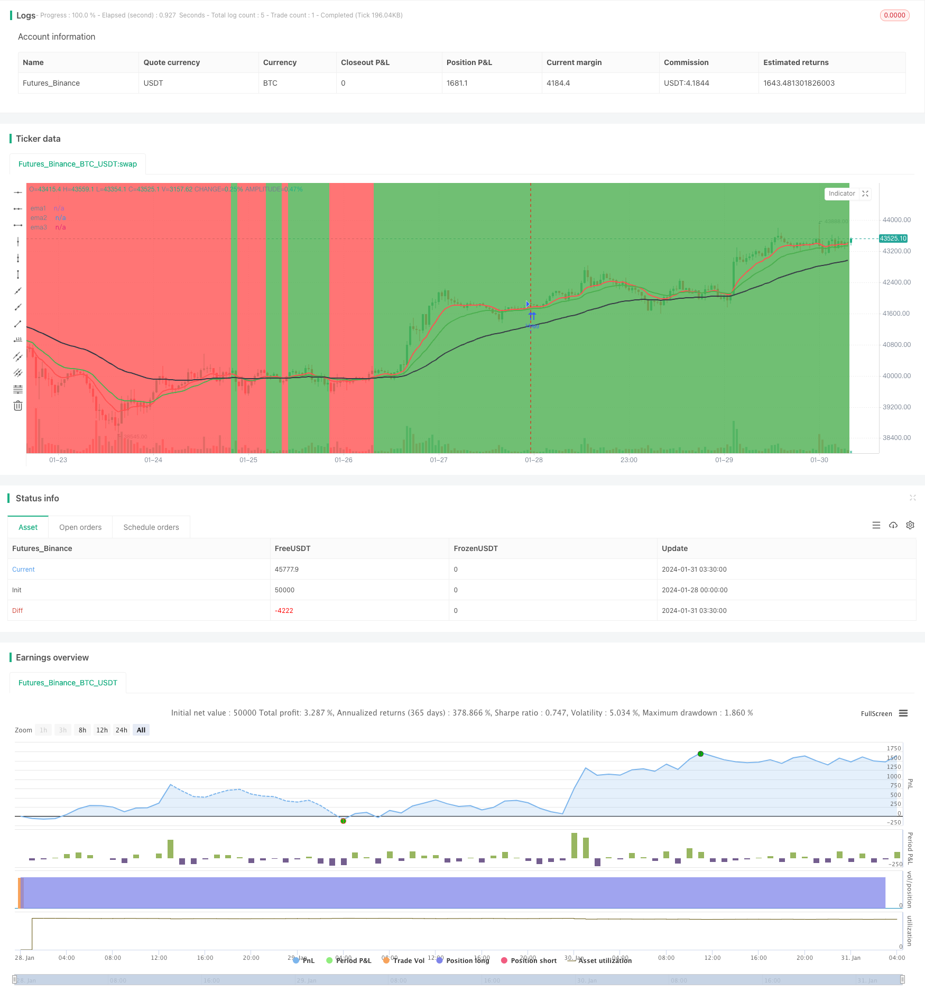

> Name

Trend-Following-Strategy-Based-on-EMA-Lines
> Author

ChaoZhang

> Strategy Description


[trans]
## Overview
This strategy is based on three EMA average lines of different periods, and determines the current trend direction by judging whether the price is above the EMA average line. A buy signal is generated when the short-term EMA line crosses the long-term EMA line; a sell signal is generated when the short-term EMA line crosses below the long-term EMA line. This strategy tracks the trend and closes positions promptly when the trend turns.
## Strategy Principle
This strategy uses three EMA average lines, namely the 10-day line, the 20-day line and the 50-day line. The judgment rules are:
1. When the 10-day EMA line and the 20-day EMA line are both above the 50-day EMA line, it is defined as an upward trend;
2. When the 10-day EMA line and the 20-day EMA line are both below the 50-day EMA line, it is defined as a downward trend;
3. A buy signal is generated when the short-term EMA line (10-day line and 20-day line) crosses the long-term EMA line (50-day line);
4. A sell signal is generated when the short-term EMA line (10-day line and 20-day line) crosses the long-term EMA line (50-day line);
5. Hold long positions in an upward trend and short positions in a downward trend;
6. When the trend turns (EMA short-term line and long-term line penetrate), close the position in the current signal direction.
This strategy takes turns to perform long and short operations by capturing profit and locking in profits by closing positions in time.
## Advantage Analysis
This strategy has the following advantages:
1. The rules are simple and clear, easy to understand and implement;
2. Use the EMA average line to determine the trend direction and avoid being disturbed by short-term market fluctuations;
3. Close positions in a timely manner, follow the trend and avoid expanding losses;
4. There is no need to predict the market direction, just follow the trend and have a higher winning rate.
## Risk Analysis
There are also some risks with this strategy:
1. When the market is consolidating, multiple penetrations are likely to occur between the EMA averages, which may cause transaction costs due to frequent opening and closing of positions;
2. After the market jumps, the effect of EMA in judging the trend will be affected, and you may miss a good opportunity to open a position.
In view of the above risks, the following methods can be used to optimize:
1. When the EMA distance is small, the position opening rules can be appropriately relaxed to avoid too frequent transactions;
2. Combine with other indicators to determine the trend and avoid the failure of EMA judgment.
## Optimization direction
This strategy can be optimized from the following directions:
1. Parameter optimization. You can test parameter combinations of different EMA periods to find the best parameters;
2. Transaction cost optimization. Properly optimize position opening rules to reduce unnecessary frequent transactions;
3. Optimize stop loss strategy. Set a reasonable stop loss level to control single losses;
4. Combine with other indicators. Use MACD, KDJ and other indicators to assist judgment and optimize entry opportunities.
## Summarize
This strategy is generally simple and practical. It uses EMA to determine the trend direction and comes with appropriate stop loss strategies, which can effectively control risks. At the same time, there is also some room for optimization. If combined with parameter optimization, stop loss strategies, other indicators, etc., the effect of this strategy still has a lot of room for improvement.
||

## Overview  

This strategy is based on 3 EMA lines of different periods. It judges the current trend direction by whether the price is above the EMA lines. When the short-term EMA line crosses above the long-term EMA line, a buy signal is generated. When the short-term EMA line crosses below the long-term EMA line, a sell signal is generated. This strategy tracks the trend runs and closes positions in time when trend reverses.

## Strategy Logic  

The strategy uses 3 EMA lines, which are 10-day, 20-day and 50-day respectively. The judging rules are:  

1. When both 10-day EMA and 20-day EMA are above 50-day EMA, it is defined as an uptrend;

2. When both 10-day EMA and 20-day EMA are below 50-day EMA, it is defined as a downtrend;

3. When short-term EMA lines (10-day and 20-day) cross above long-term EMA line (50-day), a buy signal is generated;  

4. When short-term EMA lines (10-day and 20-day) cross below long-term EMA line (50-day), a sell signal is generated;

5. Hold long position during uptrend and hold short position during downtrend;  

6. Close current directional position when trend reverses (short-term EMA crosses long-term EMA).

The strategy captures profit by timely closing positions to lock in gains and alternating between long and short positions.  

## Advantage Analysis   

The advantages of this strategy are:

1. The rules are simple and clear, easy to understand and implement;  
2. Using EMA lines to determine trend avoids interference from short-term market fluctuations;
3. Timely closing positions to track trend runs avoids expanding losses;
4. No need to predict market direction with high winning rate by tracking trends.

## Risk Analysis

There are also some risks in this strategy:   

1. During range-bound markets, EMA lines may crossover frequently, resulting in high trading costs from frequently opening and closing positions;

2. Trend determination by EMA may fail after price gap, missing good entry opportunities.

To optimize the risks, some methods can be used:

1. Open position rules can be relaxed properly when EMAs are close to avoid over-trading; 

2. Determine trend combining other indicators to avoid EMA failure.

## Optimization Directions

The strategy can be optimized from the following aspects:

1. Parameter optimization. Test different EMA period combinations to find the optimal parameters;  

2. Trading cost optimization. Optimize open position rules properly to reduce unnecessary frequent trading;

3. Stop loss strategy optimization. Set reasonable stop loss level to control single loss;

4. Combine other indicators. Use MACD, KDJ and other indicators to assist in determining optimal entry timing.


## Summary   

In general, this strategy is quite simple and practical. It uses EMA to determine trend direction with proper stop loss strategy to effectively control risks. There are also rooms for optimization. By combining parameter optimization, stop loss strategy and other indicators, the performance of this strategy can be further improved.

[/trans]

> Strategy Arguments


|Argument|Default|Description|
|----|----|----|
|v_input_1|true|infoBox|
|v_input_2|false|infoBox2|
|v_input_3|false|Buy & SellSignal|
|v_input_4|0|infoBoxSize: size.large|size.tiny|size.small|size.normal|size.auto|size.huge|
|v_input_5|10|ema1Value|
|v_input_6|20|ema2Value|
|v_input_7|59|ema3Value|
|v_input_8|3000|maxLoss|


> Source (PineScript)

``` pinescript
/*backtest
start: 2024-01-28 00:00:00
end: 2024-01-31 04:00:00
period: 45m
basePeriod: 5m
exchanges: [{"eid":"Futures_Binance","currency":"BTC_USDT"}]
*/

// This source code is subject to the terms of the Mozilla Public License 2.0 at https://mozilla.org/MPL/2.0/
// © mattehalen

//@version=4
//study("EMA 10,20 59",overlay=true)
strategy("EMA 10,20 59",overlay=true)
infoBox     = input(true, title="infoBox", type=input.bool)
infoBox2    = input(false, title="infoBox2", type=input.bool)
BuySellSignal_Bool = input(false, title="Buy & SellSignal", type=input.bool)
infoBoxSize = input(title="infoBoxSize", defval=size.large, options=[size.auto, size.tiny, size.small, size.normal, size.large, size.huge])
ema1Value   = input(10)
ema2Value   = input(20)
ema3Value   = input(59)
maxLoss = input(3000)
ema1        = ema(close,ema1Value)
ema2        = ema(close,ema2Value)
ema3        = ema(close,ema3Value)
objcnt      = 0
buyTitle    = tostring(close[1])
myProfit    = float(0)

plot(ema1,title="ema1",color=color.red,linewidth=2)
plot(ema2,title="ema2",color=color.green,linewidth=2)
plot(ema3,title="ema3",color=color.black,linewidth=2)

Buytrend = (ema1 and ema2 > ema3) and (ema1[1] and ema2[1] > ema3[1])
BarssinceBuyTrend = barssince(Buytrend)
BarssinceSellTrend = barssince(not Buytrend)
closeAtBuyTrend = close[1]
bgcolor(Buytrend ? color.green : color.red,transp=70)

BuySignal = Buytrend and not Buytrend[1] and BuySellSignal_Bool

BuySignalOut = Buytrend and (crossunder(ema1,ema2)) and BuySellSignal_Bool
BarssinceBuy = barssince(BuySignal)
bgcolor(BuySignal ? color.green : na , transp=30)
bgcolor(BuySignalOut ? color.black : na , transp=30)
plot(BarssinceBuy,title="BarssinceBuy",display=display.none)


SellSignal = not Buytrend and Buytrend[1] and BuySellSignal_Bool
SellSignalOut = not Buytrend and (crossover(ema1,ema2)) and BuySellSignal_Bool
BarssinceSell = barssince(SellSignal)
bgcolor(SellSignal ? color.red : na , transp=30)
bgcolor(SellSignalOut ? color.black : na , transp=30)
plot(BarssinceSell,title="BarssinceSell",display=display.none)


buyProfit   = float(0)
cntBuy      =0
sellProfit  = float(0)
cntSell     =0
buyProfit   := Buytrend and not Buytrend[1]? nz(buyProfit[1]) + (close[BarssinceBuyTrend[1]]-close) : nz(buyProfit[1])
cntBuy      := Buytrend and not Buytrend[1]? nz(cntBuy[1]) + 1: nz(cntBuy[1])
sellProfit  := not Buytrend and Buytrend[1]? nz(sellProfit[1]) + (close-close[BarssinceSellTrend[1]]) : nz(sellProfit[1])
cntSell     := not Buytrend and Buytrend[1]? nz(cntSell[1]) + 1 : nz(cntSell[1])
totalProfit = buyProfit + sellProfit

// if (Buytrend and not Buytrend[1] and infoBox==true)
//     l = label.new(bar_index - (BarssinceBuyTrend[1]/2), na,text="Close = " + tostring(close) + "\n" + "Start = "+tostring(close[BarssinceBuyTrend[1]]) + "\n" + "Profit = "+tostring(close[BarssinceBuyTrend[1]]-close) ,style=label.style_labelup, yloc=yloc.belowbar,color=color.red,size=infoBoxSize)
// if (not Buytrend and Buytrend[1] and infoBox==true)
//     l = label.new(bar_index - (BarssinceSellTrend[1]/2), na,text="Close = " + tostring(close) + "\n" + "Start = "+tostring(close[BarssinceSellTrend[1]]) + "\n" + "Profit = "+tostring(close-close[BarssinceSellTrend[1]]) ,style=label.style_labeldown, yloc=yloc.abovebar,color=color.green,size=infoBoxSize)

// if (BuySignalOut and not BuySignalOut[1] and infoBox2==true)
// //    l = label.new(bar_index - (BarssinceBuy[0]/2), na,text="Close = " + tostring(close) + "\n" + "Start = "+tostring(close[BarssinceBuy[0]]) + "\n" + "Profit = "+tostring(close-close[BarssinceBuy[0]]) ,style=label.style_labelup, yloc=yloc.belowbar,color=color.purple,size=infoBoxSize
//     l = label.new(bar_index, na,text="Close = " + tostring(close) + "\n" + "Start = "+tostring(close[BarssinceBuy[0]]) + "\n" + "Profit = "+tostring(close-close[BarssinceBuy[0]]) ,style=label.style_labelup, yloc=yloc.belowbar,color=color.lime,size=infoBoxSize)
// if (SellSignalOut and not SellSignalOut[1] and infoBox2==true)
// //    l = label.new(bar_index - (BarssinceSell[0]/2), na,text="Close = " + tostring(close) + "\n" + "Start = "+tostring(close[BarssinceSell[0]]) + "\n" + "Profit = "+tostring(close[BarssinceSell[0]]-close) ,style=label.style_labeldown, yloc=yloc.abovebar,color=color.purple,size=infoBoxSize)
//     l = label.new(bar_index, na,text="Close = " + tostring(close) + "\n" + "Start = "+tostring(close[BarssinceSell[0]]) + "\n" + "Profit = "+tostring(close[BarssinceSell[0]]-close) ,style=label.style_labeldown, yloc=yloc.abovebar,color=color.fuchsia,size=infoBoxSize)


// l2 = label.new(bar_index, na, 'buyProfit in pip = '+tostring(buyProfit)+"\n"+  'cntBuy = '+tostring(cntBuy) +"\n"+  'sellProfit in pip = '+tostring(sellProfit)+"\n"+  'cntSell = '+tostring(cntSell) +"\n"+  'totalProfit in pip = '+tostring(totalProfit)     , 
//   color=totalProfit>0 ? color.green : color.red, 
//   textcolor=color.white,
//   style=label.style_labeldown, yloc=yloc.abovebar,
//   size=size.large)

// label.delete(l2[1])


//--------------------------------------------------
//--------------------------------------------------
if (Buytrend)
    strategy.close("short", comment = "Exit short")
    strategy.entry("long", true)
    strategy.exit("Max Loss", "long", loss = maxLoss)

//if BuySignalOut
   // strategy.close("long", comment = "Exit Long")
if (not Buytrend)
    // Enter trade and issue exit order on max loss.
    strategy.close("long", comment = "Exit Long")
    strategy.entry("short", false)
    strategy.exit("Max Loss", "short", loss = maxLoss)
//if SellSignalOut
    // Force trade exit.
    //strategy.close("short", comment = "Exit short")
    
//--------------------------------------------------
//--------------------------------------------------
//--------------------------------------------------


```

> Detail

https://www.fmz.com/strategy/441082

> Last Modified

2024-02-05 14:21:18
