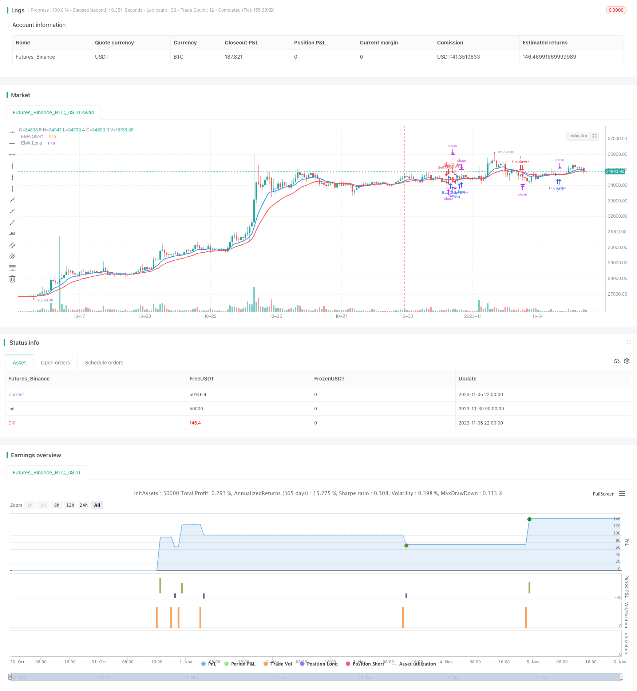

> Name

Turtle-Breakout-EMA-Cross-Strategy
> Author

ChaoZhang

> Strategy Description


[trans]


## Overview
This strategy uses two EMA moving averages of different periods, and uses their intersection to determine trend reversal as an entry and exit signal. The strategy is simple to understand and easy to operate.
## Strategy Principle
This strategy uses the ta.ema function to calculate two EMA moving averages, one with a length of 10 periods and one with a length of 20 periods, representing the short-term and long-term trends. The code uses ta.crossover and ta.crossunder to determine the intersection of the two EMAs. When the short-term EMA crosses above the long-term EMA, it goes long, and when the short-term EMA crosses below the long-term EMA, it goes short. In this way, the intersection of EMA moving averages of different periods is used to capture the turning point of the trend.
This strategy also uses the variable lastCrossTime to record the last cross time to prevent unnecessary transactions from repeated crosses. Every time there is a valid cross, all current positions will be closed first, and then positions will be opened in the direction of the cross. After opening a position, set a stop-profit and stop-loss to close the position.
## Strategic Advantages
1. The strategic ideas are simple and clear, easy to understand and operate.
2. Use EMA cross to determine the trend reversal point. This is a commonly used and effective technical indicator strategy.
3. Using EMA of different periods can ensure that the general trend is captured while also improving the sensitivity to short-term changes.
4. Set up stop-profit and stop-loss to control the risks and benefits of a single transaction.
5. Use the lastCrossTime variable to filter repeated signals to avoid unnecessary transactions.
## Strategy Risk
1. EMA crossovers are prone to produce false signals, and there is a certain risk of misjudgment.
2. Fixed TP and SL cannot cope with market changes, so dynamic stop-profit and stop-loss should be set.
3. A system based only on EMA crossovers can easily cause losses in volatile market conditions.
4. The impact of transaction costs is not considered. In actual operations, you need to pay attention to spread and other transaction costs.
5. This strategy is mainly suitable for trending market conditions, and may not be effective in volatile market conditions.
It can be improved by optimizing take profit and stop loss, adding filter conditions, combining other indicators, etc. Risks need to be strictly controlled during a firm offer to avoid excessive losses in a single transaction.
## Strategy optimization direction
1. You can test and optimize the parameters of EMA to find a more suitable period combination.
2. Add auxiliary indicator judgments such as KDJ and MACD. Avoid unnecessary trading in volatile market conditions.
3. Set dynamic stop-profit and stop-loss, such as marginal stop-loss following the trend.
4. Increase your judgment on trading volume and consider entering the market when a large amount appears.
5. Make judgments based on other graphic forms, such as breaking through important resistance levels, etc.
6. Consider the cost impact of a firm offer and set a reasonable stop-profit and stop-loss range.
## Summarize
The overall idea of ​​this strategy is simple and clear. It uses the fast and slow crossing of EMA moving average to judge the trend reversal, and cooperates with stop-profit and stop-loss to control risk and return. The strategy is easy to operate, but there is a certain risk of misjudgment at the EMA crossover. It is necessary to further optimize the indicator parameters and supplement it with other technical indicators to reduce misjudgment. The effect is better in the trending market, but it is easy to get trapped in the volatile market. When placing a firm offer, risks must be strictly controlled, take-profit and stop-loss ranges optimized, and positions appropriately reduced. In general, this strategy is a basic trend following strategy and can be used as an introduction to quantitative trading.
||

## Overview

This strategy uses two EMA lines of different periods to identify trend reversals through their crossovers as entry and exit signals. The strategy is simple and easy to implement.  

## Strategy Logic

The strategy calculates two EMA lines using ta.ema, one with length 10 for short term and one with length 20 for long term trend. It identifies EMA crossovers and crossunders using ta.crossover and ta.crossunder to determine entry and exit points. When the short EMA crosses over the long EMA, it goes long. When the short EMA crosses under the long EMA, it goes short. This way the EMA crossovers are used to capture turning points in the trend.

The strategy also uses a variable lastCrossTime to record the time of the last crossover to avoid repeated signals. On each valid crossover, it closes all current positions first, then opens a new position in the direction of the crossover. After opening the position, take profit and stop loss are set to exit.

## Advantages

1. The strategy logic is simple and clear, easy to understand and implement.

2. Using EMA crossovers to identify trend reversal points is a commonly used effective technical indicator strategy.

3. Adopting EMAs of different periods helps improve sensitivity to short term moves while still catching big trends.

4. Take profit and stop loss helps control the risk and reward of each trade. 

5. The lastCrossTime variable filters duplicate signals and avoids unnecessary trades.

## Risks

1. EMA crossovers can generate false signals, with some whipsaw risk.

2. Fixed TP and SL may fail to adapt to changing market conditions. Dynamic levels should be used.

3. Systems relying solely on EMA crossover can suffer losses in ranging markets. 

4. Trading costs like spread are not considered which impacts actual performance.

5. The strategy works better in trending rather than ranging markets.

Improvements can be made via optimizing TP/SL, adding filters, combining other indicators etc. Strict risk control and avoiding large single trade loss is essential for live trading.

## Enhancement

1. Test and optimize EMA periods to find better combinations.

2. Add other indicators like KDJ, MACD etc. to improve signal quality and avoid whipsaws.

3. Use dynamic take profit and stop loss, such as trailing stop along the trend.

4. Consider trading volume to confirm the signals.

5. Incorporate price action patterns like breakouts to strengthen signals. 

6. Account for trading costs like spread and optimize TP/SL levels accordingly.

## Conclusion

The strategy identifies trend reversals using EMA crossovers in a simple and straightforward way. TP/SL are used to control risks and rewards. It is easy to implement but EMA crossovers have whipsaw risks. Further optimizations can be done by tuning parameters, adding filters and combining other indicators to improve robustness. It performs better in trending rather than ranging markets. Strict risk management and optimal TP/SL sizing is crucial for live trading. Overall it serves as a basic trend following system and is a good starting point for algorithmic trading education.

[/trans]

> Strategy Arguments


|Argument|Default|Description|
|----|----|----|
|v_input_int_1|10|Length EMA Short|
|v_input_int_2|20|Length EMA Long|
|v_input_int_3|true|Lot Size|
|v_input_int_4|600|Take Profit Level|
|v_input_int_5|200|Stop Loss Level|


> Source (PineScript)

``` pinescript
/*backtest
start: 2023-10-30 00:00:00
end: 2023-11-06 00:00:00
period: 2h
basePeriod: 15m
exchanges: [{"eid":"Futures_Binance","currency":"BTC_USDT"}]
*/

//@version=5
strategy('XXXquang', overlay=true)

// Sử dụng hàm input.int() và input.float() để tạo các trường nhập liệu với giới hạn giá trị
length1 = input.int(10, title="Length EMA Short", minval=1)
length2 = input.int(20, title="Length EMA Long", minval=1)
lotSize = input.int(1, title="Lot Size", minval=1)

takeProfitLevel = input.int(600, title="Take Profit Level", minval=1)
stopLossLevel = input.int(200, title="Stop Loss Level", minval=1)

ema1 = ta.ema(close, length1)
ema2 = ta.ema(close, length2)

var float lastCrossTime = na

if ta.crossover(ema1, ema2)
    if na(lastCrossTime)
        strategy.close_all()
    strategy.entry('Buy Order', strategy.long, qty=lotSize)
    strategy.exit('Exit Buy', 'Buy Order', profit=takeProfitLevel / syminfo.pointvalue, loss=stopLossLevel / syminfo.pointvalue)
    lastCrossTime := timenow

if ta.crossunder(ema1, ema2)
    if na(lastCrossTime)
        strategy.close_all()
    strategy.entry('Sell Order', strategy.short, qty=lotSize)
    strategy.exit('Exit Sell', 'Sell Order', profit=takeProfitLevel / syminfo.pointvalue, loss=stopLossLevel / syminfo.pointvalue)
    lastCrossTime := timenow

plot(ema1, title='EMA Short', color=color.new(color.blue, 0), linewidth=2)
plot(ema2, title='EMA Long', color=color.new(color.red, 0), linewidth=2)

```

> Detail

https://www.fmz.com/strategy/431400

> Last Modified

2023-11-07 15:40:08
