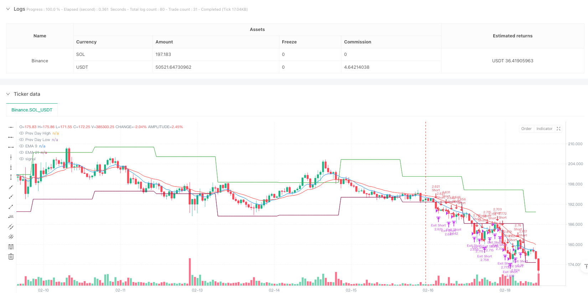
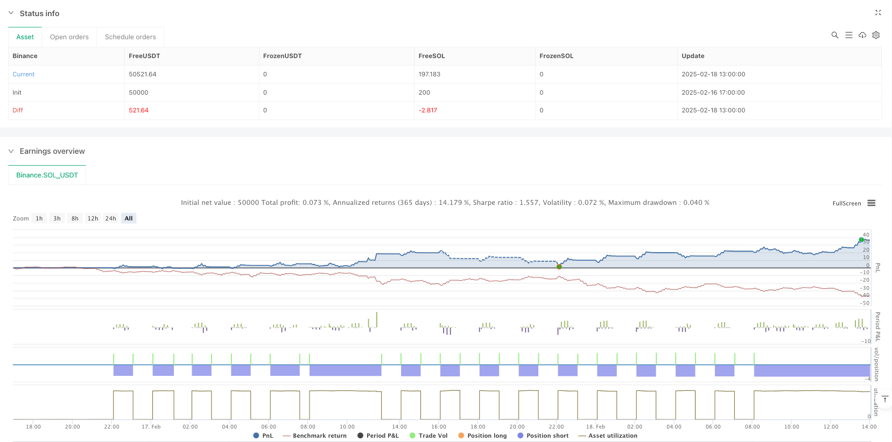

> Name

Momentum trading strategy based on intraday price range breakout combined with EMAs indicator optimization-Price-Range-Breakout-Momentum-Trading-Strategy-with-EMAs-Optimization
> Author

ianzeng123

> Strategy Description





[trans]
#### Overview
This strategy is an intraday trading strategy that combines the previous day's price range breakout with exponential moving averages (EMAs). The strategy trades by identifying when price breaks out of the previous day's high or low, combined with confirmation signals from fast and slow EMAs. This strategy focuses on capturing short-term price momentum and manages risk by setting fixed stop loss points and risk-reward ratio.
#### Strategy Principle
The core logic of the strategy is based on the following key elements:
1. Use the request.security function to obtain the high and low points of the previous trading day as the key price range.
2. Calculate 9-period and 21-period exponential moving averages (EMAs) as trend confirmation indicators.
3. A long signal is triggered when the price breaks through the previous day's high and the fast EMA is above the slow EMA.
4. A short signal is triggered when the price breaks the previous day's low and the fast EMA is below the slow EMA.
5. Manage the risk of each transaction by setting a fixed stop loss number (30 points) and a risk-to-benefit ratio (2.0).
6. Optional trading time filtering function supports trading within a specific period (SAST time zone).
#### Strategic Advantages
1. Clear structure and simple logic: The strategy uses price breakout logic that is easy to understand and execute.
2. Improved risk management: Strict risk control is achieved through the setting of fixed stop loss points and risk-return ratio.
3. Flexible time management: Optional trading time filtering allows trading during the most active market periods.
4. Multiple confirmation mechanism: combines price breakthroughs and EMAs trend confirmation to reduce the risk of false signals.
5. High degree of automation: Strategies can be fully automated and executed, reducing human intervention.
#### Strategy Risk
1. Risk of false breakthrough: The price may quickly retrace after the breakthrough, leading to stop-loss exit.
2. Slippage risk: During periods of high volatility, the actual transaction price may deviate significantly from the signal price.
3. Fixed stop loss risk: Fixed stop loss may not adapt to all market conditions.
4. Market volatility risk: Too many trading signals may be generated during periods of low volatility.
#### Strategy optimization direction
1. Dynamic stop loss optimization: Consider dynamically adjusting the stop loss points based on market volatility.
2. Trading time optimization: Optimize trading time window settings through historical data analysis.
3. Signal filtering enhancement: Add volume or volatility indicators as additional filtering conditions.
4. EMAs parameter optimization: Determine the optimal EMAs cycle settings through backtesting.
5. Position management optimization: Introduce a dynamic position management mechanism based on volatility.
#### Summary
This strategy implements a reliable intraday trading system by combining price breakouts and trend confirmation with EMAs. The core advantage of the strategy lies in its clear logical structure and complete risk management mechanism. Through the suggested optimization directions, the strategy can further improve its stability and profitability. In real trading, special attention needs to be paid to the risks of false breakthroughs and slippage, and parameter adjustments should be made based on actual market conditions. ||
#### Overview
This strategy is an intraday trading system that combines previous day's price range breakout with exponential moving averages (EMAs). It identifies trading opportunities when price breaks through the previous day's high or low, confirmed by fast and slow EMAs. The strategy focuses on capturing short-term price momentum while managing risk through fixed stop-loss points and risk-reward ratio.

#### Strategy Principles
The core logic of the strategy is based on the following key elements:
1. Using request.security function to obtain the previous day's high and low as key price levels.
2. Calculating 9-period and 21-period exponential moving averages (EMAs) as trend confirmation indicators.
3. Triggering long signals when price breaks above previous day's high and fast EMA is above slow EMA.
4. Triggering short signals when price breaks below previous day's low and fast EMA is below slow EMA.
5. Managing risk through fixed stop-loss points (30 points) and risk-reward ratio (2.0) for each trade.
6. Optional time filter functionality supporting trading during specific sessions (SAST timezone).

#### Strategy Advantages
1. Clear structure and simple logic: Strategy employs easy-to-understand and execute breakout logic.
2. Comprehensive risk management: Implements strict risk control through fixed stop-loss points and risk-reward ratio.
3. Flexible time management: Optional time filter allows trading during most active market sessions.
4. Multiple confirmation mechanism: Combines price breakout and EMAs trend confirmation to reduce false signals.
5. High automation level: Strategy can be fully automated, reducing human intervention.

#### Strategy Risks
1. False breakout risk: Price may quickly retrace after breakout, triggering stop-loss.
2. Slippage risk: Actual execution prices may significantly deviate from signal prices during high volatility.
3. Fixed stop-loss risk: Fixed point stop-loss may not adapt to all market conditions.
4. Market volatility risk: May generate excessive trading signals during low volatility periods.

#### Strategy Optimization Directions
1. Dynamic stop-loss optimization: Consider adjusting stop-loss points based on market volatility.
2. Trading time optimization: Optimize trading window settings through historical data analysis.
3. Signal filter enhancement: Add volume or volatility indicators as additional filtering conditions.
4. EMAs parameter optimization: Determine optimal EMAs periods through backtesting.
5. Position management optimization: Introduce volatility-based dynamic position sizing mechanism.

#### Summary
The strategy implements a reliable intraday trading system by combining price breakout and EMAs trend confirmation. Its core strengths lie in clear logical structure and comprehensive risk management mechanism. Through suggested optimization directions, the strategy can further enhance its stability and profitability. In live trading, special attention should be paid to false breakout and slippage risks, with parameters adjusted according to actual market conditions.[/trans]


> Source (PineScript)

``` pinescript
/*backtest
start: 2025-02-16 17:00:00
end: 2025-02-18 14:00:00
period: 1h
basePeriod: 1h
exchanges: [{"eid":"Binance","currency":"SOL_USDT"}]
*/

//@version=5
strategy("GER40 Momentum Breakout Scalping", overlay=true, initial_capital=10000, default_qty_type=strategy.percent_of_equity, default_qty_value=1)

//———— Input Parameters —————
stopLossPoints = input.int(30, title="Stop Loss (Pips)", minval=1)  // Updated to 30 pips
riskReward    = input.float(2.0, title="Risk Reward Ratio", step=0.1)
useTimeFilter = input.bool(false, title="Use Time Filter? (Sessions in SAST)")
// Define sessions (SAST) if needed
session1 = "0900-1030"
session2 = "1030-1200"
session3 = "1530-1730"

//———— Time Filter Function —————
inSession = true
if useTimeFilter
    // TradingView's session function uses the chart's timezone.
    // Adjust the session times if your chart timezone is not SAST.
    inSession = time(timeframe.period, session1) or time(timeframe.period, session2) or time(timeframe.period, session3)

//———— Get Previous Day's High/Low —————
// Fetch the previous day's high/low using the daily timeframe. [1] refers to the previous completed day.
prevHigh = request.security(syminfo.tickerid, "D", high[1])
prevLow  = request.security(syminfo.tickerid, "D", low[1])

//———— Calculate EMAs on the 1-minute chart —————
emaFast = ta.ema(close, 9)
emaSlow = ta.ema(close, 21)

//———— Define Breakout Conditions —————
longCondition  = close > prevHigh and emaFast > emaSlow
shortCondition = close < prevLow  and emaFast < emaSlow

//———— Entry & Exit Rules —————
if inSession
    // Long breakout: Price breaks above previous day's high
    if (longCondition)
        strategy.entry("Long", strategy.long)
        strategy.exit("Exit Long", "Long", 
          stop = strategy.position_avg_price - stopLossPoints * syminfo.mintick, 
          limit = strategy.position_avg_price + stopLossPoints * riskReward * syminfo.mintick)
    
    // Short breakout: Price breaks below previous day's low
    if (shortCondition)
        strategy.entry("Short", strategy.short)
        strategy.exit("Exit Short", "Short", 
          stop = strategy.position_avg_price + stopLossPoints * syminfo.mintick, 
          limit = strategy.position_avg_price - stopLossPoints * riskReward * syminfo.mintick)

//———— Plot Indicators & Levels —————
plot(emaFast, color=color.blue, title="EMA 9")
plot(emaSlow, color=color.red, title="EMA 21")
plot(prevHigh, color=color.green, style=plot.style_linebr, title="Prev Day High")
plot(prevLow, color=color.maroon, style=plot.style_linebr, title="Prev Day Low")

```

> Detail

https://www.fmz.com/strategy/483092

> Last Modified

2025-02-21 13:20:45
