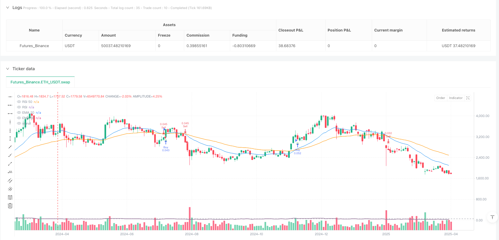
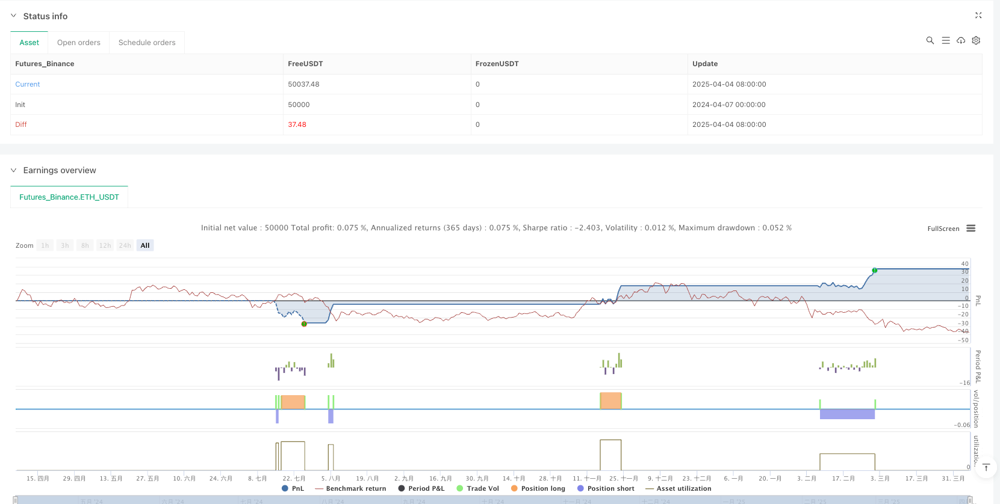

> Name

Dynamic-Volatility-Adaptive-EMA-RSI-Crossover-Strategy
> Author

ianzeng123

> Strategy Description





[trans]

#### Overview
The dynamic volatility adaptive EMaxRSI crossover strategy is a quantitative trading system that integrates technical analysis and risk management. The core of this strategy is based on the EMA cross signal, combined with the RSI indicator for filtering confirmation, and the stop loss and take profit levels are dynamically adjusted through ATR. The characteristic of the strategy is that it not only pays attention to the timing of entry, but also automatically adjusts the position size according to market volatility. It also sets up an automatic closing mechanism when the trend reverses, forming a complete closed-loop trading system.
#### Strategy Principle
This strategy uses a combination of multiple technical indicators to determine market trends and entry opportunities. The specific logic is as follows:
1. **Trend judgment and entry signals**:
   - Use the crossover of the 20-period and 50-period exponential moving averages (EMA) as the base signal
   - When the short-term EMA (20) crosses the long-term EMA (50) and the closing price is above the EMA (50), a potential buy signal is formed
   - When the short-term EMA (20) crosses the long-term EMA (50) and the closing price is below the EMA (50), a potential sell signal is formed
2. **RSI filter confirmation**:
   - Use 14-period RSI as signal filter
   - A buy signal requires RSI below 70 (not overbought area)
   - A sell signal requires RSI above 30 (not oversold area)
3. **Risk Management Mechanism**:
   - Calculate market volatility based on 14-period ATR
   - Stop loss distance = ATR × stop loss multiplier (default is 1)
   - Take profit distance = ATR × Take profit multiplier (default is 2)
   - Risk amount = total funds × single risk percentage (default 1%)
   - Position size = Risk amount ÷ Stop loss distance
4. **Trend reversal closing**:
   - Automatically close positions when a reverse signal occurs, no need to wait for stop loss or take profit to be triggered
   - A long position is closed when a confirmed sell signal appears
   - Sell positions are closed when a confirmed buy signal appears
#### Strategic Advantages
Analyzing this strategy code, the following significant advantages can be summarized:
1. **Dynamic Risk Management**: The strategy does not use fixed stop-loss points, but adjusts the stop-loss distance through ATR adaptive market volatility, so that the stop-loss setting is neither too tight to be hit by market noise, nor too loose to cause excessive single losses.
2. **Proportional risk allocation**: By accurately calculating the risk ratio of each transaction, ensuring that the loss of a single transaction is controlled within the preset percentage of the total funds (default 1%), effectively preventing the risk of liquidation.
3. **Trend following and adaptive**: Combining EMA crossover and RSI filtering, it can not only follow the main trend, but also avoid making counter-trend transactions in overbought and oversold areas, improving signal quality.
4. **Risk-return ratio optimization**: By default, the take-profit distance is set to 2 times the stop-loss distance to ensure a good risk-return ratio, which is an important factor in long-term stable profitability.
5. **Trend Reversal Protection**: The automatic closing mechanism when the trend reverses can help lock in profits or reduce losses in a timely manner and avoid large retracements of positions.
#### Strategy Risk
Although this strategy is comprehensively designed, there are still the following potential risks:
1. **False breakout risk**: EMA crossovers may generate false breakout signals, especially in sideways and volatile markets. The solution is to consider adding volume confirmation or adding signal filters, such as using the trend strength indicator ADX.
2. **Slippage and spread effects**: The strategy does not consider slippage and spread factors in actual transactions, which may cause the actual execution results to deviate from the backtest results. The solution is to adjust the distance between stop loss and take profit during actual deployment to reserve room for slippage.
3. **Parameter sensitivity**: The strategy effect is more sensitive to parameter settings such as EMA cycle, RSI threshold, and ATR multiplier. The solution is to conduct comprehensive parameter optimization and robustness testing to ensure that the parameters do not overfit the historical data.
4. **Frequent trend transitions**: In a volatile market, EMA may cross frequently, leading to excessive trading and fee erosion. The solution is to increase the filter condition of the trend duration or adjust the EMA parameters of a longer period.
5. **Fund management risk**: Although the strategy has a built-in fund management mechanism, it does not consider the simultaneous loss of related assets. The solution is to implement portfolio risk management and control the overall risk exposure of related assets.
#### Strategy optimization direction
Based on code analysis, this strategy has the following feasible optimization directions:
1. **Increase trend strength filtering**: Introduce the ADX indicator to evaluate trend strength, and only execute transactions when the trend is clear (such as ADX>25), which can significantly reduce false signals and unnecessary transactions in volatile markets.
2. **Optimize entry timing**: Consider adding confirmation of candlestick patterns or support/resistance levels. If you wait for the price to pull back to the moving average and then rebound, instead of entering directly at the intersection, you can get a better entry price.
3. **Adaptive parameter settings**: Automatically adjust the EMA cycle and RSI threshold based on market status (high volatility vs low volatility), so that the strategy can better adapt to different market environments.
4. **Add time filter**: Add trading period filtering conditions to avoid periods of insufficient market liquidity or abnormal fluctuations, which can improve transaction quality.
5. **Optimize capital management**: Implement progressive position management, moderately increase the position size after continuous profits, and reduce risk exposure after continuous losses to optimize the capital curve.
6. **Partial profit locking mechanism**: Introduce a multi-level profit-taking strategy, such as moving the stop loss to the cost price or closing positions in batches when the profit reaches a certain level, which not only ensures profit locking but also does not miss the big market.
#### Summary
The dynamic volatility adaptive EMAxRSI crossover strategy is a quantitative trading system with a complete structure and clear logic. It identifies trends through a combination of technical indicators and combines dynamic fund management and risk control mechanisms to form an effective trading decision-making framework. The advantage of the strategy is that it adjusts stop loss and profit positions and position sizes adaptively to market volatility, while improving signal quality through RSI filtering and trend reversal closing. Although there are risks such as false breakthroughs and parameter sensitivity, these problems are expected to be effectively alleviated through the recommended optimization directions, such as increasing trend strength filtering, optimizing entry timing, and introducing adaptive parameters. Overall, the strategy provides a solid quantitative trading foundation that is suitable for further refinement and optimization to suit different market environments and personal risk preferences. ||
#### Overview
The Dynamic Volatility-Adaptive EMA-RSI Crossover Strategy is a quantitative trading system that integrates technical analysis with comprehensive risk management. This strategy primarily relies on EMA crossover signals, filtered by RSI confirmation, and dynamically adjusts stop-loss and take-profit levels using ATR-based volatility measurements. What distinguishes this strategy is its focus not only on entry timing but also on position sizing based on market volatility, coupled with an automatic position closing mechanism when trend reversals occur, forming a complete trading loop system.

#### Strategy Principles
This strategy employs multiple technical indicators to determine market trends and entry points, with the following specific logic:

1. **Trend Identification and Entry Signals**:
   - Uses crossovers between 20-period and 50-period Exponential Moving Averages (EMA) as base signals
   - When the short-term EMA(20) crosses above the long-term EMA(50) and the closing price is above EMA(50), a potential buy signal is generated
   - When the short-term EMA(20) crosses below the long-term EMA(50) and the closing price is below EMA(50), a potential sell signal is generated

2. **RSI Filtering Confirmation**:
   - Uses 14-period RSI as a signal filter
   - Buy signals require RSI below 70 (not in overbought territory)
   - Sell signals require RSI above 30 (not in oversold territory)

3. **Risk Management Mechanism**:
   - Calculates market volatility based on 14-period ATR
   - Stop-loss distance = ATR × Stop-loss multiplier (default 1)
   - Take-profit distance = ATR × Take-profit multiplier (default 2)
   - Risk amount = Total capital × Per-trade risk percentage (default 1%)
   - Position size = Risk amount ÷ Stop-loss distance

4. **Trend Reversal Closing**:
   - Automatically closes positions when opposite signals occur, without waiting for stop-loss or take-profit triggers
   - Buy positions are closed when confirmed sell signals appear
   - Sell positions are closed when confirmed buy signals appear

#### Strategy Advantages
Analyzing this strategy code reveals the following significant advantages:

1. **Dynamic Risk Management**: The strategy doesn't use fixed stop-loss points but adapts stop-loss distances to market volatility through ATR, ensuring stop-loss settings are neither too tight to be triggered by market noise nor too loose to cause excessive per-trade losses.

2. **Proportional Risk Allocation**: By precisely calculating the risk proportion for each trade, it ensures single-trade losses are controlled within a preset percentage of total capital (default 1%), effectively preventing account blowout risk.

3. **Trend Following and Adaptability**: By combining EMA crossovers with RSI filtering, the strategy can both follow major trends and avoid counter-trend trades in overbought or oversold areas, improving signal quality.

4. **Optimized Risk-Reward Ratio**: The default setting makes take-profit distance twice the stop-loss distance, ensuring a favorable risk-reward ratio, which is crucial for long-term stable profitability.

5. **Trend Reversal Protection**: The automatic position closing mechanism when trends reverse helps secure profits or reduce losses promptly, preventing positions from facing significant drawdowns.

#### Strategy Risks
Despite its comprehensive design, the strategy still has these potential risks:

1. **False Breakout Risk**: EMA crossovers may generate false breakout signals, especially in ranging markets. Solution: Consider adding volume confirmation or additional filtering conditions, such as using the ADX trend strength indicator.

2. **Slippage and Spread Impact**: The strategy doesn't account for slippage and spread factors in actual trading, which may cause actual execution results to deviate from backtesting results. Solution: Adjust stop-loss and take-profit distances when deploying in real markets, allowing for slippage.

3. **Parameter Sensitivity**: Strategy performance is sensitive to parameter settings such as EMA periods, RSI thresholds, and ATR multipliers. Solution: Conduct comprehensive parameter optimization and robustness testing to ensure parameters aren't overfitted to historical data.

4. **Frequent Trend Changes**: In choppy markets, EMAs may cross frequently, leading to overtrading and commission erosion. Solution: Add trend duration filtering conditions or adjust to longer-period EMA parameters.

5. **Capital Management Risk**: Though the strategy has built-in capital management mechanisms, it doesn't consider the scenario of correlated assets losing simultaneously. Solution: Implement portfolio risk management to control the overall risk exposure of correlated assets.

#### Strategy Optimization Directions
Based on code analysis, the strategy has several viable optimization directions:

1. **Add Trend Strength Filtering**: Introduce the ADX indicator to evaluate trend strength, executing trades only when trends are clear (e.g., ADX>25), which can significantly reduce false signals and unnecessary trades in choppy markets.

2. **Optimize Entry Timing**: Consider adding candlestick pattern or support/resistance level confirmation, such as waiting for price pullbacks to moving averages before entering, rather than entering directly at crossover points, to obtain better entry prices.

3. **Adaptive Parameter Settings**: Automatically adjust EMA periods and RSI thresholds based on market conditions (high volatility vs. low volatility), allowing the strategy to better adapt to different market environments.

4. **Add Time Filtering**: Incorporate trading session filtering conditions to avoid times when market liquidity is insufficient or volatility is abnormal, improving trade quality.

5. **Optimize Capital Management**: Implement progressive position management, moderately increasing position size after consecutive wins and reducing risk exposure after consecutive losses, to optimize the equity curve.

6. **Partial Profit Locking Mechanism**: Introduce multi-tiered take-profit strategies, such as moving stop-loss to breakeven or partially closing positions when profit reaches certain levels, both securing profits and not missing out on major market moves.

#### Conclusion
The Dynamic Volatility-Adaptive EMA-RSI Crossover Strategy is a structurally complete and logically clear quantitative trading system that identifies trends through technical indicator combinations and forms an effective trading decision framework integrated with dynamic capital management and risk control mechanisms. The strategy's strengths lie in adapting stop-loss and take-profit positions and position sizes to market volatility, while improving signal quality through RSI filtering and trend reversal position closing. Although risks such as false breakouts and parameter sensitivity exist, these issues can be effectively mitigated through the suggested optimization directions, such as adding trend strength filtering, optimizing entry timing, and introducing adaptive parameters. Overall, this strategy provides a solid quantitative trading foundation suitable for further refinement and optimization to adapt to different market environments and individual risk preferences.[/trans]


> Source (PineScript)

``` pinescript
/*backtest
start: 2024-04-07 00:00:00
end: 2025-04-06 00:00:00
period: 2d
basePeriod: 2d
exchanges: [{"eid":"Futures_Binance","currency":"ETH_USDT"}]
*/

//@version=5
strategy("Kad_Sniper", overlay=true)
// Entrée Sniper avec Fermeture Tendance + Taille de Lot + SL et TP

// === Périodes des Moyennes Mobiles et RSI ===
shortEMALen = input.int(20, title="Période EMA 20")
longEMALen = input.int(50, title="Période EMA 50")
rsiLen = input.int(14, title="Période RSI")
rsiOverbought = input.int(70, title="RSI Suracheté")
rsiOversold = input.int(30, title="RSI Survendu")

// === Calcul des Moyennes Mobiles ===
ema20 = ta.ema(close, shortEMALen)
ema50 = ta.ema(close, longEMALen)

// === Calcul du RSI ===
rsi = ta.rsi(close, rsiLen)

// === Paramètres de Gestion de Risque ===
capital = input.float(1000, title="Capital Total ($)", minval=1)  // Capital total alloué
risqueParTrade = input.float(1, title="Risque par Trade (%)", minval=0.1, maxval=100)  // Risque par trade en %
stopLossMultiplier = input.float(1, title="Multiplier Stop Loss (en ATR)", minval=0.1, maxval=10)  // Multiplier du stop-loss basé sur l'ATR
takeProfitMultiplier = input.float(2, title="Multiplier Take Profit (en ATR)", minval=0.1, maxval=10)  // Multiplier du take-profit basé sur l'ATR

// === Calcul du Stop-Loss et Take Profit en Pips (en utilisant ATR pour déterminer la volatilité) ===
atr = ta.atr(14)
stopLossDistance = atr * stopLossMultiplier  // Distance du stop-loss en pips, ajustée par ATR
takeProfitDistance = atr * takeProfitMultiplier  // Distance du take-profit en pips, ajustée par ATR

// === Calcul de la Taille de Lot ===
montantRisque = capital * (risqueParTrade / 100)  // Risque par trade en $ (capital * pourcentage de risque)
tailleLot = montantRisque / stopLossDistance  // Taille du lot en fonction du risque et de la distance du stop-loss

// === Signaux de Croisement EMA et RSI ===
buySignal = ta.crossover(ema20, ema50) and rsi < rsiOverbought and close > ema50
sellSignal = ta.crossunder(ema20, ema50) and rsi > rsiOversold and close < ema50

// === Filtrage des Signaux ===
confirmedBuySignal = buySignal and rsi < rsiOverbought
confirmedSellSignal = sellSignal and rsi > rsiOversold

// === Fermeture des Positions lors du Changement de Tendance ===
// Fermer la position Buy si le signal Sell est détecté
if (confirmedSellSignal)
    strategy.close("Buy", comment="Close Buy")

// Fermer la position Sell si le signal Buy est détecté
if (confirmedBuySignal)
    strategy.close("Sell", comment="Close Sell")

// === Entrée dans les Positions avec SL et TP ===
// Entrée Buy lorsque les conditions sont validées
if (confirmedBuySignal)
    strategy.entry("Buy", strategy.long, qty=tailleLot, comment="Buy")
    strategy.exit("Exit", "Buy", stop=close - stopLossDistance, limit=close + takeProfitDistance)

// Entrée Sell lorsque les conditions sont validées
if (confirmedSellSignal)
    strategy.entry("Sell", strategy.short, qty=tailleLot, comment="Sell")
    strategy.exit("Exit", "Sell", stop=close + stopLossDistance, limit=close - takeProfitDistance )

// === Affichage des Signaux sous forme de points ultra petits ===
// Afficher un petit point vert (Buy) directement sous la bougie lorsque toutes les conditions sont validées
plotshape(series=confirmedBuySignal, location=location.belowbar, color=color.green, style=shape.circle, title="Signal Buy", size=size.tiny)

// Afficher un petit point rouge (Sell) directement au-dessus de la bougie lorsque toutes les conditions sont validées
plotshape(series=confirmedSellSignal, location=location.abovebar, color=color.red, style=shape.circle, title="Signal Sell", size=size.tiny)

// === Affichage de la Taille de Lot ===
if (confirmedBuySignal or confirmedSellSignal)
    label.new(bar_index, close, "Taille Lot: " + str.tostring(tailleLot, "#.##"), color=color.blue, style=label.style_label_down, textcolor=color.white, size=size.small)

// === Affichage des Moyennes Mobiles ===
plot(ema20, color=color.blue, title="EMA 20")
plot(ema50, color=color.orange, title="EMA 50")

// === Affichage RSI pour la confirmation ===
hline(50, "RSI 50", color=color.gray)
plot(rsi, color=color.rgb(153, 124, 158), title="RSI", linewidth=2)

```

> Detail

https://www.fmz.com/strategy/489650

> Last Modified

2025-04-07 13:25:33
