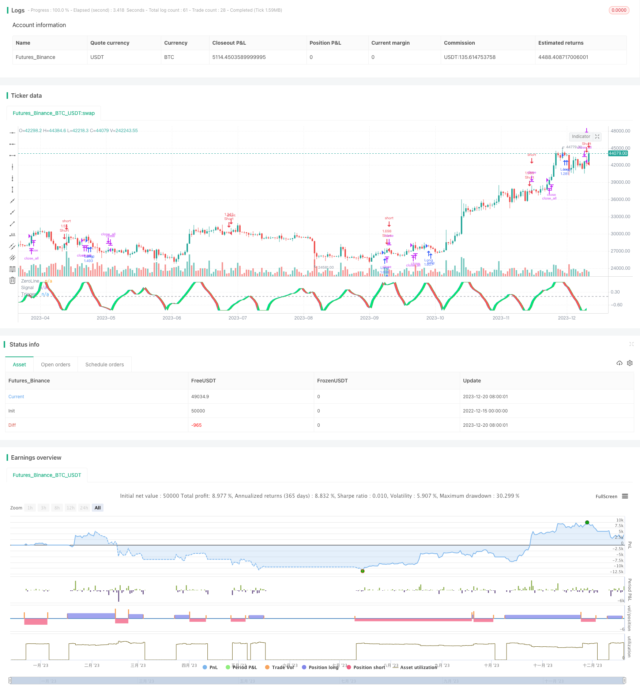

> Name

Ehlers-Fisher-Stochastic-Relative-Vigor-Index-Strategy
> Author

ChaoZhang

> Strategy Description


[trans]

## Overview
This strategy is based on the Ehlers-Fisher Stochastic Relative Vitality Index indicator proposed by John Ehlers in his book Control Analysis of Stocks and Futures. This strategy uses the Ehlers-Fisher indicator to determine a stock's relative strength, combined with customized trading rules for buying and selling.
## Strategy Principle
The strategy first calculates the closing price - opening price, which is the physical part of the stock. Then calculate the high price - low price, which is the shadow part of the stock. The stock's momentum is calculated by summing and averaging these two components separately. This momentum value is then divided by the stock's volatility to derive the relative vitality index (RVI).
Then, apply the calculation formula of the Ehlers-Fisher indicator to the RVI to obtain the signal value. Go long when the signal value crosses above the trigger value, and go short when it crosses below. In addition, fixed stop loss and trailing stop loss are also set to control risks.
## Advantage Analysis
This strategy comprehensively utilizes the momentum characteristics of stocks and stochastic indicators to effectively judge the relative strength of the market. The design of the Ehlers-Fisher indicator can reduce the impact of noise and generate more reliable trading signals. The vitality index reflects the trend and volatility of the stock itself and is a dynamic indicator.
Compared with using momentum indicators or stochastic indicators alone, this strategy organically combines indicators and models, which can improve signal quality. Strict stop-loss rules also allow this strategy to control risks while ensuring profitability.
## Risk Analysis
This strategy mainly relies on the Ehlers-Fisher indicator. When the market suddenly changes significantly, the indicator parameters need to be optimized to adapt to the new environment. If the indicator parameters are set improperly, false signals or signal lags will occur.
In addition, the strategy itself also has a certain degree of curve fitting risk. If there are major changes in the market environment between testing and actual trading, the performance of the strategy may deviate significantly. At this time, it is necessary to adjust the strategy parameters or optimize the trading rules to adapt to the new market conditions.
## Optimization direction
This strategy can be further optimized from the following aspects:
1. Optimize the parameters of the Ehlers-Fisher indicator to make it more sensitive or filter out noise.
2. Use machine learning algorithms such as LSTM to model indicators and generate more reliable trading signals.
3. Combine with market volatility indicators such as ATR to dynamically adjust the stop loss distance.
4. Add support for multi-factor models and integrate other technical indicators and fundamental indicators to improve signal quality.
5. Optimize the logic of opening and closing positions and set dynamic entry and exit conditions. Introducing adaptive stop loss and take profit technology.
## Summarize
This strategy uses the Ehlers-Fisher Stochastic Relative Vitality Index indicator to determine market trends and strength, and sets a reasonable stop-loss mechanism to control risks. Compared with a single indicator, this strategy organically combines multiple indicators and models, which can filter out noise and provide high-quality signals. Through parameter optimization, model fusion, adaptive adjustment and other means, there is room for further improvement of strategy performance.
|| 

## Overview  

This strategy is based on the Ehlers Fisher Stochastic Relative Vigor Index indicator proposed by John Ehlers in his book "Cybernetic Analysis for Stocks and Futures". The strategy utilizes the Ehlers Fisher indicator to judge the relative strength of stocks and combines it with custom trading rules for entries and exits.

## Strategy Logic

The strategy first calculates the closing price - opening price, which is the body of the candlestick. Then it calculates the high price - low price, which is the shadow of the candlestick. By taking sum and average of these two parts respectively, it obtains the momentum of the stock. Then by dividing the momentum with the volatility of the stock, it gets the Relative Vigor Index (RVI).  

Next, the Ehlers Fisher formula is applied on RVI to get the signal value. It goes long when signal crosses over trigger, and goes short when signal crosses below trigger. In addition, fixed stop loss and trailing stop loss are implemented to control risks.

## Advantage Analysis 

This strategy integrates the momentum characteristics and stochastic indicator of stocks, which can effectively determine the relative strength in the market. The design of Ehlers Fisher indicator can reduce the impact of noise and generate relatively reliable trading signals. The vigor index reflects the trending quality and volatility of a stock itself, making it a dynamic indicator.

Compared with using a single momentum indicator or stochastic indicator, this strategy combines indicators and models organically, which can improve the quality of signals. The strict stop loss rules also enable the strategy to control risks while ensuring profitability.  

## Risk Analysis

This strategy mainly relies on the Ehlers Fisher indicator. When there are drastic changes in the market, the parameters of the indicator need to be optimized to adapt to the new environment. If the parameters are set improperly, it may generate incorrect signals or lagging signals.

In addition, there is some degree of curve fitting risk intrinsically in the strategy itself. If the market environment in backtesting and live trading changes greatly, the performance of the strategy may deviate largely. In this case, strategy parameters need to be adjusted and trading rules require optimization for fitting the new market conditions.

## Optimization Directions 

This strategy can be further optimized in the following aspects:

1. Optimize the parameters of the Ehlers Fisher indicator for higher sensitivity or noise filtering.  

2. Model the indicator with machine learning algorithms like LSTM to generate more reliable trading signals.

3. Incorporate market volatility indicators like ATR to dynamically adjust the stop loss distance.  

4. Add support for multi-factor models, combining other technical and fundamental indicators to improve signal quality.

5. Optimize the open/close positions logic with dynamic entry/exit criteria. Introduce adaptive stop loss and take profit techniques.

## Conclusion

This strategy utilizes the Ehlers Fisher Stochastic RVI indicator to determine market trend and strength, and sets reasonable stop loss mechanisms to control risks. Compared with single indicators, this strategy combines multiple indicators and models organically, which can filter out noise and provide high quality signals. There is still room for further improvement in strategy performance through parameters optimization, model fusion, adaptive adjustment and other means.

[/trans]

> Strategy Arguments


|Argument|Default|Description|
|----|----|----|
|v_input_1|10|Length|
|v_input_2|true|oppositeTrade|


> Source (PineScript)

``` pinescript
/*backtest
start: 2022-12-15 00:00:00
end: 2023-12-21 00:00:00
period: 1d
basePeriod: 1h
exchanges: [{"eid":"Futures_Binance","currency":"BTC_USDT"}]
*/

//@version=3
strategy("Ehlers Fisher Stochastic Relative Vigor Index Strategy", overlay = false, default_qty_type = strategy.percent_of_equity, default_qty_value = 100.0, pyramiding = 1, commission_type = strategy.commission.percent, commission_value = 0.1)
p = input(10, title = "Length")
FisherStoch(src, len) =>
    val1 = stoch(src, src, src, len) / 100
    val2 = (4 * val1 + 3 * val1[1] + 2 * val1[2] + val1[3]) / 10
    FisherStoch = 0.5 * log((1 + 1.98 * (val2 - 0.5)) / (1 - 1.98 * (val2 - 0.5))) / 2.64

CO = close - open
HL = high - low

value1 = (CO + 2 * CO[1] + 2 * CO[2] + CO[3]) / 6
value2 = (HL + 2 * HL[1] + 2 * HL[2] + HL[3]) / 6

num = sum(value1, p)
denom = sum(value2, p)

RVI = denom != 0 ? num / denom : 0

signal = FisherStoch(RVI, p)
trigger = signal[1]
oppositeTrade = input(true)
barsSinceEntry = 0
barsSinceEntry := nz(barsSinceEntry[1]) + 1
if strategy.position_size == 0
    barsSinceEntry := 0
if ((crossover(signal, trigger) and not oppositeTrade) or (oppositeTrade and crossunder(signal, trigger))) and abs(signal) > 2 / 2.64
    strategy.entry("Long", strategy.long)
    barsSinceEntry := 0
if ((crossunder(signal, trigger) and not oppositeTrade) or (oppositeTrade and crossover(signal, trigger))) and abs(signal) > 2 / 2.64
    strategy.entry("Short", strategy.short)
    barsSinceEntry := 0
if strategy.openprofit < 0 and barsSinceEntry > 8
    strategy.close_all()
    barsSinceEntry := 0
    
hline(0, title="ZeroLine", color=gray) 
signalPlot = plot(signal, title = "Signal", color = blue)
triggerPlot = plot(trigger, title = "Trigger", color = green)
fill(signalPlot, triggerPlot, color = signal < trigger ? red : lime, transp = 50)
```

> Detail

https://www.fmz.com/strategy/436218

> Last Modified

2023-12-22 12:04:23
