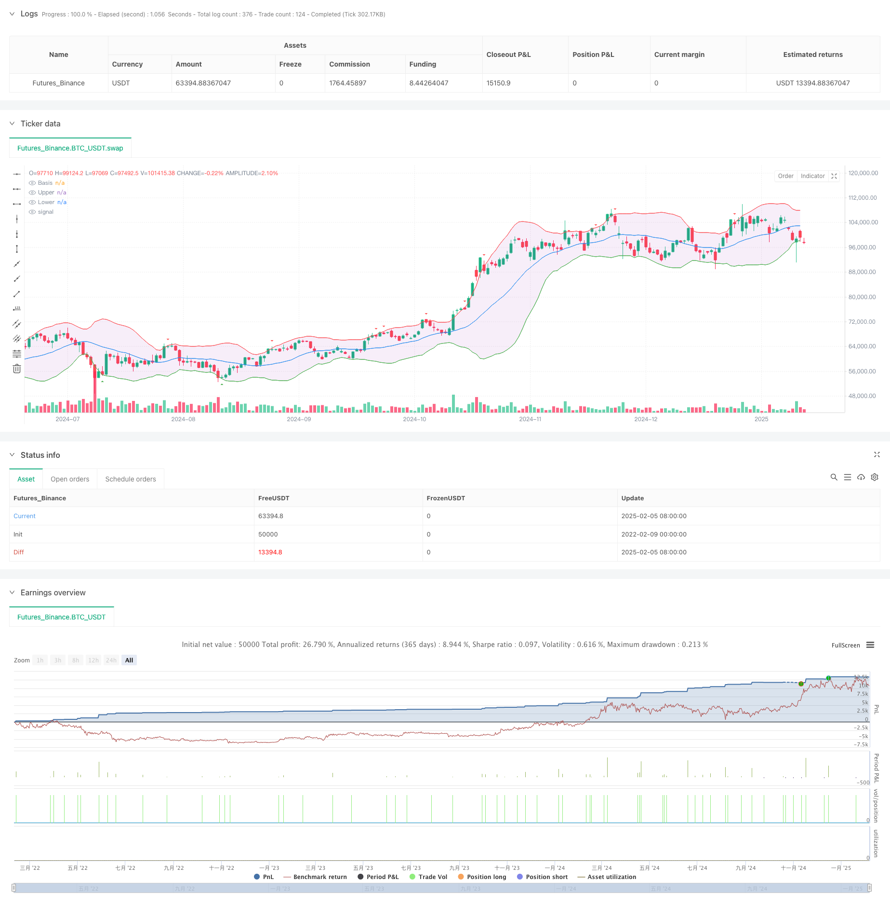

> Name

Enhanced-Bollinger-Bands-Dynamic-SL-TP-Quantitative-Trading-Strategy
> Author

ChaoZhang

> Strategy Description



[trans]
#### Overview
This strategy is an advanced quantitative trading system based on Bollinger Bands, combined with a dynamic stop-profit and stop-loss mechanism. The core of the strategy is to capture market momentum through the breakthrough of the upper and lower Bollinger Bands, and at the same time, it introduces stop-profit and stop-loss based on points (Pips) to manage risks. This strategy is suitable for various trading varieties and can be adapted to different market environments through parameter optimization.
#### Strategy Principle
The strategy is mainly based on the following core principles:
1. Use the 20-period simple moving average (SMA) as the middle track of the Bollinger Bands, and use 2 times the standard deviation to calculate the upper and lower tracks.
2. When the price breaks through the lower rail and the closing price is above the lower rail, a long signal is triggered; when the price breaks through the upper rail and the closing price is below the upper rail, a short signal is triggered.
3. Adopt a dynamic stop-profit and stop-loss mechanism based on points. The default stop-loss setting is 10 points and the take-profit is 20 points.
4. Adapt to different trading varieties through the pipValue parameter, making the strategy universal.
#### Strategic Advantages
1. The signal generation mechanism is robust and reliable, and false signals are reduced through closing price confirmation.
2. The risk management system is complete and uses dynamic stop-profit and stop-loss to protect profits and limit losses.
3. The strategy parameters are highly adjustable and can adapt to different market environments.
4. The visualization function is complete, making it easy for traders to monitor and analyze.
5. Taking actual transaction costs into consideration, slippage parameters are introduced to improve the authenticity of backtesting.
#### Strategy Risk
1. Frequent false breakthrough signals may occur in volatile markets.
2. Fixed-point stop-profit and stop-loss may not be suitable for markets with large volatility changes.
3. Improper parameter setting may lead to over-trading or missing important opportunities.
Solution:
- Added trend filter to reduce false signals that shake the market
- Introducing dynamic take-profit and stop-loss based on ATR
- Determine the optimal parameter combination through backtest optimization
#### Strategy optimization direction
1. Introduce market volatility indicators (such as ATR) to dynamically adjust the stop-profit and stop-loss distances.
2. Add trend confirmation indicators to filter trading signals.
3. Add volume analysis to support entry decisions.
4. Implement a position management system to optimize capital utilization efficiency.
5. Develop adaptive parameter systems to adapt to changes in market conditions.
#### Summary
This is a well-designed quantitative trading strategy that captures market opportunities through Bollinger Band breakthroughs and is supplemented by a scientific risk management system. The strategy has good scalability and adaptability, and its performance can be further improved through the suggested optimization directions. Suitable for investors interested in mid- to long-term trend trading. ||
#### Overview
This strategy is an advanced quantitative trading system based on Bollinger Bands with dynamic stop-loss and take-profit mechanisms. The core idea is to capture market momentum through breakouts of Bollinger Bands while managing risk using pip-based SL/TP levels. The strategy is applicable to various trading instruments and can be adapted to different market conditions through parameter optimization.

#### Strategy Principles
The strategy is based on the following core principles:
1. Uses a 20-period Simple Moving Average (SMA) as the middle band, with 2 standard deviations for upper and lower bands.
2. Generates long signals when price breaks above the lower band and closes above it; generates short signals when price breaks below the upper band and closes below it.
3. Implements dynamic SL/TP based on pips, with default settings of 10 pips for stop-loss and 20 pips for take-profit.
4. Adapts to different trading instruments through the pipValue parameter, making the strategy universal.

#### Strategy Advantages
1. Robust signal generation mechanism with confirmation through closing prices to reduce false signals.
2. Comprehensive risk management system using dynamic SL/TP to protect profits and limit losses.
3. Highly adjustable parameters to adapt to different market conditions.
4. Complete visualization features for easy monitoring and analysis.
5. Considers real trading costs with slippage parameters for more realistic backtesting.

#### Strategy Risks
1. May generate frequent false breakout signals in ranging markets.
2. Fixed pip-based SL/TP might not suit markets with varying volatility.
3. Improper parameter settings may lead to overtrading or missing important opportunities.
Solutions:
- Add trend filters to reduce false signals in ranging markets
- Implement ATR-based dynamic SL/TP
- Optimize parameters through backtesting

#### Optimization Directions
1. Introduce volatility indicators (like ATR) to dynamically adjust SL/TP distances.
2. Add trend confirmation indicators to filter trading signals.
3. Incorporate volume analysis to support entry decisions.
4. Implement position sizing system to optimize capital efficiency.
5. Develop adaptive parameter system to adjust to changing market conditions.

#### Summary
This is a well-designed quantitative trading strategy that captures market opportunities through Bollinger Bands breakouts with scientific risk management. The strategy offers good scalability and adaptability, with potential for further performance enhancement through suggested optimizations. It is suitable for investors interested in medium to long-term trend trading.[/trans]


> Source (PineScript)

``` pinescript
/*backtest
start: 2022-02-09 00:00:00
end: 2025-02-06 08:00:00
period: 1d
basePeriod: 1d
exchanges: [{"eid":"Futures_Binance","currency":"BTC_USDT"}]
*/

//@version=5
strategy("Enhanced Bollinger Bands Strategy with SL/TP", overlay=true,
  slippage=2)

// 入力パラメータの改善
length = input.int(20, "SMA Length", minval=1)
mult = input.float(2.0, "Standard Deviation Multiplier", minval=0.001, maxval=50)
enableLong = input.bool(true, "Enable Long Positions")
enableShort = input.bool(true, "Enable Short Positions")
pipValue = input.float(0.0001, "Pip Value", step=0.00001)
slPips = input.float(10, "Stop Loss (Pips)", minval=0)
tpPips = input.float(20, "Take Profit (Pips)", minval=0)
showBands = input.bool(true, "Show Bollinger Bands")
showSignals = input.bool(true, "Show Entry Signals")

// ボリンジャーバンド計算
basis = ta.sma(close, length)
dev = mult * ta.stdev(close, length)
upper = basis + dev
lower = basis - dev

// 可視化
plot(showBands ? basis : na, "Basis", color=color.blue)
u = plot(showBands ? upper : na, "Upper", color=color.red)
l = plot(showBands ? lower : na, "Lower", color=color.green)
fill(u, l, color=color.new(color.purple, 90))

// エントリー条件の改善
longCondition = ta.crossover(close, lower) and close > lower and enableLong
shortCondition = ta.crossunder(close, upper) and close < upper and enableShort

// ポジション管理
calcSlPrice(price, isLong) => isLong ? price - slPips * pipValue : price + slPips * pipValue
calcTpPrice(price, isLong) => isLong ? price + tpPips * pipValue : price - tpPips * pipValue

// エントリー＆エグジットロジック
if longCondition
    strategy.entry("Long", strategy.long, limit=lower)
    strategy.exit("Long Exit", "Long",
         stop=calcSlPrice(lower, true),
         limit=calcTpPrice(lower, true))

if shortCondition
    strategy.entry("Short", strategy.short, limit=upper)
    strategy.exit("Short Exit", "Short",
         stop=calcSlPrice(upper, false),
         limit=calcTpPrice(upper, false))

// シグナル可視化
plotshape(showSignals and longCondition, style=shape.triangleup, location=location.belowbar, color=color.green, size=size.small)
plotshape(showSignals and shortCondition, style=shape.triangledown, location=location.abovebar, color=color.red, size=size.small)
```

> Detail

https://www.fmz.com/strategy/481110

> Last Modified

2025-02-08 15:23:41
