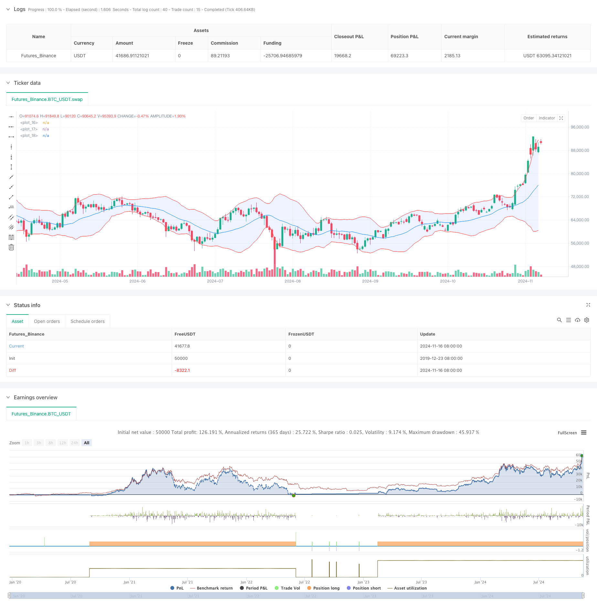

> Name

Enhanced-Bollinger-Mean-Reversion-Quantitative-Strategy
> Author

ChaoZhang

> Strategy Description



[trans]
#### Overview
This strategy is a mean reversion trading system based on Bollinger Bands, which optimizes trading results by combining trend filters and dynamic stops. The strategy uses statistical principles to trade when prices deviate from the mean, while using technical indicators to improve winning rates and manage risks.
#### Strategy Principle
The core of the strategy is based on the following key components:
1. Use a 20-period Bollinger band as the main signal source, with a bandwidth of 2 times the standard deviation.
2. Introduce the 50-period EMA as a trend filter to ensure that the trading direction is consistent with the mid-term trend
3. Use 14-period ATR to dynamically set stop loss and profit targets to improve the risk-return ratio
4. Open long when the price touches the lower band and is above the EMA, and open short when it touches the upper band and is below the EMA.
5. Use 2 times ATR as the profit target and 1 times ATR as the stop loss point.
#### Strategic Advantages
1. Combining the advantages of mean reversion and trend following to improve the reliability of trading
2. Dynamic stop loss and profit settings to adapt to changes in market volatility
3. Clear entry and exit rules to reduce subjective judgments
4. Fixed 2:1 risk-return ratio, conducive to long-term stable profits
5. A combination of technical indicators reduces the impact of false signals
#### Strategy Risk
1. You may miss the big move in a strong trending market
2. Frequent trading may occur when the sideways trading range is too narrow.
3. Stop loss may slip when the market suddenly changes.
4. Need to continuously monitor and adjust parameters to adapt to market changes
5. Transaction costs may affect strategy returns
#### Strategy optimization direction
1. Add trading volume indicator as auxiliary confirmation
2. Introduce market volatility filter to avoid periods of high volatility
3. Optimize parameter adaptation mechanism
4. Add more technical indicators for cross-validation
5. Improve the fund management system
#### Summary
This is a strategy that combines classic technical analysis with modern quantitative methods. Through multiple indicator confirmation and strict risk control, the strategy has good practicality. It is recommended to conduct sufficient historical backtesting and simulated trading verification before real trading. ||
#### Overview
This strategy is a mean reversion trading system based on Bollinger Bands, optimized with trend filters and dynamic stop-loss mechanisms. It applies statistical principles to trade price deviations from the mean while using technical indicators to improve win rates and manage risks.

#### Strategy Principles
The strategy is built on several key components:
1. Uses 20-period Bollinger Bands as the primary signal source with 2 standard deviation bandwidth
2. Incorporates 50-period EMA as a trend filter to ensure trade direction aligns with medium-term trends
3. Employs 14-period ATR for dynamic stop-loss and profit targets to improve risk-reward ratios
4. Enters long when price touches lower band and is above EMA, shorts when price touches upper band and is below EMA
5. Sets profit target at 2x ATR and stop-loss at 1x ATR

#### Strategy Advantages
1. Combines benefits of mean reversion and trend following for improved reliability
2. Dynamic stop-loss and profit targets adapt to market volatility
3. Clear entry and exit rules minimize subjective judgment
4. Fixed 2:1 risk-reward ratio promotes long-term profitability
5. Technical indicator combination reduces false signals

#### Strategy Risks
1. May miss major trends in strongly trending markets
2. Frequent trading possible in narrow consolidation ranges
3. Slippage risk during market gaps
4. Requires ongoing parameter monitoring and adjustment
5. Trading costs may impact strategy returns

#### Optimization Directions
1. Add volume indicators for confirmation
2. Implement volatility filters to avoid high volatility periods
3. Optimize parameter adaptation mechanisms
4. Include additional technical indicators for cross-validation
5. Enhance money management system

#### Summary
This strategy combines classical technical analysis with modern quantitative methods. Through multiple indicator confirmations and strict risk control, the strategy demonstrates good practicality. Thorough backtesting and demo trading are recommended before live implementation.[/trans]


> Source (PineScript)

``` pinescript
/*backtest
start: 2019-12-23 08:00:00
end: 2024-11-17 00:00:00
period: 1d
basePeriod: 1d
exchanges: [{"eid":"Futures_Binance","currency":"BTC_USDT"}]
*/

//@version=5
strategy("Optimized Bollinger Mean Reversion", overlay=true)

// Bollinger Band Settings
length = input.int(20, title="BB Length")
src = input(close, title="Source")
mult = input.float(2.0, title="BB Multiplier")

// Bollinger Bands Calculation
basis = ta.sma(src, length)
dev = mult * ta.stdev(src, length)
upper = basis + dev
lower = basis - dev

// Plot the Bollinger Bands
plot(basis, color=color.blue)
p1 = plot(upper, color=color.red)
p2 = plot(lower, color=color.red)
fill(p1, p2, color=color.rgb(41, 98, 255, 90))

// Trend Filter - 50 EMA
ema_filter = ta.ema(close, 50)

// ATR for Dynamic Stop Loss/Take Profit
atr_value = ta.atr(14)

// Buy condition - price touches lower band and above 50 EMA
buy_condition = ta.crossover(close, lower) and close > ema_filter

// Sell condition - price touches upper band and below 50 EMA
sell_condition = ta.crossunder(close, upper) and close < ema_filter

// Strategy Execution
if (buy_condition)
    strategy.entry("Buy", strategy.long)

if (sell_condition)
    strategy.entry("Sell", strategy.short)

// Exit with dynamic ATR-based stop loss and take profit
strategy.exit("Take Profit/Stop Loss", from_entry="Buy", limit=2*atr_value, stop=1*atr_value)
strategy.exit("Take Profit/Stop Loss", from_entry="Sell", limit=2*atr_value, stop=1*atr_value)

```

> Detail

https://www.fmz.com/strategy/472253

> Last Modified

2024-11-18 16:07:05
