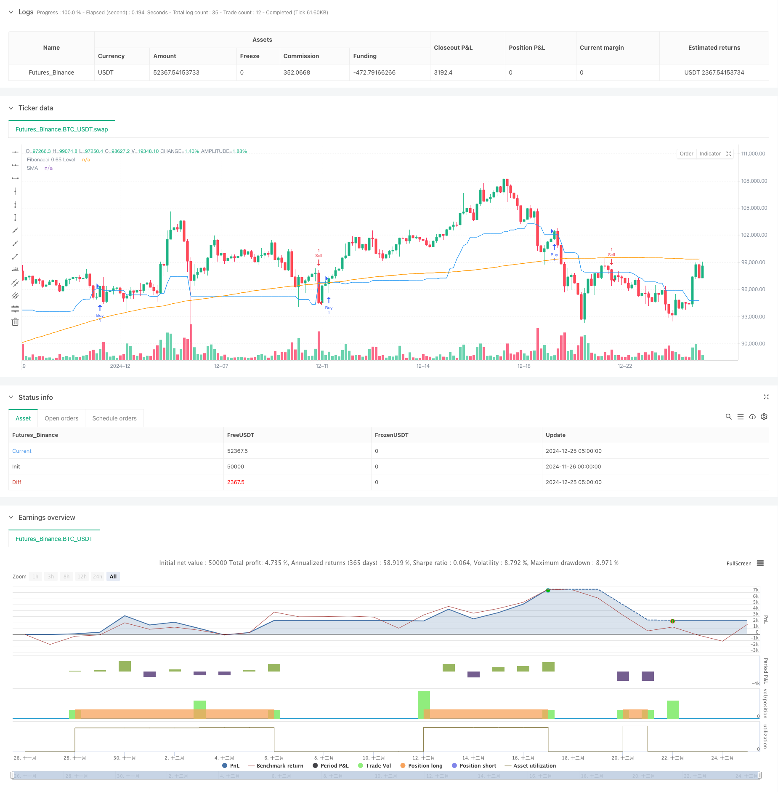

> Name

Enhanced Fibonacci Trend Following and Risk Management Strategy-Enhanced-Fibonacci-Trend-Following-and-Risk-Management-Strategy
> Author

ChaoZhang

> Strategy Description



[trans]
#### Overview
This strategy is a comprehensive trading system that combines Fibonacci retracement, trend following, and risk management. It is mainly based on the 0.65 Fibonacci retracement level as the key price reference point, combined with moving averages to confirm market trends, and integrates a dynamic stop-loss and take-profit mechanism based on ATR. This strategy operates on a 15-minute timeframe and is designed to capture high-probability trading opportunities consistent with current market trends.
#### Strategy Principle
The core logic of the strategy is based on the following key components:
1. Calculate the high and low using 38 periods of historical data, and determine the 0.65 Fibonacci retracement level based on this range.
2. Use the 181-period Simple Moving Average (SMA) as a trend filter to determine the overall direction of the market.
3. Use the 12-period average true range (ATR) multiplied by a factor of 1.8 to set dynamic stop loss and take profit levels.
4. In an uptrend, a long signal is triggered when the price breaks through the 0.65 Fibonacci level from below; in a downtrend, a short signal is triggered when the price breaks through this level from above.
#### Strategic Advantages
1. Integrate multiple technical analysis tools to provide more reliable trading signals.
2. Use dynamic stop-loss and take-profit levels to adaptively adjust risk management parameters according to market volatility.
3. Use the trend filter to ensure that the trading direction is consistent with the main trend, which improves the success rate of trading.
4. Adopt percentage position management method, using 5% of account equity by default to effectively control risks.
5. The strategy logic is clear and the parameters are highly adjustable, making it suitable for different market environments.
#### Strategy Risk
1. Frequent false breakthrough signals may occur in sideways markets, increasing transaction costs.
2. The 181-period moving average may respond slowly to market changes and may cause losses in a sharply turning market.
3. The fixed ATR multiplier may perform inconsistently under different market volatility environments.
4. The strategy relies on accurate high and low point calculations, which may cause misjudgments when the data quality is poor.
#### Strategy optimization direction
1. Introduce trading volume indicators as auxiliary confirmation to improve the reliability of breakthrough signals.
2. Consider adding a dynamic ATR multiplier adjustment mechanism to make stop loss and take profit more suitable for the current market environment.
3. Market volatility filters can be added to adjust or suspend trading during periods of high volatility.
4. To optimize the trend judgment mechanism, you can consider using a multi-period moving average combination.
5. Add trading time filtering to avoid periods of greater market volatility.
#### Summary
This is a well-designed mid-term trend tracking strategy that builds a complete trading system by combining Fibonacci theory, trend tracking and risk management. The main feature of the strategy is to use price breakthroughs to generate trading signals based on identifying market trends, and to manage risks through a dynamic stop-loss and take-profit mechanism. Although there are some areas that need optimization, overall this is a strategic framework with practical value. ||
#### Overview
This strategy is a comprehensive trading system that combines Fibonacci retracement, trend following, and risk management. It primarily uses the 0.65 Fibonacci retracement level as a key price reference point, incorporates moving averages for trend confirmation, and integrates dynamic stop-loss and take-profit mechanisms based on ATR. The strategy operates on a 15-minute timeframe and aims to capture high-probability trading opportunities aligned with the current market trend.

#### Strategy Principles
The core logic of the strategy is based on several key components:
1. Calculates highest and lowest points over a 38-period lookback window to determine the 0.65 Fibonacci retracement level.
2. Uses a 181-period Simple Moving Average (SMA) as a trend filter to determine the overall market direction.
3. Employs a 12-period Average True Range (ATR) multiplied by 1.8 to set dynamic stop-loss and take-profit levels.
4. Generates long signals when price breaks above the 0.65 Fibonacci level during uptrends, and short signals when price breaks below this level during downtrends.

#### Strategy Advantages
1. Integrates multiple technical analysis tools for more reliable trading signals.
2. Implements dynamic stop-loss and take-profit levels that adapt to market volatility.
3. Ensures trade direction aligns with the main trend through trend filtering, improving success rate.
4. Uses percentage-based position sizing, defaulting to 5% of account equity for effective risk control.
5. Features clear logic and adjustable parameters, suitable for various market conditions.

#### Strategy Risks
1. May generate frequent false breakout signals in ranging markets, increasing trading costs.
2. The 181-period moving average might be slow to react to market changes, potentially leading to losses in rapidly reversing markets.
3. Fixed ATR multiplier may perform inconsistently across different market volatility environments.
4. Strategy relies on accurate high-low calculations, which may lead to misinterpretation with poor quality data.

#### Strategy Optimization Directions
1. Introduce volume indicators as confirmation to improve breakout signal reliability.
2. Consider implementing dynamic ATR multiplier adjustment mechanism for more adaptive stop-loss and take-profit levels.
3. Add market volatility filters to adjust or pause trading during high volatility periods.
4. Optimize trend determination mechanism by considering multiple-period moving average combinations.
5. Add trading time filters to avoid highly volatile market periods.

#### Summary
This is a well-designed medium-term trend following strategy that builds a complete trading system by combining Fibonacci theory, trend following, and risk management. The strategy's main feature is generating trading signals based on price breakouts of key levels while identifying market trends, managing risk through dynamic stop-loss and take-profit mechanisms. While there are areas for optimization, it provides a practical strategy framework with real-world application value.[/trans]


> Source (PineScript)

``` pinescript
/*backtest
start: 2024-11-26 00:00:00
end: 2024-12-25 08:00:00
period: 3h
basePeriod: 3h
exchanges: [{"eid":"Futures_Binance","currency":"BTC_USDT"}]
*/

//@version=5
strategy("Refined Fibonacci Strategy - Enhanced Risk Management", overlay=true)

// Input parameters
fibonacci_lookback = input.int(38, minval=2, title="Fibonacci Lookback Period")
atr_multiplier = input.float(1.8, title="ATR Multiplier for Stop Loss and Take Profit")
sma_length = input.int(181, title="SMA Length")

// Calculating Fibonacci levels
var float high_level = na
var float low_level = na
if (ta.change(ta.highest(high, fibonacci_lookback)))
    high_level := ta.highest(high, fibonacci_lookback)
if (ta.change(ta.lowest(low, fibonacci_lookback)))
    low_level := ta.lowest(low, fibonacci_lookback)

fib_level_0_65 = high_level - ((high_level - low_level) * 0.65)

// Trend Filter using SMA
sma = ta.sma(close, sma_length)
in_uptrend = close > sma
in_downtrend = close < sma

// ATR for Risk Management
atr = ta.atr(12)
long_stop_loss = close - (atr * atr_multiplier)
long_take_profit = close + (atr * atr_multiplier)
short_stop_loss = close + (atr * atr_multiplier)
short_take_profit = close - (atr * atr_multiplier)

// Entry Conditions
buy_signal = close > fib_level_0_65 and close[1] <= fib_level_0_65 and in_uptrend
sell_signal = close < fib_level_0_65 and close[1] >= fib_level_0_65 and in_downtrend

// Execute Trades
if (buy_signal)
    strategy.entry("Buy", strategy.long)
if (sell_signal)
    strategy.entry("Sell", strategy.short)

// Exit Conditions
if (strategy.position_size > 0)
    strategy.exit("Exit Long", "Buy", stop=long_stop_loss, limit=long_take_profit)
if (strategy.position_size < 0)
    strategy.exit("Exit Short", "Sell", stop=short_stop_loss, limit=short_take_profit)

// Plotting
plot(fib_level_0_65, color=color.blue, title="Fibonacci 0.65 Level")
plot(sma, color=color.orange, title="SMA")

```

> Detail

https://www.fmz.com/strategy/476243

> Last Modified

2024-12-27 14:10:14
