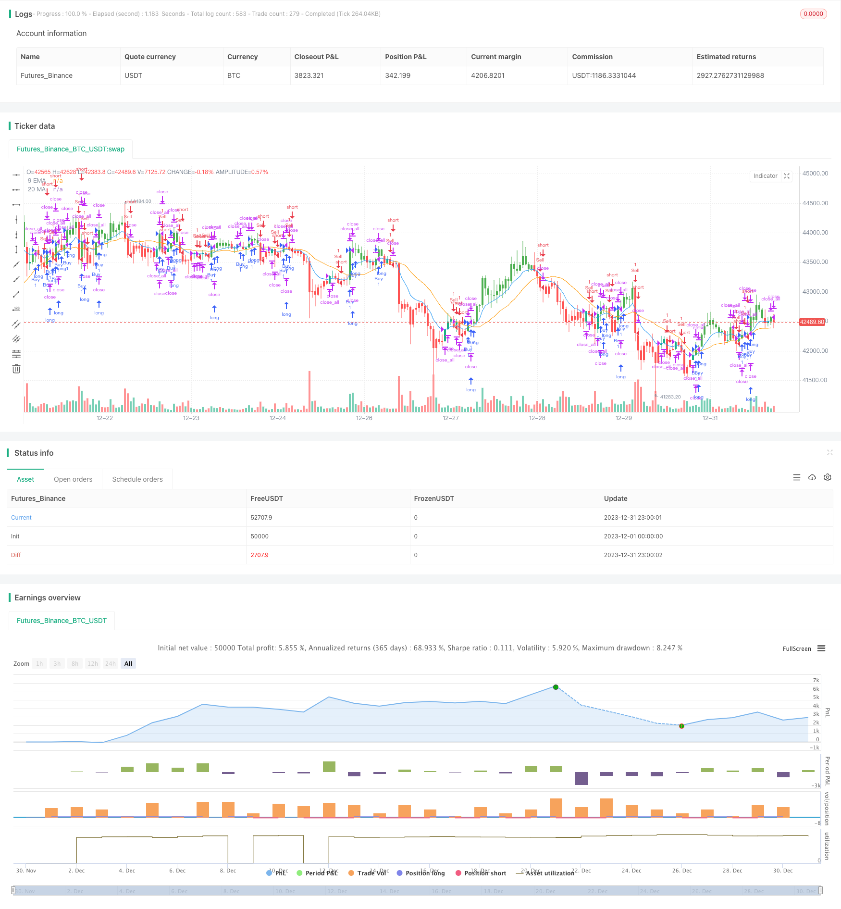

> Name

Exponential-Moving-Average-and-Moving-Average-Crossover-with-Close-Strategy
> Author

ChaoZhang

> Strategy Description


 [trans]
## Overview
The moving average crossover and closing trading strategy is a strategy that conducts trading operations based on the price movement of the 9-day exponential moving average (EMA) and the 20-day simple moving average (MA). This strategy uses the crossover signals of EMA and MA to determine the direction of the trend to issue buy and sell signals. Once the price crosses the moving average again, the strategy closes the existing position.
## Strategy Principle
### Calculation of EMA and MA
- EMA9 calculates the 9-day exponential moving average. EMA gives more weight to the most recent prices, making it more responsive to new information.
- MA20 calculates the 20-day simple moving average. MA is the average of the closing prices of the past 20 days.
### Buy and sell conditions
- Buying conditions: Established when the closing price is higher than the 9-day EMA and the 20-day MA. This signal is considered a long signal.  
- Sell condition: established when the closing price is below the 9-day EMA and the 20-day MA. This signal is considered a bearish signal.
### Opening and closing positions
- When the buying conditions are met, execute the buying and opening operation.  
- When the selling conditions are met, execute the selling opening operation. 
- When the price crosses the 9-day EMA or the 20-day EMA again, regardless of the current position direction, the position closing operation will be executed.
### K line color matching
- The buy K-line is marked green
- Sell K-line is marked in red
- Other K lines are white by default
### EMA and MA drawing
Plot the 9-day EMA and 20-day MA curves on the chart to observe the relative position of the price and the moving average.
## Strategic advantage analysis
This strategy combines two widely used technical indicators, EMA and MA, and makes full use of their advantages in smoothing prices and determining trend direction. Compared with using EMA or MA alone, this combination can provide more reliable trading signals.
The cross signals of EMA and MA lines are simple and clear, which can clearly judge the changes of market Bachelder and avoid wrong transactions.
The strategy is directly visually matched on the K line, and current trends and signals can be intuitively judged without complex calculations.
Automatically execute position opening and closing operations and strictly follow pre-established trading rules, which is helpful for risk control.
## Risk Analysis
Moving averages are trend-following indicators that can generate a large number of false signals during consolidation periods. This strategy should be avoided during choppy trends.
When prices fluctuate violently, the moving average may lag, causing the best entry or exit opportunities to be missed.
The parameter settings of EMA and MA will have a great impact on trading results. Parameters should be adjusted to suit different instruments and trading cycles.
Automated trading strategies cannot cope with various complex situations like manual traders, and it is difficult to close misleading positions in critical moments. Stop loss and take profit should be set in advance.
## Optimization direction
EMA and MA parameter combinations of different lengths can be tested to select the parameters that produce the best signal and minimize false signals.
Volatility indicators such as ATR can be combined to filter some high-risk signals to control potential losses.
Use the strategy in conjunction with other indicators or signals, such as volume and price indicators, and Bollinger Bands, to verify the reliability of the signal.
Add stop loss and take profit logic to proactively control position risk. Stop losses can be set based on ATR multiples or price levels.
## Summarize
The moving average crossover and closing trading strategy determines the direction of the market trend based on the crossover of EMA and MA to send trading signals. This strategy is simple and practical, and it is easy to implement automated trading. However, like other technical indicator strategies, its parameter settings and market conditions have a great impact on the results. In actual practice, it needs to be constantly adjusted and optimized to adapt to market changes.
||

## Overview

The Exponential Moving Average (EMA) and Moving Average (MA) Crossover with Close Strategy generates trading signals based on the price movement of an asset relative to its 9-period EMA and 20-period MA. It uses EMA and MA crossover signals to determine trend direction for entries and closes positions when the price recrosses the moving averages.

## Strategy Logic

### EMA and MA Calculation

- ema9 calculates the 9-period Exponential Moving Average of closing prices. EMA gives more weight to recent prices, making it more responsive.  
- ma20 calculates the 20-period Simple Moving Average of closing prices. MA is an average of closing prices over 20 periods.

### Buy and Sell Conditions

- buyCondition is true when close > both ema9 and ma20. This is interpreted as a bullish signal.
- sellCondition is true when close < both ema9 and ma20. This is interpreted as a bearish signal. 

### Trade Execution 

- When buyCondition is true, execute a long entry order.
- When sellCondition is true, execute a short entry order.
- When price recrosses ema9 or ma20, close any open position.  

### Candle Coloring  

- Green candles indicate buy condition 
- Red candles indicate sell condition
- Other candles are default white

### EMA and MA Plotting  

The 9 EMA and 20 MA are plotted on the chart for visual reference.

## Advantage Analysis

The strategy combines two widely used indicators, taking advantage of EMA and MA’s trend following and smoothing capabilities to generate more reliable signals.

Crossovers provide clear trend change signals, avoiding bad trades.

Candle color coding visually indicates conditions without complex calculations.

Automated entry and exit execution strictly follows predetermined rules, aiding risk management.

## Risk Analysis  

As trend following indicators, moving averages can produce many false signals during range-bound periods. Avoid using this strategy during choppy, non-trending markets.

Fast price moves can create lag in MA and EMA values, causing missed opportunities. 

EMA and MA parameters significantly impact strategy performance and should be adjusted for different products and timeframes.

Automated strategies cannot adapt to complex situations like a human trader. Preset stop losses and take profits.

## Optimization Directions 

Test different EMA and MA length combinations to find optimal parameters that maximize true signals and minimize false signals.

Incorporate volatility metrics like ATR to filter higher risk setups and control potential losses.

Combine with other indicators or signals like volume and Bollinger Bands to confirm signal reliability.  

Add stop loss and take profit logic to actively manage trade risk. Stops can be price-based or ATR-based.

## Summary

The EMA and MA Crossover with Close Strategy uses EMA and MA crossovers to determine trends and signal entries. While simple and automatable, performance is heavily dependent on parameter tuning and market conditions. Regular optimization is needed to adapt to evolving markets.

[/trans]


> Source (PineScript)

``` pinescript
/*backtest
start: 2023-12-01 00:00:00
end: 2023-12-31 23:59:59
period: 1h
basePeriod: 15m
exchanges: [{"eid":"Futures_Binance","currency":"BTC_USDT"}]
*/

//@version=4
strategy("EMA and MA Crossover with Close Strategy", shorttitle="EMA_MA_Close", overlay=true)

// Define the length of the Exponential Moving Average and Moving Average
lengthEMA = 9
lengthMA = 20

// Calculate the 9 EMA and 20 MA
ema9 = ema(close, lengthEMA)
ma20 = sma(close, lengthMA)

// Define the buy and sell conditions
buyCondition = close > ema9 and close > ma20
sellCondition = close < ema9 and close < ma20

// Define the close position condition
closeCondition = crossover(close, ema9) or crossover(close, ma20)

// Execute buy or sell orders
if (buyCondition)
    strategy.entry("Buy", strategy.long)
else if (sellCondition)
    strategy.entry("Sell", strategy.short)

// Close any position if the close condition is met
if (closeCondition)
    strategy.close_all()

// Coloring the candles based on conditions
barcolor(buyCondition ? color.green : na)
barcolor(sellCondition ? color.red : na)

// Plotting the EMA and MA for reference
plot(ema9, color=color.blue, title="9 EMA")
plot(ma20, color=color.orange, title="20 MA")

```

> Detail

https://www.fmz.com/strategy/439353

> Last Modified

2024-01-19 14:50:50
