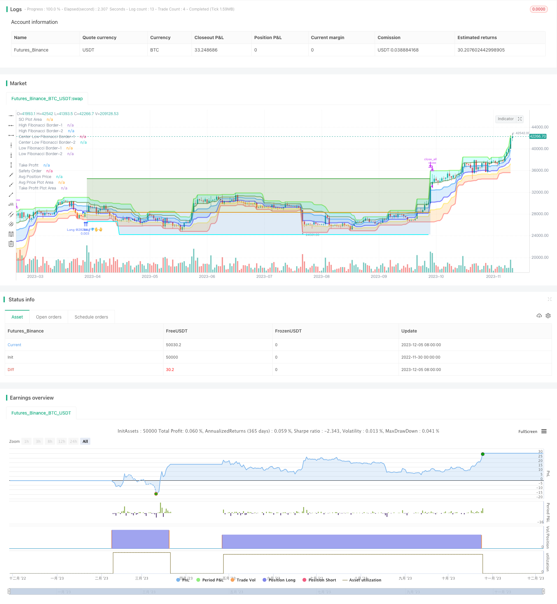

> Name

Quantitative trading precise long and short strategy Fibonacci-Zone-DCA-Strategy
> Author

ChaoZhang

> Strategy Description



[trans]

### Overview
This article mainly introduces a quantitative trading strategy based on Bollinger Bands, ADX indicators and K-line for long and short judgments. This strategy uses the Bollinger Band to determine market trends and volatility, and combines the ADX indicator to determine the strength of the market trend. It chooses the direction of long and short in the strong trending market, and consolidates and waits in the volatile market to avoid risks to the greatest extent.
### Strategy Principles
- 1. Determine the market trend direction based on the upper and lower Bollinger Bands. When the price is above the upper track, it is a long market, and when it is below the lower track, it is a short market.
- 2. Bollinger Bands width reflects market volatility and risk. The wider the Bollinger Bands, the more volatile the market is and the greater the risk. At this time, you should avoid opening a position.
- 3. The ADX indicator determines the strength of the market trend. When the ADX value is greater than 25, it indicates a trend market. At this time, judge the direction of the Bollinger Band and choose the direction to open a position. When ADX is less than 25, it indicates a volatile market and trading should be avoided at this time.
- 4. After deciding on the long and short direction, set the stop loss level according to the ATR indicator. ATR is used to measure market fluctuations and set the stop loss distance based on the ATR multiple.
- 5. Take profit is set according to the upper and lower Bollinger Bands. Take-profit for long positions is the lower track, and take-profit for short positions is the upper track. Or set a fixed take-profit distance based on the ATR multiple of the ATR indicator.
- 6. Perform profit and loss management between the stop loss position and the take profit position, and set a trailing stop loss to lock in profits.
### Strategic Advantages
1. Combined with the Bollinger Band and ADX indicators to determine the direction, you can clearly judge the long and short positions and selectively open positions to avoid unnecessary transactions in volatile market conditions.
2. Use the width of Bollinger Bands to judge volatility risk. The chances of Bollinger Bands narrowing will be high but the risk will be small. Avoid trading when the Bollinger Bands are widening.
3. The ATR stop loss setting makes the risk controllable and avoids being chased by the stop loss to the greatest extent.
4. Set the take-profit level according to the Bollinger Bands, and there is no risk of taking profit to chase high and stop profit to chase low.
5. The moving stop-profit is used to stop the profit in time after making a profit to ensure the profit and continue to follow the trend.
### Strategy Risk
1. Both Bollinger Bands and ADX indicators have the possibility of pressure. If there is a deviation, it may lead to misjudgment.
2. The ATR indicator can only reflect historical fluctuations and cannot predict future fluctuations. The risk of actual stop loss being chased still exists.
3. The division of Bollinger Bands areas is subjective and opportunities may be missed.
4. Trailing stop loss can only be performed during the session, and there is a risk that it cannot be moved during the interval.
5. Backtest data fitting risks. Test reports are difficult to replicate in the real market.
### Strategy optimization
1. Integrate more indicators for mutual trust to avoid false signals from Bollinger Bands and ADX indicators.
2. ATR stop loss can be added with gap stop loss. Or use deep learning algorithms to predict market fluctuations and set stop losses.
3. Optimize the channel parameters of Bollinger Bands so that it can embrace greater market opportunities.
4. Utilize a more efficient programmatic trading system for unattended trailing stop loss.
5. Conduct backtesting over a longer time period and more variety combinations to ensure the robustness of the strategy.
### Summarize
This strategy integrates multiple indicator signals such as Bollinger Bands and ADX indicators, and selectively opens positions after determining the clear trend direction. It also uses the ATR indicator to optimize stop loss and profit settings to maximize the control of risk and profit ratio. It is a recommended quantitative trading strategy. We see that this strategy still has a lot of room for optimization and look forward to the output of future iterative versions.
|| 

### Overview  

This article mainly introduces a quantitative trading strategy based on Fibonacci Zones and DCA setup with ADX indicators. The strategy uses Fibonacci Zones to determine trend and volatility, combines with ADX indicators to measure trend strength, enters trades following the major trend direction in strong trending markets, avoids trading in sideways markets, to maximize profits while minimizing risks.

### Principles  

- 1. Uses Fibonacci Zones formed with Donchian Channels to determine market trend direction. The zones divide into uptrend, ranging and downtrend zones.

- 2. Uses ADX and DI indicators to measure trend strength and direction. ADX above 25 indicates a trending market.

- 3. Enters long trades when price breaks into uptrend Fibonacci zone according to trend strength and direction. Add subsequent safety orders to average down. 

- 4. Sets initial stop loss based on entry price and safety order formula. Moves stop loss up to lock in profits.

- 5. Exits strategy with profit target by percentage or touching price levels related to Fibonacci zone borders.

### Advantages

1. Captures big trending moves while avoiding whipsaws in choppy markets.

2. Fibonacci zones work as dynamic support/resistance levels to identify turning points.

3. DCA allows better entries and maximizes profit potential from trends.

4. ADX gauges trend strength to avoid bad trades. DI shows bullish/bearish bias.

5. All components like TP, SO and SL prices update dynamically and automatically.

### Risks  

1. ADX and DI can give false signals without additional indicator confirmation.

2. Areas in Fibonacci zones are subjective and may miss opportunities.

3. DCA fails if the price trends strongly against position before SO triggered.    

4. Trail stop or profit target may exit before reaching full potential.

5. Backtest bias and curve fitting risks may not replicate live performance.

### Enhancements

1. Add more indicators like RSI, stochastics to confirm signals.

2. Optimize ADX and Fibonacci input parameters for better performance. 

3. Experiment with more intelligent trailing stop loss algorithms.  

4. Expand testing on more symbols and timeframes to ensure robustness.

5. Use machine learning predictions for dynamic stop loss and take profit.

### Conclusion
This strategy combines Fibonacci statistics and indicators like ADX for identifying high probability setups to go long or avoid trading altogether. The dynamic DCA position sizing ensures good entries while managing risks. With further optimizations, it has the potential to be a robust mechanical trading system. We look forward to more advanced versions in future.

[/trans]

> Strategy Arguments


|Argument|Default|Description|
|----|----|----|
|v_input_1|timestamp(01 Jan 2015 00:00 +0000)|(?Date Range)Start Time|
|v_input_2|timestamp(31 Dec 2050 23:59 +0000)|End Time|
|v_input_source_1_close|0|(?Trade Entry Settings)Source: close|high|low|open|hl2|hlc3|hlcc4|ohlc4|
|v_input_3|14|Fibonacci length|
|v_input_int_1|14|ADX Smoothing|
|v_input_int_2|14|DI Length|
|v_input_int_3|25|Min ADX value to open trade|
|v_input_string_1|0|Open a trade when the price moves:: 2-Higher than the top of the Downtrend Fib zone|1-To the bottom of Downtrend Fib zone|3-Higher than the bottom of Ranging Fib Zone|4-Higher than the top of Ranging Fib Zone|5-Higher than the bottom of Uptrend Fib Zone|6-To the top of Uptrend Fib Zone|
|v_input_bool_1|false|Only open trades on bullish +DI (Positive Directional Index)? (off for contrarian traders)|
|v_input_int_4|false|Min +DI value to open trade|
|v_input_int_5|100|Max +DI value to open trade|
|v_input_4|100|Base order|
|v_input_5|200|Safety order|
|v_input_float_3|6|Price deviation to open safety orders (%)|
|v_input_float_4|2|Safety order volume scale|
|v_input_float_5|1.4|Safety order step scale|
|v_input_6|5|Max safety orders|
|v_input_string_2|0|(?Trade Exit Settings)Take profit using:: Target Take Profit (%)|High Fibonacci Border-1|High Fibonacci Border-2|
|v_input_float_1|22|Target Take Profit (%)|
|v_input_float_2|false|Trailing deviation. Default= 0.0 (%)|


> Source (PineScript)

``` pinescript
/*backtest
start: 2022-11-30 00:00:00
end: 2023-12-06 00:00:00
period: 1d
basePeriod: 1h
exchanges: [{"eid":"Futures_Binance","currency":"BTC_USDT"}]
*/

// © Fibonacci Zone DCA Strategy - R3c0nTrader ver 2022-06-12
// For backtesting with 3Commas DCA Bot settings
// Thank you "eykpunter" for granting me permission to use "Fibonacci Zones" to create this strategy
// Thank you "junyou0424" for granting me permission to use "DCA Bot with SuperTrend Emulator" which I used for adding bot inputs, calculations, and strategy
//@version=5
strategy('Fibonacci Zone DCA Strategy - R3c0nTrader', shorttitle='Fibonacci Zone DCA Strategy', overlay=true )

// Strategy Inputs
// Start and End Dates
i_startTime = input(defval=timestamp('01 Jan 2015 00:00 +0000'), title='Start Time', group="Date Range")
i_endTime = input(defval=timestamp('31 Dec 2050 23:59 +0000'), title='End Time', group="Date Range")
inDateRange = true

// Fibonacci Settings
sourceInput = input.source(close, "Source", group="Trade Entry Settings")
per = input(14, title='Fibonacci length', tooltip='Number of bars to look back. Recommended for beginners to set ADX Smoothing and DI Length to the same value as this.', group="Trade Entry Settings")
hl = ta.highest(high, per)  //High Line (Border)
ll = ta.lowest(low, per)  //Low Line  (Border)
dist = hl - ll  //range of the channel    
hf = hl - dist * 0.236  //Highest Fibonacci line
cfh = hl - dist * 0.382  //Center High Fibonacci line
cfl = hl - dist * 0.618  //Center Low Fibonacci line
lf = hl - dist * 0.764  //Lowest Fibonacci line

// ADX Settings
lensig = input.int(14, title="ADX Smoothing", tooltip='Fibonacci signals work best when market is trending. ADX is used to measure trend strength. Default value is 14. Recommend for beginners to match this with Fibonacci length and DI Length',minval=1, maxval=50, group="Trade Entry Settings")
len = input.int(14, minval=1, title="DI Length", tooltip='Fibonacci signals work best when market is trending. DI Length is used to calculate ADX to measure trend strength. Default value is 14. Recommend for beginners to match this with Fibonacci length and ADX Smoothing.', group="Trade Entry Settings")
adx_min = input.int(25, title='Min ADX value to open trade', tooltip='Use this to set the minium ADX value (trend strength) to open trade. 25 or higher is recommended for beginners. 0 to 20 is a weak trend. 25 to 35 is a strong trend. 35 to 45 is a very strong trend. 45 to 100 is an extremely strong trend.', group="Trade Entry Settings")
up = ta.change(high)
down = -ta.change(low)
plusDM = na(up) ? na : (up > down and up > 0 ? up : 0)
minusDM = na(down) ? na : (down > up and down > 0 ? down : 0)
trur = ta.rma(ta.tr, len)
di_plus = fixnan(100 * ta.rma(plusDM, len) / trur)
di_minus = fixnan(100 * ta.rma(minusDM, len) / trur)
sum = di_plus + di_minus
adx = 100 * ta.rma(math.abs(di_plus - di_minus) / (sum == 0 ? 1 : sum), lensig)
fib_choice = input.string("2-Higher than the top of the Downtrend Fib zone", title="Open a trade when the price moves:", options=["1-To the bottom of Downtrend Fib zone", "2-Higher than the top of the Downtrend Fib zone", "3-Higher than the bottom of Ranging Fib Zone", "4-Higher than the top of Ranging Fib Zone", "5-Higher than the bottom of Uptrend Fib Zone", "6-To the top of Uptrend Fib Zone"],
   tooltip='There are three fib zones. The options are listed from the bottom zone to the top zone. The bottom zone is the Downtrend zone; the middle zone is the Ranging zone; The top fib zone is the Uptrend zone;',
   group="Trade Entry Settings")
di_choice = input.bool(false, title="Only open trades on bullish +DI (Positive Directional Index)? (off for contrarian traders)", tooltip=
   'Default is disabled. If you want to be more selective (you want a bullish confirmation), enable this and it will only open trades when the +DI (Positive Directional Index) is higher than the -DI (Negative Directional Index). Contrarian traders (buy the dip) should leave this disabled', 
   group="Trade Entry Settings")
di_min = input.int(0, title='Min +DI value to open trade', 
   tooltip='Default is zero. Use this to set the minium +DI value to open the trade. Try incrementing this value if you want to be more selective and filter for more bullish moves (e.g. 20-25). For Contrarian traders, uncheck "Only open trades on bullish DI" option and set Min +DI to zero', 
   group="Trade Entry Settings")
di_max = input.int(100, title='Max +DI value to open trade', tooltip='Default is 100. Use this to set the maxium +DI value to open trade. For Contrarian traders, uncheck "Only open trades on bullish DI" option and try a Max +DI value no higher than 20 or 25', group="Trade Entry Settings")
di_inrange = di_plus >= di_min and di_plus <= di_max

// Truncate function
truncate(number, decimals) =>
    factor = math.pow(10, decimals)
    int(number * factor) / factor

//Declare take_profit
take_profit = float(0.22)

// Take Profit Drop-down menu option
tp_choice = input.string("Target Take Profit (%)", title="Take profit using:", options=["Target Take Profit (%)", "High Fibonacci Border-1", "High Fibonacci Border-2"], tooltip=
   'Select how to exit your trade and take profit. Then specify below this option the condition to exit. "High Fibonacci Border-1" is the top-most Fibonacci line in the green uptrend zone. "High Fibonacci Border-2" is the bottom Fibonacci line in the green uptrend zone. You can find these lines on the "Style" tab and toggle them off/on to locate these lines for more clarity', 
   group="Trade Exit Settings")
if tp_choice == "Target Take Profit (%)"
    take_profit := input.float(22.0, title='Target Take Profit (%)', step=0.5, minval=0.0, tooltip='Only used if "Target Take Profit (%)" is selected above.', group="Trade Exit Settings") / 100
    take_profit
else if tp_choice == "High Fibonacci Border-1"
    take_profit := float(hl)
    take_profit
else if tp_choice == "High Fibonacci Border-2"
    take_profit := float(hf)
    take_profit

trailing = input.float(0.0, title='Trailing deviation. Default= 0.0 (%)', step=0.5, minval=0.0, group="Trade Exit Settings") / 100
base_order = input(100.0, title='Base order', group="Trade Entry Settings")
safe_order = input(200.0, title='Safety order', group="Trade Entry Settings")
price_deviation = input.float(6.0, title='Price deviation to open safety orders (%)', step=0.25, minval=0.0, group="Trade Entry Settings") / 100
safe_order_volume_scale = input.float(2.0, step=0.5, title='Safety order volume scale', group="Trade Entry Settings")
safe_order_step_scale = input.float(1.4, step=0.1, title='Safety order step scale', group="Trade Entry Settings")
max_safe_order = input(5, title='Max safety orders', group="Trade Entry Settings")

var current_so = 0
var initial_order = 0.0
var previous_high_value = 0.0
var original_ttp_value = 0.0

// Calculate our key levels
take_profit_level = strategy.position_avg_price * (1 + take_profit)

if tp_choice == "Target Take Profit (%)"
    take_profit_level := strategy.position_avg_price * (1 + take_profit)
else
    take_profit_level := take_profit

fib_trigger = bool(false)
if fib_choice == "2-Higher than the top of the Downtrend Fib zone"
    fib_trigger := ta.crossover(sourceInput, lf)
else if fib_choice == "1-To the bottom of Downtrend Fib zone"
    fib_trigger := sourceInput <= ll
else if fib_choice == "3-Higher than the bottom of Ranging Fib Zone"
    fib_trigger := ta.crossover(sourceInput, cfl)
else if fib_choice == "4-Higher than the top of Ranging Fib Zone"
    fib_trigger := ta.crossover(sourceInput, cfh)
else if fib_choice == "5-Higher than the bottom of Uptrend Fib Zone"
    fib_trigger := ta.crossover(sourceInput, hf)
else if fib_choice == "6-To the top of Uptrend Fib Zone"
    fib_trigger := sourceInput >= hl


// If option enabled for enter trades only when DI is positive, then open trade based on user settings
if di_choice == true and strategy.position_size == 0 and sourceInput > 0 and inDateRange and fib_trigger and adx >= adx_min and di_plus > di_minus and di_inrange
    strategy.entry('Long @' + str.tostring(sourceInput)+'?✋?', strategy.long, qty=base_order / sourceInput)
    initial_order := sourceInput
    current_so := 1
    previous_high_value := 0.0
    fib_trigger := false
    original_ttp_value := 0
    original_ttp_value
    
// Open First Position when candle source value crosses above the 'Low Fibonacci Border-1'
else if di_choice == false and strategy.position_size == 0 and sourceInput > 0 and inDateRange and fib_trigger and adx >= adx_min and di_inrange
    strategy.entry('Long @' + str.tostring(sourceInput)+'?✋?', strategy.long, qty=base_order / sourceInput)
    initial_order := sourceInput
    current_so := 1
    previous_high_value := 0.0
    fib_trigger := false
    original_ttp_value := 0
    original_ttp_value
    
threshold = 0.0
    
if safe_order_step_scale == 1.0
    threshold := initial_order - initial_order * price_deviation * safe_order_step_scale * current_so
    threshold

else if current_so <= max_safe_order
    threshold := initial_order - initial_order * ((price_deviation * math.pow(safe_order_step_scale, current_so) - price_deviation) / (safe_order_step_scale - 1))
    threshold

else if current_so > max_safe_order
    threshold := initial_order - initial_order * ((price_deviation * math.pow(safe_order_step_scale, max_safe_order) - price_deviation) / (safe_order_step_scale - 1))
    threshold
    
// Average down when lowest candle value crosses below threshold
if current_so > 0 and low <= threshold and current_so <= max_safe_order and previous_high_value == 0.0
    // Trigger a safety order at the Safety Order "threshold" price
    strategy.entry('?? SO ' + str.tostring(current_so) + '@' + str.tostring(threshold), direction=strategy.long, qty=safe_order * math.pow(safe_order_volume_scale, current_so - 1) / threshold)
    current_so += 1
    current_so

// Take Profit!
// Take profit when take profit level is equal to or higher than the high of the candle
if take_profit_level <= high and strategy.position_size > 0 or previous_high_value > 0.0
    if trailing > 0.0
        if previous_high_value > 0.0
            if high >= previous_high_value
                previous_high_value := sourceInput
                previous_high_value
            else
                previous_high_percent = (previous_high_value - original_ttp_value) * 1.0 / original_ttp_value
                current_high_percent = (high - original_ttp_value) * 1.0 / original_ttp_value
                if previous_high_percent - current_high_percent >= trailing
                    strategy.close_all(comment='Close (trailing) @' + str.tostring(truncate(current_high_percent * 100, 3)) + '%')
                    current_so := 0
                    previous_high_value := 0
                    original_ttp_value := 0
                    original_ttp_value
        else
            previous_high_value := high
            original_ttp_value := high
            original_ttp_value
    else
        strategy.close_all(comment='? Close @' + str.tostring(high))
        current_so := 0
        previous_high_value := 0
        original_ttp_value := 0
        original_ttp_value

// Plot Fibonacci Areas
fill(plot(hl, title='High Fibonacci Border-1', color=color.new(#53ed0f, 50), linewidth=3), plot(hf, title='High Fibonacci Border-2', color=color.new(#38761d, 50), linewidth=3), color=color.new(#00FFFF, 80), title='Uptrend Fibonacci Zone @ 23.6%')  //uptrend zone
fill(plot(cfh, title='Center Low Fibonacci Border-1', color=color.new(#0589f4, 50), linewidth=3), plot(cfl, title='Center Low Fibonacci Border-2', color=color.new(#2018ff, 50), linewidth=3), color=color.new(color.blue, 80), title='Ranging Fibonacci Zone @ 61.8%')  // ranging zone
fill(plot(lf, title='Low Fibonacci Border-1', color=color.new(color.yellow, 50), linewidth=3), plot(ll, title='Low Fibonacci Border-2', color=color.new(color.red, 50), linewidth=3), color=color.new(color.orange, 80), title='Downtrend Fibonacci Zone @ 76.4%')  //down trend zone

// Plot TP
plot(strategy.position_size > 0 ? take_profit_level : na, style=plot.style_linebr, color=color.green, linewidth=2, title="Take Profit")

// Plot All Safety Order lines except for last one as bright blue
plot(strategy.position_size > 0 and current_so <= max_safe_order and current_so > 0 ? threshold : na, style=plot.style_linebr, color=color.new(#00ffff,0), linewidth=2, title="Safety Order")

// Plot Last Safety Order Line as Red
plot(strategy.position_size > 0 and current_so > max_safe_order ? threshold : na, style=plot.style_linebr, color=color.red, linewidth=2, title="No Safety Orders Left")

// Plot Average Position Price Line as Orange
plot(strategy.position_size > 0 ? strategy.position_avg_price : na, style=plot.style_linebr, color=color.orange, linewidth=2, title="Avg Position Price")

// Fill TP Area and SO Area
h1 = plot(strategy.position_avg_price, color=color.new(#000000,100), title="Avg Price Plot Area", display=display.none, editable=false)
h2 = plot(take_profit_level, color=color.new(#000000,100), title="Take Profit Plot Area", display=display.none, editable=false)
h3 = plot(threshold, color=color.new(#000000,100), title="SO Plot Area", display=display.none, editable=false)

// Fill TP Area and SO Area
fill(h1,h2,color=color.new(#38761d,80), title="Take Profit Plot Area")
// Current SO Area
fill(h1,h3,color=color.new(#3d85c6,80), title="SO Plot Area")
```

> Detail

https://www.fmz.com/strategy/434575

> Last Modified

2023-12-07 16:19:11
