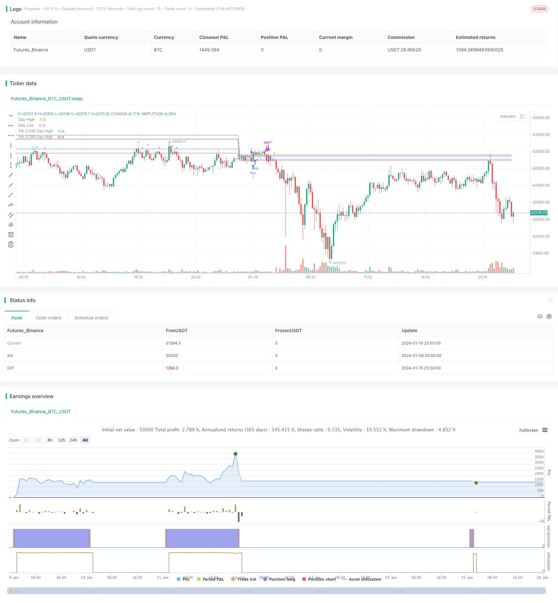

> Name

Breakthrough-of-Daily-High-low-Price-Based-on-Fibonacci-Levels
> Author

ChaoZhang

> Strategy Description


 [trans]

## Overview
This strategy calculates the daily high and low prices, combined with Fibonacci retracement levels, to find trading opportunities for breakthroughs within the current trading day. When the price rises and breaks through the highest price of the day, a bullish strategy is adopted; when the price falls and breaks through the lowest price of the day, a bearish strategy is adopted.
## Strategy Principle
The core logic of this strategy is as follows:
1. When the market opens every day, record the highest price dayHigh and the lowest price dayLow on that day.
2. Calculate the two Fibonacci retracement levels of 0.236 and 0.786:
   fib236High = dayLow + 0.236 * (dayHigh - dayLow)  
   fib786High = dayLow + 0.786 * (dayHigh - dayLow)

3. If the closing price rises and breaks through dayHigh, a buy signal is generated; if the closing price falls and breaks through dayLow, a sell signal is generated.
4. Adopt corresponding bullish or bearish strategies based on buy and sell signals.
This strategy cleverly combines the highest price, lowest price and Fibonacci level to look for trading opportunities when intraday breakthroughs occur. It is a type of trend following strategy and can capture trend reversals that occur in the middle of the session.
## Advantage Analysis
This strategy mainly has the following advantages:
1. The intraday operation frequency is high, and you can seize the price breakthrough in the middle period.
2. Combining the Fibonacci retracement with certain technical indicator support, it is not a simple pursuit of highs and lows.
3. Using the highest price and the lowest price as reference levels has certain support.
4. The transaction logic is simple and clear, easy to understand and implement, and is suitable for quantitative transactions.
5. Configurable to display the highest price, lowest price and Fibonacci level for easy visual analysis.
## Risk Analysis
There are also some risks with this strategy:
1. Frequent intraday operations may increase transaction costs and slippage risks.
2. Intraday breakthroughs may be false breakthroughs, and there is a risk of receiving wrong signals for both long and short positions.
3. Without stop loss logic, there is a risk of loss expansion.
4. Purely driven by technical indicators and not combined with fundamental analysis.
Countermeasures:
1. Appropriately adjust the location size to reduce cost impact.
2. Combine more technical indicators to filter signals to avoid false breakthroughs.
3. Add a trailing stop loss strategy to control single losses.
4. Combine with fundamental data to avoid market reversal blows.
## Optimization direction
The main optimization directions of this strategy are:
1. Add a combination of multiple technical indicators to improve signal reliability.
2. Add automatic stop loss strategy to control losses.
3. Optimize trading strategy parameters and adjust position management.
4. Based on high-frequency factors, filter signals by combining volatility, volume ratio, etc.
5. Use machine learning methods to find better parameter combinations.
6. Establish a dynamic exit mechanism instead of simply crossing the highest or lowest level.
## Summarize
The Fibonacci strategy of squeezing Fibonacci at high and low prices during the day is relatively simple overall, and profits are made by seizing short-term price breakthroughs. The strategy has a large space for optimization, and can be improved from multiple perspectives such as indicator optimization, stop loss management, parameter adjustment, etc., making it a stable and profitable high-frequency intraday strategy.
||

## Overview

This strategy calculates the highest and lowest prices of each day, combined with Fibonacci retracement levels, to find breakthrough trading opportunities within the current trading day. When the price breaks through the highest price of the day, take a bullish strategy; when the price breaks through the lowest price of the day, take a bearish strategy.

## Strategy Principle 

The core logic of this strategy is as follows:

1. Record the highest price dayHigh and the lowest price dayLow of the day at market open each day.

2. Calculate two Fibonacci retracement levels of 0.236 and 0.786:

   fib236High = dayLow + 0.236 * (dayHigh - dayLow)  
   fib786High = dayLow + 0.786 * (dayHigh - dayLow)  

3. If the closing price breaks through dayHigh upwards, a buy signal is generated; if the closing price breaks through dayLow downwards, a sell signal is generated.  

4. Take corresponding bullish or bearish strategies according to buy and sell signals.

This strategy ingeniously combines the highest price, the lowest price and Fibonacci levels to find trading opportunities when breakthroughs occur during the day. It is a kind of trend tracking strategy that can capture trend reversals during the midday trading session.

## Advantage Analysis

The main advantages of this strategy are:

1. High intraday trading frequency to capture price breakthroughs during midday trading sessions.

2. With certain technical indicator support of Fibonacci retracement, it is not simply chasing new highs or new lows.

3. Using the highest and lowest prices as reference levels has some supporting strength.  

4. The trading logic is simple and clear, easy to understand and implement, suitable for quantitative trading.

5. Displaying the highest price, lowest price and Fibonacci levels is configurable for visual analysis.

## Risk Analysis

There are also some risks to this strategy:

1. Frequent intraday operations may increase transaction costs and slippage risks.

2. Intraday breakthroughs may be false breakouts, with the risk of getting wrong bullish or bearish signals.  

3. There is no stop loss logic, with the risk of expanding losses.

4. It is purely technically driven without combining fundamental analysis.

Countermeasures:

1. Adjust position size appropriately to reduce cost impact.

2. Combine more technical indicators to filter out false breakout signals.  

3. Increase moving stop loss strategies to control single loss.

4. Combine fundamental data analysis to avoid impacts of market reversals.

## Optimization Direction

The main optimization directions for this strategy:

1. Increase the combination of multiple technical indicators to improve signal reliability.  

2. Add automatic stop loss strategies to control losses.

3. Optimize buy and sell strategy parameters, adjust position management.  

4. Based on high frequency factors, combine volatility, volume ratio and other filtering signals.

5. Use machine learning methods to find better parameter combinations. 

6. Establish a dynamic exit mechanism, rather than a simple crossover of highest or lowest prices.

## Summary

This intraday high-low price squeeze Fibonacci strategy is relatively simple, profiting by capturing short-term breakthroughs of price levels. There is large room for strategy optimization in areas like indicator optimization, stop loss management, parameter adjustment to make it a stable profitable high frequency intraday strategy.

[/trans]

> Strategy Arguments


|Argument|Default|Description|
|----|----|----|
|v_input_1|true|Show Day High/Low Lines|
|v_input_2|true|Show Fibonacci Levels|


> Source (PineScript)

``` pinescript
/*backtest
start: 2024-01-09 00:00:00
end: 2024-01-16 00:00:00
period: 10m
basePeriod: 1m
exchanges: [{"eid":"Futures_Binance","currency":"BTC_USDT"}]
*/

//@version=4
strategy("Day High/Low Fibonacci Levels Strategy", shorttitle="DHL Fibonacci", overlay=true)

// Calculate the day's high and low
var float dayHigh = na
var float dayLow = na
if change(time("D"))
    dayHigh := high
    dayLow := low

// Define input for plotting lines
showLines = input(true, title="Show Day High/Low Lines")
showFibLevels = input(true, title="Show Fibonacci Levels")

// Plot the day's high and low as lines
plot(showLines ? dayHigh : na, color=color.green, style=plot.style_line, linewidth=1, title="Day High")
plot(showLines ? dayLow : na, color=color.red, style=plot.style_line, linewidth=1, title="Day Low")

// Calculate buy and sell conditions
buyCondition = crossover(close, dayHigh)
sellCondition = crossunder(close, dayLow)

// Plot buy and sell signals
plotshape(buyCondition, style=shape.triangleup, location=location.belowbar, color=color.green, size=size.small, title="Buy Signal")
plotshape(sellCondition, style=shape.triangledown, location=location.abovebar, color=color.red, size=size.small, title="Sell Signal")

// Calculate Fibonacci levels for the day's high and low
fib236High = dayLow + (0.236 * (dayHigh - dayLow))
fib786High = dayLow + (0.786 * (dayHigh - dayLow))

// Plot Fibonacci levels
plot(showFibLevels ? fib236High : na, color=color.blue, style=plot.style_line, linewidth=1, title="Fib 0.236 Day High")
plot(showFibLevels ? fib786High : na, color=color.purple, style=plot.style_line, linewidth=1, title="Fib 0.786 Day High")

// Strategy
strategy.entry("Buy", strategy.long, when=buyCondition)
strategy.close("Buy", when=sellCondition)

```

> Detail

https://www.fmz.com/strategy/439083

> Last Modified

2024-01-17 15:59:17
