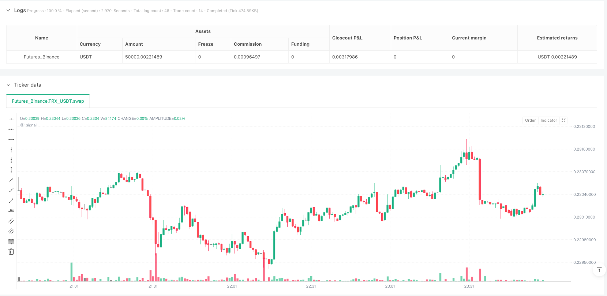
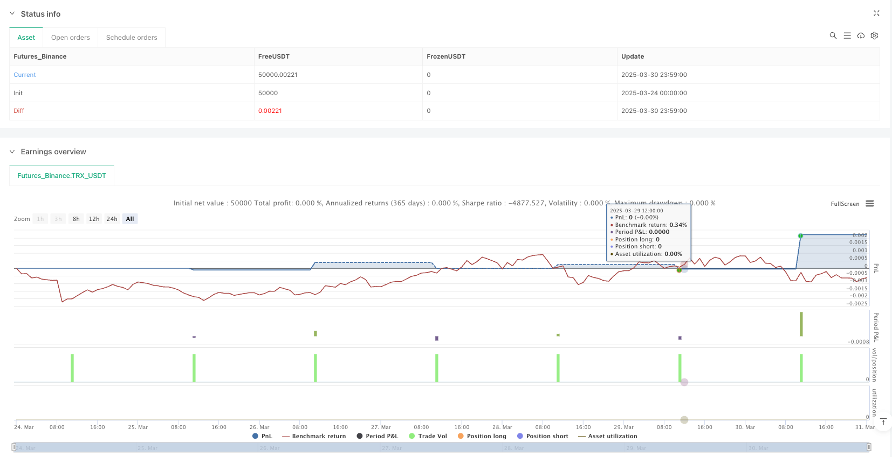

> Name

First-Candle-Breakout-Dynamic-Trailing-Stop-EOD-Close-Strategy
> Author

ianzeng123

> Strategy Description





[trans]

The First Candle Breakout - Dynamic Trailing Stop and Close Close strategy is an intraday trading strategy that uses the price range of the first candle after the market opens as important support and resistance levels. After the first candle is formed, this strategy waits for the price to break through its high or low before entering the market. At the same time, it adopts a dynamic trailing stop loss mechanism based on the price range of the first candle and forces liquidation at a specific time every day to avoid overnight risks.
## Strategy Principle
This strategy is based on the market observation that the price range formed by the first candle after the market opens often has important technical significance. The core logic of the strategy is as follows:
1. Identify and record the highest price and lowest price of the first candle line of the day at a specific time point set by the user (default is 9:15).
2. Calculate the price range of the first candle line (highest price minus lowest price).
3. The strategy triggers a long signal when the price breaks through the high price of the first candle after the formation of the first candle.
4. The strategy triggers a short signal when the price breaks through the low price of the first candle after the formation of the first candle.
5. After entering the market, set a dynamic trailing stop loss. The stop loss distance is 1.5 times the price range of the first candle (can be adjusted through parameters).
6. For long positions, as the price rises, the stop loss level increases accordingly, maintaining a fixed stop loss distance from the current price.
7. For short positions, as the price falls, the stop loss level is also reduced accordingly, maintaining a fixed stop loss distance from the current price.
8. Force all positions to be closed at a specific time point every day (default is 15:30) to avoid overnight risks.
This strategy uses a post-confirmation entry mechanism, which means entering the trade after the price actually breaks through the high or low of the first candle, rather than entering the market as soon as the price hits these levels. This helps reduce the risk of false breakouts.
## Strategic Advantages
1. **Clear entry signal**: This strategy is based on clear price breakthrough signals for entry. The rules are simple and clear, easy to understand and execute.
2. **Dynamic Risk Management**: Adopt a dynamic tracking stop loss mechanism based on market fluctuations. The stop loss distance is automatically adjusted according to the fluctuation range of the first candle of the day, making risk management more adaptable.
3. **Avoid False Breakouts**: By waiting for price to close above the high or low of the first candle before entering, rather than entering as soon as price hits these levels, it can help filter out some false breakout signals.
4. **Avoid overnight risks**: Forced closing of positions at a fixed time every day, avoiding the gap risk and uncertainty that may arise if positions are held overnight.
5. **Adapt to market fluctuations**: The entry point and stop-loss level of the strategy will be automatically adjusted according to the degree of market volatility on the day. The stop-loss distance will be wider on days with high volatility, and the stop-loss distance will be narrower on days with low volatility, thus better adapting to different market environments.
6. **Only one transaction**: Only one transaction is allowed per day to avoid excessive trading and reduce transaction costs.
7. **Full Automation**: The strategy can be executed completely automatically without manual intervention. It is suitable for traders who do not have time to monitor the market in real time.
##, strategic risk
While this strategy offers several advantages, there are still some potential risks:
1. **False Breakout Risk**: Although the strategy waits for the price to close with a breakthrough before entering the market, it may still encounter a false breakthrough situation, that is, the price quickly retracts after the breakthrough, causing the stop loss to be triggered. The solution is to consider adding additional confirmation indicators, such as volume confirmation or trend confirmation.
2. **Stop loss distance is too large**: On days with greater volatility, the first candle range may be wider, resulting in a stop loss distance that is too large and a single loss. The solution is to set an absolute upper limit on the maximum stop loss distance.
3. **Stop loss distance is too small**: On the contrary, on days with less volatility, the first candle range may be very narrow, causing the stop loss distance to be too small and easily triggered by market noise. The solution is to set an absolute lower limit for the minimum stop loss distance.
4. **Missing the big market**: Since the strategy only allows one transaction per day and forced liquidation at a fixed time, you may miss the continuous big market. The solution is to consider allowing positions to be held overnight under certain conditions.
5. **Time dependence**: The strategy has strict requirements on the formation time of the first candle and the forced closing time. It is highly dependent on time. Different markets or different time zones may need to adjust parameters. The solution is to adjust the parameters according to the trading hours of the specific market.
6. **No profit target**: The strategy does not set a clear profit target and relies entirely on trailing stop loss or end-of-day closing to end the transaction. It may not be possible to take profits at the best position. The solution is to consider adding a profit-taking mechanism based on support/resistance levels or technical indicators.
7. **Parameter Sensitivity**: The performance of the strategy may be very sensitive to parameter settings (such as start time, end time, trailing stop multiplier, etc.) and requires thorough backtesting and optimization.
## Strategy optimization direction
In response to the above risks, this strategy can be optimized in the following directions:
1. **Add filter conditions**: Combined with market trend indicators or trading volume indicators, enter the market only when the trend direction is consistent or the trading volume is confirmed to reduce the risk of false breakthroughs. For example, you can add a moving average as a trend filter, or require a significant increase in volume on a breakout.
2. **Optimized Stop Loss Mechanism**: Set upper and lower limits on the absolute value of the stop loss distance to maintain a reasonable risk level even in days of extreme volatility. You can consider combining the ATR (average true range) indicator to set a more dynamic stop loss distance.
3. **Introducing a partial profit mechanism**: When the price reaches a certain target (such as 2 times or 3 times the range of the first candle), you can consider partially closing the position to make a profit, and continue to use trailing stop loss management for the remaining positions.
4. **Add conditions for holding positions overnight**: Under certain conditions (such as a strong trend or the price is far away from the entry point), some or all positions are allowed to be held overnight to grasp the general trend.
5. **Add time filter**: Avoid trading during periods when market volatility is low or uncertainty is high. For example, you can avoid entering before and after the release of important economic data.
6. **Optimization parameter adaptive mechanism**: Allows the strategy to automatically adjust parameters based on recent market conditions, such as adjusting the trailing stop loss multiplier based on the average volatility in recent days.
7. **Add market environment identification**: Use different trading parameters or even different trading logic under different market environments (such as volatile markets and trending markets) to improve the adaptability of the strategy.
8. **Consider multi-time frame analysis**: Combine the market structure of the larger time frame, trade in the same direction of the main trend, and avoid trading against the trend.
9. **Added Fund Management Module**: Dynamically adjust position size based on market volatility and historical performance, reducing positions during periods of high uncertainty and increasing positions during periods of good strategy performance.
## Summarize
The First Candle Breakout - Dynamic Trailing Stop and Close Close strategy is an intraday trading strategy based on the price range of the first candle after the market opens. It uses confirmed price breakthrough signals to enter the market, uses a dynamic trailing stop-loss mechanism based on market fluctuations to manage risks, and forces liquidation at a fixed time every day to avoid overnight risks.
The advantages of this strategy include clear entry signals, dynamic risk management, avoiding false breakthroughs and overnight risks, adapting to market fluctuations, limiting excessive trading, and fully automated execution. However, it also faces challenges such as false breakthrough risk, unreasonable stop loss distance, missing big market trends, strong time dependence, lack of profit targets, and parameter sensitivity.
The stability and profitability of the strategy can be further improved by adding filtering conditions, optimizing the stop-loss mechanism, introducing a partial profit mechanism, adding overnight holding conditions, adding time filtering, optimizing the parameter adaptive mechanism, adding market environment identification, considering multi-time frame analysis and adding a fund management module.
Overall, this is a clearly structured and logical day trading strategy suitable for traders who want to day trade through an automated system and strictly control risk. Through targeted optimization and appropriate parameter adjustment, this strategy is expected to achieve stable performance in different market environments. ||
## Overview

The First Candle Breakout - Dynamic Trailing Stop & EOD Close Strategy is an intraday trading strategy that uses the price range of the first candle after market opening as significant support and resistance levels. This strategy enters the market after price breaks above or below the first candle's high or low points, employs a dynamic trailing stop loss mechanism based on the first candle's price range, and forces position closure at a specific time each day to avoid overnight risk.

## Strategy Principles

This strategy is based on the market observation that the price range formed by the first candle after market opening often has significant technical importance. The core logic of the strategy is as follows:

1. Identify and record the high and low of the first candle of the day at a user-defined specific time (default is 9:15).
2. Calculate the price range of the first candle (high minus low).
3. When the price breaks above the first candle's high after the first candle has formed, the strategy triggers a long signal.
4. When the price breaks below the first candle's low after the first candle has formed, the strategy triggers a short signal.
5. Set a dynamic trailing stop loss after entry, with the stop distance being 1.5 times the first candle's price range (adjustable via parameters).
6. For long positions, as the price rises, the stop loss level also rises accordingly, maintaining a fixed stop distance from the current price.
7. For short positions, as the price falls, the stop loss level also falls accordingly, maintaining a fixed stop distance from the current price.
8. Force close all positions at a specific time each day (default is 15:30) to avoid overnight risk.

The strategy adopts a confirmation-based entry mechanism, meaning it only enters trades after the price has actually broken through the first candle's high or low, rather than entering immediately when the price just touches these levels, which helps reduce the risk of false breakouts.

## Strategy Advantages

1. **Clear Entry Signals**: The strategy enters based on clear price breakout signals, with simple and easy-to-understand rules that are straightforward to implement and execute.
2. **Dynamic Risk Management**: Employs a dynamic trailing stop loss mechanism based on market volatility, with the stop distance automatically adjusting according to the day's first candle range, making risk management more adaptive.
3. **Avoids False Breakouts**: By waiting for price to close beyond the first candle's high or low before entering, rather than entering as soon as price touches these levels, it helps filter out some false breakout signals.
4. **Avoids Overnight Risk**: Forced position closure at a fixed time each day avoids potential gap risk and uncertainties associated with holding positions overnight.
5. **Adapts to Market Volatility**: The entry points and stop loss levels automatically adjust according to the day's market volatility - wider stop distances on volatile days and narrower stop distances on calmer days - thus better adapting to different market environments.
6. **Single Trade Per Day**: Only one trade per day is allowed, avoiding overtrading and reducing transaction costs.
7. **Fully Automated**: The strategy can be executed completely automatically without manual intervention, suitable for traders who don't have time to monitor the market in real-time.

## Strategy Risks

Despite its numerous advantages, the strategy still has some potential risks:

1. **False Breakout Risk**: Although the strategy waits for price to close beyond breakout levels before entering, it may still encounter false breakouts where price breaks through but quickly retraces, triggering the stop loss. A solution is to consider adding additional confirmation indicators such as volume confirmation or trend confirmation.
2. **Excessively Wide Stop Loss**: On highly volatile days, the first candle's range may be wide, resulting in a large stop distance and potentially significant losses per trade. A solution is to set an absolute upper limit for the maximum stop distance.
3. **Excessively Narrow Stop Loss**: Conversely, on days with low volatility, the first candle's range may be very narrow, resulting in a small stop distance that can easily be triggered by market noise. A solution is to set an absolute lower limit for the minimum stop distance.
4. **Missing Major Trends**: Since the strategy only allows one trade per day and forces position closure at a fixed time, it may miss continuing major market moves. A solution is to consider allowing overnight position holding under specific conditions.
5. **Time Dependency**: The strategy has strict requirements for the timing of the first candle formation and forced position closure, making it highly time-dependent. Different markets or time zones may require parameter adjustments. The solution is to adjust parameters according to specific market trading hours.
6. **No Profit Target**: The strategy does not set a clear profit target and relies entirely on trailing stops or end-of-day closures to end trades, which may not capitalize at optimal positions. A solution is to consider adding profit-taking mechanisms based on support/resistance levels or technical indicators.
7. **Parameter Sensitivity**: The strategy's performance may be very sensitive to parameter settings (such as start time, end time, trailing stop multiplier, etc.), requiring thorough backtesting and optimization.

## Strategy Optimization Directions

Addressing the above risks, the strategy can be optimized in the following directions:

1. **Add Filtering Conditions**: Combine market trend indicators or volume indicators, entering only when the trend direction is consistent or volume confirms, to reduce the risk of false breakouts. For example, adding moving averages as trend filters, or requiring significant volume increase during breakouts.
2. **Optimize Stop Loss Mechanism**: Set absolute upper and lower limits for stop distances to maintain reasonable risk levels even on extremely volatile days. Consider incorporating the ATR (Average True Range) indicator to set more dynamic stop distances.
3. **Introduce Partial Profit-Taking**: Consider partial position closure when price reaches certain targets (such as 2x or 3x the first candle's range), with remaining positions continuing to be managed by trailing stops.
4. **Add Overnight Holding Conditions**: Allow partial or complete position holding overnight under specific conditions (such as strong trends or price far from entry point) to capture major trend movements.
5. **Add Time Filters**: Avoid trading during periods of low market volatility or high uncertainty, such as avoiding entries before and after important economic data releases.
6. **Optimize Parameter Adaptation**: Enable the strategy to automatically adjust parameters based on recent market conditions, such as adjusting the trailing stop multiplier based on the average volatility of recent days.
7. **Incorporate Market Environment Recognition**: Apply different trading parameters or even different trading logic in different market environments (such as ranging markets, trending markets) to improve strategy adaptability.
8. **Consider Multi-Timeframe Analysis**: Combine larger timeframe market structures, trading only when aligned with the main trend direction to avoid counter-trend trading.
9. **Add Money Management Module**: Dynamically adjust position sizes based on market volatility and historical performance, reducing positions during periods of high uncertainty and increasing positions during periods of good strategy performance.

## Summary

The First Candle Breakout - Dynamic Trailing Stop & EOD Close Strategy is an intraday trading strategy based on the price range of the first candle after market opening. It enters trades based on confirmed price breakout signals, employs a dynamic trailing stop loss mechanism based on market volatility to manage risk, and forces position closure at a fixed time each day to avoid overnight risk.

The strategy's advantages include clear entry signals, dynamic risk management, avoidance of false breakouts and overnight risks, adaptation to market volatility, limited overtrading, and fully automated execution. However, it also faces challenges such as false breakout risks, potentially unreasonable stop distances, missing major market moves, strong time dependency, lack of profit targets, and parameter sensitivity.

Through adding filtering conditions, optimizing stop loss mechanisms, introducing partial profit-taking, adding overnight holding conditions, incorporating time filters, optimizing parameter adaptation, integrating market environment recognition, considering multi-timeframe analysis, and adding money management modules, the strategy's stability and profitability can be further enhanced.

Overall, this is a clearly structured and logically sound intraday trading strategy, suitable for traders who wish to conduct intraday trading through automated systems with strict risk control. With targeted optimization and appropriate parameter adjustments, this strategy has the potential to achieve stable performance across different market environments.[/trans]


> Source (PineScript)

``` pinescript
/*backtest
start: 2025-03-24 00:00:00
end: 2025-03-31 00:00:00
period: 1m
basePeriod: 1m
exchanges: [{"eid":"Futures_Binance","currency":"TRX_USDT"}]
*/

//@version=5
strategy("First Candle Breakout - Trailing Stop & EOD Close", overlay=true)

// User Inputs
startHour = input(9, "Start Hour (Exchange Time)")
startMinute = input(15, "Start Minute (Exchange Time)")
endHour = input(15, "End Hour (Exchange Time)")  // Market closing hour
endMinute = input(30, "End Minute (Exchange Time)")
trailStopMultiplier = input(1.5, "Trailing Stop Multiplier")  // 1.5x first candle range

// Variables to store the first candle's high & low
var float firstCandleHigh = na
var float firstCandleLow = na
var bool tradeTaken = false  // Ensures only one trade per day
var int tradeDirection = 0   // 1 for long, -1 for short
var float trailStopLevel = na  // Trailing stop level

// Identify first candle's high & low
if (hour == startHour and minute == startMinute and bar_index > 1)
    firstCandleHigh := high
    firstCandleLow := low
    tradeTaken := false  // Reset trade flag at start of day
    tradeDirection := 0   // Reset trade direction
    trailStopLevel := na  // Reset trailing stop

// Calculate first candle range
firstCandleRange = firstCandleHigh - firstCandleLow
trailStopDistance = firstCandleRange * trailStopMultiplier

// Buy condition: Close above first candle high AFTER the first candle closes
longCondition = not na(firstCandleHigh) and close > firstCandleHigh and not tradeTaken and hour > startHour
if (longCondition)
    strategy.entry("Buy", strategy.long, comment="Buy")
    trailStopLevel := close - trailStopDistance  // Set initial trailing stop
    tradeTaken := true
    tradeDirection := 1

// Sell condition: Close below first candle low AFTER the first candle closes
shortCondition = not na(firstCandleLow) and close < firstCandleLow and not tradeTaken and hour > startHour
if (shortCondition)
    strategy.entry("Sell", strategy.short, comment="Sell")
    trailStopLevel := close + trailStopDistance  // Set initial trailing stop
    tradeTaken := true
    tradeDirection := -1

// Update trailing stop for long trades
if (tradeDirection == 1 and not na(trailStopLevel))
    trailStopLevel := nz(trailStopLevel, close - trailStopDistance)  // Initialize if na
    trailStopLevel := math.max(trailStopLevel, close - trailStopDistance)  // Adjust trailing stop up
    if (close <= trailStopLevel)  // Stop loss hit
        strategy.close("Buy", comment="Trailing SL Hit")

// Update trailing stop for short trades
if (tradeDirection == -1 and not na(trailStopLevel))
    trailStopLevel := nz(trailStopLevel, close + trailStopDistance)  // Initialize if na
    trailStopLevel := math.min(trailStopLevel, close + trailStopDistance)  // Adjust trailing stop down
    if (close >= trailStopLevel)  // Stop loss hit
        strategy.close("Sell", comment="Trailing SL Hit")

// Close trade at end of day if still open
if (tradeTaken and hour == endHour and minute == endMinute)
    strategy.close_all(comment="EOD Close")

```

> Detail

https://www.fmz.com/strategy/489018

> Last Modified

2025-04-01 11:06:47
