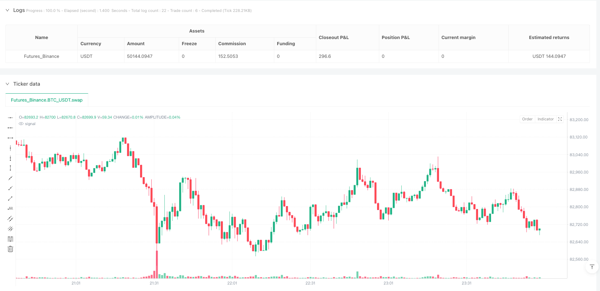
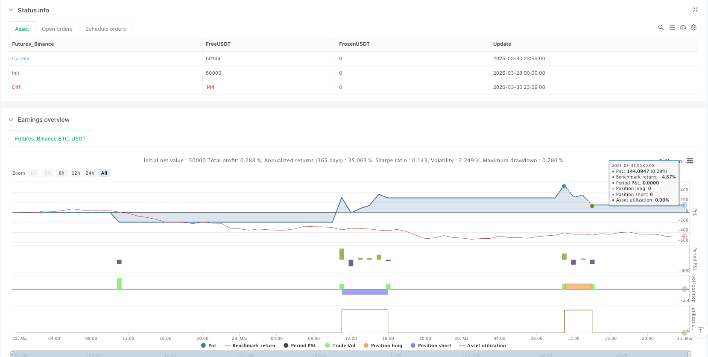

> Name

First-Candle-Breakout-with-Stop-Loss-or-End-of-Day-Closing-Strategy
> Author

ianzeng123

> Strategy Description




[trans]

#### Overview
The First Candle Breakout-Stop or Close Strategy is an intraday trading strategy that identifies potential entry signals based on the high and low of the first candle of the trading day. This strategy profits from short-term swings by capturing the momentum when price breaks out of the first candle's range and closing the position before the end of the day or when the stop is hit. The strategy design is concise and clear, focusing on the initial directional breakthrough of the intraday price trend, and setting clear stop loss and closing rules to effectively control risks.
#### Strategy Principle
The core principle of this strategy is to use price momentum and breakout signals in the early stages of the trading day to predict subsequent movements. The specific operation process is as follows:
1. First, the strategy defines the start time of the trading day (default is 9:15) and records the high and low prices of the first candle.
2. When the price breaks through the highest price of the first candle line, the strategy triggers a long signal; when the price falls below the lowest price of the first candle line, a short signal is triggered.
3. The strategy adopts a strict single transaction mechanism to ensure that only one transaction (long or short) is executed on each trading day.
4. For long trades, the stop loss level is set at the lowest point of the first candle; for short trades, the stop loss level is set at the highest point of the first candle.
5. Regardless of whether the transaction hits the stop loss, all open transactions will be automatically closed at the end of the trading day (default is 15:30).
The strategy ensures only one transaction per day through the variable `tradeTaken`, records the current trading direction through `tradeDirection` (1 means long, -1 means short), and effectively manages the transaction status and the application of stop loss conditions.
#### Strategic Advantages
1. **Simple and efficient**: The strategy logic is simple and clear, easy to understand and implement, and does not require complex technical indicators or parameter optimization.
2. **Clear entry signal**: Provide clear trading signals based on price breakthroughs to reduce subjective judgment factors.
3. **Strict risk control**: Limit the maximum loss of each transaction by setting the opposite extreme value of the first candle line as the stop loss point.
4. **Timed position closing mechanism**: Ensure that all transactions are completed within the day to avoid overnight risks.
5. **Strong adaptability**: The strategy can be applied to various trading varieties and time frames, and can be adapted to different markets by adjusting the start and end time parameters.
6. **Emotionally Neutral**: Automated trading signals reduce the impact of traders’ emotional fluctuations on decision-making.
7. **Capture Intraday Momentum**: Effectively take advantage of initial momentum and directional breakouts after the market opens.
#### Strategy Risk
1. **False Breakout Risk**: The market may reverse quickly after a breakthrough, causing stop loss to be triggered. To mitigate this risk, consider adding confirmation indicators such as volume confirmation or multi-time frame analysis.
2. **Slippage and Execution Delays**: In highly volatile markets, order execution may face slippage or delays, affecting the actual entry price and stop-loss execution. It is recommended to use limit orders rather than market orders and consider setting looser stops.
3. **Single reference point risk**: Relying only on the first candle line as a criterion for judgment, ignoring the broader market environment and trends. It is recommended to screen trading signals based on market trend and support and resistance level analysis.
4. **Fixed Time Frame Limitation**: The strategy is based on fixed start and end times and may miss good opportunities in other time periods. You can consider backtesting different time periods to find the optimal trading time window.
5. **Lack of profit target**: The strategy does not set a clear profit-taking target and may not be able to maximize the benefits of favorable market conditions. It is recommended to set dynamic take-profit targets based on historical volatility.
6. **Intraday Volatility Limit**: Low volatility markets may cause the first candle range to be too small and the stop loss level to be too close, increasing the possibility of being easily triggered.
#### Strategy optimization direction
1. **Add filter conditions**: Combine trend indicators (such as moving average systems) to filter trading directions, and only enter the market when the trend direction is consistent to increase the success rate.
2. **Dynamic stop loss setting**: You can consider setting dynamic stop loss based on ATR (average true range) instead of simply using the high and low points of the first candle line to adapt to different fluctuation environments.
3. **Introducing a take-profit mechanism**: Design a take-profit rule based on the risk-reward ratio, such as automatically closing some positions when the profit reaches 1.5 times or 2 times the stop-loss distance.
4. **Optimize trading time**: Analyze the best trading time windows for different markets and varieties, and adjust the start and end times to obtain the best results.
5. **Opening and closing positions in batches**: Consider dividing a single transaction into multiple batches for execution, and opening and closing positions at different price levels to reduce timing risks.
6. **Add trading volume confirmation**: When the breakthrough signal is triggered, add the trading volume confirmation requirement to filter out false breakthroughs with low trading volume.
7. **Adaptability parameter adjustment**: Dynamically adjust strategy parameters according to market conditions (such as volatility, trading volume) to improve the adaptability of the strategy.
8. **Add market environment filtering**: Pause strategy execution under extreme market conditions (such as abnormally high volatility or major news release days) to avoid unnecessary risks.
#### Summary
The first candle breakout-stop-loss or close-out strategy is a simple and efficient intraday trading method that profits by capturing directional breakouts after the market opens. The main advantages of this strategy are that it is simple to operate and has controllable risks, making it suitable for day traders. However, the strategy also suffers from the risk of false breakouts and the limitations of a single reference point. By adding filtering conditions, optimizing stop-loss and take-profit mechanisms, and combining market environment analysis, the stability and profitability of the strategy can be significantly improved. This is a great starting strategy for newbies looking to get into quantitative trading, or it can serve as a building block for more complex trading systems. The most important thing is that traders should make appropriate parameter adjustments and optimizations to the strategy based on their own risk tolerance and trading goals to achieve the best trading results. ||
#### Overview
The First Candle Breakout with Stop Loss or End-of-Day Closing Strategy is an intraday trading approach that identifies potential entry signals based on the high and low points of the first candle of the trading day. This strategy captures momentum when price breaks out of the first candle's range and closes positions either at the end of the day or when stop-loss levels are triggered, allowing for short-term volatility profits. The strategy design is straightforward, focusing on directional breakouts during the initial phase of the trading day, with clear stop-loss and exit rules for effective risk management.
#### Strategy Principles
The core principle of this strategy is to leverage price momentum and breakout signals from the initial phase of the trading day to predict subsequent movements. The specific process follows:

1. First, the strategy defines the trading day start time (default 9:15) and records the high and low of the first candle.
2. When price breaks above the first candle's high, a long signal is triggered; when price breaks below the first candle's low, a short signal is triggered.
3. The strategy employs a strict single-trade mechanism, ensuring only one trade (either long or short) is executed per trading day.
4. For long trades, the stop-loss is set at the first candle's low; for short trades, the stop-loss is set at the first candle's high.
5. Regardless of whether the stop-loss is hit, all open positions are automatically closed at the end of the trading day (default 15:30).

The strategy uses the variable `tradeTaken` to ensure only one trade per day and `tradeDirection` to record the current trade direction (1 for long, -1 for short), effectively managing trade status and stop-loss application.

#### Strategy Advantages
1. **Simplicity and Efficiency**: The strategy logic is straightforward, easy to understand and implement, requiring no complex technical indicators or parameter optimization.
2. **Clear Entry Signals**: Provides distinct trading signals based on price breakouts, reducing subjective judgment factors.
3. **Strict Risk Control**: Limits maximum loss per trade by setting stop-loss at the opposite extreme of the first candle.
4. **Timed Exit Mechanism**: Ensures all trades are completed within the day, avoiding overnight risk.
5. **High Adaptability**: The strategy can be applied to various trading instruments and timeframes by adjusting the start and end time parameters.
6. **Emotional Neutrality**: Automated trading signals reduce the impact of trader emotions on decision-making.
7. **Intraday Momentum Capture**: Effectively utilizes initial momentum and directional breakouts after market open.

#### Strategy Risks
1. **False Breakout Risk**: Markets may quickly reverse after a breakout, triggering stop-losses. To mitigate this risk, consider adding confirmation indicators such as volume confirmation or multi-timeframe analysis.
2. **Slippage and Execution Delays**: In volatile markets, order execution may face slippage or delays, affecting actual entry prices and stop-loss execution. Consider using limit orders rather than market orders and setting wider stops.
3. **Single Reference Point Risk**: Relying solely on the first candle as a judgment criterion ignores broader market environment and trends. Consider combining market trend and support/resistance analysis to filter trading signals.
4. **Fixed Timeframe Limitation**: The strategy is based on fixed start and end times, potentially missing good opportunities in other time periods. Consider backtesting different time windows to find optimal trading timeframes.
5. **Lack of Profit Targets**: The strategy doesn't set clear take-profit objectives, potentially failing to maximize gains in favorable market conditions. Consider setting dynamic profit targets based on historical volatility.
6. **Intraday Volatility Constraints**: Low volatility markets may result in a small first candle range with close stop-loss levels that are easily triggered.

#### Strategy Optimization Directions
1. **Add Filtering Conditions**: Incorporate trend indicators (such as moving averages) to screen trade direction, entering only when aligned with the trend to improve success rates.
2. **Dynamic Stop-Loss Settings**: Consider setting dynamic stops based on ATR (Average True Range) rather than simply using the first candle's high/low points to adapt to different volatility environments.
3. **Introduce Take-Profit Mechanism**: Design profit-taking rules based on risk-reward ratios, such as closing partial positions when profit reaches 1.5 or 2 times the stop-loss distance.
4. **Optimize Trading Times**: Analyze optimal trading windows for different markets and instruments, adjusting start and end times for best results.
5. **Phased Position Building and Closing**: Consider executing a single trade in multiple batches, building and closing positions at different price levels to reduce timing risk.
6. **Add Volume Confirmation**: Require volume confirmation when breakout signals trigger to filter out low-volume false breakouts.
7. **Adaptive Parameter Adjustment**: Dynamically adjust strategy parameters based on market conditions (volatility, trading volume) to improve strategy adaptability.
8. **Market Environment Filtering**: Pause strategy execution during extreme market conditions (abnormal high volatility or major news release days) to avoid unnecessary risks.

#### Conclusion
The First Candle Breakout with Stop Loss or End-of-Day Closing Strategy is a concise and efficient intraday trading method that profits by capturing directional breakouts after market open. The main advantages of this strategy lie in its simplicity, controllable risk, and suitability for intraday traders. However, the strategy also faces false breakout risks and limitations from relying on a single reference point. By adding filtering conditions, optimizing stop-loss and take-profit mechanisms, and incorporating market environment analysis, the stability and profitability of the strategy can be significantly enhanced. For beginners entering the quantitative trading field, this serves as an excellent starting strategy and can also function as a foundational component for more complex trading systems. Most importantly, traders should adjust and optimize strategy parameters according to their risk tolerance and trading objectives to achieve optimal trading results.[/trans]


> Source (PineScript)

``` pinescript
/*backtest
start: 2025-03-28 00:00:00
end: 2025-03-31 00:00:00
period: 1m
basePeriod: 1m
exchanges: [{"eid":"Futures_Binance","currency":"BTC_USDT"}]
*/

//@version=5
strategy("First Candle Breakout - Close on SL or EOD", overlay=true)

// User Inputs
startHour = input(9, "Start Hour (Exchange Time)")
startMinute = input(15, "Start Minute (Exchange Time)")
endHour = input(15, "End Hour (Exchange Time)")  // Market closing hour
endMinute = input(30, "End Minute (Exchange Time)")

// Variables to store the first candle's high & low
var float firstCandleHigh = na
var float firstCandleLow = na
var bool tradeTaken = false  // Ensures only one trade per day
var int tradeDirection = 0   // 1 for long, -1 for short

// Identify first candle's high & low
if (hour == startHour and minute == startMinute and bar_index > 1)
    firstCandleHigh := high
    firstCandleLow := low
    tradeTaken := false  // Reset trade flag at start of day
    tradeDirection := 0   // Reset trade direction

// Buy condition: Close above first candle high AFTER the first candle closes
longCondition = not na(firstCandleHigh) and close > firstCandleHigh and not tradeTaken and hour > startHour
if (longCondition)
    strategy.entry("Buy", strategy.long, comment="Buy")
    tradeTaken := true  // Mark trade as taken
    tradeDirection := 1  // Mark trade as long

// Sell condition: Close below first candle low AFTER the first candle closes
shortCondition = not na(firstCandleLow) and close < firstCandleLow and not tradeTaken and hour > startHour
if (shortCondition)
    strategy.entry("Sell", strategy.short, comment="Sell")
    tradeTaken := true  // Mark trade as taken
    tradeDirection := -1  // Mark trade as short

// Stop loss for long trades (first candle low)
if (tradeDirection == 1 and close <= firstCandleLow)
    strategy.close("Buy", comment="SL Hit")

// Stop loss for short trades (first candle high)
if (tradeDirection == -1 and close >= firstCandleHigh)
    strategy.close("Sell", comment="SL Hit")

// Close trade at end of day if still open
if (tradeTaken and hour == endHour and minute == endMinute)
    strategy.close_all(comment="EOD Close")

```

> Detail

https://www.fmz.com/strategy/489035

> Last Modified

2025-04-01 13:51:36
