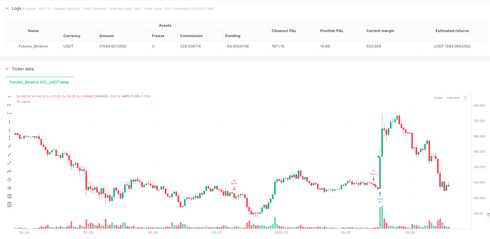
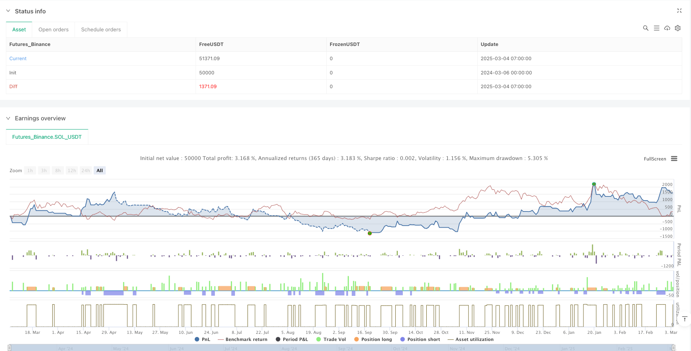

> Name

Trend judgment and dynamic stop loss strategy based on fixed range volume distribution and anchored weighted volume average price-Fixed-Range-Volume-Profile-And-Anchored-VWAP-Trend-Identification-Strategy-With-Dynamic-Stop-Loss
> Author

ianzeng123

> Strategy Description





[trans]#### Overview
The trend judgment and dynamic stop loss strategy that combines fixed range volume distribution with anchored weighted volume average price is a comprehensive trading system that cleverly combines two powerful technical analysis tools, fixed range volume distribution (FRVP) and anchored weighted volume average price (AVWAP), and combines multiple momentum indicators such as RSI, EMA, MACD, etc., as well as dynamic stop loss management based on ATR. The strategy is designed to capture price trends while improving trade quality and reducing false signals through multiple filters. The system uses a method that combines volume analysis and trend tracking to provide traders with a comprehensive and adaptive trading framework, which is especially suitable for market environments with obvious trends.
#### Strategy Principle
The core principle of this strategy is to make trading decisions through multi-dimensional analysis of market structure and dynamics, combined with trading volume and price behavior. Specifically:
1. **Anchored Volume Weighted Average Price (AVWAP)**: As a dynamic support/resistance level, the average price is calculated through weighted volume, providing an important reference point for price breakthroughs. When price breaks above AVWAP, it may indicate that the trend direction has been established.
2. **Fixed Range Volume Distribution (FRVP)**: By analyzing the highest and lowest prices within a specified period, the midpoint price (frvpMid) is calculated to help identify changes in market structure and key price levels.
3. **Exponential Moving Average (EMA)**: The 200-period EMA is used as a trend filter to prevent counter-trend trading. Consider going long only when price is above the EMA and vice versa.
4. **Relative Strength Index (RSI)**: Avoid trading in overbought/oversold areas to provide additional confirmation for entry. For a long position, the RSI is required to be above the oversold level; for a short position, the RSI is required to be below the overbought level.
5. **MACD Confirmation**: Ensure that the momentum direction is consistent with the trading direction and improve the quality of trading signals.
6. **Volume Filter**: Only trade when volume is higher than the 20-period average to avoid false breakouts in low liquidity environments.
7. **ATR-based stop loss and trailing stop loss**: Dynamically adjust the stop loss position according to market volatility, allowing enough price breathing space while protecting funds.
Entry conditions strictly require unanimous confirmation of all indicators, which greatly improves the reliability of trading signals. For example, a long position requires price to break out of AVWAP, above the EMA, RSI above oversold levels, MACD to confirm upward momentum, and sufficient volume. The exit strategy uses stop loss calculated by ATR multiples and trailing stop loss, allowing risk management to adapt to different market fluctuation environments.
#### Strategic Advantages
This strategy has many advantages:
1. **Multi-dimensional analysis**: Combine price, trading volume and momentum indicators for comprehensive analysis to form a more comprehensive market perspective and reduce the false signals that a single indicator may bring.
2. **Strong adaptability**: ATR's basic stop-loss and trailing stop-loss mechanisms can automatically adjust according to market volatility, allowing the strategy to maintain appropriate risk management in different market environments.
3. **Combination of trend and trading volume**: AVWAP and FRVP provide price support and resistance levels based on trading volume, which are more convincing than pure price analysis because they reflect real market participation.
4. **Strict entry conditions**: The multiple confirmation mechanism significantly reduces false signals and improves the winning rate of transactions. Although the frequency of transactions may be reduced, the quality is guaranteed.
5. **Dynamic Risk Management**: The stop-loss strategy based on ATR can automatically adjust the stop-loss distance according to market volatility, making risk control more accurate and reasonable.
6. **Filter low volume trades**: Avoid trading in low liquidity environments and reduce the risk of slippage and false breakouts.
7. **Visual feedback**: The strategy visually displays trading signals on the chart through the label function, helping traders better understand and evaluate system performance.
#### Strategy Risk
Although this strategy is comprehensively designed, there are still some potential risks:
1. **Parameter sensitivity**: The combination of multiple indicators and parameters may lead to over-optimization risks. Different markets and time frames may require different parameter settings, which require adequate backtesting and verification.
2. **Sideways market performance**: In a sideways market with no obvious trend, the strategy may generate too many false breakthrough signals, leading to continuous losses. Consider adding a volatility filter to pause trading in low volatility environments.
3. **Lagging problem**: EMA and other indicators are lagging in nature, which may lead to a slightly late entry time and miss some profits. Consider using faster indicators or adjusting existing indicator parameters to mitigate this problem.
4. **Stop loss gap risk**: In fast market or overnight gap situations, ATR based stop loss may not fully protect funds. It is recommended to set a maximum loss limit or use an option protection strategy.
5. **Over-reliance on technical indicators**: The strategy is based entirely on technical analysis and ignores factors such as fundamentals and market sentiment. Consider integrating market sentiment indicators or fundamental filters to get a more comprehensive view of the market.
6. **Frequent transaction costs**: If the parameters are set improperly, it may lead to frequent transactions and increase transaction costs. Parameters should be optimized through backtesting to find the balance between trading frequency and profitability.
#### Strategy optimization direction
Based on code analysis, this strategy can be optimized from the following directions:
1. **Dynamic parameter adaptation**: It can realize dynamic adjustment of RSI, EMA and other parameters, and automatically optimize parameters according to market volatility, making the strategy more adaptable. For example, use longer RSI periods in high volatility markets and shorter periods in low volatility markets.
2. **Add market sentiment indicator**: Integrate VIX or other market sentiment indicators, adjust strategic behavior during periods of extreme panic or greed, and avoid trading under extreme market conditions.
3. **Time Filter**: Add a time filter function to avoid high volatility periods before the market opens and closes, or focus on specific trading periods to increase your winning rate.
4. **Multiple time frame analysis**: Integrate confirmation signals from higher time frames to ensure that the trading direction is consistent with the larger trend and reduce the risk of counter-trend trading.
5. **Improved profit target setting**: The current code does not clearly define the profit target, and mainly relies on trailing stop loss to lock in profits. Smart profit targets can be set based on key resistance/support levels, risk-reward ratios, or price ranges.
6. **Optimized trading volume analysis**: The trading volume analysis can be further refined, such as using the relative trading volume change rate instead of simple mean comparison to more accurately determine trading volume abnormalities.
7. **Add strategy suspension mechanism**: Automatically suspend trading in the event of continuous losses or specific market conditions to protect funds from systemic risks, and restart trading after conditions recover.
8. **Fund Management Optimization**: The current strategy uses a fixed percentage (10%) capital management method. You can consider adjusting the position size based on volatility, increasing positions during low volatility periods and reducing positions during high volatility periods.
#### Summary
The trend judgment and dynamic stop-loss strategy that combines fixed-range volume distribution with anchored weighted volume average price is a well-designed quantitative trading system that forms a comprehensive and adaptive trading framework by integrating a variety of technical analysis tools and indicators. The core advantage of the strategy is that it combines volume-based price analysis (FRVP and AVWAP) with traditional trend and momentum indicators (EMA, RSI, MACD), supplemented by a flexible risk management mechanism, allowing it to maintain stable performance in different market environments.
Although there are potential risks such as parameter sensitivity and poor sideways market performance, most of these problems can be effectively mitigated through the recommended optimization directions, such as dynamic parameter adaptation, multi-time frame analysis and improved money management. In particular, the proposal to add market sentiment indicators and strategy pause mechanisms is expected to further improve the system's robustness and long-term profitability.
For quantitative traders looking for a comprehensive trading strategy, this system provides a solid foundation that can be further customized and optimized based on personal risk appetite and transaction characteristics. With rigorous backtesting and incremental improvements, this strategy has the potential to become an effective trading tool over the long term. || #### Overview
The Fixed Range Volume Profile And Anchored VWAP Trend Identification Strategy With Dynamic Stop-Loss is a comprehensive trading system that cleverly combines Fixed Range Volume Profile (FRVP) and Anchored Volume Weighted Average Price (AVWAP) with multiple momentum indicators including RSI, EMA, and MACD, along with ATR-based dynamic stop-loss management. This strategy aims to capture price trends while improving trade quality through multiple filtering conditions to reduce false signals. The system employs a combination of volume analysis and trend following methods, providing traders with a comprehensive and adaptive trading framework that is particularly suitable for markets with clear trending conditions.
#### Strategy Principles
The core principle of this strategy is to analyze market structure and momentum through multiple dimensions, combining volume and price behavior to make trading decisions. Specifically:

1. **Anchored Volume Weighted Average Price (AVWAP)**: Acts as a dynamic support/resistance level by calculating the average price weighted by volume, providing important reference points for price breakouts. When price breaks through the AVWAP, it may indicate that a trend direction has been established.

2. **Fixed Range Volume Profile (FRVP)**: Analyzes the highest and lowest prices within a specified period to calculate a midpoint price (frvpMid), helping to identify changes in market structure and key price levels.

3. **Exponential Moving Average (EMA)**: The 200-period EMA serves as a trend filter to prevent counter-trend trades. Long positions are only considered when price is above the EMA, and vice versa.

4. **Relative Strength Index (RSI)**: Avoids trading in overbought/oversold areas, providing additional confirmation for entries. For long positions, RSI must be above the oversold level; for short positions, RSI must be below the overbought level.

5. **MACD Confirmation**: Ensures that momentum direction aligns with trade direction, improving signal quality.

6. **Volume Filter**: Trades only when volume is above its 20-period average, avoiding false breakouts in low-liquidity environments.

7. **ATR-Based Stop-Loss and Trailing Stop**: Dynamically adjusts stop-loss positions based on market volatility, protecting capital while allowing sufficient price movement.

Entry conditions strictly require confirmation from all indicators, greatly improving the reliability of trading signals. For example, a long position requires price to break above AVWAP, be above the EMA, RSI above oversold level, MACD confirming upward momentum, and sufficient volume. The exit strategy employs stop-loss and trailing stop calculated as ATR multiples, allowing risk management to adapt to different market volatility environments.

#### Strategy Advantages
This strategy has multiple advantages:

1. **Multi-dimensional Analysis**: Combines price, volume, and momentum indicators for a comprehensive analysis, forming a more complete market perspective and reducing false signals that might come from using a single indicator.

2. **Strong Adaptability**: ATR-based stop-loss and trailing stop mechanisms automatically adjust according to market volatility, maintaining appropriate risk management in different market environments.

3. **Trend and Volume Combination**: AVWAP and FRVP provide volume-based support and resistance levels that are more convincing than pure price analysis, as they reflect actual market participation.

4. **Strict Entry Conditions**: Multiple confirmation mechanisms significantly reduce false signals and improve win rates. While this may reduce trading frequency, it ensures quality.

5. **Dynamic Risk Management**: ATR-based stop-loss strategy automatically adjusts stop distances based on market volatility, making risk control more precise and reasonable.

6. **Low Volume Trade Filtering**: Avoids trading in low liquidity environments, reducing the risk of slippage and false breakouts.

7. **Visual Feedback**: The strategy uses label functionality to visually display trading signals on the chart, helping traders better understand and evaluate system performance.

#### Strategy Risks
Despite its comprehensive design, the strategy still has some potential risks:

1. **Parameter Sensitivity**: The combination of multiple indicators and parameters may lead to over-optimization risk. Different markets and timeframes may require different parameter settings, necessitating thorough backtesting and validation.

2. **Ranging Market Performance**: In ranging markets without clear trends, the strategy may produce too many false breakout signals, leading to consecutive losses. Consider adding a volatility filter to pause trading in low-volatility environments.

3. **Lag Issues**: EMA and other indicators inherently have lag, which may lead to slightly delayed entries, missing part of the profit. Consider using faster indicators or adjusting existing indicator parameters to mitigate this issue.

4. **Gap Risk for Stop-Loss**: In fast markets or overnight gaps, ATR-based stops may not fully protect capital. Consider setting maximum loss limits or using options protection strategies.

5. **Over-reliance on Technical Indicators**: The strategy is completely based on technical analysis, ignoring factors such as fundamentals and market sentiment. Consider integrating market sentiment indicators or fundamental filters for a more comprehensive market view.

6. **Frequent Trading Costs**: Improper parameter settings may lead to frequent trading, increasing costs. Parameters should be optimized through backtesting to find the balance between trading frequency and profitability.

#### Strategy Optimization Directions
Based on code analysis, this strategy can be optimized in the following directions:

1. **Dynamic Parameter Adaptation**: Implement dynamic adjustment of parameters such as RSI and EMA based on market volatility, automatically optimizing parameters to make the strategy more adaptive. For example, use longer RSI periods in high-volatility markets and shorter periods in low-volatility markets.

2. **Add Market Sentiment Indicators**: Integrate VIX or other market sentiment indicators to adjust strategy behavior during periods of extreme fear or greed, avoiding trading in extreme market conditions.

3. **Time Filters**: Add time filtering functionality to avoid high-volatility periods around market open and close, or focus on specific trading sessions to improve win rates.

4. **Multi-timeframe Analysis**: Integrate confirmation signals from higher timeframes to ensure that trade direction aligns with larger trends, reducing the risk of counter-trend trading.

5. **Improved Profit Target Setting**: The current code does not explicitly define profit targets, mainly relying on trailing stops to lock in profits. Consider setting intelligent profit targets based on key resistance/support levels, risk-reward ratios, or price range.

6. **Optimize Volume Analysis**: Further refine volume analysis, such as using relative volume change rates rather than simple mean comparisons, to more accurately identify volume anomalies.

7. **Add Strategy Pause Mechanism**: Automatically pause trading after consecutive losses or under specific market conditions to protect capital from systemic risks, resuming trading when conditions improve.

8. **Optimize Money Management**: Currently, the strategy uses a fixed percentage (10%) for position sizing. Consider implementing volatility-based position sizing, increasing positions during low volatility and decreasing during high volatility.

#### Summary
The Fixed Range Volume Profile And Anchored VWAP Trend Identification Strategy With Dynamic Stop-Loss is a well-designed quantitative trading system that forms a comprehensive and adaptive trading framework by integrating multiple technical analysis tools and indicators. The core advantage of the strategy lies in combining volume-based price analysis (FRVP and AVWAP) with traditional trend and momentum indicators (EMA, RSI, MACD), supplemented by flexible risk management mechanisms, enabling it to maintain stable performance in different market environments.

While there are potential risks such as parameter sensitivity and poor performance in ranging markets, most of these issues can be effectively mitigated through the suggested optimization directions, including dynamic parameter adaptation, multi-timeframe analysis, and improved money management. In particular, the suggestions to add market sentiment indicators and a strategy pause mechanism are likely to further enhance the system's robustness and long-term profitability.

For quantitative traders seeking a comprehensive trading strategy, this system provides a solid foundation that can be further customized and optimized according to individual risk preferences and instrument characteristics. Through rigorous backtesting and gradual improvement, this strategy has the potential to become an effective long-term trading tool.[/trans]


> Source (PineScript)

``` pinescript
/*backtest
start: 2024-03-06 00:00:00
end: 2025-03-04 08:00:00
period: 1h
basePeriod: 1h
exchanges: [{"eid":"Futures_Binance","currency":"SOL_USDT"}]
*/

//@version=5
strategy("FRVP + AVWAP Improved By NgashCT", overlay=true, default_qty_type=strategy.percent_of_equity, default_qty_value=10)

// Inputs
length = input(50, title="AVWAP Length")
frvpLength = input(100, title="FRVP Length")
rsiLength = input(14, title="RSI Length")
rsiOverbought = input(70, title="RSI Overbought")
rsiOversold = input(30, title="RSI Oversold")
emaLength = input(200, title="EMA Length")
atrMultiplier = input(1.5, title="ATR Multiplier for Stop Loss")
trailStopMultiplier = input(2, title="ATR Multiplier for Trailing Stop")

// Indicators
avwap = ta.vwap(close)
ema = ta.ema(close, emaLength)
rsi = ta.rsi(close, rsiLength)
macdLine = ta.ema(close, 12) - ta.ema(close, 26)
signalLine = ta.ema(macdLine, 9)
atr = ta.atr(14)

// Volume Profile
highestHigh = ta.highest(high, frvpLength)
lowestLow = ta.lowest(low, frvpLength)
frvpMid = (highestHigh + lowestLow) / 2

// Entry Conditions
longCondition = ta.crossover(close, avwap) and close > ema and rsi > rsiOversold and macdLine > signalLine
shortCondition = ta.crossunder(close, avwap) and close < ema and rsi < rsiOverbought and macdLine < signalLine

// Volume Filter (Trade only when volume is above its moving average)
avgVolume = ta.sma(volume, 20)
volumeFilter = volume > avgVolume

longCondition := longCondition and volumeFilter
shortCondition := shortCondition and volumeFilter

// Debugging Prints
labelLong = longCondition ? "Long Signal" : ""
labelShort = shortCondition ? "Short Signal" : ""
label.new(bar_index, high, labelLong, color=color.green, textcolor=color.white)
label.new(bar_index, low, labelShort, color=color.red, textcolor=color.white)

// Strategy Orders
if longCondition
    strategy.entry("Long", strategy.long)
    strategy.exit("Exit Long", from_entry="Long", stop=close - atr * atrMultiplier, trail_points=atr * trailStopMultiplier)

if shortCondition
    strategy.entry("Short", strategy.short)
    strategy.exit("Exit Short", from_entry="Short", stop=close + atr * atrMultiplier, trail_points=atr * trailStopMultiplier)

```

> Detail

https://www.fmz.com/strategy/485128

> Last Modified

2025-03-06 11:14:10
