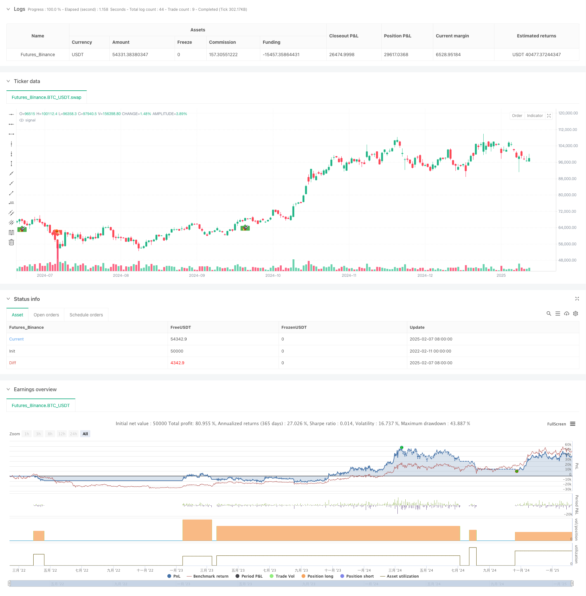

> Name

Flexible-Long-Short-Trading-Strategy-Based-on-Keltner-Channels
> Author

ChaoZhang

> Strategy Description



[trans]
#### Overview
This is a flexible trading strategy based on the Keltner Channel. This strategy supports long and short two-way trading, and trades are conducted by monitoring the upper and lower rails of the price breakthrough channel. The core of the strategy is to use the moving average (MA) to construct a price channel, and combine it with the true range (ATR) to dynamically adjust the channel width, so as to maintain the adaptability of the strategy in different market environments.
#### Strategy Principle
The strategy is mainly based on the following core principles:
1. Calculate the central trend of the price through EMA or SMA to form the middle track of the channel
2. Use ATR, TR or Range to calculate volatility and construct the upper and lower rails of the channel
3. When the price breaks through the upper band, a long signal is triggered, and when the price breaks through the lower band, a short signal is triggered.
4. Use the stop-loss order mechanism for entry and exit to improve the reliability of transaction execution.
5. Support flexible trading mode selection: long only, short only or two-way trading
#### Strategic Advantages
1. Strong adaptability - dynamically adjust the channel width through ATR, so that the strategy can adapt to different market fluctuation environments
2. Improved risk control - use the stop-loss order mechanism for transactions to effectively control risks
3. Flexible operation - supports multiple trading modes and can be adjusted according to market characteristics and trading preferences
4. Validated - performs well in cryptocurrency and stock markets, especially in more volatile markets
5. Clear visualization - Provides intuitive display of trading signals and position status
#### Strategy Risk
1. Volatile market risk - A volatile market may produce frequent false breakthrough signals
2. Slippage risk - In an illiquid market, stop-loss orders may face greater slippage.
3. Trend reversal risk - the possibility of suffering large losses when the trend suddenly reverses
4. Parameter sensitivity - the choice of channel parameters has an important impact on strategy performance
#### Strategy optimization direction
1. Introduce trend filter - reduce false breakout signals by adding trend judgment indicators
2. Dynamic parameter optimization - dynamically adjust channel parameters according to market fluctuations
3. Improve the stop-loss mechanism - add a trailing stop-loss function to better protect profits
4. Increase volume confirmation - combine with volume indicators to improve signal reliability
5. Optimize position management - introduce dynamic position management to better control risks
#### Summary
This strategy is a well-designed and logically designed trading system that effectively captures market opportunities through the flexible use of Ketner channels and a variety of technical indicators. The strategy is highly customizable and suitable for traders with different risk preferences. Through continuous optimization and improvement, this strategy is expected to maintain stable performance in various market environments.
|| 

#### Overview
This is a flexible trading strategy based on Keltner Channels, supporting both long and short trading by monitoring price breakouts of the channel's upper and lower bands. The strategy's core lies in using Moving Averages (MA) to construct price channels and combining Average True Range (ATR) to dynamically adjust channel width, maintaining strategy adaptability across different market conditions.

#### Strategy Principles
The strategy is based on the following core principles:
1. Calculating price's central tendency using EMA or SMA to form the channel's middle line
2. Using ATR, TR, or Range to calculate volatility for constructing upper and lower bands
3. Triggering long signals when price breaks above the upper band, and short signals when breaking below the lower band
4. Implementing stop-entry orders for both entry and exit to improve trade execution reliability
5. Supporting flexible trading modes: long-only, short-only, or bidirectional trading

#### Strategy Advantages
1. High Adaptability - Dynamically adjusts channel width through ATR to adapt to different market volatility environments
2. Comprehensive Risk Control - Uses stop-entry orders for trading to effectively manage risk
3. Operational Flexibility - Supports multiple trading modes, adjustable based on market characteristics and trading preferences
4. Proven Effectiveness - Performs well in cryptocurrency and stock markets, especially in high-volatility markets
5. Clear Visualization - Provides intuitive display of trading signals and position status

#### Strategy Risks
1. Choppy Market Risk - May generate frequent false breakout signals in ranging markets
2. Slippage Risk - Stop-entry orders may face significant slippage in markets with insufficient liquidity
3. Trend Reversal Risk - May suffer larger losses during sudden trend reversals
4. Parameter Sensitivity - Strategy performance is significantly influenced by channel parameter selection

#### Strategy Optimization Directions
1. Introduce Trend Filters - Add trend identification indicators to reduce false breakout signals
2. Dynamic Parameter Optimization - Adjust channel parameters dynamically based on market volatility conditions
3. Improve Stop-Loss Mechanism - Add trailing stop functionality for better profit protection
4. Add Volume Confirmation - Incorporate volume indicators to improve signal reliability
5. Optimize Position Management - Introduce dynamic position sizing for better risk control

#### Summary
This strategy is a well-designed, logically clear trading system that effectively captures market opportunities through flexible use of Keltner Channels and various technical indicators. The strategy's high customizability makes it suitable for traders with different risk preferences. Through continuous optimization and improvement, this strategy has the potential to maintain stable performance across various market conditions.[/trans]


> Source (PineScript)

``` pinescript
/*backtest
start: 2022-02-11 00:00:00
end: 2025-02-08 08:00:00
period: 1d
basePeriod: 1d
exchanges: [{"eid":"Futures_Binance","currency":"BTC_USDT"}]
*/

//@version=6
strategy(title = "Jaakko's Keltner Strategy", overlay = true, initial_capital = 10000, default_qty_type = strategy.percent_of_equity, default_qty_value = 100)

// ──────────────────────────────────────────────────────────────────────────────
// ─── USER INPUTS ─────────────────────────────────────────────────────────────
// ──────────────────────────────────────────────────────────────────────────────
length      = input.int(20,     minval=1,  title="Keltner MA Length")
mult        = input.float(2.0,             title="Multiplier")
src         = input(close,                 title="Keltner Source")
useEma      = input.bool(true,             title="Use Exponential MA")
BandsStyle  = input.string(title = "Bands Style", defval  = "Average True Range", options = ["Average True Range", "True Range", "Range"])
atrLength   = input.int(10,                title="ATR Length")

// Choose which side(s) to trade
tradeMode = input.string(title   = "Trade Mode", defval  = "Long Only", options = ["Long Only", "Short Only", "Both"])

// ──────────────────────────────────────────────────────────────────────────────
// ─── KELTNER MA & BANDS ───────────────────────────────────────────────────────
// ──────────────────────────────────────────────────────────────────────────────
f_ma(source, length, emaMode) =>
    maSma = ta.sma(source, length)
    maEma = ta.ema(source, length)
    emaMode ? maEma : maSma

ma    = f_ma(src, length, useEma)
rangeMa = BandsStyle == "True Range" ? ta.tr(true) : BandsStyle == "Average True Range" ? ta.atr(atrLength) : ta.rma(high - low, length)

upper = ma + rangeMa * mult
lower = ma - rangeMa * mult

// ──────────────────────────────────────────────────────────────────────────────
// ─── CROSS CONDITIONS ─────────────────────────────────────────────────────────
// ──────────────────────────────────────────────────────────────────────────────
crossUpper = ta.crossover(src, upper) // potential long signal
crossLower = ta.crossunder(src, lower) // potential short signal

// ──────────────────────────────────────────────────────────────────────────────
// ─── PRICE LEVELS FOR STOP ENTRY (LONG) & STOP ENTRY (SHORT) ─────────────────
// ──────────────────────────────────────────────────────────────────────────────
bprice = 0.0
bprice := crossUpper ? high + syminfo.mintick : nz(bprice[1])

sprice = 0.0
sprice := crossLower ? low - syminfo.mintick : nz(sprice[1])

// ──────────────────────────────────────────────────────────────────────────────
// ─── BOOLEAN FLAGS FOR PENDING LONG/SHORT ─────────────────────────────────────
// ──────────────────────────────────────────────────────────────────────────────
crossBcond = false
crossBcond := crossUpper ? true : crossBcond[1]

crossScond = false
crossScond := crossLower ? true : crossScond[1]

// Cancel logic for unfilled orders (same as original)
cancelBcond = crossBcond and (src < ma or high >= bprice)
cancelScond = crossScond and (src > ma or low <= sprice)

// ──────────────────────────────────────────────────────────────────────────────
// ─── LONG SIDE ────────────────────────────────────────────────────────────────
// ──────────────────────────────────────────────────────────────────────────────
if (tradeMode == "Long Only" or tradeMode == "Both")  // Only run if mode is long or both
    // Cancel unfilled long if invalid
    if cancelBcond
        strategy.cancel("KltChLE")

    // Place long entry
    if crossUpper
        strategy.entry("KltChLE", strategy.long, stop=bprice, comment="Long Entry")

    // If we are also using “Both,” we rely on short side to flatten the long.
    // But if “Long Only,” we can exit on crossLower or do nothing.
    // Let’s do a "stop exit" if in "Long Only" (like the improved version).
    if tradeMode == "Long Only"
        // Cancel unfilled exit
        if cancelScond
            strategy.cancel("KltChLX")

        // Place exit if crossLower
        if crossLower
            strategy.exit("KltChLX", from_entry="KltChLE", stop=sprice, comment="Long Exit")

// ──────────────────────────────────────────────────────────────────────────────
// ─── SHORT SIDE ───────────────────────────────────────────────────────────────
// ──────────────────────────────────────────────────────────────────────────────
if (tradeMode == "Short Only" or tradeMode == "Both") // Only run if mode is short or both
    // Cancel unfilled short if invalid
    if cancelScond
        strategy.cancel("KltChSE")

    // Place short entry
    if crossLower
        strategy.entry("KltChSE", strategy.short, stop=sprice, comment="Short Entry")

    // If “Short Only,” we might do a symmetrical exit approach for crossUpper
    // Or if "Both," going long automatically flattens the short in a no-hedge account.
    // Let's replicate "stop exit" for short side if "Short Only" is chosen:
    if tradeMode == "Short Only"
        // Cancel unfilled exit
        if cancelBcond
            strategy.cancel("KltChSX")

        // Place exit if crossUpper
        if crossUpper
            strategy.exit("KltChSX", from_entry="KltChSE", stop=bprice, comment="Short Exit")

// ──────────────────────────────────────────────────────────────────────────────
// ─── OPTIONAL VISUALS ─────────────────────────────────────────────────────────
// ──────────────────────────────────────────────────────────────────────────────
barcolor(strategy.position_size > 0 ? color.green : strategy.position_size < 0 ? color.red : na)

plotshape(    strategy.position_size > 0 and strategy.position_size[1] <= 0, title     = "BUY",  text      = '?',  style     = shape.labelup,    location  = location.belowbar,     color     = color.green,     textcolor = color.white,      size      = size.small)

plotshape(    strategy.position_size <= 0 and strategy.position_size[1] > 0,     title     = "SELL",     text      = '☄️',     style     = shape.labeldown,     location  = location.abovebar,     color     = color.red,       textcolor = color.white,     size      = size.small)

plotshape(crossLower, style=shape.triangledown, color=color.red, location=location.abovebar, title="CrossLower Trigger")

```

> Detail

https://www.fmz.com/strategy/481366

> Last Modified

2025-02-10 15:07:12
