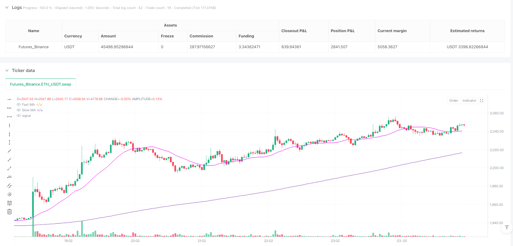
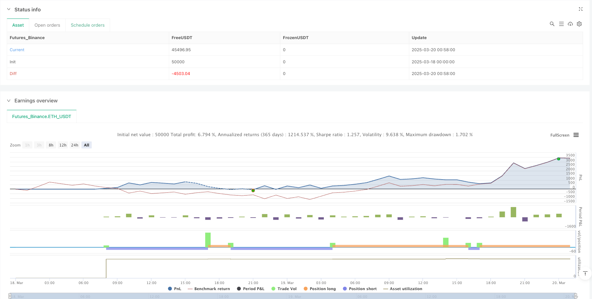

> Name

Flexible-Moving-Average-Crossover-Quantitative-Strategy
> Author

ianzeng123

> Strategy Description





[trans]
#### Overview
The Flexible Double Moving Average Crossover Quantitative Strategy is a trend following system based on moving average crossover signals. This strategy uses the intersection between the fast and slow moving averages to identify market trend turning points and trigger trading signals. The core of the strategy is to allow traders to flexibly choose the type of moving average (SMA, EMA, SMMA, WMA, VWMA) and period through parametric design to adapt to different market environments and characteristics of trading varieties. In addition, the strategy also provides control options for trading direction, which can be set to two-way trading, long-only or short-only mode according to the trader's preference.
#### Strategy Principle
The core principle of this strategy is based on the correlation between two moving averages of different periods to determine market trends. The specific implementation logic is as follows:
1. Parameter settings: Define the period and type of fast moving average and slow moving average by inputting parameters. The default configuration is a 20-period SMA as the fast line and a 200-period SMA as the slow line.
2. Moving average calculation: Flexibly calculate different types of moving averages through the custom function `ma()`, including simple moving average (SMA), exponential moving average (EMA), smoothed moving average (SMMA), weighted moving average (WMA) and volume weighted moving average (VWMA).
3. Trading signal generation:
   - Long signal: A long signal is triggered when the fast moving average crosses the 200-period SMA upwards
   - Short signal: A short signal is triggered when the fast moving average crosses the slow moving average downwards
4. Transaction execution control: According to the `directionOfTrade` parameter settings, you can choose to execute two-way transactions, only long or only short operations. In long-only mode, a short signal will close an existing long position; in short-only mode, a long signal will close an existing short position.
#### Strategic Advantages
1. High flexibility: The strategy allows users to customize the moving average type and period, is highly adaptable, and can optimize parameters according to different market characteristics and trading varieties.
2. Parametric design: Through the parametric moving average function, the strategy can easily switch between different types of moving averages, making it easy to test which moving average combination performs best in a specific market.
3. Visual support: Provides visual display options and color customization of moving averages, making it easier for traders to intuitively observe and analyze the relationship between market trends and moving averages.
4. Trading direction control: Supports setting trading direction (two-way, long only, short only), suitable for different market preferences and risk management needs.
5. Trend following logic: The strategy is based on moving average crossover signals, effectively captures mid- and long-term trend changes, and is suitable for markets with greater volatility.
6. Fund management: The strategy uses the position percentage method to manage funds by default, which helps to balance risk control and fund growth.
#### Strategy Risk
1. Moving average hysteresis: All strategies based on moving averages have hysteresis problems, which may lead to less than ideal entry points, especially in volatile markets, which are prone to false signals.
2. Unbalanced signal frequency: In violently volatile or sideways markets, too many cross signals may be generated, resulting in frequent transactions and higher handling fee costs.
3. Parameter sensitivity: Strategy performance is highly dependent on the selection of the moving average cycle. The optimal parameters may vary greatly under different market environments, requiring continuous monitoring and adjustment.
4. Long signal design issues: The long signal of the current strategy is based on the fast moving average crossing the 200 moving average, while the short signal is based on the fast and slow moving average crossing. This asymmetric design may lead to unbalanced triggering logic of long and short signals.
5. Lack of stop-loss mechanism: The current strategy does not set stop-loss conditions and may face a greater risk of loss when the trend suddenly reverses.
Solution:
- Introducing additional indicators (such as RSI, MACD, etc.) to confirm signal validity
- Implement appropriate stop loss and take profit strategies
- Optimize parameter combinations under different market environments through backtesting
-Adjust trading frequency and add signal filtering conditions
- Balance the generation logic of long and short signals to make it more consistent
#### Strategy optimization direction
1. Signal confirmation mechanism: Introduce other technical indicators as auxiliary confirmation tools, such as relative strength index (RSI), MACD or trading volume indicators, to reduce false signals. For example, when a moving average crossover occurs, the RSI is required to be in the overbought or oversold area at the same time before executing the trade.
2. Dynamic parameter adjustment: Implement a dynamic parameter adjustment mechanism based on market volatility or trend intensity, so that the strategy can adapt to different market conditions. For example, automatically extend the moving average period in high volatility environments to reduce false signals.
3. Unify the long and short signal logic: Modify the current asymmetric long and short signal generation logic so that both are based on fast and slow moving average crossovers or choose other more consistent signal generation methods.
4. Enhanced risk management: Add stop loss and take profit functions, such as dynamic stop loss based on ATR (true fluctuation range), or trailing stop loss mechanism based on retracement percentage.
5. Optimize fund management: Adjust position size based on signal strength or market volatility to achieve smarter fund allocation.
6. Time filtering: Add trading session filtering function to avoid market periods with low liquidity or high uncertainty.
7. Retracement control: Increase the maximum retracement limit, and suspend trading or reduce positions when the strategy retracement reaches the preset threshold.
#### Summarize
The flexible double moving average crossover quantitative strategy is a trend tracking system with clear structure and strong customizability. By allowing users to select different types and periods of moving averages, the strategy is able to adapt to a variety of trading instruments and market environments. Its core advantages lie in parametric design and trading direction control, allowing traders to adjust strategic behavior according to personal preferences and market conditions.
However, as a strategy based on moving average crossovers, it also faces inherent challenges such as hysteresis and false signals. In order to improve the robustness and profitability of the strategy, it is recommended to introduce a signal confirmation mechanism, improve the risk management system, optimize fund management methods, and implement dynamic parameter adjustment functions. These optimization directions can not only reduce false signals and control retracement, but also improve the adaptability of the strategy to different market conditions.
Overall, this is a strategy with a good basic framework. Through appropriate parameter adjustment and function expansion, it can be developed into a more comprehensive and powerful quantitative trading system, providing traders with a reliable tool for capturing market trends.
 ||
#### Overview
The Flexible Moving Average Crossover Quantitative Strategy is a trend-following system based on moving average crossover signals. This strategy utilizes the crossover relationship between fast and slow moving averages to identify market trend reversal points and trigger trading signals. The core of the strategy lies in its parameterized design that allows traders to flexibly choose the type of moving average (SMA, EMA, SMMA, WMA, VWMA) and period to adapt to different market environments and trading instrument characteristics. Additionally, the strategy provides trade direction control options, which can be set to bidirectional trading, long-only, or short-only modes according to the trader's preference.

#### Strategy Principle

The core principle of this strategy is based on the relationship between two moving averages with different periods to determine market trends. The specific implementation logic is as follows:

1. Parameter Settings: Define the period and type of fast and slow moving averages through input parameters. The default configuration is a 20-period SMA as the fast line and a 200-period SMA as the slow line.

2. Moving Average Calculation: Flexibly calculate different types of moving averages through the custom function `ma()`, including Simple Moving Average (SMA), Exponential Moving Average (EMA), Smoothed Moving Average (SMMA), Weighted Moving Average (WMA), and Volume Weighted Moving Average (VWMA).

3. Trade Signal Generation:
   - Long Signal: Triggered when the fast moving average crosses above the 200-period SMA
   - Short Signal: Triggered when the fast moving average crosses below the slow moving average

4. Trade Execution Control: Based on the `directionOfTrade` parameter setting, the strategy can execute bidirectional trades, long-only, or short-only operations. In long-only mode, short signals will close existing long positions; in short-only mode, long signals will close existing short positions.

#### Strategy Advantages

1. High Flexibility: The strategy allows users to customize moving average types and periods, offering strong adaptability that can be optimized for different market characteristics and trading instruments.

2. Parameterized Design: Through the parameterized moving average function, the strategy can easily switch between different types of moving averages, facilitating testing of which moving average combination performs best in specific markets.

3. Visualization Support: Provides visualization options for moving averages with color customization, allowing traders to intuitively observe and analyze market trends and their relationship with moving averages.

4. Trade Direction Control: Supports setting trading direction (bidirectional, long-only, short-only), suitable for different market preferences and risk management requirements.

5. Trend Following Logic: The strategy is based on moving average crossover signals, effectively capturing medium to long-term trend changes, suitable for markets with higher volatility.

6. Capital Management: The strategy uses position percentage by default to manage funds, helping to balance risk control and capital growth.

#### Strategy Risks

1. Moving Average Lag: All strategies based on moving averages suffer from lag issues, which may lead to less-than-ideal entry points, especially in oscillating markets where false signals are common.

2. Uneven Signal Frequency: In highly volatile or range-bound markets, excessive crossover signals may occur, leading to frequent trading and higher transaction costs.

3. Parameter Sensitivity: Strategy performance is highly dependent on the choice of moving average periods. Optimal parameters may vary greatly across different market environments, requiring continuous monitoring and adjustment.

4. Long Signal Design Issue: The current strategy's long signal is based on the fast moving average crossing above the 200-period SMA, while the short signal is based on the crossover of fast and slow moving averages. This asymmetric design may lead to an imbalance in the triggering logic between long and short signals.

5. Lack of Stop-Loss Mechanism: The current strategy does not set stop-loss conditions, which may face significant loss risks in sudden trend reversals.

Solutions:
- Introduce additional indicators (such as RSI, MACD, etc.) to confirm signal validity
- Implement appropriate stop-loss and take-profit strategies
- Optimize parameter combinations for different market environments through backtesting
- Adjust trading frequency and add signal filtering conditions
- Balance the logic for generating long and short signals to make them more consistent

#### Strategy Optimization Directions

1. Signal Confirmation Mechanism: Introduce other technical indicators as auxiliary confirmation tools, such as Relative Strength Index (RSI), MACD, or volume indicators to reduce false signals. For example, require the RSI to be in overbought or oversold territories when a moving average crossover occurs before executing a trade.

2. Dynamic Parameter Adjustment: Implement a dynamic parameter adjustment mechanism based on market volatility or trend strength, allowing the strategy to self-adapt to different market states. For example, automatically extend moving average periods in high-volatility environments to reduce false signals.

3. Unify Long and Short Signal Logic: Modify the current asymmetric long and short signal generation logic to make both based on fast and slow moving average crossovers or choose other more consistent signal generation methods.

4. Risk Management Enhancement: Add stop-loss and take-profit functions, such as dynamic stop-loss based on ATR (Average True Range), or trailing stop-loss mechanisms based on drawdown percentage.

5. Optimize Capital Management: Adjust position size based on signal strength or market volatility for smarter fund allocation.

6. Time Filtering: Add trading session filtering functionality to avoid low liquidity or high uncertainty market periods.

7. Drawdown Control: Add maximum drawdown limits, pausing trading or reducing positions when strategy drawdown reaches preset thresholds.

#### Summary

The Flexible Moving Average Crossover Quantitative Strategy is a clear-structured, highly customizable trend-following system. By allowing users to select different types and periods of moving averages, this strategy can adapt to various trading instruments and market environments. Its core advantages lie in its parameterized design and trade direction control, enabling traders to adjust strategy behavior according to personal preferences and market conditions.

However, as a strategy based on moving average crossovers, it also faces inherent challenges such as lag and false signals. To enhance the strategy's robustness and profitability, it is recommended to introduce signal confirmation mechanisms, improve risk management systems, optimize capital management methods, and implement dynamic parameter adjustment functions. These optimization directions can not only reduce false signals and control drawdowns but also improve the strategy's adaptability to different market states.

Overall, this is a strategy with a solid foundational framework that, through appropriate parameter adjustments and functional extensions, can develop into a more comprehensive and powerful quantitative trading system, providing traders with a reliable tool for capturing market trends.
[/trans]


> Source (PineScript)

``` pinescript
/*backtest
start: 2025-03-18 00:00:00
end: 2025-03-20 01:00:00
period: 2m
basePeriod: 2m
exchanges: [{"eid":"Futures_Binance","currency":"ETH_USDT"}]
*/

// This Pine Script™ code is subject to the terms of the Mozilla Public License 2.0 at https://mozilla.org/MPL/2.0/
// © ccrockatt21700

//@version=6
strategy("MA crossover strategy", overlay=true, fill_orders_on_standard_ohlc = true, default_qty_type=strategy.percent_of_equity, default_qty_value=100)

ma(source, length, type) =>
    type == "SMA" ? ta.sma(source, length) :
     type == "EMA" ? ta.ema(source, length) :
     type == "SMMA (RMA)" ? ta.rma(source, length) :
     type == "WMA" ? ta.wma(source, length) :
     type == "VWMA" ? ta.vwma(source, length) :
     na

fastMAPeriod = input.int(20, "Fast moving average period", inline="Fast moving average")
fastMAType   = input.string("SMA"  , ""     , inline="Fast moving average", options=["SMA", "EMA", "SMMA (RMA)", "WMA", "VWMA"])
fastMAColor  = input(#ee09f6, ""     , inline="Fast moving average")
plotFastMA   = input.bool(true, "Plot Fast MA")

slowMAPeriod = input.int(200, "Slow moving average period", inline="Slow moving average")
slowMAType   = input.string("SMA"  , ""     , inline="Slow moving average", options=["SMA", "EMA", "SMMA (RMA)", "WMA", "VWMA"])
slowMAColor  = input(#2bd4e0, ""     , inline="Slow moving average")
plotSlowMA = input.bool(true, "Plot Slow MA")

directionOfTrade = input.string("LongShort", "Trade direction: long & short, long only or short only", options=["LongShort", "Long", "Short"])

fastMA = ma(close, fastMAPeriod, fastMAType)
plot(plotFastMA ? fastMA : na, title="Fast MA", color=fastMAColor)

slowMA = ma(close, slowMAPeriod, slowMAType)
plot(plotSlowMA ? slowMA : na, title="Slow MA")

longCondition = ta.crossover(fastMA, ta.sma(close, 200))
if (longCondition)
    if (directionOfTrade == "LongShort" or directionOfTrade == "Long")
        strategy.entry("My Long Entry Id", strategy.long)
    else
        strategy.close("My Short Entry Id")

shortCondition = ta.crossunder(fastMA, slowMA)
if (shortCondition)
    if (directionOfTrade == "LongShort" or directionOfTrade == "Short")
        strategy.entry("My Short Entry Id", strategy.short)
    else
        strategy.close("My Long Entry Id")

```

> Detail

https://www.fmz.com/strategy/488239

> Last Modified

2025-03-26 11:01:59
