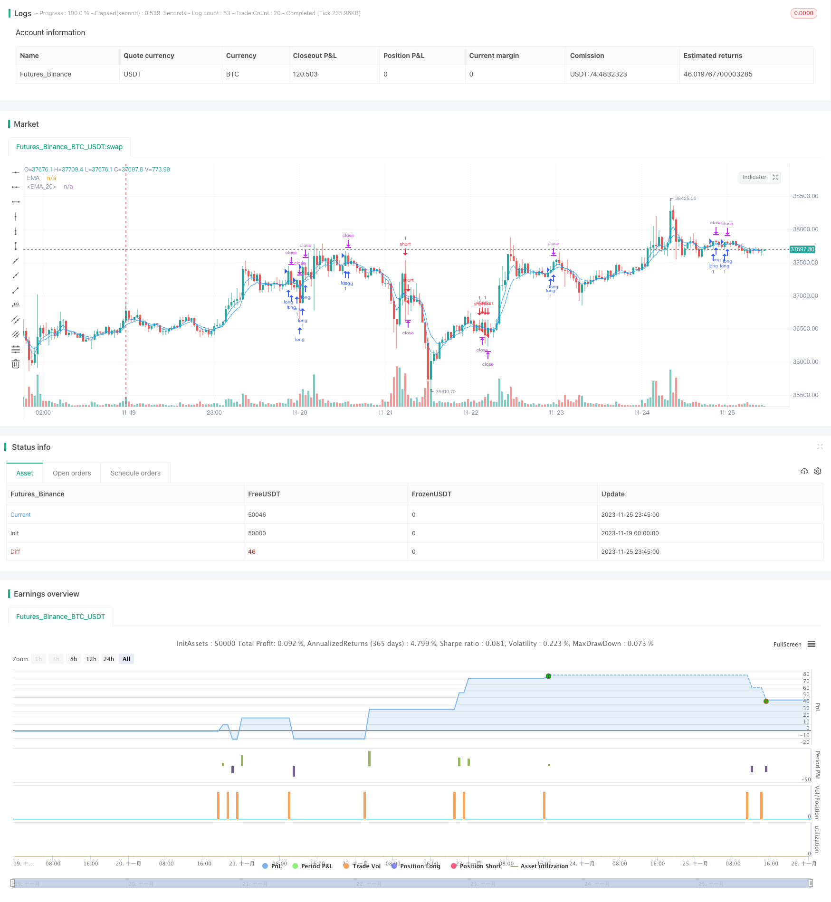

> Name

Four-Indicator-Momentum-Reversal-Strategy
> Author

ChaoZhang

> Strategy Description


[trans]

## Overview
This strategy uses the combination of three mainstream indicators, the moving average EMA, the relative strength indicator RSI, and the commodity channel indicator CCI, to identify the price trend through whether the EMA moving average reverses, and then uses the overbought and oversold RSI and CCI indicators to assist in judgment and form trading signals. It is an intermediate trading strategy.
## Strategy Principle
1. Use the 4-period and 8-period EMA moving average crossovers to determine the price trend. The 4-period period is quick to judge, and the 8-period period is slow to determine;
2. When the EMA moving average reverses upward, that is, the 4-period line crosses the 8-period line, and then assists in judging that the RSI indicator is higher than 65 (relatively overbought zone) and the CCI indicator is higher than 0 (representing no overbought or oversold), if satisfied, a long signal will be generated;
3. When the EMA moving average reverses downward, that is, the 4-period line crosses the 8-period line, and then assists in judging that the RSI indicator is below 35 (relatively oversold zone) and the CCI indicator is below 0 (indicating that there is no overbought or oversold), if satisfied, a short signal will be generated;
4. After forming a signal, set the stop loss and take profit prices according to the input stop loss distance and take profit distance.
Generally speaking, this strategy comprehensively considers short- and medium-term price trends and short-term indicator overbought and oversold range avoidance, which is relatively stable. At the same time, the stop-loss and take-profit settings will also effectively control the maximum loss of a single transaction.
## Advantage Analysis
1. Comprehensive judgment of multiple indicators to avoid single indicator trading strategies with a high probability of misjudgment;
2. EMA determines the main trend to avoid being misled by short-term fluctuations; RSI and CCI indicators avoid overbought and oversold zones to increase the winning rate;
3. Automatically set stop loss and take profit to control the risk of a single transaction and effectively prevent losses from expanding due to extreme market conditions;
4. This strategy is a technical trading strategy and is not affected by fundamentals. It can be used in any market period and is easy to implement.
## Risk Analysis
1. Technical indicators are prone to failure in the face of sudden major bad/good news;
2. When the stock price fluctuates violently, the stop loss may be breached, and the stop loss range should be appropriately relaxed;
3. This strategy is a short-term frequent trading strategy, and transaction costs will have a certain impact on profits. It is suitable for high-frequency strategies with cost advantages.
## Optimization direction
1. Add machine learning algorithms to automatically adjust parameters based on stock fundamentals;
2. Add an adaptive stop loss mechanism instead of a fixed stop loss distance.
## Summarize
This trading strategy combines multiple indicators to judge, and under reasonable parameter settings, it can obtain relatively stable short- and medium-term trading profits. It is a technical strategy that is easy to implement. But at the same time, attention should also be paid to guarding against sudden major basic news, and risk prevention measures such as appropriately relaxing stop loss distances. This is also a direction that can be further optimized in the future.
||

## Overview

This strategy utilizes three mainstream technical indicators: the moving average EMA, the relative strength index RSI and the commodity channel index CCI to identify price momentum through EMA crossovers and further entries confirmed by oversold/overbought readings from RSI and CCI. This intermediate-term trading strategy aims to capture momentum reversals.

## Strategy Logic

1. Use crossovers between 4-period and 8-period EMA to determine price momentum – the faster 4-period EMA to swiftly react and the slower 8-period EMA to confirm;  

2. When EMAs turn upward, i.e. the 4-period EMA crossing above the 8-period EMA, check that RSI (over 65) and CCI (above 0) are not overbought to give a long signal;

3. When EMAs turn downward, i.e. the 4-period EMA crossing below the 8-period EMA, check that RSI (below 35) and CCI (below 0) are oversold to give a short signal;

4. Set stop loss and take profit prices based on input distances once trade signals are triggered.

In summary, this strategy considers medium-term trend and short-term overbought/oversold levels to form relatively stable signals, while stop losses and take profits effectively limit loss per trade.

## Advantage Analysis 

1. Multiple indicators mitigate false signals from individual oscillators;  

2. EMAs determine the main trend while RSI and CCI avoid overheated areas to improve win rate;

3. Automatic stop loss and take profit setup constrains loss in extreme moves;  

4. Purely technical nature makes this strategy easily implementable across any timeframe.

## Risk Analysis

1. Major fundamental news can override technical levels;

2. Stop loss may be taken out by huge volatility calls for wider stops;

3. Frequent trading drives higher transaction costs thus best left for high frequency algorithms.

## Enhancement Opportunities

1. Incorporate machine learning models to auto-adjust parameters based on fundamentals; 

2. Build adaptive stops reacting to volatility rather than fixed distances.  

## Conclusion

This multifaceted strategy can deliver consistent medium-term profits under optimized parameters, making it an accessible technical system. Still, allowance needs to be given to black swan events via expanded stops etc, presenting areas for ongoing refinements.

[/trans]

> Strategy Arguments


|Argument|Default|Description|
|----|----|----|
|v_input_1|4|Length_MA4|
|v_input_2_close|0|Source: close|high|low|open|hl2|hlc3|hlcc4|ohlc4|
|v_input_3|false|Offset|
|v_input_4|8|Length_MA8|
|v_input_5_close|0|Source: close|high|low|open|hl2|hlc3|hlcc4|ohlc4|
|v_input_6|false|Offset|
|v_input_7|14|Length|
|v_input_8|6|CCI Turbo Length|
|v_input_9|14|CCI 14 Length|
|v_input_10|12|a|
|v_input_11|15|b|
|v_input_12|120|tp|
|v_input_13|96|sl|


> Source (PineScript)

``` pinescript
/*backtest
start: 2023-11-19 00:00:00
end: 2023-11-26 00:00:00
period: 45m
basePeriod: 5m
exchanges: [{"eid":"Futures_Binance","currency":"BTC_USDT"}]
*/

// This source code is subject to the terms of the Mozilla Public License 2.0 at https://mozilla.org/MPL/2.0/
// © SoftKill21

//@version=4


strategy(title="Moving Average Exponential", shorttitle="EMA", overlay=true)


len4 = input(4, minval=1, title="Length_MA4")
src4 = input(close, title="Source")
offset4 = input(title="Offset", type=input.integer, defval=0, minval=-500, maxval=500)
out4 = ema(src4, len4)
plot(out4, title="EMA", color=color.blue, offset=offset4)

len8 = input(8, minval=1, title="Length_MA8")
src8 = input(close, title="Source")
offset8 = input(title="Offset", type=input.integer, defval=0, minval=-500, maxval=500)
out8 = ema(src8, len8)
plot(out8, title="EMA", color=color.blue, offset=offset8)


//rsioma
src = close, len = input(14, minval=1, title="Length")
up = rma(max(change(ema(src, len)), 0), len)
down = rma(-min(change(ema(src, len)), 0), len)
rsi = down == 0 ? 100 : up == 0 ? 0 : 100 - (100 / (1 + up / down))
//plot(rsi, color=color.blue)
//band1 = hline(80)
//band0 = hline(20)
//fill(band1, band0, color=color.purple, transp=90)
//hline(50, color=color.gray, linestyle=plot.style_line)
sig = ema(rsi, 21)
//plot(sig, color=color.purple)

//woodie
cciTurboLength = input(title="CCI Turbo Length", type=input.integer, defval=6, minval=3, maxval=14)
cci14Length = input(title="CCI 14 Length", type=input.integer, defval=14, minval=7, maxval=20)

source = close

cciTurbo = cci(source, cciTurboLength)
cci14 = cci(source, cci14Length)

last5IsDown = cci14[5] < 0 and cci14[4] < 0 and cci14[3] < 0 and cci14[2] < 0 and cci14[1] < 0
last5IsUp = cci14[5] > 0 and cci14[4] > 0 and cci14[3] > 0 and cci14[2] > 0 and cci14[1] > 0
histogramColor = last5IsUp ? color.green : last5IsDown ? color.red : cci14 < 0 ? color.green : color.red


// Exit Condition
// Exit Condition
a = input(12)*10
b = input(15)*10
c = a*syminfo.mintick
d = b*syminfo.mintick


longCondition = crossover(out4, out8) and (rsi >= 65 and cci14>=0)
shortCondition = crossunder(out4, out8) and (rsi <=35 and cci14<=0)


long_stop_level     = float(na)
long_profit_level1  = float(na)
long_profit_level2  = float(na)
long_even_level     = float(na)

short_stop_level    = float(na)
short_profit_level1 = float(na)
short_profit_level2 = float(na)
short_even_level    = float(na)

long_stop_level     := longCondition  ? close - c : long_stop_level     [1]
long_profit_level1  := longCondition  ? close + d : long_profit_level1  [1]
//long_profit_level2  := longCondition  ? close + d : long_profit_level2  [1]
//long_even_level     := longCondition  ? close + 0 : long_even_level     [1]

short_stop_level    := shortCondition ? close + c : short_stop_level    [1]
short_profit_level1 := shortCondition ? close - d : short_profit_level1 [1]
//short_profit_level2 := shortCondition ? close - d : short_profit_level2 [1]
//short_even_level    := shortCondition ? close + 0 : short_even_level    [1] 


//ha
// === Input ===
//ma1_len = input(1, title="MA 01")
//ma2_len = input(40, title="MA 02")

// === MA 01 Filter ===
//o=ema(open,ma1_len)
//cc=ema(close,ma1_len)
//h=ema(high,ma1_len)
//l=ema(low,ma1_len)

// === HA calculator ===
//ha_t = heikinashi(syminfo.tickerid)
//ha_o = security(ha_t, timeframe.period, o)
//ha_c = security(ha_t, timeframe.period, cc)
//ha_h = security(ha_t, timeframe.period, h)
//ha_l = security(ha_t, timeframe.period, l)

// === MA 02 Filter ===
//o2=ema(ha_o, ma2_len)
//c2=ema(ha_c, ma2_len)
//h2=ema(ha_h, ma2_len)
//l2=ema(ha_l, ma2_len)

// === Color def ===
//ha_col=o2>c2 ? color.red : color.lime

// ===  PLOTITING===
//plotcandle(o2, h2, l2, c2, title="HA Smoothed", color=ha_col)

tp=input(120)
sl=input(96)
    
strategy.entry("long", strategy.long, when = longCondition)
//strategy.close("long", when = o2>c2 , comment="ha_long")
strategy.entry("short", strategy.short , when =shortCondition )
//strategy.close("short", when = o2<=c2 , comment = "ha_short" )

//strategy.close("long",when=long_profit_level1 or long_stop_level  , comment="tp/sl")
//strategy.close("short",when=short_profit_level1 or short_stop_level , comment="tp/sl")

strategy.exit("x_long","long",profit = tp, loss = sl) //when = o2>c2)
strategy.exit("x_short","short",profit = tp, loss = sl) //when = o2<c2)


```

> Detail

https://www.fmz.com/strategy/433431

> Last Modified

2023-11-27 15:51:01
