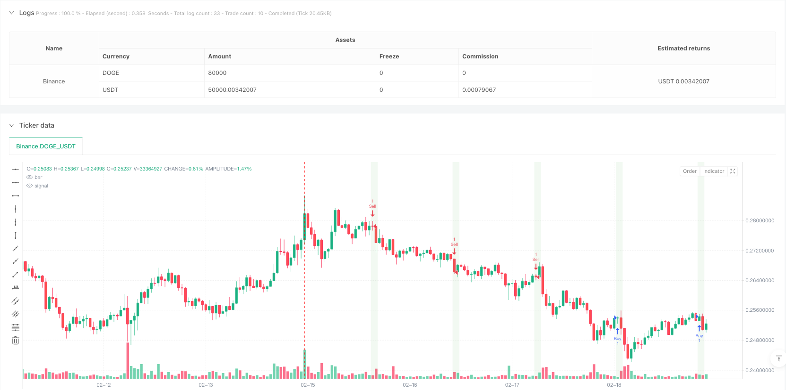
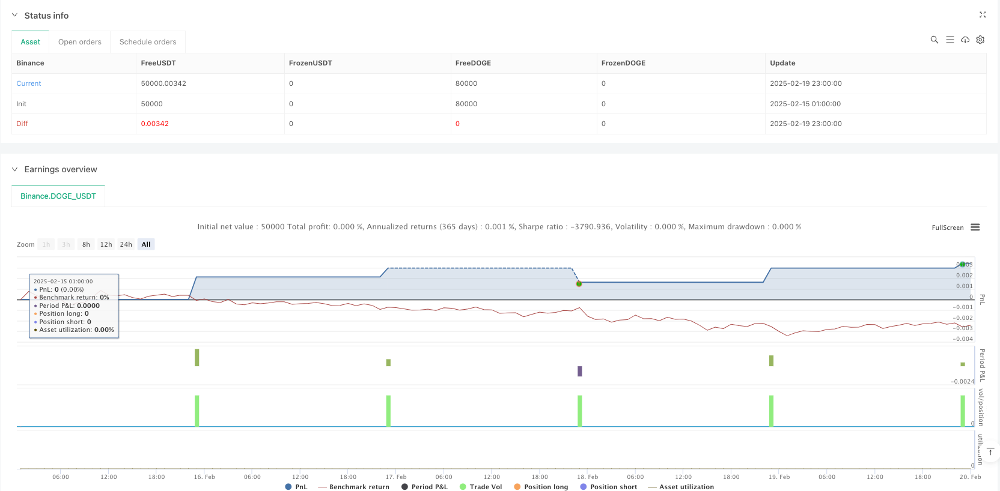

> Name

Trading variety candlestick size threshold trading strategy-Futures-Candlestick-Size-Threshold-Trading-Strategy
> Author

ianzeng123

> Strategy Description





[trans]
#### Overview
This strategy identifies and trades important price movements based on candle size. It provides precise control by setting specific pip thresholds, trading time windows and daily trade limits. The strategy is specifically optimized for futures markets to capture significant price movements during periods of high liquidity.
#### Strategy Principles
The core logic of the strategy is to calculate the difference between the high and low points of each candle line (in points) and compare it with the preset threshold. When the size of the candle line exceeds the threshold and is within the specified trading time window (default is 7:00-9:15 US-China time), the system will trigger a long and short trading signal based on the direction of the candle line. In order to control risks, the strategy limits execution to only one transaction per day and sets take-profit and stop-loss points.
#### Strategic Advantages
1. Precise point control - ensuring the accuracy of transaction execution through tick-level calculations
2. Time filtering - focus on trading during the most active periods of the market
3. Risk Management - Set clear take-profit and stop-loss levels to protect funds
4. Trading frequency control - one trading limit per day to avoid excessive trading
5. Visual reminder - the candle line that triggered the transaction will be highlighted for easy analysis.
6. Backtesting compatibility - includes functions such as date filtering and time execution to facilitate historical backtesting
#### Strategy Risk
1. Market volatility risk – false signals may be triggered during periods of severe volatility
2. Slippage risk - high-speed trading in the futures market may cause the actual transaction price to deviate
3. Opportunity cost - the limit of one trade per day may miss other good trading opportunities
4. Time dependence - the effectiveness of the strategy is highly dependent on the selected trading time window
#### Strategy optimization direction
1. Dynamic Thresholds - Automatically adjust candle size thresholds based on market volatility
2. Multiple time periods - Add confirmation signals for multiple time periods
3. Trading volume filtering - adding trading volume indicators as auxiliary judgments
4. Market Sentiment Indicator - Assess the market environment combined with indicators such as volatility
5. Adaptive take profit and stop loss - set dynamic take profit and stop loss levels based on market fluctuations
#### Summary
This strategy provides a reliable trading system for futures trading through precise point control and strict time filtering. Its advantage lies in the accuracy of execution and risk control, but it also requires traders to optimize parameters according to specific varieties and market conditions. Through the suggested optimization direction, the strategy can further improve its adaptability and stability. ||
#### Overview
This strategy identifies and trades significant price movements based on candlestick size. It achieves precise control through specific tick thresholds, trading time windows, and daily trade frequency limits. The strategy is specifically optimized for the futures market and can capture significant price movements during high liquidity periods.

#### Strategy Principle
The core logic of the strategy is to calculate the high-low range of each candlestick (in ticks) and compare it with a preset threshold. When the candlestick size exceeds the threshold within the specified trading window (default 7:00-9:15 CST), the system triggers long or short trading signals based on the candlestick direction. To control risk, the strategy limits execution to one trade per day and sets take-profit and stop-loss levels.

#### Strategy Advantages
1. Precise Tick Control - Ensures trading execution accuracy through tick-level calculations
2. Time Filtering - Focuses on trading during periods of highest market activity
3. Risk Management - Sets clear take-profit and stop-loss levels to protect capital
4. Trade Frequency Control - Daily trade limit prevents overtrading
5. Visual Alerts - Triggered candlesticks are highlighted for easy analysis
6. Backtesting Compatibility - Includes date filtering and time execution features for historical testing

#### Strategy Risks
1. Market Volatility Risk - May trigger false signals during periods of extreme volatility
2. Slippage Risk - High-speed trading in futures markets may lead to execution price deviation
3. Opportunity Cost - Daily trade limit may miss other good trading opportunities
4. Time Dependency - Strategy effectiveness highly depends on chosen trading window

#### Strategy Optimization Directions
1. Dynamic Threshold - Automatically adjust candlestick size threshold based on market volatility
2. Multiple Timeframes - Add confirmation signals from multiple timeframes
3. Volume Filter - Incorporate volume indicators as auxiliary judgment
4. Market Sentiment Indicators - Integrate volatility indicators to assess market conditions
5. Adaptive Take-Profit/Stop-Loss - Set dynamic exit levels based on market volatility

#### Summary
This strategy provides a reliable trading system for futures through precise tick control and strict time filtering. Its strengths lie in execution accuracy and risk control, but traders need to optimize parameters based on specific instruments and market conditions. Through the suggested optimization directions, the strategy can further enhance its adaptability and stability.[/trans]


> Source (PineScript)

``` pinescript
/*backtest
start: 2025-02-15 01:00:00
end: 2025-02-20 00:00:00
period: 1h
basePeriod: 1h
exchanges: [{"eid":"Binance","currency":"DOGE_USDT"}]
*/

// This Pine Script™ code is subject to the terms of the Mozilla Public License 2.0 at https://mozilla.org/MPL/2.0/
// © omnipadme

//@version=5
strategy("Futures Candle Size Strategy (Start Trading on Jan 1, 2025)", overlay=true)

// Input for candle size threshold in ticks
candleSizeThresholdTicks = input.float(25, title="Candle Size Threshold (Ticks)", minval=1)

// Input for take profit and stop loss in ticks
takeProfitTicks = input.float(50, title="Take Profit (Ticks)", minval=1)
stopLossTicks = input.float(40, title="Stop Loss (Ticks)", minval=1)

// Time filter for trading (e.g., 7:00 AM to 9:15 AM CST)
startHour = input.int(7, title="Start Hour (CST)", minval=0, maxval=23)
startMinute = input.int(0, title="Start Minute (CST)", minval=0, maxval=59)
endHour = input.int(9, title="End Hour (CST)", minval=0, maxval=23)
endMinute = input.int(15, title="End Minute (CST)", minval=0, maxval=59)

// Tick size of the instrument (e.g., ES = 0.25)
tickSize = syminfo.mintick

// Convert tick inputs to price levels
candleSizeThreshold = candleSizeThresholdTicks * tickSize
takeProfit = takeProfitTicks * tickSize
stopLoss = stopLossTicks * tickSize

// Time range calculation
startTime = timestamp("GMT-6", year(timenow), month(timenow), dayofmonth(timenow), startHour, startMinute)
endTime = timestamp("GMT-6", year(timenow), month(timenow), dayofmonth(timenow), endHour, endMinute)
inTimeRange = (time >= startTime and time <= endTime)

// Filter to start trading only from January 1, 2025
startTradingDate = timestamp("GMT-6", 2025, 1, 1, 0, 0)
isValidStartDate = time >= startTradingDate

// Calculate the candle size for the current candle
candleSize = math.abs(high - low)

// Track whether a trade has been executed for the day
var hasTradedToday = false
isNewDay = dayofweek != dayofweek[1]  // Detect new day

// Reset `hasTradedToday` at the start of a new day
if isNewDay
    hasTradedToday := false

// Trigger condition for futures trading (only if no trade has been executed today)
triggerCondition = isValidStartDate and inTimeRange and candleSize >= candleSizeThreshold and not hasTradedToday

// Entry logic: If condition is met, enter a trade
if triggerCondition
    hasTradedToday := true  // Mark as traded for the day
    if close > open  // Bullish candle
        strategy.entry("Buy", strategy.long)
    if close < open  // Bearish candle
        strategy.entry("Sell", strategy.short)

// Set take profit and stop loss
strategy.exit("Exit Long", from_entry="Buy", limit=close + takeProfit, stop=close - stopLoss)
strategy.exit("Exit Short", from_entry="Sell", limit=close - takeProfit, stop=close + stopLoss)

// Alerts for triggered condition
if triggerCondition
    alert("Candle size is " + str.tostring(candleSizeThresholdTicks) + " ticks or greater. Trade initiated.", alert.freq_once_per_bar)

// Color the alert candle white
barcolor(triggerCondition ? color.white : na)

// Visual aids for backtesting
bgcolor(isValidStartDate and inTimeRange ? color.new(color.green, 90) : na, title="Time and Date Range Highlight")


```

> Detail

https://www.fmz.com/strategy/483033

> Last Modified

2025-02-27 17:17:35
