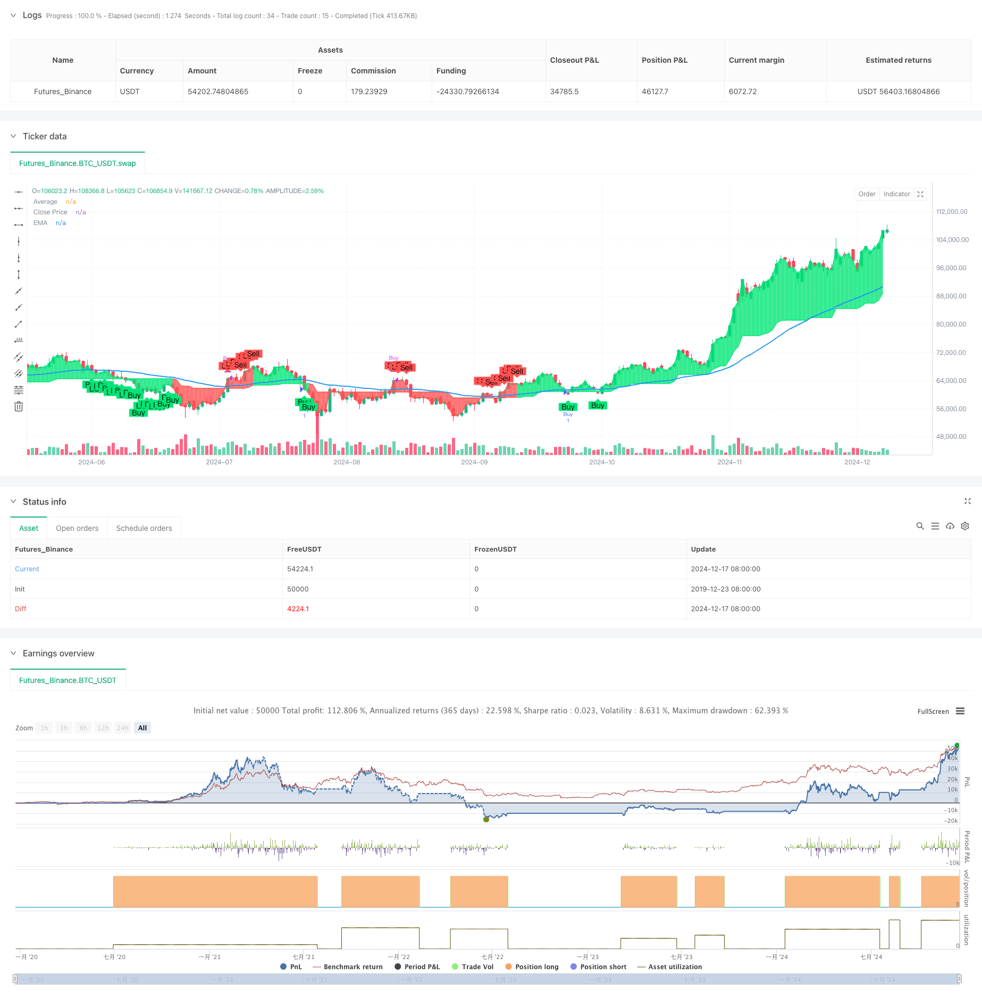

> Name

Quantitative-Long-Short-Switching-Strategy-Based-on-G-Channel-and-EMA
> Author

ChaoZhang

> Strategy Description



[trans]
#### Overview
This strategy is a quantitative trading system that combines G-Channel and exponential moving average (EMA). The core of the strategy is to capture the market trend direction through the G channel, and at the same time use EMA for signal confirmation and risk control, so as to obtain profits from the two-way fluctuations in the market. The strategy adopts a fully automated trading mode and does not require manual intervention.
#### Strategy Principle
The strategy operates based on two core indicators: G channel and EMA. The G channel identifies price trends by dynamically calculating the upper and lower tracks, and sends trading signals when the price breaks through the channel. Specifically, the strategy uses a 100-period G channel calculation to continuously update the upper and lower boundaries of the channel through mathematical formulas. At the same time, the strategy introduces the 50-period EMA as a secondary confirmation, and the transaction will only be executed when the relative position of the price and the EMA is in line with expectations. The buying condition is that the G channel sends a long signal and the closing price is below the EMA. The selling condition is that the G channel sends a short signal and the closing price is above the EMA.
#### Strategic Advantages
1. Combined with trend tracking and mean reversion characteristics, it can maintain stable performance in different market environments
2. Use EMA as an auxiliary confirmation to effectively reduce the risk of false breakthroughs
3. Use fully automated trading to avoid human emotional interference
4. The calculation logic is simple and clear, easy to understand and maintain
5. The parameters are highly adjustable and adaptable to different market characteristics.
#### Strategy Risk
1. Frequent transactions may occur in volatile markets, increasing transaction costs.
2. Improper setting of G channel parameters may cause signal lag
3. Improper selection of the EMA cycle may miss important trend turning points
4. Large retracements may occur when the market fluctuates violently.
Countermeasures:
-Introducing a stop-loss mechanism to control risks
- Optimize parameter configuration to improve system stability
- Add market environment filtering mechanism
- Set up reasonable position management strategies
#### Strategy optimization direction
1. Introduce volatility indicators to adjust strategy parameters or suspend trading in high volatility environments
2. Increase trading volume analysis and improve signal reliability
3. Add trend strength filter to avoid frequent trading in weak trending markets
4. Optimize the EMA parameter adaptation mechanism to improve system adaptability
5. Build a multi-time period signal confirmation mechanism to improve transaction stability
#### Summary
This strategy builds a robust quantitative trading system by combining two technical indicators, G channel and EMA. The strategy logic is clear, simple to implement, and has good scalability. Through reasonable parameter optimization and risk control measures, this strategy is expected to achieve stable returns in real trading. It is recommended to carry out targeted optimization based on market characteristics when applying real offers, and strictly implement the risk management system. ||
#### Overview
This strategy is a quantitative trading system that combines G-Channel and Exponential Moving Average (EMA). The core concept is to capture market trend directions through G-Channel while using EMA for signal confirmation and risk control, aiming to generate profits from market fluctuations. The strategy operates in a fully automated mode without manual intervention.

#### Strategy Principle
The strategy operates based on two core indicators: G-Channel and EMA. G-Channel identifies price trends by dynamically calculating upper and lower bands, generating trading signals when prices break through the channel. Specifically, the strategy uses a 100-period G-Channel calculation, continuously updating the channel boundaries through mathematical formulas. Additionally, a 50-period EMA is introduced as secondary confirmation, executing trades only when the price's relative position to EMA meets expectations. Buy conditions are triggered when G-Channel signals long and closing price is below EMA, while sell conditions occur when G-Channel signals short and closing price is above EMA.

#### Strategy Advantages
1. Combines trend-following and mean-reversion characteristics, maintaining stable performance in various market conditions
2. Uses EMA as auxiliary confirmation to effectively reduce false breakout risks
3. Employs fully automated trading to avoid emotional interference
4. Features simple and clear calculation logic, easy to understand and maintain
5. Offers strong parameter adjustability to adapt to different market characteristics

#### Strategy Risks
1. May result in frequent trading in oscillating markets, increasing transaction costs
2. Improper G-Channel parameter settings may lead to signal lag
3. Inappropriate EMA period selection might miss important trend turning points
4. Possibility of significant drawdowns during extreme market volatility
Risk mitigation measures:
- Implement stop-loss mechanisms
- Optimize parameter configuration
- Add market environment filtering
- Set reasonable position management strategies

#### Strategy Optimization Directions
1. Introduce volatility indicators to adjust strategy parameters or pause trading in high-volatility environments
2. Incorporate volume analysis to improve signal reliability
3. Add trend strength filters to avoid frequent trading in weak trend markets
4. Optimize EMA parameter adaptive mechanisms to enhance system adaptability
5. Develop multi-timeframe signal confirmation mechanisms to improve trading stability

#### Summary
This strategy constructs a robust quantitative trading system by combining G-Channel and EMA technical indicators. The strategy logic is clear, implementation is simple, and it offers good scalability. Through proper parameter optimization and risk control measures, the strategy shows potential for generating stable returns in live trading. It is recommended to optimize the strategy based on market characteristics and strictly implement risk management protocols when applying it to live trading.[/trans]


> Source (PineScript)

``` pinescript
/*backtest
start: 2019-12-23 08:00:00
end: 2024-12-18 08:00:00
period: 1d
basePeriod: 1d
exchanges: [{"eid":"Futures_Binance","currency":"BTC_USDT"}]
*/

// This Pine Script™ code is subject to the terms of the Mozilla Public License 2.0 at https://mozilla.org/MPL/2.0/
// © stanleygao01


//@version=5
strategy('G-Channel with EMA Strategy', overlay=true)

// G-Channel parameters
length = input(100, title='G-Channel Length')
src = input(close, title='Source')

a = 0.0
b = 0.0
a := math.max(src, nz(a[1])) - nz(a[1] - b[1]) / length
b := math.min(src, nz(b[1])) + nz(a[1] - b[1]) / length
avg = math.avg(a, b)

crossup = b[1] < close[1] and b > close
crossdn = a[1] < close[1] and a > close
bullish = ta.barssince(crossdn) <= ta.barssince(crossup)

// EMA parameters
emaLength = input(50, title='EMA Length')
ema = ta.ema(close, emaLength)

// Buy and Sell Conditions
buyCondition = bullish and close < ema
sellCondition = not bullish and close > ema

// Plot G-Channel
c = bullish ? color.lime : color.red
p1 = plot(avg, title='Average', color=c, linewidth=1, transp=90)
p2 = plot(close, title='Close Price', color=c, linewidth=1, transp=100)
fill(p1, p2, color=c, transp=90)

// Plot EMA
plot(ema, title='EMA', color=color.new(color.blue, 0), linewidth=2)

// Strategy Entries and Exits
if buyCondition
    strategy.entry('Buy', strategy.long)
if sellCondition
    strategy.close('Buy')

// Plot Buy/Sell Labels
plotshape(buyCondition, title='Buy Signal', location=location.belowbar, color=color.new(color.lime, 0), style=shape.labelup, text='Buy')
plotshape(sellCondition, title='Sell Signal', location=location.abovebar, color=color.new(color.red, 0), style=shape.labeldown, text='Sell')


```

> Detail

https://www.fmz.com/strategy/475598

> Last Modified

2024-12-20 14:31:56
