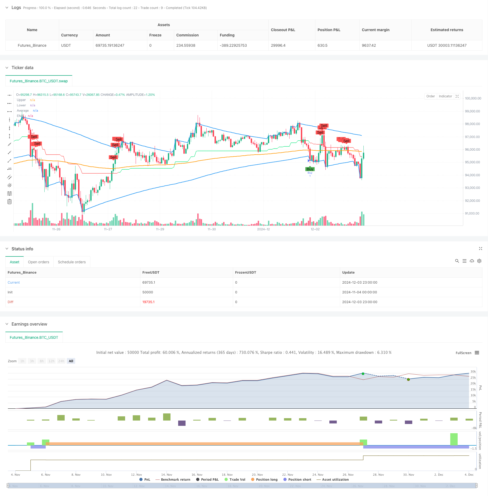

> Name

G-Channel-and-EMA-Trend-Filter-Trading-System
> Author

ChaoZhang

> Strategy Description



[trans]
#### Overview
This strategy is a trend following trading system based on custom G channels and exponential moving averages (EMA). The G channel consists of the upper track (a), the lower track (b) and the middle track (avg), and the channel boundaries are determined by dynamically calculating current and historical prices. This strategy combines EMA as a trend filter to generate trading signals through the intersection of price and channel lines and the position relationship with EMA, effectively capturing the market trend turning point.
#### Strategy Principle
The core logic of the strategy consists of two main components: G channel and EMA filter. The calculation of the G channel is based on the current price and historical data, and the channel width is dynamically adjusted through an adaptive algorithm. The upper track (a) takes the larger value of the current price and the previous upper track, and dynamically adjusts it according to the channel width and length parameters; the lower track (b) uses a similar method to calculate the minimum value; the middle track is the arithmetic mean of the upper and lower tracks. The triggering conditions for trading signals combine the intersection of the price with the channel line and the relative position with the EMA: a buy signal is generated when the price breaks through the lower band and is below the EMA; a sell signal is generated when the price falls below the upper band and is above the EMA.
#### Strategic Advantages
1. Strong adaptability: G channel can automatically adjust the channel width according to market fluctuations and adapt to different market environments.
2. Trend confirmation: Using EMA as a filter improves the reliability of trading signals.
3. Risk control: Through the dual verification mechanism of channel breakthrough and trend confirmation, the risk of false signals is reduced.
4. Clear signals: The trading conditions are clear, which facilitates programmatic implementation and backtest verification.
5. Visual support: The strategy provides a complete graphical display to facilitate analysis and judgment.
#### Strategy Risk
1. Trend delay: EMA, as a lagging indicator, may cause a delay in entry timing.
2. Risk of volatile market: Frequent false breakthrough signals may occur in a volatile market.
3. Parameter sensitivity: The choice of channel length and EMA period has a greater impact on strategy performance.
4. Market environment dependence: The strategy performs better in markets with obvious trends, but may perform poorly in volatile markets.
#### Strategy optimization direction
1. Introducing volatility indicators: channel parameters can be dynamically adjusted according to market volatility to improve strategy adaptability.
2. Add market environment filtering: add a market environment judgment mechanism and adopt different parameter settings under different market conditions.
3. Optimize the stop-loss mechanism: Design a dynamic stop-loss plan based on channel width to improve risk control capabilities.
4. Improve signal filtering: increase auxiliary indicators such as trading volume and volatility to improve signal quality.
5. Parameter optimization: Optimize the optimal parameter combination under different market environments through backtesting.
#### Summary
The G Channel and EMA Trend Filter Trading System is a complete trading strategy that combines channel breakouts and trend following. Through the dynamic characteristics of the G channel and the trend confirmation function of EMA, this strategy can effectively capture market turning points and control trading risks. Although there are certain limitations, the overall performance of the strategy is expected to be further improved through the proposed optimization direction. This strategy is suitable for use in markets with obvious trends and can be used as a basic framework for building more complex trading systems. ||
#### Overview
This strategy is a trend-following trading system based on the custom G-Channel and Exponential Moving Average (EMA). The G-Channel consists of upper (a), lower (b), and middle (avg) lines, determining channel boundaries through dynamic calculation of current and historical prices. The strategy combines EMA as a trend filter, generating trading signals through price crossovers with channel lines and relative position to EMA, effectively capturing market trend reversal points.

#### Strategy Principles
The core logic comprises two main components: G-Channel and EMA filter. The G-Channel calculations are based on current prices and historical data, dynamically adjusting channel width through an adaptive algorithm. The upper line (a) takes the maximum of current price and previous upper line, adjusted by channel width and length parameters; the lower line (b) uses a similar method for minimum values; the middle line is the arithmetic mean. Trading signals are triggered by combining price crossovers with channel lines and relative position to EMA: buy signals occur when price breaks above the lower line while below EMA; sell signals when price breaks below the upper line while above EMA.

#### Strategy Advantages
1. Strong adaptability: G-Channel automatically adjusts channel width based on market volatility, adapting to different market environments.
2. Trend confirmation: EMA as a filter improves trading signal reliability.
3. Risk control: Dual verification mechanism through channel breakouts and trend confirmation reduces false signal risks.
4. Clear signals: Trading conditions are clear, facilitating programmatic implementation and backtesting.
5. Visual support: Strategy provides complete graphical display for analysis and judgment.

#### Strategy Risks
1. Trend delay: EMA as a lagging indicator may cause delayed entry timing.
2. Sideways market risk: May generate frequent false breakout signals in ranging markets.
3. Parameter sensitivity: Channel length and EMA period choices significantly impact strategy performance.
4. Market environment dependence: Strategy performs better in trending markets but may underperform in ranging markets.

#### Strategy Optimization Directions
1. Introduce volatility indicators: Dynamically adjust channel parameters based on market volatility to improve adaptability.
2. Add market environment filtering: Implement market state judgment mechanism to use different parameter settings in different market conditions.
3. Optimize stop-loss mechanism: Design dynamic stop-loss plans based on channel width to enhance risk control.
4. Improve signal filtering: Add volume, volatility, and other auxiliary indicators to improve signal quality.
5. Parameter optimization: Optimize parameter combinations for different market environments through backtesting.

#### Summary
The G-Channel and EMA Trend Filter Trading System is a complete trading strategy combining channel breakouts and trend following. Through G-Channel's dynamic characteristics and EMA's trend confirmation function, the strategy effectively captures market turning points while controlling trading risks. Though certain limitations exist, the strategy's overall performance can be further improved through the proposed optimization directions. This strategy is suitable for trending markets and can serve as a foundation framework for building more complex trading systems.[/trans]


> Source (PineScript)

``` pinescript
/*backtest
start: 2024-11-04 00:00:00
end: 2024-12-04 00:00:00
period: 1h
basePeriod: 1h
exchanges: [{"eid":"Futures_Binance","currency":"BTC_USDT"}]
*/

//@version=5
strategy("G-Channel with EMA Strategy", overlay=true)

// G-Channel Indicator
length = input.int(100, title="G-Channel Length")
src = input(close, title="Source")

var float a = na
var float b = na
a := math.max(src, nz(a[1])) - (nz(a[1]) - nz(b[1])) / length
b := math.min(src, nz(b[1])) + (nz(a[1]) - nz(b[1])) / length
avg = (a + b) / 2

// G-Channel buy/sell signals
crossup = ta.crossover(close, b)
crossdn = ta.crossunder(close, a)
bullish = ta.barssince(crossdn) <= ta.barssince(crossup)

// EMA Indicator
emaLength = input.int(200, title="EMA Length")
ema = ta.ema(close, emaLength)

// Buy Condition: G-Channel gives a buy signal and price is below EMA
buySignal = bullish and close < ema

// Sell Condition: G-Channel gives a sell signal and price is above EMA
sellSignal = not bullish and close > ema

// Plotting the G-Channel and EMA
plot(a, title="Upper", color=color.blue, linewidth=2, transp=100)
plot(b, title="Lower", color=color.blue, linewidth=2, transp=100)
plot(avg, title="Average", color=bullish ? color.lime : color.red, linewidth=1, transp=90)
plot(ema, title="EMA", color=color.orange, linewidth=2)

// Strategy Execution
if (buySignal)
    strategy.entry("Buy", strategy.long)

if (sellSignal)
    strategy.entry("Sell", strategy.short)

// Plot Buy/Sell Signals
plotshape(buySignal, location=location.belowbar, color=color.green, style=shape.labelup, text="Buy")
plotshape(sellSignal, location=location.abovebar, color=color.red, style=shape.labeldown, text="Sell")

```

> Detail

https://www.fmz.com/strategy/474053

> Last Modified

2024-12-05 16:27:24
