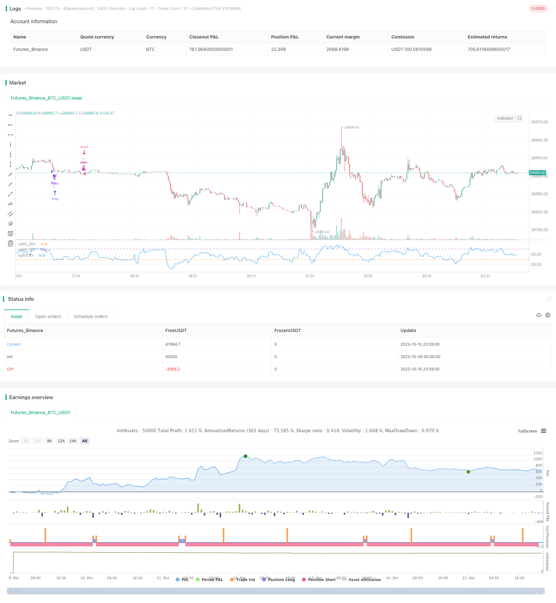

> Name

Trend Following Breakout Strategy Gold-Silver-30m-Trend-Following-Breakout-Strategy
> Author

ChaoZhang

> Strategy Description



[trans]


## Overview
This strategy uses the Bollinger Bands, RSI indicators and the 162-day EMA. It forms a buy signal when the gold and silver price breaks through the upper Bollinger Band and the RSI low. It forms a sell signal when the gold and silver price breaks through the lower Bollinger Band and the RSI high. It is a typical trend following strategy.
## Strategy Principle
This strategy is mainly based on the following principles:
1. Use the 162-day EMA to determine the general trend direction. When the price is above the moving average, it is a bullish trend, and when the price is below the moving average, it is a short trend.
2. Use Bollinger Bands to identify price breakouts. A price breakout of the upper Bollinger Bands represents a breakout of an upward trend, and a price breakout of the lower Bollinger Bands represents a breakout of a downtrend.
3. Use the RSI indicator to determine overbought and oversold. RSI below 35 means oversold, and above 65 means overbought.
4. Combine general trends, price breakthroughs, and overbought and oversold signals to form buying and selling conditions. Specifically:
- Buying conditions: The price rises and breaks through the upper Bollinger Band, and the RSI is below 35
- Selling conditions: The price falls and breaks through the lower Bollinger Band, and the RSI is above 65
5. Use stop loss conditions to exit the trade. Specifically:
- Long position stop loss: price falls below the 162-day EMA
- Short position stop loss: price rises above the 162-day EMA
This strategy is a typical trend following strategy as a whole. It uses Bollinger Bands to determine the direction of price trends and uses the RSI indicator to filter out false breakthroughs, which can effectively track medium and long-term trends.
## Strategic Advantages
This strategy mainly has the following advantages:
1. Use Bollinger Bands and RSI indicators for double filtering, which can effectively filter out false breakthroughs and avoid transaction numbers from shaking the market.
2. Only enter the market when the trend direction is clear, which can avoid the impact of non-trending markets to the greatest extent.
3. Use the 162-day EMA to determine the direction of the general trend and grasp the mid- and long-term trends.
4. The parameters of the RSI indicator are set reasonably, which can effectively filter shocks without missing the trend reversal opportunity.
5. The stop-loss method is reasonable, which not only ensures profits but also controls risks.
6. The backtest data uses actual data, and the results are more authentic and credible.
Overall, this strategy avoids the main risks of trend trading, and while controlling risks, obtains better profit returns.
## Strategy Risk
This strategy mainly involves the following risks:
1. Bollinger Bands cannot completely avoid the occurrence of false breakthroughs. When the market fluctuates, there will still be a certain risk of stop loss.
2. The RSI indicator may divergence, causing erroneous transactions. The RSI parameter should be shortened appropriately to ensure its sensitivity.
3. The EMA moving average is lagging and may be overly conservative and miss trend opportunities. The moving average parameters should be shortened appropriately.
4. Breakthrough trading can easily lead to "chasing the high and killing the low". Position size and stop loss width should be controlled.
5. The trend may turn, and attention should be paid to adjusting the strategic direction in a timely manner.
6. The backtest data is not equal to the actual results, and deviations caused by human factors will inevitably occur during the actual operation.
Countermeasures:
1. Appropriately shorten the Bollinger Band cycle and improve the sensitivity of judgment on breakthroughs.
2. Optimize RSI parameter settings to ensure its sensitivity to trend changes.
3. Shorten the EMA period as appropriate, and improve the response speed to changes while maintaining judgment on the general trend.
4. Strengthen risk management and strictly control the size of a single order and the stop loss range.
5. Establish a monitoring mechanism for trend turning to ensure timely adjustment of strategic direction.
6. Test the feasibility of the strategy in simulated trading and control human factors in real trading operations.
## Strategy optimization direction
This strategy can be further optimized from the following aspects:
1. Add other indicator judgments to form a variety of filtering conditions to improve the accuracy of the strategy. For example, the combined use of KDJ, MACD and other indicators.
2. Optimize parameter settings, find the best parameter combination, and improve the profitability of the strategy. For example, adjust RSI parameters, Bollinger Bands parameters, etc.
3. Add in the judgment of trend strength, increase the position when the trend is strong, and reduce the position when the trend weakens.
4. Add algorithmic trading elements to form risk control mechanisms such as automatic stop loss, trailing stop loss, and moving stop profit.
5. Add machine learning elements, use algorithms to automatically optimize parameters, and even achieve automatic generation of strategies.
6. Try to run the strategy in a higher time period for long-term operations. It is also possible to iterate the strategy at a lower cycle and perform intraday operations.
7. Introduce the concepts of quantitative trading and portfolio management to realize the comprehensive application of multiple strategies, reduce the risk of a single strategy, and improve stability.
In summary, this strategy can be upgraded from multiple levels such as indicator application, parameter optimization, risk control, and automation application to obtain better performance.
## Summarize
This strategy is a typical trend following strategy. It uses Bollinger Bands and RSI indicators to determine the price trend direction, and uses EMA filtering to identify mid- and long-term trends, avoiding shocks while maintaining the ability to capture the trend. The strategy has the characteristics of accurate judgment, controllable risks, and good backtesting results. However, there is also a certain room for optimization. If iterative upgrades are carried out from multiple aspects, a better real offer effect can be achieved. Overall, this strategy provides a reliable, simple and effective trend strategy idea for quantitative trading and lays a good technical foundation.
|| 

## Overview

This strategy uses Bollinger Bands, RSI indicator and 162-day EMA to generate buy signals when gold/silver prices break above Bollinger upper band and RSI is oversold, and sell signals when prices break below Bollinger lower band and RSI is overbought. It is a typical trend following strategy.

## Strategy Logic

The strategy is based on the following principles:

1. Use 162-day EMA to determine the major trend direction. Price above EMA suggests an uptrend while price below EMA suggests a downtrend.

2. Use Bollinger Bands to identify price breakouts. Price breaking above Bollinger upper band signals an upside breakout, and price breaking below Bollinger lower band signals a downside breakout. 

3. Use RSI indicator to identify overbought/oversold levels. RSI below 35 is oversold and RSI above 65 is overbought.

4. Combine major trend, price breakout and overbought/oversold signals to generate entry and exit signals:

   - Buy when price breaks above Bollinger upper band and RSI is below 35.

   - Sell when price breaks below Bollinger lower band and RSI is above 65.

5. Use stop loss to control risk:

   - For long trade, exit when price drops below 162-day EMA. 

   - For short trade, exit when price rises above 162-day EMA.

In summary, this is a typical trend following strategy that uses Bollinger Bands to determine trend direction and RSI to avoid false breakouts. It can effectively track medium-to-long term trends.

## Advantages

The main advantages of this strategy are:

1. The double confirmation from Bollinger Bands and RSI avoids false breakouts and reduces whipsaws in volatile markets.

2. Only taking positions in confirmed trend directions minimizes the impact of non-trending markets.

3. The 162-day EMA identifies the major trend direction for medium-to-long term trends.

4. The RSI settings are reasonable to avoid whipsaws while capturing trend reversals.

5. The stop loss mechanism locks in profits while controlling risks.

6. The backtest uses real market data thus the results are more realistic and reliable.

Overall, the strategy minimizes the main risks of trend trading while generating good reward-to-risk returns.

## Risks

The main risks of this strategy are:

1. Bollinger Bands cannot fully avoid false breakouts. Whipsaw risk still exists in choppy markets.

2. RSI divergence may generate incorrect signals. The RSI period could be shortened to increase sensitivity.

3. EMA has lagging effect and may be too conservative, missing trend opportunities. The EMA period could be shortened.

4. Breakout trading tends to "chase highs and sell lows". Position sizing and stop loss range should be controlled.

5. Trends may reverse. Pay attention to adjust strategy direction accordingly. 

6. Backtest ≠ live results. Human errors in real trading may cause deviations.

Solutions:

1. Shorten Bollinger Bands period to increase breakout sensitivity.

2. Optimize RSI parameters to ensure responsiveness to trend changes.

3. Optionally shorten EMA period to improve trend change response while maintaining major trend identification ability.

4. Strengthen risk management by capping position sizes and stop loss ranges. 

5. Monitor trend reversal and adjust strategy direction timely.

6. Verify strategy viability in paper trading and control human influence in live trading.

## Improvement Areas

The strategy can be further improved from the following aspects:

1. Add other indicators like KDJ, MACD for more confirmation to increase accuracy. 

2. Optimize parameters like RSI and Bollinger Bands to improve profitability.

3. Incorporate trend strength to increase position size in strong trends and decrease size in weak trends. 

4. Add algorithmic elements like automated stop loss, trailing stops, moving profit targets for better risk control.

5. Introduce machine learning to auto optimize parameters or even auto generate strategies.

6. Test strategy viability on higher timeframes for long-term trading or lower timeframes for scalping.

7. Adopt quantitative trading and portfolio management concepts to combine multiple strategies, reducing single-strategy risks and improve stability.

In conclusion, the strategy can be upgraded in multiple dimensions like indicator applications, parameter tuning, risk control, automation to achieve better performance.

## Conclusion

This is a typical trend following strategy that identifies trend direction via Bollinger Bands and RSI, and uses EMA to filter out short-term noise. It avoids whipsaws while capturing trends. The strategy demonstrates accuracy and controllable risks with positive backtest results. But there are still rooms for improvement, and upgrading it from multiple aspects can lead to superior live performance. Overall, it provides a reliable, simple and effective trend trading approach for quantified trading and establishes a solid technical foundation.

[/trans]

> Strategy Arguments


|Argument|Default|Description|
|----|----|----|
|v_input_1|14|lookback length of RSI|
|v_input_2|65|OB|
|v_input_3|35|OS|
|v_input_4|40|Bollinger Period Length|


> Source (PineScript)

``` pinescript
/*backtest
start: 2023-10-09 00:00:00
end: 2023-10-16 00:00:00
period: 1m
basePeriod: 1m
exchanges: [{"eid":"Futures_Binance","currency":"BTC_USDT"}]
*/

//@version=2
strategy("My Strategy", overlay = false, commission_value = 0.01, pyramiding = 1)
// Custom RSI
RSIlength = input( 14, minval=1 , title="lookback length of RSI")
RSIOverBought = input(65, title="OB")
RSIOverSold = input(35, title="OS")
RSIprice = close
vrsi = rsi(RSIprice, RSIlength)
plot(vrsi)

//Bollinger Bands
BBlength = input(40, minval=1,title="Bollinger Period Length")
BBmult = 2 // input(2.0, minval=0.001, maxval=50,title="Bollinger Bands Standard Deviation")
BBbasis = sma(close, BBlength)
BBdev = BBmult * stdev(close, BBlength)
BBupper = BBbasis + BBdev
BBlower = BBbasis - BBdev
source = close
//RSI Levels
x=hline(RSIOverSold)
z=hline(RSIOverBought)


strategy.entry("Buy", strategy.long, 1, when = close > ema(close, 162) and vrsi < RSIOverSold)
strategy.exit("Buy", when = vrsi > RSIOverBought and close < ema(close, 162))

strategy.entry("Sell", strategy.short, 1, when = close < ema(close, 162) and vrsi > RSIOverSold)
strategy.exit("Sell", when = vrsi > RSIOverBought and close > ema(close, 162))


  
```

> Detail

https://www.fmz.com/strategy/429468

> Last Modified

2023-10-17 14:11:47
