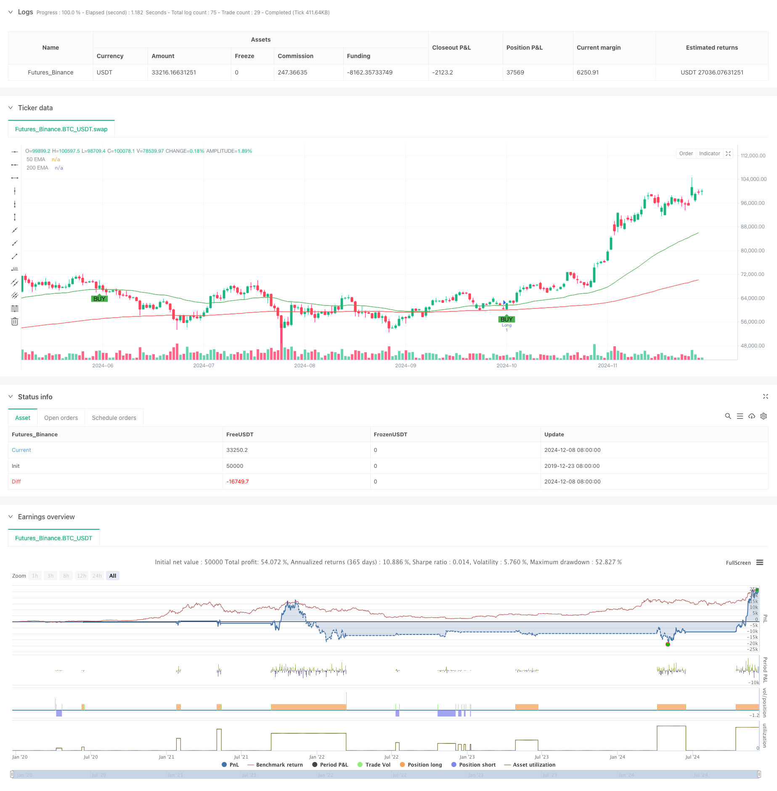

> Name

Gold-Trend-Channel-Reversal-Momentum-Strategy
> Author

ChaoZhang

> Strategy Description



[trans]
#### Overview
This strategy is a trading system based on trend channels, price reversal patterns, and momentum indicators. It combines an moving average system (EMA) to determine trend direction, a relative strength indicator (RSI) to identify consolidation ranges, and an engulfing pattern to find precise entry opportunities. The strategy uses a dynamic volatility indicator (ATR) to manage risk and achieve quick profit taking.
#### Strategy Principle
The core logic of the strategy is based on the collaborative verification of multi-layer technical indicators:
1. Use the 50 and 200 period exponential moving averages (EMA) to construct a trend channel and determine the trend direction through the moving average crossover.
2. Use RSI(14) to find the potential energy accumulation area in the neutral range of 45-55
3. Confirm price reversal signals through engulfing patterns
4. Dynamically set the stop loss position based on ATR(14)
5. Set a fixed 20-point profit target for quick profit taking
#### Strategic Advantages
1. Cross-validation of multiple technical indicators to improve the reliability of trading signals
2. Combine trend following and reversal trading to fully seize market opportunities
3. Filter false signals through the RSI neutral zone
4. Dynamic stop loss mechanism adapts to changes in market volatility
5. Fixed profit targets facilitate disciplined trading
6. The strategy logic is clear and easy to understand and implement.
#### Strategy Risk
1. Volatile markets may generate frequent trading signals
2. Fixed profit targets may limit the profit potential of the general market
3. The moving average system may lag behind during violent fluctuations.
4. RSI neutral zone judgment may miss some trading opportunities
5. Engulfing patterns can produce false signals during periods of high volatility
#### Strategy optimization direction
1. Introduce trading volume indicators to verify the effectiveness of price breakthroughs
2. Develop an adaptive profit target mechanism to replace fixed points
3. Add trend strength filter to reduce false signals in volatile markets
4. Optimize the RSI interval range to improve signal capture efficiency
5. Combine more time period signals to improve accuracy
#### Summary
This strategy builds a systematic trading system by comprehensively using technical analysis tools. It focuses on both trend following and price reversal, and improves the success rate of transactions through multiple indicator verifications. Although there are certain limitations, through continuous optimization and risk management, it can provide traders with a reliable trading reference. ||
#### Overview
This strategy is a trading system based on trend channels, price reversal patterns, and momentum indicators. It combines the moving average system (EMA) to determine trend direction, uses the Relative Strength Index (RSI) to identify consolidation zones, and employs engulfing patterns to find precise entry points. The strategy manages risk through dynamic volatility indicators (ATR) and implements quick profit-taking.

#### Strategy Principles
The core logic is built on multi-layer technical indicator validation:
1. Uses 50 and 200-period EMAs to construct trend channels and determine trend direction through crossovers
2. Utilizes RSI(14) neutral zone (45-55) to identify momentum accumulation areas
3. Confirms price reversal signals through engulfing patterns
4. Sets dynamic stop-loss levels based on ATR(14)
5. Implements fixed 20-point profit targets for quick profit realization

#### Strategy Advantages
1. Multiple technical indicator cross-validation improves signal reliability
2. Combines trend-following and reversal trading to capture market opportunities
3. Filters false signals through RSI neutral zone
4. Dynamic stop-loss mechanism adapts to market volatility changes
5. Fixed profit targets facilitate disciplined trading
6. Clear strategy logic, easy to understand and implement

#### Strategy Risks
1. May generate frequent trading signals in choppy markets
2. Fixed profit targets might limit profits in strong trends
3. Moving average system may lag in violent fluctuations
4. RSI neutral zone judgment might miss some trading opportunities
5. Engulfing patterns may produce false signals in high volatility periods

#### Strategy Optimization Directions
1. Introduce volume indicators to validate price breakout validity
2. Develop adaptive profit target mechanism to replace fixed points
3. Add trend strength filters to reduce false signals in choppy markets
4. Optimize RSI range to improve signal capture efficiency
5. Incorporate multiple timeframe signals to enhance accuracy

#### Summary
The strategy constructs a systematic trading approach through comprehensive technical analysis tools. It emphasizes both trend following and price reversal, using multiple indicator validation to improve trade success rates. While it has certain limitations, continuous optimization and risk management can provide traders with reliable trading references.[/trans]


> Source (PineScript)

``` pinescript
/*backtest
start: 2019-12-23 08:00:00
end: 2024-12-09 08:00:00
period: 1d
basePeriod: 1d
exchanges: [{"eid":"Futures_Binance","currency":"BTC_USDT"}]
*/

//@version=5
strategy("Gold Scalping Strategy with Precise Entries", overlay=true)

// Inputs for EMAs and ATR
ema50 = ta.ema(close, 50)
ema200 = ta.ema(close, 200)
atr = ta.atr(14)
rsi = ta.rsi(close, 14)

// Set 50 pips for gold (assuming 1 pip = 0.10 movement in XAU/USD)
pip_target = 20 * 0.10

// Bullish/Bearish Engulfing Pattern
bullish_engulfing = close > open and close[1] < open[1] and close > close[1] and open < close[1]
bearish_engulfing = close < open and close[1] > open[1] and close < close[1] and open > close[1]

// Define trend and exact entry conditions
longCondition = (ema50 > ema200) and (rsi >= 45 and rsi <= 55) and (bullish_engulfing) and (close > ema50)
shortCondition = (ema50 < ema200) and (rsi >= 45 and rsi <= 55) and (bearish_engulfing) and (close < ema50)

// ATR-based stop loss
longStopLoss = close - atr
shortStopLoss = close + atr

// Entry Conditions with precise points
if (longCondition)
    strategy.entry("Long", strategy.long)
    strategy.exit("Take Profit/Stop Loss", "Long", limit=close + pip_target, stop=longStopLoss)

if (shortCondition)
    strategy.entry("Short", strategy.short)
    strategy.exit("Take Profit/Stop Loss", "Short", limit=close - pip_target, stop=shortStopLoss)

// Plot EMAs
plot(ema50, color=color.green, title="50 EMA")
plot(ema200, color=color.red, title="200 EMA")

// Plot Buy/Sell Signals
plotshape(series=longCondition, location=location.belowbar, color=color.green, style=shape.labelup, title="Buy Signal", text="BUY")
plotshape(series=shortCondition, location=location.abovebar, color=color.red, style=shape.labeldown, title="Sell Signal", text="SELL")

```

> Detail

https://www.fmz.com/strategy/474720

> Last Modified

2024-12-11 17:52:15
