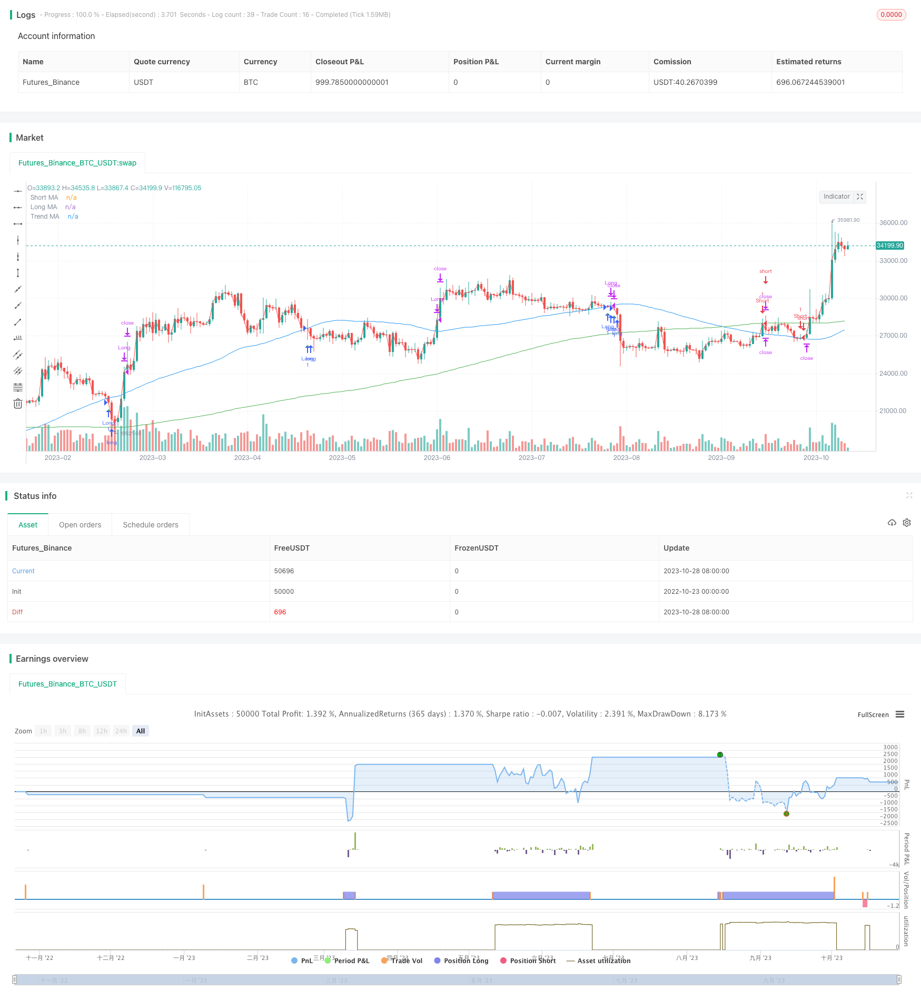

> Name

Golden-Cross-Death-Cross-Moving-Average-Trading-Strategy
> Author

ChaoZhang

> Strategy Description



[trans]

Overview: This strategy is based on three moving averages with different periods to achieve golden cross and dead cross trading. Go long when the short-period moving average crosses the long-period moving average, and go short when the short-period moving average crosses below the long-period moving average. At the same time, combine the long-term trend moving average to determine the trend direction.
Strategy principle:
1. Define three moving averages, namely short-term average, long-term average and trend average. The short-term moving average period is 20, the long-term moving average period is 200, and the trend moving average period is 50.
2. When the short-term moving average crosses the long-term moving average, a buy signal is generated, and when the short-term moving average crosses below the long-term moving average, a sell signal is generated.
3. Check at the same time whether the short-term moving average and the long-term moving average are above the trend moving average. If not, filter the signal. This avoids going against the trend.
4. Stop loss and take profit are set to a certain proportion of the entry price, and the parameters can be optimized according to the actual situation.
5. Draw the intersection point of the moving average to assist in observing the entry timing.
Advantage analysis:
1. The strategic ideas are simple and intuitive, easy to understand and implement.
2. Able to effectively capture short- and medium-term trends and follow the trend.
3. Combined with trend moving averages, signals can be further filtered to avoid counter-trend operations.
4. By adjusting the parameters of the three moving averages, it can adapt to the characteristics of different markets.
5. You can customize stop-loss and take-profit parameters to control risks.
Risk analysis:
1. If the market fluctuates sharply, it may lead to stop loss being trapped.
2. When the trend changes, large losses may occur.
3. Improper parameter settings may lead to frequent transactions or missed opportunities.
4. Attention needs to be paid to the impact of transaction costs.
Optimization direction:
1. The signal can be further filtered by combining volatility indicators, such as ATR.
2. Machine learning algorithms can be introduced to dynamically optimize parameters.
3. More indicators can be combined to determine the trend, such as MACD.
4. You can set a trailing stop to lock in profits.
5. The parameters of stop loss and take profit can be optimized through backtesting.
Summarize:
The overall idea of ​​this strategy is clear and easy to implement, and the trend is systematically captured through golden crosses and dead crosses. Use trend moving averages and stop loss and take profit to control risks. Parameter settings need to be optimized according to specific market conditions. More indicators can be further combined to improve results. This strategy is suitable for short- and medium-term trend trading and performs well in backtesting and demo trading. However, in real trading, you need to pay attention to prevent risks caused by being trapped and trend changes. Overall, this strategy has certain practical value.
||

## 

Overview: This strategy implements golden cross and death cross trading based on three moving averages with different periods. It goes long when the short period MA crosses above the long period MA, and goes short when the short period MA crosses below the long period MA. The trend direction is determined by the trend MA line.

Strategy Logic:

1. Define three MAs - short period MA, long period MA and trend MA. The periods are 20, 200 and 50 respectively.  

2. A buy signal is generated when the short period MA crosses above the long period MA. A sell signal is generated when the short period MA crosses below the long period MA.

3. Check if both the short and long MAs are above the trend MA. If not, the signal is filtered out to avoid trading against the trend.

4. Set stop loss and take profit as a percentage of the entry price. Optimize parameters based on backtesting. 

5. Plot the MA crossover points to visualize entry signals.

Advantages:

1. Simple and intuitive strategy logic, easy to understand and implement.

2. Can effectively capture mid-term trends and trade with the momentum. 

3. Filtering with trend MA avoids trading against the trend.

4. MA periods can be adjusted for different market conditions. 

5. Customizable stop loss and take profit to control risks.

Risks:

1. Sharp volatile moves may trigger stop loss. 

2. Larger losses when trend reverses.

3. Improper parameter tuning may lead to overtrading or missing opportunities.

4. Transaction costs need to be considered.

Enhancements:

1. Add volatility filter like ATR to avoid false signals.

2. Use machine learning to dynamically optimize parameters.

3. Add more indicators like MACD to determine trend.

4. Implement trailing stop loss to lock in profits.

5. Backtest to find optimal stop loss and take profit levels.

Conclusion:

The strategy captures trends effectively with clear logic and easy execution. Controlling risks with trend filter, stop loss and take profit. Parameter tuning requires optimization for market conditions. More indicators can improve performance. Suitable for mid-term trend trading. Performed well in backtest and demo trading. In live trading, beware of whipsaws and trend reversal risks. Has practical value overall.

[/trans]

> Strategy Arguments


|Argument|Default|Description|
|----|----|----|
|v_input_int_1|64|Long MA Length|
|v_input_int_2|true|Short MA Length|
|v_input_int_3|200|Trend MA Length|
|v_input_1|true|Long Stop Loss (%)|
|v_input_2|3|Long Take Profit (%)|
|v_input_3|true|Short Stop Loss (%)|
|v_input_4|3|Short Take Profit (%)|


> Source (PineScript)

``` pinescript
/*backtest
start: 2022-10-23 00:00:00
end: 2023-10-29 00:00:00
period: 1d
basePeriod: 1h
exchanges: [{"eid":"Futures_Binance","currency":"BTC_USDT"}]
*/

//@version=5
strategy("XAU M15", overlay=true)

// Define input parameters
long_length = input.int(64, title="Long MA Length")
short_length = input.int(1, title="Short MA Length")
trend_length = input.int(200, title="Trend MA Length")

// Calculate moving averages
long_ma = ta.sma(close, long_length)
short_ma = ta.sma(close, short_length)
trend_ma = ta.sma(close, trend_length)

// Plot moving averages on chart
plot(long_ma, color=color.blue, title="Long MA")
plot(short_ma, color=color.red, title="Short MA")
plot(trend_ma, color=color.green, title="Trend MA")

// Entry conditions
enterLong = ta.crossover(long_ma, short_ma) and long_ma > trend_ma and short_ma > trend_ma
enterShort = ta.crossunder(long_ma, short_ma) and long_ma < trend_ma and short_ma < trend_ma

if (enterLong)
    strategy.entry("Long", strategy.long)

if (enterShort)
    strategy.entry("Short", strategy.short)

// Exit conditions
exitLong = ta.crossunder(long_ma, short_ma)
exitShort = ta.crossover(long_ma, short_ma)

if (exitLong)
    strategy.close("Long")

if (exitShort)
    strategy.close("Short")

// Set stop loss and take profit levels
long_stop_loss_percentage = input(1, title="Long Stop Loss (%)") / 100
long_take_profit_percentage = input(3, title="Long Take Profit (%)") / 100

short_stop_loss_percentage = input(1, title="Short Stop Loss (%)") / 100
short_take_profit_percentage = input(3, title="Short Take Profit (%)") / 100

strategy.exit("Take Profit/Stop Loss", "Long", stop=close * (1 - long_stop_loss_percentage), limit=close * (1 + long_take_profit_percentage))
strategy.exit("Take Profit/Stop Loss", "Short", stop=close * (1 + short_stop_loss_percentage), limit=close * (1 - short_take_profit_percentage))

plotshape(series=enterLong, title="Buy Entry", location=location.belowbar, color=color.green, style=shape.triangleup, size=size.tiny)
plotshape(series=enterShort, title="Sell Entry", location=location.abovebar, color=color.red, style=shape.triangledown, size=size.tiny)

```

> Detail

https://www.fmz.com/strategy/430569

> Last Modified

2023-10-30 14:42:09
