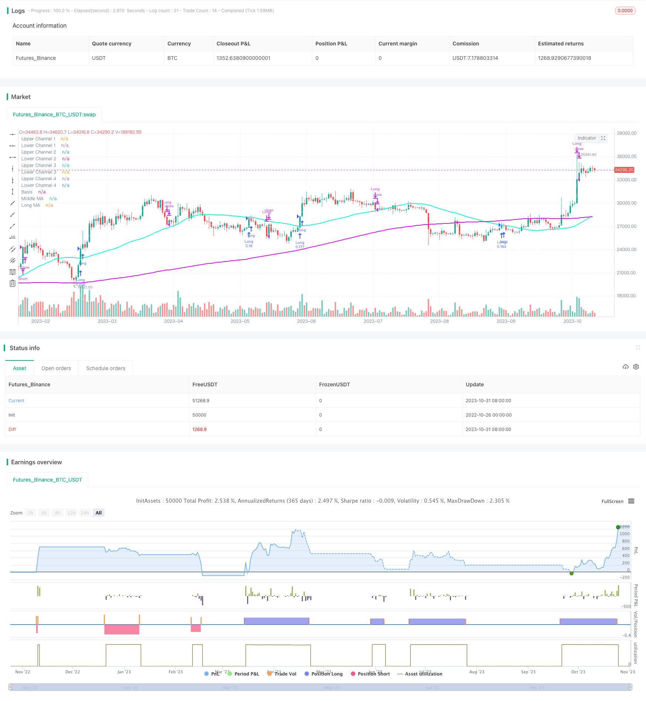

> Name

Golden-Cross-Keltner-Channel-Trend-Following-Strategy
> Author

ChaoZhang

> Strategy Description


[trans]


## Overview
The Golden Cross Celtic Channel trend following strategy is a strategy that only trades in the direction of the trend. It combines moving average golden crosses and Celtic channels as entry signals to capture the direction of the trend.
## Principle
This strategy uses two moving averages, namely the short-term moving average and the long-term moving average, to form a golden cross and a death cross to determine the trend direction. At the same time, it draws the upper and lower rails of the Celtic channel using user-defined multiples, generating trading signals when price breaks out of the channel.
Specifically, the strategy first determines whether the long-term moving average is above the short-term moving average. If so, it is a golden cross and the trend is upward; if the short-term moving average is below the long-term moving average, it is a death cross and the trend is downward.
On the basis of trend judgment, if the price breaks through the upper track, a long signal is generated; if the price falls below the lower track, a short signal is generated. Users can adjust the moving average period and channel width by themselves, thereby adjusting the parameters of the strategy.
After entering the market, the strategy uses the user-defined take-profit and stop-loss ATR multiples to set the take-profit and stop-loss levels. At the same time, the strategy also provides additional breakthrough take-profit and stop-loss conditions, allowing for more flexible position control.
## Advantage Analysis
This strategy combines the advantages of trend tracking and channel breakthroughs, and can effectively judge market trends and capture trend opportunities. The specific advantages are as follows:
1. Using golden cross to determine the trend direction can effectively filter out noise transactions that do not conform to the general trend.
2. Celtic channel breakthrough combined with trend direction judgment can improve the timing accuracy of entering the market.
3. The stop-profit and stop-loss mechanism can lock in profits and actively control risks.
4. Strategy parameters can be flexibly adjusted and suitable for different varieties and market environments.
5. You can do both long and short positions at the same time to expand the applicable scope of the strategy.
## Risk Analysis
Although this strategy has many advantages, there are certain risks to be aware of:
1. There is a certain risk of missing the reversal opportunity.
2. If the general trend changes, there may be a risk of losses against the trend.
3. Improper parameter settings may lead to too loose or too frequent transactions.
4. A certain amount of overnight risk is required.
5. There is a certain risk of curve fitting.
In this regard, risks can be reduced through parameter optimization, timely adjustment of the moving average cycle, or appropriate reduction of position size.
## Optimization ideas
There is room for further optimization of this strategy:
1. You can consider adding more judgment indicators to form a multi-factor model to improve the accuracy of the strategy. For example, add MACD, RSI, etc.
2. Parameters can be optimized based on machine learning to make them more consistent with different market environments.
3. You can consider dynamically adjusting the stop-profit and stop-loss conditions to pursue greater returns while ensuring profits.
4. The position size can be dynamically adjusted according to changes in volatility.
5. Study the parameter preferences of different varieties and formulate parameter combinations suitable for different varieties.
6. Add a mechanism to reduce transaction frequency to reduce the impact of transaction rates.
## Summarize
The Golden Cross Celtic Channel trend following strategy is generally a relatively stable and reliable trend following strategy. It combines the advantages of trend judgment and channel breakthroughs to effectively identify the market trend direction and select high-probability trading opportunities. Through parameter optimization and mechanism improvement, this strategy can become a powerful quantitative trading tool.
||

## Overview

The Golden Cross Keltner Channel Trend Following Strategy is a strategy that only trades in the direction of the trend. It combines the moving average golden cross and Keltner Channel as entry signals to capture the trend direction.

## Principle 

This strategy uses two moving averages, a short-term and a long-term moving average, to form golden crosses and death crosses to determine the trend direction. At the same time, it uses user-defined multiples to plot the upper and lower rails of the Keltner Channel and generate trading signals when prices break through the channel.

Specifically, the strategy first checks if the long-term moving average is above the short-term moving average, indicating a golden cross and an upward trend. If the short-term MA is below the long-term MA, it is a death cross, indicating a downward trend.

Based on the trend determination, if the price breaks above the upper rail, a long signal is generated. If the price breaks below the lower rail, a short signal is generated. Users can adjust the MA periods and channel width to customize the strategy parameters.

After entry, the strategy uses user-defined ATR multiples for take-profit and stop-loss. It also provides additional break-even and stop-loss conditions for more flexible position control.

## Advantage Analysis

This strategy combines the advantages of trend following and channel breakouts, enabling effective trend identification and opportunity capturing. The main advantages are:

1. Golden cross filters out false signals not aligned with the major trend. 

2. Channel breakout with trend direction improves entry accuracy.

3. Take-profit and stop-loss preserve profits and control risks.

4. Flexible parameter adjustments suit different products and environments. 

5. Goes both long and short, expanding applicability.

## Risk Analysis

Despite the advantages, some risks need attention:

1. Missing reversal opportunities. 

2. Trend changes may lead to losses.

3. Improper parameters may cause over-trading or sparse trading.

4. Overnight risk exists. 

5. Curve fitting risk.

Solutions include parameter optimization, timely MA period adjustment, and position sizing control.

## Optimization Directions

There is room for further improvements:

1. Adding more indicators to build a multi-factor model and improve accuracy. E.g. MACD, RSI.

2. Parameter optimization via machine learning for market adaptability.

3. Dynamic take-profit and stop-loss rules to balance profitability and reward.

4. Dynamic position sizing based on volatility.

5. Research optimal parameters for different products. 

6. Reduce trading frequency to minimize fees.

## Conclusion

The Golden Cross Keltner Channel Trend Following Strategy is generally a stable and reliable trend following system. By combining trend filtering and channel breakouts, it identifies high-probability opportunities aligned with the trend direction. Further optimizations and enhancements can make it a robust trading framework.

[/trans]

> Strategy Arguments


|Argument|Default|Description|
|----|----|----|
|v_input_1|21|MA Length|
|v_input_2|true|Entry ATR|
|v_input_3|4|Profit Taker|
|v_input_4|-1|Exit ATR|
|v_input_string_1|0|Moving Average Type: SMA|EMA|WMA|
|v_input_5|true|Long Positions|
|v_input_6|true|Enable Short Positions|
|v_input_7|50|Short MA for Golden Cross|
|v_input_8|200|Long MA for Golden Cross|
|v_input_9|true|Enable Long Profit Taker|
|v_input_10|true|Enable Long Stop|
|v_input_11|true|Enable Short Profit Taker|
|v_input_12|true|Enable Short Stop|
|v_input_13|true|Enable Take Profit Condition|


> Source (PineScript)

``` pinescript
/*backtest
start: 2022-10-26 00:00:00
end: 2023-11-01 00:00:00
period: 1d
basePeriod: 1h
exchanges: [{"eid":"Futures_Binance","currency":"BTC_USDT"}]
*/

// This source code is subject to the terms of the Mozilla Public License 2.0 at https://mozilla.org/MPL/2.0/
// © OversoldPOS

//@version=5
// strategy("Keltner Channel Strategy by OversoldPOS", overlay=true,initial_capital = 100000,default_qty_type = strategy.percent_of_equity,default_qty_value = 10, commission_type = strategy.commission.cash_per_order, commission_value = 7)

// Parameters
length = input(21, title="MA Length")
Entrymult = input(1, title="Entry ATR")
profit_mult = input(4, title="Profit Taker")
exit_mult = input(-1, title="Exit ATR")

// Moving Average Type Input
ma_type = input.string("SMA", title="Moving Average Type", options=["SMA", "EMA", "WMA"])

// Calculate Keltner Channels for different ATR multiples
atr_value = ta.atr(length)

basis = switch ma_type
    "SMA" => ta.sma(close, length)
    "EMA" => ta.ema(close, length)
    "WMA" => ta.wma(close, length)
 

//
EntryKeltLong = basis + Entrymult * ta.atr(10)
EntryKeltShort = basis - Entrymult * ta.atr(10)
upper_channel1 = basis + 1 * ta.atr(10)
lower_channel1 = basis - 1 * ta.atr(10)
upper_channel2 = basis + 2 * ta.atr(10)
lower_channel2 = basis - 2 * ta.atr(10)
upper_channel3 = basis + 3 * ta.atr(10)
lower_channel3 = basis - 3 * ta.atr(10)
upper_channel4 = basis + 4 * ta.atr(10)
lower_channel4 = basis - 4 * ta.atr(10)

// Entry condition parameters
long_entry_condition = input(true, title="Long Positions")
short_entry_condition = input(true, title="Enable Short Positions")

// Additional conditions for long and short entries
is_long_entry = ta.ema(close, 20) > ta.ema(close, 50)
is_short_entry = ta.ema(close, 20) < ta.ema(close, 50)

// Additional conditions for long and short entries
MAShort =  input(50, title="Short MA for Golden Cross")
MALong =  input(200, title="Long MA for Golden Cross")
is_long_entry2 = ta.ema(close, MAShort) > ta.ema(close, MALong)
is_short_entry2 = ta.ema(close, MAShort) < ta.ema(close, MALong)

// Exit condition parameters
long_exit_condition1_enabled = input(true, title="Enable Long Profit Taker")
long_exit_condition2_enabled = input(true, title="Enable Long Stop")
short_exit_condition1_enabled = input(true, title="Enable Short Profit Taker")
short_exit_condition2_enabled = input(true, title="Enable Short Stop")

// Take Profit condition parameters
take_profit_enabled = input(true, title="Enable Take Profit Condition")

Takeprofit = basis + profit_mult * atr_value
STakeprofit = basis - profit_mult * atr_value

// Long entry condition
long_condition = long_entry_condition and ta.crossover(close, EntryKeltLong) and is_long_entry2

// Short entry condition
short_condition = short_entry_condition and ta.crossunder(close, EntryKeltShort) and is_short_entry2

// Exit conditions
long_exit_condition1 = long_exit_condition1_enabled and close > Takeprofit
long_exit_condition2 = long_exit_condition2_enabled and close < basis + exit_mult * atr_value
short_exit_condition1 = short_exit_condition1_enabled and close < STakeprofit
short_exit_condition2 = short_exit_condition2_enabled and close > basis - exit_mult * atr_value

// Strategy logic
if (long_condition)
    strategy.entry("Long", strategy.long)
if (short_condition)
    strategy.entry("Short", strategy.short)

if (long_exit_condition1 or long_exit_condition2)
    strategy.close("Long")

if (short_exit_condition1 or short_exit_condition2)
    strategy.close("Short")

// Moving Averages
var float MA1 = na
var float MA2 = na

if (ma_type == "SMA")
    MA1 := ta.sma(close, MAShort)
    MA2 := ta.sma(close, MALong)
else if (ma_type == "EMA")
    MA1 := ta.ema(close, MAShort)
    MA2 := ta.ema(close, MALong)
else if (ma_type == "WMA")
    MA1 := ta.wma(close, MAShort)
    MA2 := ta.wma(close, MALong)

// Plotting Keltner Channels with adjusted transparency
transparentColor = color.rgb(255, 255, 255, 56)

plot(upper_channel1, color=transparentColor, title="Upper Channel 1")
plot(lower_channel1, color=transparentColor, title="Lower Channel 1")
plot(upper_channel2, color=transparentColor, title="Upper Channel 2")
plot(lower_channel2, color=transparentColor, title="Lower Channel 2")
plot(upper_channel3, color=transparentColor, title="Upper Channel 3")
plot(lower_channel3, color=transparentColor, title="Lower Channel 3")
plot(upper_channel4, color=transparentColor, title="Upper Channel 4")
plot(lower_channel4, color=transparentColor, title="Lower Channel 4")
plot(basis, color=color.white, title="Basis")
plot(MA1, color=color.rgb(4, 248, 216), linewidth=2, title="Middle MA")
plot(MA2, color=color.rgb(220, 7, 248), linewidth=2, title="Long MA")

```

> Detail

https://www.fmz.com/strategy/430843

> Last Modified

2023-11-02 14:31:10
