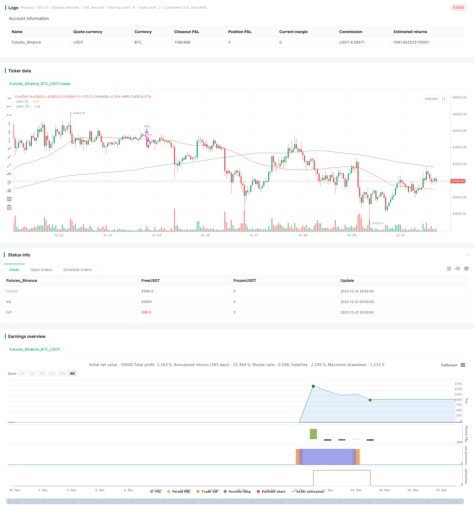

> Name

A trend following strategy Golden-Cross-Moving-Average-Strategy based on moving averages
> Author

ChaoZhang

> Strategy Description


 [trans]
## Overview
The Golden Cross Moving Average strategy is a trend following strategy based on moving averages. This strategy determines the trend direction of the market by calculating moving averages of different periods and generates trading signals accordingly. Specifically, this strategy calculates three moving averages: the 50-day moving average, the 100-day moving average, and the 200-day moving average. When the short-term moving average breaks through the long-term moving average from bottom to top, a buy signal is generated; when the short-term moving average falls below the long-term moving average from top to bottom, a sell signal is generated.
## Strategy Principle
The core signal for this strategy comes from the golden cross of the moving averages. The so-called golden cross refers to the short-term moving average breaking through the long-term moving average from bottom to top, indicating that the market has entered a bullish trend. This strategy uses the 50-day moving average as the short-term moving average and the 200-day moving average as the long-term moving average, and waits for the golden cross between the two moving averages to buy; uses the 50-day moving average as the short-term moving average, and the 100-day moving average as the long-term moving average, and waits for the short-term moving average to cross below the long-term moving average to sell, completing a trading cycle.
By setting moving averages with different parameters, you can better capture the turning points of the market trend. The short-term moving average can respond to price changes more quickly and reflect the latest price trends; the long-term moving average is insensitive to short-term fluctuations and can determine the main trend direction. A golden cross is formed between the two moving averages, which can effectively confirm the trend turning point and generate trading signals.
## Strategic advantage analysis
This strategy has the following advantages:
1. Strong trend following ability. The double moving average strategy can follow the main market trends, avoid being disturbed by short-term market noise, and has strong trend tracking capabilities.
2. The trading signals are clear. The strategy completely relies on the relationship between moving averages to form trading signals. The signal generation and interpretation are very clear and direct, avoiding subjective judgment errors.
3. Easy to implement backtesting. As a typical trend following strategy, this strategy can quickly implement backtesting and evaluate the strategy effect.
4. Large space for expansion. Moving average parameters, trading varieties, time periods, etc. can all be optimized and expanded to find better parameter combinations.
## Risk Analysis
There are also some risks with this strategy:
1. Miss the turning point. The moving average is lagging in nature and cannot accurately locate important turning points, which may result in missing the best buying opportunity.
2. Generate false long signals. There may be multiple golden cross false signals in the short term, causing investors to misjudge.
3. Risk of emergencies. Major emergencies may cause violent market fluctuations, and moving average strategies are difficult to deal with such abnormal situations.
4. Risk of market shock. When the market is in a state of wide fluctuation for a long time, this strategy may produce too many invalid signals, resulting in frequent operations but weak overall returns.
These risks can be avoided by adjusting the moving average parameters, setting a stop-loss strategy, or using it in combination with other indicators.
## Optimization direction
This strategy can be optimized from the following aspects:
1. Optimize the moving average parameters and find the best parameter combination. More period parameters can be tested, and adaptive moving averages such as three-exponential moving averages can also be introduced.
2. Add a stop loss strategy to control single losses. Trailing stop loss or proportional stop loss can avoid further losses.
3. Filter signals in combination with other indicators. Double moving average signals can be combined with indicators such as trading volume and volatility to ensure that transactions are only generated when the trend is strong.
4. Use machine learning technology for strategy optimization. The algorithm automatically searches for better parameter combinations and trading rules, and continuously iteratively improves strategy profitability.
## Summarize
The golden cross moving average strategy determines the main trend direction of the market by calculating the relationship between the two moving averages to capture medium and long-term trend opportunities. The advantage of this strategy is that the signal judgment rules are clear, easy to implement and optimize, and is suitable for medium and long-term investors. We should also pay attention to the hysteresis of this strategy and possible false signals, and take combination and optimization measures to avoid potential risks.
||

## Overview

The Golden Cross Moving Average strategy is a trend-following strategy based on moving averages. It determines the market trend direction by calculating moving averages of different periods and generates trading signals accordingly. Specifically, it calculates the 50-day, 100-day, and 200-day moving averages. When the short-term moving average crosses above the long-term moving average, a buy signal is generated. When the short-term moving average crosses below the long-term moving average, a sell signal is generated.

## Strategy Logic

The core signal of this strategy comes from the golden cross of moving averages. The so-called golden cross refers to the short-term moving average crossing above the long-term moving average, indicating the market is entering a bullish trend. This strategy uses the 50-day moving average as the short-term MA and the 200-day moving average as the long-term MA. It buys when the two MAs form a golden cross and sells when the 50-day MA crosses below the 100-day MA to complete a trading cycle. 

By setting moving averages of different periods, we can better capture the inflection points of market trends. The short-term MA responds faster to price changes and reflects recent price movements. The long-term MA is insensitive to short-term fluctuations and can determine the primary trend direction. The golden cross formed between the two MAs can effectively confirm the trend reversal and generate trading signals.

## Advantage Analysis  

The advantages of this strategy are:

1. Strong trend following capability. The dual moving average strategy can follow the primary market trend, avoid being disturbed by short-term market noise, and has strong trend-following capability.

2. Clear trading signals. The strategy relies entirely on the relationship between moving averages to generate trading signals, making signal generation and interpretation very direct and unambiguous, avoiding subjective judgment errors.

3. Easy backtesting implementation. As a typical trend-following strategy, it can be quickly implemented for backtesting to evaluate the strategy's effectiveness. 

4. Great scalability. Parameters like moving average periods, trading products, and time frames can all be optimized and expanded to find better parameter combinations.

## Risk Analysis

The strategy also has some risks:

1. Missing inflection points. The inherent lagging of moving averages cannot accurately locate important inflection points and may miss the best buying opportunities.

2. Generating false bullish signals. There may be multiple golden crosses forming false signals in the short term, causing investors to make wrong judgements. 

3. Risks of sudden events. Major sudden events can cause drastic market fluctuations that moving average strategies may fail to cope with. 

4. Risks of range-bound markets. When the market is range-bound for an extended period, the strategy may generate excessive invalid signals, resulting in frequent trading but overall meager profitability.

These risks can be mitigated by adjusting moving average parameters, setting stop losses, or combining with other indicators. 

## Optimization Directions   

The strategy can be optimized in the following aspects:

1. Optimize moving average parameters to find the best combinations. More cycle parameters can be tested. Adaptive moving averages like triple exponential moving averages can also be introduced.

2. Add stop loss strategies to control single loss. Both trailing stop loss and proportional stop loss can avoid further loss expansion.

3. Combine other indicators to filter signals. Dual moving average signals can be combined with indicators like volume and volatility to ensure signals are only generated when the trend is strong.

4. Utilize machine learning techniques to optimize the strategy. The algorithms can automatically search for more optimal parameter sets and trading rules to continuously improve the strategy's profitability.

## Conclusion

The Golden Cross Moving Average strategy determines the primary market trend direction by calculating the relationship between dual moving averages, trying to capture mid-to-long term trend opportunities. The advantages are clear signal rules that are easy to implement and optimize. It is suitable for mid-to-long term investors. We should also note the lagging limitation and possible false signals of this strategy and take combination and optimization measures to mitigate potential risks.

[/trans]


> Source (PineScript)

``` pinescript
/*backtest
start: 2023-12-01 00:00:00
end: 2023-12-31 23:59:59
period: 1h
basePeriod: 15m
exchanges: [{"eid":"Futures_Binance","currency":"BTC_USDT"}]
*/

//@version=4
strategy(title="MA Cross", overlay=true)
short = sma(close, 50)
short1 = sma(close[5], 50)
medium = sma(close, 100)
long = sma(close, 200)
long1 = sma(close[5], 200)

plot(short, color = color.red)
plot(long, color = color.green)
trendUp = (cross(short, long) and (long1 > short1) ? true : false)
x = if (trendUp)
    (long1 - short1)*5
else
    0
    
//start     = timestamp(2000, 01, 01, 00, 00)        // backtest start window
//finish    = timestamp(2020, 02, 09, 23, 59)        // backtest finish window
//window()  => time >= start and time <= finish ? true : false  

//strategy.entry("long", true, 1000, limit = high, when = window() and trendUp)
//strategy.close("long", when = window() and close < medium)

strategy.entry("long", true, 1, limit = high, when = trendUp)
strategy.close("long", when = close < medium)


```

> Detail

https://www.fmz.com/strategy/440074

> Last Modified

2024-01-26 14:23:55
