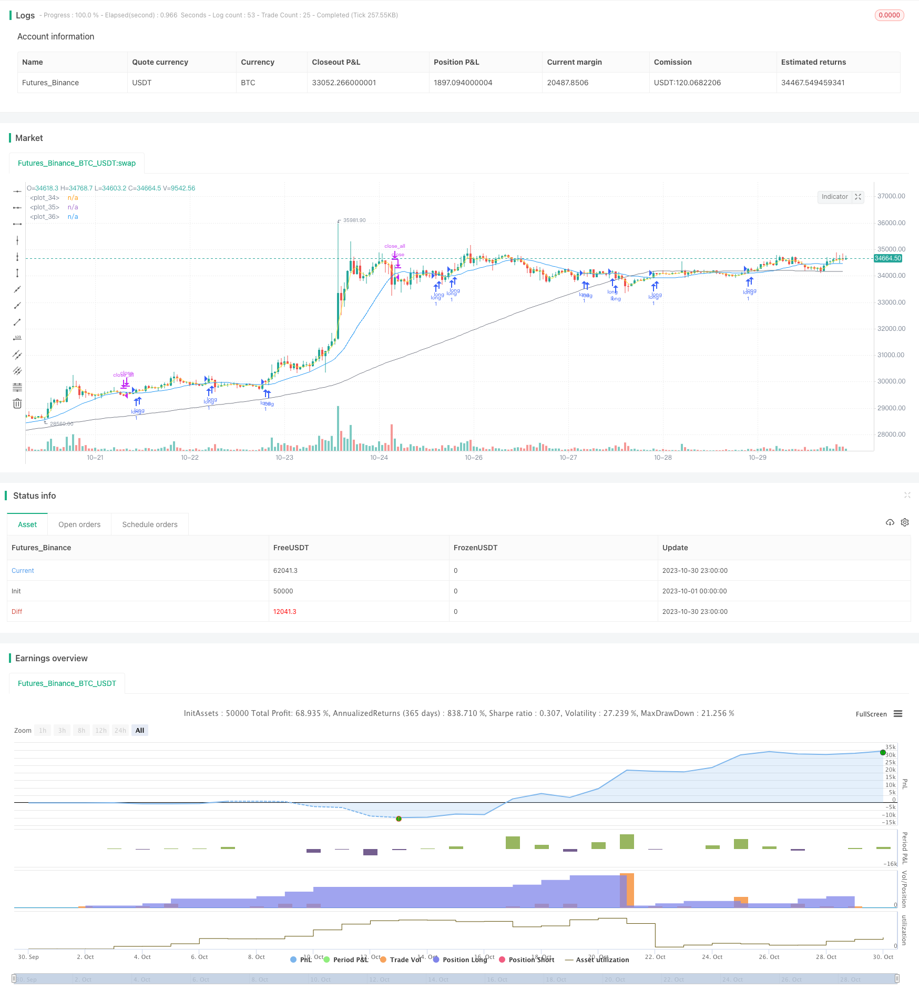

> Name

Golden-Cross-Trend-Following-Strategy
> Author

ChaoZhang

> Strategy Description



[trans]

## Overview
This strategy determines the entry opportunity by calculating the golden cross of the short-term moving average and the long-term moving average, and sets a stop loss point to exit the position. It is a typical trend following strategy. This strategy is suitable for markets with an obvious upward trend. It can follow the trend, ride on the upward trend, and stop losses in time when the trend reverses.
## Strategy Principle
This strategy mainly determines the market trend by calculating the short-term moving average and the long-term moving average and observing their intersection. The specific logic is as follows:
1. Calculate the 3-day simple moving average short_ma as the short-term moving average
2. Calculate the 19-day simple moving average long_ma as the long-term moving average
3. When the short-term moving average crosses the long-term moving average, a long signal is sent and a long position is entered.
4. When the price rises and exceeds the entry price * (1 + stop loss range %), close all positions
5. When the short-term moving average crosses the long-term moving average, a short selling signal is issued and a short position is entered.
6. Limit the running time range of the strategy by conducting backtests within a specific date range
7. By calculating the 100-day simple moving average as a general trend indicator, trade only when the general trend is upward.
This strategy makes full use of the golden cross principle of the moving average. When the index continues to rise, when the short-term moving average crosses the long-term moving average, it enters a long position, which can effectively capture the opportunities in the trend; when the short-term moving average crosses below the long-term moving average, exit the long position and enter a short position, which can effectively control risks.
## Advantage Analysis
This strategy has the following advantages:
1. The strategic idea is clear and easy to understand, and the trend direction can be judged through the crossing of moving averages, which is easy to master.
2. The entry judgment rules are simple and effective, allowing you to follow the trend and effectively control risks.
3. Set a stop loss point to lock in profits and stop losses in time when the market reverses.
4. Only trade when the general trend is upward, which can filter out most false signals during shock periods.
5. The moving average parameters can be customized to adapt to the characteristics of different markets.
6. The backtest time range can be set and verification can be conducted for a specific time period.
## Risk Analysis
There are also some risks with this strategy:
1. The moving average strategy is sensitive to parameters, and different parameter settings will affect the performance of the strategy.
2. Curve fitting is only based on historical data and cannot handle abnormal situations.
3. Failure to effectively handle price gaps may lead to exceeding the stop loss point.
4. It is easy to get trapped in the volatile market, so you need to set a reasonable stop loss point.
5. It is only suitable for market environments with obvious trends and is not suitable for sideways market fluctuations.
6. The choice of backtest time range will affect the strategy verification results.
## Optimization direction
This strategy can be optimized from the following aspects:
1. Try different parameter combinations to find the best parameters, such as the number of moving average periods, etc.
2. Add other technical indicators for comprehensive judgment, such as MACD, Bollinger Bands, etc., to improve the decision-making effect.
3. Set dynamic trailing stop to better control risks.
4. Optimize the entry and stop loss logic, such as considering entering the market by breaking through the previous high point.
5. Test different market environment data and evaluate the stability of the strategy.
6. Consider adding models such as machine learning for parameter optimization or signal judgment.
7. Added handling of abnormal situations such as price gapping and stop-loss cover.
## Summarize
This strategy realizes the capture of the upward trend through the simple and effective moving average crossover principle, sets stop loss points to control risks, and can obtain better returns in markets with obvious trends. However, this strategy also has certain limitations, and optimization testing needs to continue to make the strategy more stable and efficient. Overall, the strategy is clear, easy to understand and implement, and is suitable for beginners to learn.
||

## Overview

This strategy generates trading signals based on the golden cross of short-term and long-term moving averages to determine entry points, and sets stop loss points to exit positions. It is a typical trend following strategy. It is suitable for markets with obvious upward trends, allowing it to follow the trend and profit from upward momentum, and exit promptly when the trend reverses.

## Strategy Logic

The strategy mainly uses the crossover of short-term and long-term moving averages to determine market trend. The logic is as follows:

1. Calculate 3-day simple moving average short_ma as the short-term moving average.

2. Calculate 19-day simple moving average long_ma as the long-term moving average.

3. When short_ma crosses above long_ma, a long signal is generated. 

4. When price rises above entry price * (1 + stop loss %), close all positions. 

5. When short_ma crosses below long_ma, a short signal is generated.

6. Backtest within a specific date range to limit the strategy's operation period.

7. Trade only when the 100-day moving average trend_ma suggests an upward trend.

The strategy utilizes the golden cross of moving averages. During a sustained uptrend, long signals generated when short_ma crosses above long_ma allow it to capture opportunities. Short signals when short_ma crosses below long_ma help manage risks.

## Advantage Analysis 

The advantages of this strategy:

1. Simple and easy to understand logic based on moving average crossovers.

2. Clear entry and exit rules that follow the trend and manage risks.

3. Stop loss to lock in profits when trend reverses.

4. Only trade when overall trend is up to avoid false signals.

5. Customizable moving average periods adaptable to different markets. 

6. Backtest over specific periods allows validation.

## Risk Analysis

The risks of this strategy:

1. Sensitive to parameter tuning, different settings affect performance.

2. Curve fitted to historical data, ineffective in anomalies.

3. Unable to handle price gaps, risks exceeding stop loss. 

4. Prone to being whipsawed in ranging markets.

5. Only works in obvious trending markets, not for sideways.

6. Backtest period selection influences results.

## Enhancement Opportunities

The strategy can be improved in the following aspects:

1. Test different parameter sets to find optimum values.

2. Incorporate other indicators like MACD, Bollinger Bands to improve decisions.

3. Use dynamic trailing stop loss to better control risks.

4. Optimize entry, exit logic, like breakout entry.

5. Test robustness across different market conditions. 

6. Explore machine learning for parameter tuning and signal generation.

7. Add handling of price gaps and stop loss whipsaw scenarios.

## Conclusion

This simple and effective strategy captures uptrends using moving average crosses and manages risk via stop loss. It performs well in strong trending markets but has limitations. Further optimization and testing is needed to improve robustness. Overall it has clear logic, is easy to understand and implement, suitable for beginners to learn.

[/trans]

> Strategy Arguments


|Argument|Default|Description|
|----|----|----|
|v_input_int_1|3|단기 이평|
|v_input_int_2|19|장기 이평|
|v_input_float_1|3|최소수익률%|
|v_input_int_3|100|(?추세 이평) 추세 이평|
|v_input_bool_1|true|추세용 이평 사용|
|v_input_bool_2|true|(?기간 백테스트)특정 기간 백테스트|
|v_input_1|timestamp(1 Jan 2021)|시작날짜|
|v_input_2|timestamp(1 Jan 2022)|종료날짜|

> Source (PineScript)

``` pinescript
/*backtest
start: 2023-10-01 00:00:00
end: 2023-10-31 00:00:00
period: 1h
basePeriod: 15m
exchanges: [{"eid":"Futures_Binance","currency":"BTC_USDT"}]
*/

// This source code is subject to the terms of the Mozilla Public License 2.0 at https://mozilla.org/MPL/2.0/
// © Ta3MooChi
//@version=5
strategy("전략", overlay=true,process_orders_on_close = true, pyramiding = 100)

short_ma = ta.sma(close,input.int(3, "단기 이평", minval = 1))
long_ma = ta.sma(close, input.int(19,"장기 이평", minval = 1))

trend_ma = ta.sma(close, input.int(100," 추세 이평", minval = 20, group = "추세 이평"))
up_trend = (trend_ma > trend_ma[1])
use_trend_ma = input.bool(true, title = "추세용 이평 사용", group = "추세 이평" )
inTrendMa = not use_trend_ma or up_trend

useDateFilter = input.bool(true, title = "특정 기간 백테스트", group = "기간 백테스트")
backtestStartDate = input(timestamp("1 Jan 2021"), title = "시작날짜", group = "기간 백테스트")
backtestEndDate = input(timestamp("1 Jan 2022"), title = "종료날짜", group = "기간 백테스트")
inTradeWindow = true

longStopPerc = 1 + input.float(3, "최소수익률%", minval = 1)*0.01

longcondition = ta.crossover(short_ma, long_ma)
shortcondition = ta.crossunder(short_ma, long_ma)

if (longcondition) and inTradeWindow and inTrendMa
    strategy.entry("long", strategy.long)

if (shortcondition) and (close > strategy.position_avg_price*longStopPerc) and inTradeWindow
    strategy.close_all()

if not inTradeWindow and inTradeWindow[1]
    strategy.cancel_all()
    strategy.close_all(comment = "매매 종료")

plot(short_ma,color = color.yellow)
plot(long_ma,color = color.blue)
plot(trend_ma,color = color.gray)
    


```

> Detail

https://www.fmz.com/strategy/430773

> Last Modified

2023-11-01 17:02:14
