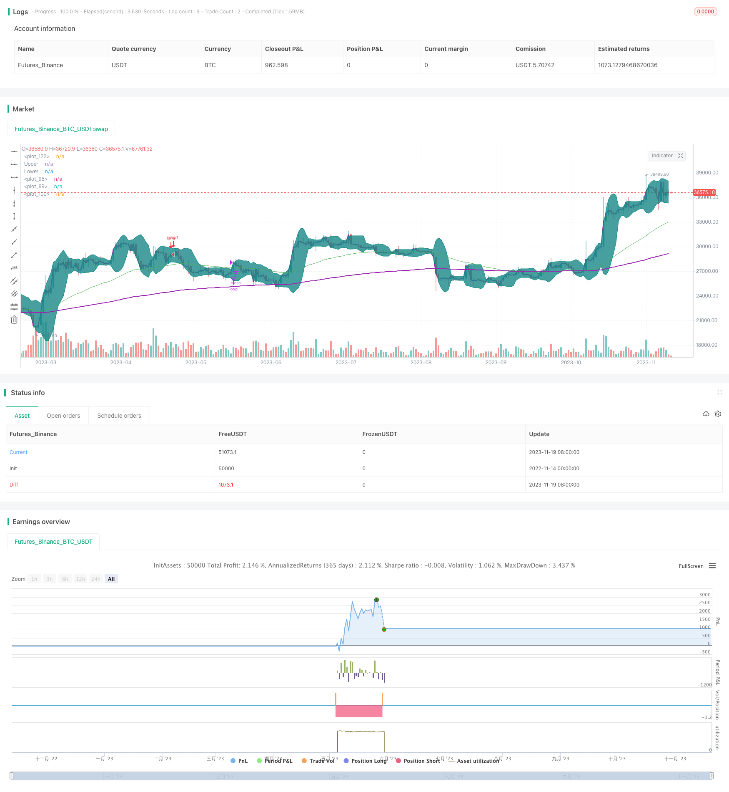

> Name

Golden-Cross-with-Bollinger-Bands-Momentum-Strategy
> Author

ChaoZhang

> Strategy Description



[trans]

## Overview
This strategy combines the moving average indicator, the Bollinger Band indicator and the volume weighted average price indicator, and it is judged to enter when the golden cross forms and the short moving average crosses the long moving average. The strategy also uses the Bollinger Bands channel to only consider entering the market when the price touches the lower Bollinger Bands band, thereby avoiding frequent entry and exit during market fluctuations.
## Strategy Principle
This strategy mainly uses moving average indicators to determine the trend direction, and uses Bollinger Bands to locate the fluctuation range and select buying points. Specifically, the strategy includes the following key rules:
1. Use the 50-day EMA and the 200-day EMA to construct a golden cross judgment system. When the fast moving average crosses the slow moving average, it is considered to be in a bullish upward trend;
2. When the price is greater than VWAP, it is considered to be in the price rising stage, which is conducive to building a long position;
3. When the price just touches or breaks through the lower Bollinger Band, it indicates that the stock price may be near the rebound point, and the opportunity is good;
4. After entering a long position, when the price exceeds the upper Bollinger Band, take profit and exit in time.
Through the combination of these rules, this strategy can choose the appropriate buying point to buy in the bull market, and set stop loss and take profit to ensure profits.
## Strategic Advantages
- Use the golden cross judgment system to determine the direction of the general trend and avoid small wins and small losses in volatile market conditions;
- The VWAP indicator can determine the direction of price fluctuations, making the selection of buying points more accurate;
- The Bollinger Band indicator determines the buying point to make the strategy more resilient, and at the same time, set stop loss and profit to lock in profits;
- Multiple indicators verify each other, making strategic judgments more accurate and reliable.
## Strategic risks and solutions
- The Golden Cross judgment system may send out false signals, so the length of the moving average period should be shortened appropriately and verified with other indicators;
- Improper setting of Bollinger Band parameters will also make the strategy ineffective. The Bollinger Band cycle and standard deviation parameters should be adjusted;
- The stop loss point setting is too loose and cannot effectively control losses. The stop loss range should be appropriately tightened to ensure that risks are controllable.
## Strategy optimization direction
- Optimize the Golden Cross moving average combination, test different moving average parameters, and find the best parameters;
- Test the Bollinger Band parameters of different periods and find the parameter combination with the best amplitude and dispersion;
- Test and optimize the stop loss range so that it can effectively control the risk without being too easily triggered.
## Summarize
This strategy comprehensively uses the moving average system, Bollinger Bands and VWAP indicators to determine the timing of entry, striking a balance between discovering opportunities and controlling risks. Through subsequent parameter optimization and rule revision, it is expected to lock in continued opportunities in the industry and market.
||

## Overview

This strategy combines moving average, Bollinger bands and volume weighted average price (VWAP) indicators. It enters long positions when the golden cross forms and the fast moving average breaks above the slow one. The strategy also utilizes the Bollinger band channel and only considers entering when the price touches the lower band, thus avoiding frequent entries and exits amid market fluctuations.

## Strategy Logic  

The core logic relies on moving averages to determine the trend direction, and Bollinger bands to locate the fluctuation range for buying signals. Specifically, it has the following key rules:  

1. Construct the golden cross system using 50-day EMA and 200-day EMA. An up trend is identified when the fast EMA crosses above the slow EMA.  

2. When the price is above VWAP, it indicates the price is in an upward phase which favors long positions.

3. When the price just touches or breaks the Bollinger lower band, it suggests the price may be near a rebound point thus providing a good opportunity.

4. Exit long positions with profit when the price exceeds the Bollinger upper band.

By combining these rules, the strategy is able to locate appropriate long entries in bull markets and set stop loss/profit taking to secure returns.  

## Advantages

- The golden cross system determines the major trend direction, avoiding small wins and losses amid consolidations.

- VWAP gauges the price wave direction for more precise buying signals.  

- The Bollinger bands add resilience by locating buys while setting stop loss/profit taking locks in gains.

- Multiple confirming indicators enhance reliability.

## Risks and Solutions

- The golden cross may give false signals. Fine tune the MA periods and add other confirmations.  

- Improper Bollinger parameters could render the strategy ineffective. Optimize periods and standard deviation.

- A stop loss threshold too wide fails to effectively limit losses. Tighten the stop loss range to ensure controllable risks.

## Optimization Directions   

- Optimize MA combinations by testing different parameters to find the best.  

- Test Bollinger periods and parameter sets for better bandwidth and volatility.  

- Test and tune stop loss ranges for balancing risk control and avoiding premature triggering.

## Conclusion  

This strategy strikes a balance between discovering opportunities and controlling risks by integrating MA, Bollinger and VWAP analysis for entries. Continuous fine tuning and optimization will allow it to capitalize on sector and market trends over time.

[/trans]

> Strategy Arguments


|Argument|Default|Description|
|----|----|----|
|v_input_1|true|From Day|
|v_input_2|6|From Month|
|v_input_3|2020|From Year|
|v_input_4|true|To Day|
|v_input_5|8|To Month|
|v_input_6|2020|To Year|
|v_input_7|50|fast EMA|
|v_input_8|200|slow EMA|
|v_input_9|7|BB SMA Length|
|v_input_10_close|0|BB Source: close|high|low|open|hl2|hlc3|hlcc4|ohlc4|
|v_input_11|0|strategy to use: BB|BB_percentageB|
|v_input_12|true|Stop Loss%|
|v_input_13|2|StdDev|
|v_input_14|false|Offset|


> Source (PineScript)

``` pinescript
/*backtest
start: 2022-11-14 00:00:00
end: 2023-11-20 00:00:00
period: 1d
basePeriod: 1h
exchanges: [{"eid":"Futures_Binance","currency":"BTC_USDT"}]
*/

// This source code is subject to the terms of the Mozilla Public License 2.0 at https://mozilla.org/MPL/2.0/
// © mohanee

//@version=4
strategy(title="VWAP and BB strategy [$$]", overlay=true,pyramiding=2, default_qty_value=1, default_qty_type=strategy.fixed,    initial_capital=10000, currency=currency.USD)


fromDay = input(defval = 1, title = "From Day", minval = 1, maxval = 31)
fromMonth = input(defval = 6, title = "From Month", minval = 1, maxval = 12)
fromYear = input(defval = 2020, title = "From Year", minval = 1970)
 
// To Date Inputs
toDay = input(defval = 1, title = "To Day", minval = 1, maxval = 31)
toMonth = input(defval = 8, title = "To Month", minval = 1, maxval = 12)
toYear = input(defval = 2020, title = "To Year", minval = 1970)
 
// Calculate start/end date and time condition
DST = 1 //day light saving for usa
//--- Europe
London = iff(DST==0,"0000-0900","0100-1000")
//--- America
NewYork = iff(DST==0,"0400-1300","0500-1400")
//--- Pacific
Sydney = iff(DST==0,"1300-2200","1400-2300")
//--- Asia
Tokyo = iff(DST==0,"1500-2400","1600-0100")

//-- Time In Range
timeinrange(res, sess) => time(res, sess) != 0

london = timeinrange(timeframe.period, London)
newyork = timeinrange(timeframe.period, NewYork)

startDate = timestamp(fromYear, fromMonth, fromDay, 00, 00)
finishDate = timestamp(toYear, toMonth, toDay, 00, 00)
time_cond = time >= startDate and time <= finishDate 


is_price_dipped_bb(pds,source1) =>
    t_bbDipped=false
    for i=1 to pds
        t_bbDipped:=  (t_bbDipped   or  close[i]<source1) ? true : false
        if t_bbDipped==true
            break
        else
            continue
            
    t_bbDipped


is_bb_per_dipped(pds,bbrSrc) =>
    t_bbDipped=false
    for i=1 to pds
        t_bbDipped:=  (t_bbDipped   or  bbrSrc[i]<=0) ? true : false
        if t_bbDipped==true
            break
        else
            continue
            
    t_bbDipped
    

// variables  BEGIN
shortEMA = input(50, title="fast EMA", minval=1)
longEMA = input(200, title="slow EMA", minval=1)

//BB

smaLength = input(7, title="BB SMA Length", minval=1)
bbsrc = input(close, title="BB Source")

strategyCalcOption = input(title="strategy to use", type=input.string, options=["BB", "BB_percentageB"],      defval="BB")


//addOnDivergence = input(true,title="Add to existing on Divergence")
//exitOption = input(title="exit on RSI or BB", type=input.string, options=["RSI", "BB"],      defval="BB")

//bbSource = input(title="BB  source", type=input.string, options=["close", "vwap"],      defval="close")
     
//vwap_res = input(title="VWAP Resolution", type=input.resolution, defval="session")
stopLoss = input(title="Stop Loss%", defval=1, minval=1)

//variables  END

longEMAval= ema(close, longEMA)
shortEMAval= ema(close, shortEMA)
ema200val = ema(close, 200)


vwapVal=vwap(close)


// Drawings

//plot emas
plot(shortEMAval, color = color.green, linewidth = 1, transp=0)
plot(longEMAval, color = color.orange, linewidth = 1, transp=0)
plot(ema200val, color = color.purple, linewidth = 2, style=plot.style_line ,transp=0)


//bollinger calculation 
mult = input(2.0, minval=0.001, maxval=50, title="StdDev")
basis = sma(bbsrc, smaLength)
dev = mult * stdev(bbsrc, smaLength)
upperBand = basis + dev
lowerBand = basis - dev
offset = input(0, "Offset", type = input.integer, minval = -500, maxval = 500)

bbr = (bbsrc - lowerBand)/(upperBand - lowerBand) 
//bollinger calculation 

//plot bb
//plot(basis, "Basis", color=#872323, offset = offset)
p1 = plot(upperBand, "Upper", color=color.teal, offset = offset)
p2 = plot(lowerBand, "Lower", color=color.teal, offset = offset)
fill(p1, p2, title = "Background", color=#198787, transp=95)


plot(vwapVal, color = color.purple, linewidth = 2, transp=0)


// Colour background

//barcolor(shortEMAval>longEMAval and close<=lowerBand ? color.yellow: na)
  

//longCondition=  shortEMAval > longEMAval and  close>open and  close>vwapVal
longCondition=  ( shortEMAval > longEMAval  and close>open and close>vwapVal and close<upperBand ) //and time_cond //     and  close>=vwapVal 


//Entry
strategy.entry(id="long", comment="VB LE" , long=true,  when= longCondition and ( strategyCalcOption=="BB"? is_price_dipped_bb(10,lowerBand) : is_bb_per_dipped(10,bbr)  )   and strategy.position_size<1 )   //is_price_dipped_bb(10,lowerBand))  //and strategy.position_size<1       is_bb_per_dipped(15,bbr) 


//add to the existing position
strategy.entry(id="long", comment="Add" , long=true,  when=strategy.position_size>=1 and close<strategy.position_avg_price and close>vwapVal) //and time_cond)

barcolor(strategy.position_size>=1  ? color.blue: na)


strategy.close(id="long", comment="TP Exit",   when=crossover(close,upperBand) )

//stoploss
stopLossVal =   strategy.position_avg_price * (1-(stopLoss*0.01) )
//strategy.close(id="long", comment="SL Exit",   when= close < stopLossVal)

//strategy.risk.max_intraday_loss(stopLoss, strategy.percent_of_equity)
```

> Detail

https://www.fmz.com/strategy/432765

> Last Modified

2023-11-21 12:01:25
