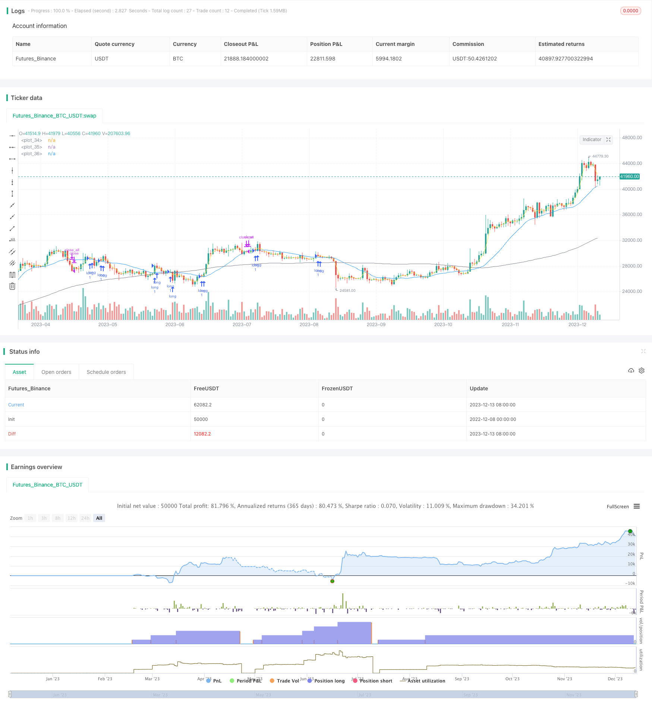

> Name

Golden-Dead-Cross-Trend-Tracking-Strategy
> Author

ChaoZhang

> Strategy Description



[trans]

## Overview
The golden cross and dead cross trend following strategy determines the timing of entry and exit by calculating the intersection of the short-term moving average and the long-term moving average. This strategy also combines large-level trend judgment, entering long positions only when the trend is upward, and actively stopping losses and exiting when the trend is downward.
## Strategy Principle
The core indicators of this strategy are the short-term moving average and the long-term moving average. Short-term lines generally choose shorter periods such as 5 days and 10 days, which can more sensitively reflect recent changes in prices. The long-term line generally chooses longer periods such as 20 days and 60 days, which can reflect the main trend of prices. When the short-term line crosses the long-term line from below, a golden cross signal is generated, which means that the market has entered a long trend; when the short-term line crosses the long-term line from above, a dead cross signal is generated, which means that the market has entered the short stage.
This strategy also uses longer period moving averages to determine the direction of large-scale trends. Only when the general trend is upward, enter the market at the golden cross opportunity to go long. After going long, profit will be taken based on the set take profit conditions. When the price rise reaches the set profit-taking point, it will take the initiative to take profit and leave the market.
In the short stage, this strategy uses the dead cross signal to stop losses. When the short-term moving average breaks through the long-term moving average from top to bottom to form a dead cross, if the position has already made a certain degree of profit at this time, it will choose to stop the loss and leave the market to eliminate the risks brought by the short position.
## Strategic Advantages
The rules for judging entry and exit of the Golden Cross and Dead Cross strategy are simple and clear, easy to understand and implement. At the same time, combined with trend judgment, it can reduce the risk of being trapped in trend trading. The strategy has the following advantages:
**1. Accurate entry and strong tracking**
When the golden cross is formed, it means that the short-term market has entered the long position, and the price may have a wave of breakthroughs and increases. Entering the market at this time can accurately capture possible breakthrough opportunities in the market. At the same time, only enter the market when the general trend is upward to avoid being trapped by going long against the trend.
**2. The profit stop method is reasonable and guarantees part of the profit**
Set a fixed proportion of the take-profit range, and take the initiative to take profit when it is reached. This profit-taking method is simple and practical, and can leave the market in time after the market rises sharply and realize partial profits.
**3. Stop losses promptly and control risks**
When the short trend arrives, use the dead cross signal to determine the trend reversal and choose a stop loss. Timely stop loss can minimize the losses caused by the short position and is effective for risk control.
## Strategy Risk
The main risks of this strategy come from two aspects:
**1. Risk of misjudgment of golden cross and dead cross signals**
In a complex market environment, relying only on simple indicators such as golden cross and dead cross to judge long and short may cause certain false signals. Price Action's pattern judgment in complex market conditions is more accurate and three-dimensional than indicator signals.
**2. Risks caused by improper setting of take-profit and stop-loss points**
Fixed ratio take-profit and stop-loss conditions cannot fully adapt to market changes. If the take-profit range is set too small, you will leave the market early and cause profit losses. If the stop loss point is set too large, it may bring greater losses.
To deal with these risks, optimization can be done in the following ways:
1. Combine more indicator signals to build a judgment system and improve the ability to identify trends and key points. Such as using cost lines, channel lines, etc.
2. Use dynamic stop-profit and stop-loss instead of static ratio. Set take profit and stop loss as judgment conditions that can be adjusted as the market changes.
## Summarize
The golden cross and dead cross trend tracking strategy uses simple indicators as the basis for long and short judgments, and the principle is easy to understand. At the same time, filters signals based on trends to reduce the risk of being trapped. It has the advantages of clear judgment, dynamic stop profit, and timely stop loss. However, the accuracy of the golden cross and dead cross signals needs to be improved, and the stop-profit and stop-loss methods also need to be further optimized. This is the main problem faced by this strategy and the direction of improvement.
||

## Overview  

The golden dead cross trend tracking strategy determines the timing of entry and exit by calculating the crossovers between short-term and long-term moving averages. At the same time, it also combines the judgment of larger time frame trends. It would only go long when the major trend goes up to avoid going against the trend.  

## Strategy Logic  

The core indicators of this strategy are the short-term and long-term moving averages. The short-term line usually chooses relatively short periods like 5-day and 10-day to sensitively reflect the recent price changes. The long-term line usually chooses relatively long periods like 20-day and 60-day to reflect the major trend. When the short-term line goes above the long-term line, a golden cross is formed, indicating an uptrend. When the short-term line goes below the long-term line, a dead cross is formed, indicating a downtrend.  

This strategy also uses an even longer period moving average to determine the direction of the major trend. It would only go long on golden crosses when the major trend is up. After going long, it would lock in profits based on the configured profit target. When the price rise hits the profit target, it would actively lock in profits and exit.  

In downtrends, this strategy uses dead crosses to cut losses. When the short-term MA crosses below the long-term MA forming a dead cross, if the current position already has some profits at that point, it would choose to cut losses and exit to avoid risks associated with downtrends.   

## Advantages  

The rules of using golden dead crosses are simple and clear, easy to understand and implement. Also, combining with trend analysis helps reduce the risk of being caught in trend trades. The advantages are:  

**1. Accurate entry, tracking strengths**  

The golden cross indicates the short-term trend has turned bullish and prices may breakout and rise. Entering at this point allows accurately capturing potential breakout opportunities. Also, only going long when the major trend is up avoids going against the trend.  

**2. Reasonable profit-taking, ensuring partial profits**   

By setting a fixed percentage as the profit target and actively taking profits when it is reached, this profit-taking approach is simple and practical to lock in partial profits after big rises.  

**3. Timely stop loss, controlling risks**  

Using dead crosses to determine trend reversal and cut losses in downtrends allows maximum avoiding risks and losses during downtrends, effectively controlling risks.  

## Risks  

The main risks come from two aspects:  

**1. Inaccurate signal risks**   

In complex market environments, purely relying on simple indicators like golden dead crosses to determine trends can lead to some inaccurate signals. Price action patterns can be more accurate in complex environments.  

**2. Improper profit target and stop loss risks**  

Fixed percentage profit targets and stop losses cannot fully adapt to market changes. If profit percentage is too low, it would exit too early leading to lost profits. If stop loss percentage is too high, it may lead to larger losses.  

To address these risks, some optimization methods include:  

1. Using more indicators like baseline, channel lines to improve trend and key points recognition accuracy.   

2. Use dynamic profit targets and stop losses instead of fixed percentages, with the ability to adjust based on market changes.  

## Conclusion  

The golden dead cross trend tracking strategy uses simple indicators for trend determination, which is easy to understand. It also filters signals using trend analysis to reduce being caught in traps. It has the advantages of clear rules, dynamic profit-taking and timely stop losses. But the accuracy of cross signals needs improvement and profit targets and stop loss mechanisms require further optimization, which are the main problems and improvement directions.  
[/trans]

> Strategy Arguments


|Argument|Default|Description|
|----|----|----|
|v_input_int_1|3|단기 이평|
|v_input_int_2|19|장기 이평|
|v_input_float_1|3|최소수익률%|
|v_input_int_3|100|(?추세 이평) 추세 이평|
|v_input_bool_1|true|추세용 이평 사용|
|v_input_bool_2|true|(?기간 백테스트)특정 기간 백테스트|
|v_input_1|timestamp(1 Jan 2021)|시작날짜|
|v_input_2|timestamp(1 Jan 2022)|종료날짜|

> Source (PineScript)

``` pinescript
/*backtest
start: 2022-12-08 00:00:00
end: 2023-12-14 00:00:00
period: 1d
basePeriod: 1h
exchanges: [{"eid":"Futures_Binance","currency":"BTC_USDT"}]
*/

// This source code is subject to the terms of the Mozilla Public License 2.0 at https://mozilla.org/MPL/2.0/
// © Ta3MooChi
//@version=5
strategy("전략", overlay=true,process_orders_on_close = true, pyramiding = 100)

short_ma = ta.sma(close,input.int(3, "단기 이평", minval = 1))
long_ma = ta.sma(close, input.int(19,"장기 이평", minval = 1))

trend_ma = ta.sma(close, input.int(100," 추세 이평", minval = 20, group = "추세 이평"))
up_trend = (trend_ma > trend_ma[1])
use_trend_ma = input.bool(true, title = "추세용 이평 사용", group = "추세 이평" )
inTrendMa = not use_trend_ma or up_trend

useDateFilter = input.bool(true, title = "특정 기간 백테스트", group = "기간 백테스트")
backtestStartDate = input(timestamp("1 Jan 2021"), title = "시작날짜", group = "기간 백테스트")
backtestEndDate = input(timestamp("1 Jan 2022"), title = "종료날짜", group = "기간 백테스트")
inTradeWindow = true

longStopPerc = 1 + input.float(3, "최소수익률%", minval = 1)*0.01

longcondition = ta.crossover(short_ma, long_ma)
shortcondition = ta.crossunder(short_ma, long_ma)

if (longcondition) and inTradeWindow and inTrendMa
    strategy.entry("long", strategy.long)

if (shortcondition) and (close > strategy.position_avg_price*longStopPerc) and inTradeWindow
    strategy.close_all()

if not inTradeWindow and inTradeWindow[1]
    strategy.cancel_all()
    strategy.close_all(comment = "매매 종료")

plot(short_ma,color = color.yellow)
plot(long_ma,color = color.blue)
plot(trend_ma,color = color.gray)
    


```

> Detail

https://www.fmz.com/strategy/435513

> Last Modified

2023-12-15 16:10:24
