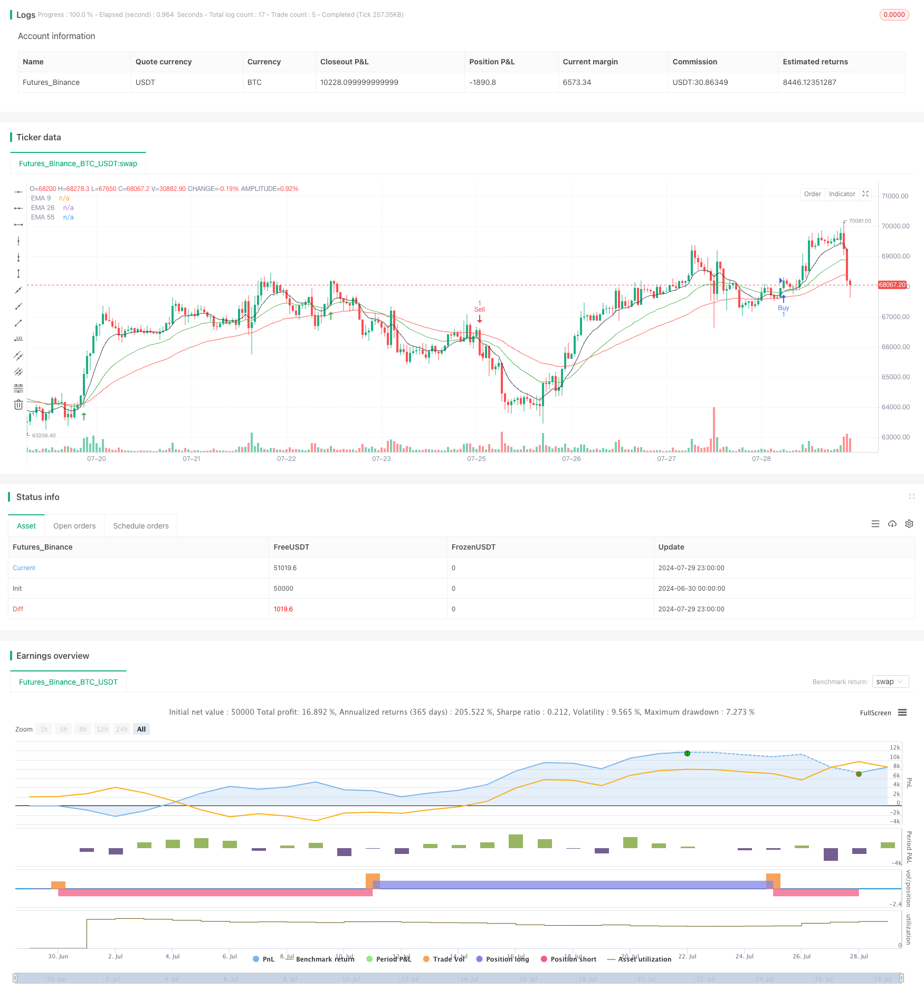

> Name

Golden-Momentum-Capture-Strategy-Multi-Timeframe-Exponential-Moving-Average-Crossover-System
> Author

ChaoZhang

> Strategy Description



[trans]

#### Overview
The Golden Cross Momentum Capture Strategy is a trading system based on multiple time frame analysis that uses the intersection of three exponential moving averages (EMA) to identify market trends and potential trading opportunities. This strategy combines short-term (9-period), mid-term (26-period) and long-term (55-period) EMA, and judges changes in market momentum and trends by observing the relative positions and crossovers between them. The core of the strategy is to determine the overall trend direction in the higher time frame, and then find precise entry and exit points in the lower time frame, thereby improving the success rate and profitability of the transaction.
#### Strategy Principle
1. Multiple time frame analysis:
   - Analyze the trends of EMA 9, EMA 26 and EMA 55 on higher time frames (such as daily or 4-hour lines) to determine the overall market trend.
   - If EMA 55 is trending upward on the high time frame, it is considered a bullish environment; if it is trending downward, it is considered a bearish environment.
2. Low time frame execution:
   - After identifying a high time frame trend, move to lower time frames (such as 15 minutes or 1 hour) to look for specific trading signals.
   - Buy signal: A buy signal is generated when EMA 9 crosses EMA 26 from below, and both are above EMA 55.
   - Sell signal: A sell signal is generated when EMA 9 crosses EMA 26 from above, and both are below EMA 55.
3. Signal confirmation:
   - Buy Confirmation: In addition to the EMA crossover, both EMA 9 and EMA 26 are required to be above EMA 55 and consistent with the bullish trend on the high time frame.
   - Sell Confirmation: In addition to an EMA crossover, both EMA 9 and EMA 26 are required to be below EMA 55 and consistent with a bearish trend on the high time frame.
4. Code implementation:
   - Written in Pine Script language, it can run on the Trading View platform.
   - Implement the acquisition and analysis of multi-time frame data through the request.security() function.
   - Use the ta.crossover() and ta.crossunder() functions to detect EMA crossovers.
   - Buy and sell operations are performed through the strategy.entry() function.
#### Strategic Advantages
1. Trend following: By combining EMAs of multiple time frames, the strategy can effectively capture the main trends of the market and reduce the risk of counter-trend trading.
2. Momentum capture: EMA crossover signals help to detect changes in market momentum in a timely manner, allowing traders to enter the market early in the trend.
3. Signal filtering: EMA 9 and EMA 26 are required to be at specific positions relative to EMA 55, which can filter out some potential false signals.
4. Flexibility: The strategy allows users to customize the time frame of EMA, which can be adjusted according to different trading varieties and personal preferences.
5. Objectivity: Based on clear mathematical indicators and rules, it reduces the bias caused by subjective judgment.
6. Automation potential: The strategy logic is clear, easy to program and implement, and has good automated trading potential.
#### Strategy Risk
1. Lagging: EMA is essentially a lagging indicator and may not react quickly enough in a rapidly changing market.
2. False breakthroughs: In volatile markets, frequent false breakthrough signals may appear, leading to over-trading.
3. Trend dependence: In a sideways market with no obvious trend, the strategy may perform poorly.
4. Parameter sensitivity: EMA cycle selection has a significant impact on strategy performance, and different markets may require different parameter settings.
5. Over-reliance on technical analysis: Ignoring fundamentals and other market factors may lead to misjudgments.
6. Retracement risk: When the trend reverses, the strategy may not be able to identify it in time, resulting in a larger retracement.
#### Strategy optimization direction
1. Introduce additional filters:
   - Consider adding a volume indicator to ensure that trading signals are supported by sufficient volume.
   - Combine with momentum indicators such as the Relative Strength Index (RSI) or Stochastic to further confirm the strength of the trend.
2. Dynamic parameter adjustment:
   - Realize dynamic adjustment of EMA cycle and automatically optimize parameters according to market volatility.
   - Consider using an adaptive moving average (AMA) instead of the traditional EMA to better adapt to different market conditions.
3. Stop loss and profit strategy improvements:
   - Introducing trailing stops, such as dynamic stops based on ATR (Average True Range).
   - Implement a partial profit locking mechanism to make profits mid-trend.
4. Market environment identification:
   - Develop algorithms to identify whether the current market is trending or oscillating, and adopt different trading strategies in different market environments.
5. Multi-factor model:
   - Use the EMA crossover strategy as a component in a multi-factor model, combined with other technical and fundamental factors.
6. Machine learning optimization:
   - Use machine learning algorithms to optimize parameter selection and signal generation processes.
   - Explore deep learning models, such as LSTM networks, to predict the future trend of EMA.
#### Summarize
The Golden Cross Momentum Capture Strategy is a comprehensive trading system that combines multiple time frame analysis and EMA crossover techniques. This strategy is designed to increase trading accuracy and profitability by identifying the overall trend on high time frames and finding precise entry points on low time frames. While there are some inherent risks, such as lag and false breakouts, with proper risk management and continued optimization, this strategy has the potential to become a powerful trading tool. Future optimization directions include introducing additional technical indicators, implementing dynamic parameter adjustment, improving stop loss strategies, and exploring machine learning applications. Overall, this is a strategy framework that deserves further study and improvement, especially for traders looking to strike a balance between trend following and momentum trading.
||

#### Overview

The Golden Momentum Capture Strategy is a trading system based on multi-timeframe analysis that utilizes the crossover of three Exponential Moving Averages (EMAs) to identify market trends and potential trading opportunities. This strategy combines short-term (9-period), medium-term (26-period), and long-term (55-period) EMAs, observing their relative positions and crossovers to determine changes in market momentum and trends. The core of the strategy lies in determining the overall trend direction on a higher timeframe, then seeking precise entry and exit points on lower timeframes, thereby improving the success rate and profitability of trades.

#### Strategy Principles

1. Multi-Timeframe Analysis:
   - Analyze the trends of EMA 9, EMA 26, and EMA 55 on higher timeframes (e.g., daily or 4-hour) to determine the overall market trend.
   - If EMA 55 shows an upward trend on the higher timeframe, it's considered a bullish environment; if downward, it's considered bearish.

2. Lower Timeframe Execution:
   - After determining the higher timeframe trend, switch to lower timeframes (e.g., 15-minute or 1-hour) to look for specific trading signals.
   - Buy Signal: Generated when EMA 9 crosses above EMA 26, and both are above EMA 55.
   - Sell Signal: Generated when EMA 9 crosses below EMA 26, and both are below EMA 55.

3. Signal Confirmation:
   - Buy Confirmation: In addition to the EMA crossover, EMA 9 and EMA 26 must be above EMA 55 and align with the bullish trend identified on the higher timeframe.
   - Sell Confirmation: In addition to the EMA crossover, EMA 9 and EMA 26 must be below EMA 55 and align with the bearish trend identified on the higher timeframe.

4. Code Implementation:
   - Written in Pine Script language, executable on the TradingView platform.
   - Uses the request.security() function to obtain and analyze multi-timeframe data.
   - Employs ta.crossover() and ta.crossunder() functions to detect EMA crossovers.
   - Executes buy and sell operations through the strategy.entry() function.

#### Strategy Advantages

1. Trend Following: By combining EMAs from multiple timeframes, the strategy effectively captures major market trends, reducing the risk of counter-trend trading.

2. Momentum Capture: EMA crossover signals help timely detect changes in market momentum, allowing traders to enter at the early stages of trends.

3. Signal Filtering: Requiring specific positions of EMA 9 and EMA 26 relative to EMA 55 helps filter out potential false signals.

4. Flexibility: The strategy allows users to customize EMA timeframes, adjustable for different trading instruments and personal preferences.

5. Objectivity: Based on clear mathematical indicators and rules, it reduces biases from subjective judgment.

6. Automation Potential: With clear strategy logic, it's easy to implement programmatically, showing good potential for automated trading.

#### Strategy Risks

1. Lag: EMAs are inherently lagging indicators, which may not react quickly enough in rapidly changing markets.

2. False Breakouts: In choppy markets, frequent false breakout signals may lead to overtrading.

3. Trend Dependency: The strategy may not perform well in range-bound markets with no clear trends.

4. Parameter Sensitivity: The choice of EMA periods significantly affects strategy performance; different markets may require different parameter settings.

5. Over-reliance on Technical Analysis: Ignoring fundamental factors and other market elements may lead to misjudgments.

6. Drawdown Risk: The strategy may not identify trend reversals timely, potentially leading to significant drawdowns.

#### Strategy Optimization Directions

1. Introduce Additional Filters:
   - Consider adding volume indicators to ensure trading signals are supported by sufficient volume.
   - Incorporate momentum indicators like Relative Strength Index (RSI) or Stochastic Oscillator to further confirm trend strength.

2. Dynamic Parameter Adjustment:
   - Implement dynamic adjustment of EMA periods, automatically optimizing parameters based on market volatility.
   - Consider using Adaptive Moving Averages (AMA) instead of traditional EMAs to better adapt to different market conditions.

3. Improve Stop Loss and Profit-Taking Strategies:
   - Introduce trailing stops, such as dynamic stops based on Average True Range (ATR).
   - Implement partial profit-locking mechanisms to secure gains during trends.

4. Market Environment Recognition:
   - Develop algorithms to identify whether the current market is trending or ranging, and apply different trading strategies accordingly.

5. Multi-Factor Model:
   - Incorporate the EMA crossover strategy as a component in a multi-factor model, combining it with other technical and fundamental factors.

6. Machine Learning Optimization:
   - Use machine learning algorithms to optimize parameter selection and signal generation processes.
   - Explore deep learning models, such as LSTM networks, to predict future EMA trends.

#### Summary

The Golden Momentum Capture Strategy is a comprehensive trading system that combines multi-timeframe analysis with EMA crossover techniques. By determining the overall trend on higher timeframes and seeking precise entry points on lower timeframes, this strategy aims to improve trading accuracy and profitability. While there are inherent risks such as lag and false breakouts, with proper risk management and continuous optimization, this strategy has the potential to become a powerful trading tool. Future optimization directions include introducing additional technical indicators, implementing dynamic parameter adjustments, improving stop-loss strategies, and exploring machine learning applications. Overall, this is a strategy framework worth further research and improvement, particularly suitable for traders seeking a balance between trend following and momentum trading.

[/trans]


> Source (PineScript)

``` pinescript
/*backtest
start: 2024-06-30 00:00:00
end: 2024-07-30 00:00:00
period: 1h
basePeriod: 15m
exchanges: [{"eid":"Futures_Binance","currency":"BTC_USDT"}]
*/

//@version=5
strategy("Golden Crossover", overlay=true)

// Define EMA lengths
ema9_length = 9
ema26_length = 26
ema55_length = 55

// Input parameters
timeFrame9 = input.timeframe('', 'Time Frame - EMA 9')
timeFrame26 = input.timeframe('', 'Time Frame - EMA 26')
timeFrame55 = input.timeframe('', 'Time Frame - EMA 55')

// Request data from specified time frames
ema9 = request.security(syminfo.tickerid, timeFrame9, ta.ema(close, ema9_length))
ema26 = request.security(syminfo.tickerid, timeFrame26, ta.ema(close, ema26_length))
ema55 = request.security(syminfo.tickerid, timeFrame55, ta.ema(close, ema55_length))

// Plot EMAs on the chart
plot(ema9, color=color.black, title="EMA 9")
plot(ema26, color=color.green, title="EMA 26")
plot(ema55, color=color.red, title="EMA 55")

// Define buy condition
buy_condition = ta.crossover(ema9, ema26) and ema26 > ema55 //and ema26 > ema55 // (We can activate additional condition to get more accurate signals)

// Define sell condition
sell_condition = ta.crossunder(ema9, ema26) and (ema26 < ema55) //and ema26 < ema55 // (We can activate additional condition to get more accurate signals)

// Execute buy and sell orders
if (buy_condition)
    strategy.entry("Buy", strategy.long)

if (sell_condition)
    strategy.entry("Sell", strategy.short)

// Optional: Plot buy and sell signals on the chart
plotshape(series=buy_condition, location=location.belowbar, color=color.green, style=shape.arrowup, title="Buy")
plotshape(series=sell_condition, location=location.abovebar, color=color.red, style=shape.arrowdown, title="Sell")
```

> Detail

https://www.fmz.com/strategy/458279

> Last Modified

2024-07-31 15:00:12
