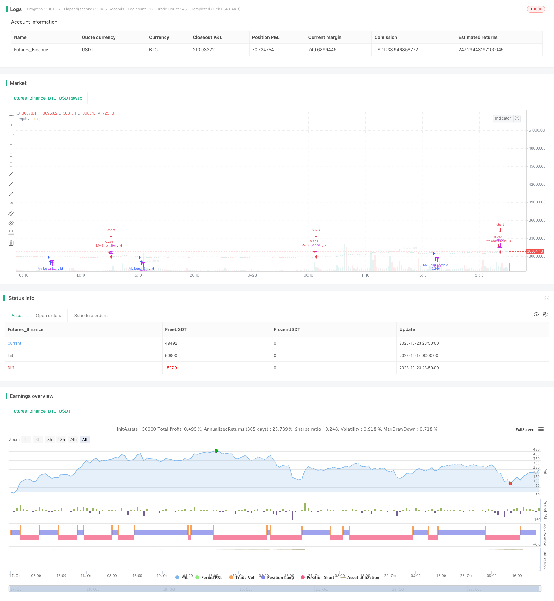

> Name

Gradient-Trailing-Stop-Loss-Strategy
> Author

ChaoZhang

> Strategy Description



[trans]

## Overview
The gradient trailing stop loss strategy achieves an organic combination of risk control and profit taking by dynamically adjusting the stop loss line. It uses the average true fluctuation range to calculate stop loss lines, which can effectively track stock price trends and reduce unnecessary stop losses while protecting profits. This strategy is suitable for stocks with strong trends and can obtain stable returns.
## Principle
This strategy uses a calculated average true range (ATR) as the basis for dynamic stops. ATR can effectively reflect the volatility of a stock. The strategy first enters the ATR cycle parameter, which is typically 10 days. Then calculate the ATR value. When the stock price rises, the stop-loss line will also move upward and is dynamically tracked; when the stock price falls, the stop-loss line remains unchanged and profits can be locked in. At the same time, the strategy allows fine-tuning the distance between the stop loss line and the stock price through the "factor" parameter.
Specifically, the strategy calculates the ATR value of the current K line, and then multiplies it by the "factor" parameter to obtain the stop loss distance. If the stock price is higher than the stop-loss price, a long position is opened; if the stock price is lower than the stop-loss price, a short position is opened. In this way, the stop loss line will run closely with the stock price, achieving the gradual tracking effect of the stop loss line.
## Advantages
- Dynamic tracking stop loss, the stop loss distance can be adjusted according to market conditions, and the flexibility is strong
- Use ATR to calculate stop loss distance, which can effectively track market fluctuations
- The strategy is simple and easy to use, making it easy to implement automated trading
- Customizable ATR cycle and stop loss distance factors to adapt to different trading varieties
- Can balance stop loss and take profit, reducing the probability of unnecessary stop loss
## Risk
- ATR is used as the basis for dynamic stop loss. It is crucial to choose appropriate parameters.
- Stop loss distance that is too close may increase the probability of unnecessary stop loss
- If the stop loss distance is too far, the loss cannot be stopped in time and the risk cannot be controlled.
- The strategy itself cannot judge the market trend and requires manual confirmation of buying and selling signals.
- It is necessary to pay attention to whether the calculation period of ATR is reasonable and the adjustment of "factor" parameters
## optimization
- You can consider combining moving averages and other indicators to filter signals to reduce the probability of wrong transactions
- ATR cycle and stop loss distance parameters can be automatically optimized through machine learning methods
- Automatic take-profit strategies can be introduced and combined with stop-loss to lock in profits
- Can be considered for use in combination with other indicators to verify the reliability of buying and selling signals
- You can try to improve the ATR calculation method or dynamically adjust the ATR cycle parameters
- You can study different dynamic trailing stop loss algorithms to further optimize the stop loss effect
## Summarize
The gradient trailing stop loss strategy achieves an effective balance between risk control and profit taking by dynamically adjusting the stop loss distance. This strategy is simple to operate, highly customizable, and suitable for robot automatic trading. Of course, reasonable parameter selection and indicator combination still require manual experience. Through further optimization, this strategy is expected to obtain a more stable return on investment.
||


## Overview

The Gradient Trailing Stop Loss strategy dynamically adjusts the stop loss line to balance risk control and profit taking. It uses the Average True Range (ATR) to calculate the stop loss line and effectively tracks price trends, protecting profits while reducing unnecessary stop outs. This strategy works well for stocks with strong trends and can generate steady returns.

## Principles 

The strategy uses the Average True Range (ATR) as the basis for dynamic stop loss. ATR effectively reflects the volatility of a stock. The strategy first takes the ATR period as input, typically 10 days. Then the ATR value is calculated. As the price rises, the stop loss line also moves up to trail the price. When the price drops, the stop loss line remains unchanged to lock in profits. Also, the strategy allows fine tuning the stop loss distance from the price using a "factor" parameter.

Specifically, the strategy calculates the current ATR, then multiplies it by the "factor" to get the stop loss distance. If the price is above the stop loss price, a long position is opened. If the price is below, a short position is opened. Thus, the stop loss line closely follows the price, achieving a gradient trailing effect.

## Advantages

- Dynamic trailing stop loss adjusts stop distance based on market conditions
- ATR calculates stop distance based on market volatility  
- Simple and easy to automate trading
- Customizable ATR period and stop loss factor for different assets
- Balances between stopping loss and profit taking  
- Reduces unnecessary stop outs

## Risks

- Choosing proper ATR parameters is crucial 
- Stop loss too close may increase unnecessary stop outs
- Stop loss too far may fail to control risks
- Strategy itself cannot determine market trends
- Need to evaluate ATR period and factor settings

## Enhancements

- Add filters like moving averages to reduce false signals
- Auto-optimize ATR period and stop loss factor via machine learning
- Incorporate profit taking strategy to lock in profits  
- Combine with other indicators to verify buy/sell signals
- Research better ATR calculation or dynamic ATR period
- Explore other dynamic trailing stop algorithms 
- Further optimize the stop loss effect

## Conclusion

The Gradient Trailing Stop Loss strategy effectively balances risk and profit by dynamically adjusting the stop loss distance. With simple logic and high configurability, it is suitable for algorithmic trading. Proper parameter tuning and indicator combinations still rely on human expertise. Further optimizations can make this strategy even more profitable.
[/trans]


> Strategy Arguments


|Argument|Default|Description|
|----|----|----|
|v_input_1|2020|Start Year|
|v_input_2|true|Start Month|
|v_input_3|true|Start Day|
|v_input_4|9999|End Year|
|v_input_5|12|End Month|
|v_input_6|31|End Day|
|v_input_7|10|ATR Length|
|v_input_float_1|3|Factor|


> Source (PineScript)

``` pinescript
/*backtest
start: 2023-10-17 00:00:00
end: 2023-10-24 00:00:00
period: 10m
basePeriod: 1m
exchanges: [{"eid":"Futures_Binance","currency":"BTC_USDT"}]
*/

//@version=5
strategy("Supertrend Strategy, by Ho.J.", overlay=true, default_qty_type=strategy.percent_of_equity, default_qty_value=15)

// 백테스팅 시작일과 종료일 입력
startYear = input(2020, title="Start Year")
startMonth = input(1, title="Start Month")
startDay = input(1, title="Start Day")

endYear = input(9999, title="End Year")
endMonth = input(12, title="End Month")
endDay = input(31, title="End Day")

// 백테스팅 시간 범위 확인
backtestingTimeBool = (year >= startYear and month >= startMonth and dayofmonth >= startDay) and (year <= endYear and month <= endMonth and dayofmonth <= endDay)

atrPeriod = input(10, "ATR Length")
factor = input.float(3.0, "Factor", step = 0.01)

[_, direction] = ta.supertrend(factor, atrPeriod)

var bool longCondition = false
var bool shortCondition = false

if backtestingTimeBool
    prevDirection = direction[1]
    if direction < 0
        longCondition := false
        shortCondition := true
    else if direction > 0
        longCondition := true
        shortCondition := false

if longCondition
    strategy.entry("My Long Entry Id", strategy.long)

if shortCondition
    strategy.entry("My Short Entry Id", strategy.short)

plot(strategy.equity, title="equity", color=color.rgb(255, 255, 255), linewidth=2, style=plot.style_area)
```

> Detail

https://www.fmz.com/strategy/430148

> Last Modified

2023-10-25 14:56:28
