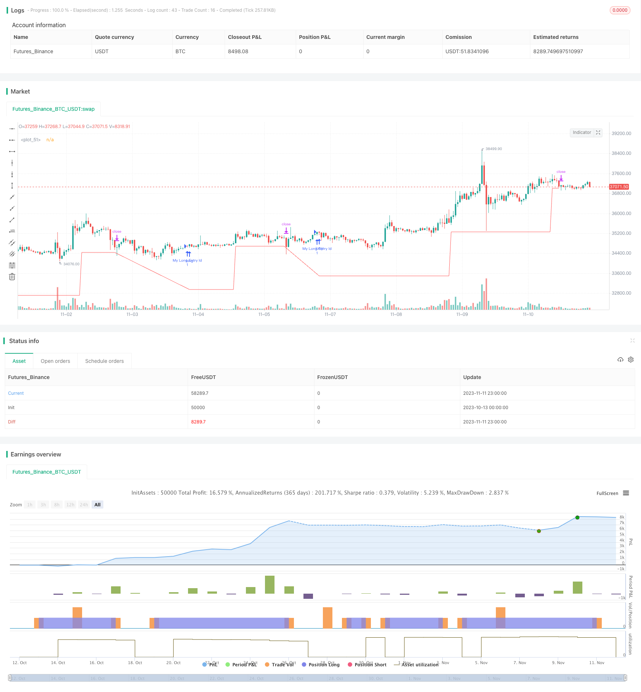

> Name

Gradual-Stop-Loss-Movement-Strategy
> Author

ChaoZhang

> Strategy Description



[trans]

## Overview
The Gradual Stop-Loss Move-Up strategy is a simple but very practical strategy that reminds you to gradually move your stop-loss position upward when the price rises.
## Principle
This strategy first sets the initial stop loss level at 95% of the entry price when entering a long position. Then it will define multiple higher stop loss levels, which are 100%, 105%, 110% of the entry price, etc. The strategy checks whether the lowest price of the past 7 days breaks through the previous stop loss level, and if so, sets the stop loss level to that higher stop loss level. In this way, as the price rises, the stop loss position will gradually move upward.
Specifically, the strategy will define 8 stop loss levels, which are 95%, 100%, 105%, 110%, 115%, 120%, 125%, and 130% of the entry price. It checks if the lowest price of the past 7 days is higher than the next stop, and if so, sets the stop to that higher stop.
For example, if the entry price is $100, the initial stop loss is $95. If the lowest price in the last 7 days rises to $105, which is higher than the next stop loss level of $100, set the stop loss level to $100. If it continues to rise to $115, set your stop loss at $105, and so on.
In this way, as the price rises, the stop loss position will continue to move upward, achieving a gradual stop loss and protecting part of the profit. At the same time, it avoids the overly optimistic effect of ordinary trailing stop loss in backtesting.
## Advantages
The biggest advantage of this progressive stop-loss strategy is that it can gradually move the stop-loss position upward as the price rises, protecting part of the profit and preventing the stop-loss from being breached and directly losing all profits.
Compared with ordinary trailing stop loss, progressive stop loss will not produce overly optimistic results during backtesting. Because the ordinary trailing stop will immediately move the stop loss position downward when the price retraces, thus skipping the retracement process and directly entering the next rise. But in actual trading, the retracement process cannot be skipped. This will cause the ordinary trailing stop loss strategy to be unable to achieve the backtesting effect in actual transactions.
The gradual stop loss strategy, because the stop loss position gradually moves upward, can more truly reflect the process of stop loss position movement during actual trading during backtesting, avoiding overly optimistic results.
In addition, this strategy provides timing prompts for stop loss modification, allowing traders to modify the stop loss position themselves. Many exchanges do not provide a trailing stop function, so this strategy is more versatile and can be widely applied to different trading platforms.
## Risk
The biggest risk with this strategy is that the stop may not move up quickly enough to keep up with extremely rapid price increases. If the price rises sharply in a short period of time and exceeds multiple stop loss levels, the stop loss level can only move upward slowly and cannot protect profits in time.
Another risk is that traders may miss or delay the opportunity to modify their stop loss. This strategy only provides timing tips for stop loss modifications, and traders need to manually adjust the specific stop loss levels themselves. If the trader neglects to make timely modifications, or the modification operation is delayed, the stop loss may be breached.
## optimization
This strategy can be optimized in the following ways:
1. Optimize the percentage setting of the stop loss level to make it more consistent with the fluctuations of specific trading varieties.
2. Optimize the viewing of the lowest price cycle parameters, for example, change to viewing the lowest price in the last 5 days or 10 days to adapt to the fluctuation frequency of different varieties.
3. Increase the number of stop loss positions to make the stop loss position move up more gradually.
4. Add the logic of moving the take profit level so that the take profit level can also gradually move up.
5. Automatically execute the stop loss modification operation without manual participation, reducing the difficulty of operation and the risk of delay.
6. Add event reminders for stop-loss breakthroughs to prevent traders from inadvertently breaking the stop-loss.
## Summarize
The progressive stop-loss move-up strategy is a simple and practical strategic idea. It can gradually move the stop-loss position upward as the price rises, protecting profits while avoiding overly optimistic simulated trading results. Compared with ordinary trailing stop loss, it is more suitable for the actual trading environment and easier to apply on different trading platforms. By optimizing the stop loss percentage, lowest price parameters, stop loss quantity, etc., the strategy can be better adapted to different trading varieties. Combined with the automation of moving take-profit and stop-loss execution, the difficulty and risk of operation can be further reduced.
||
## Overview

The gradual stop loss movement strategy is a simple but very useful strategy that reminds you to gradually move up the stop loss as prices rise.

## Principles 

The strategy first sets the initial stop loss at 95% of the entry price when taking a long position. It then defines multiple higher stop loss levels at 100%, 105%, 110% etc of the entry price. The strategy checks if the lowest low of the past 7 days has broken through the previous stop loss level. If so, the stop loss is set to that higher level. Thus as prices rise, the stop loss also gradually moves up.

Specifically, the strategy defines 8 stop loss levels at 95%, 100%, 105%, 110%, 115%, 120%, 125%, 130% of the entry price. It checks if the lowest low of the past 7 days is above the next stop loss level. If so, the stop loss is set to that higher level. 

For example, if the entry price is $100, the initial stop loss is $95. If the lowest low of the past 7 days rises to $105, above the next stop loss of $100, the stop loss is set to $100. If it continues to rise to $115, the stop loss is set to $105, and so on.

As prices rise, the stop loss moves up gradually as well, realizing a gradual stop loss to protect some profits. It also avoids the over-optimistic results of regular trailing stops in backtests.

## Advantages

The biggest advantage of this gradual stop loss strategy is that it can move up the stop loss gradually as prices rise, to protect some profits and avoid the stop loss being hit and losing all profits immediately.

Compared to regular trailing stops, the gradual stop loss does not produce over-optimistic results in backtests. Because regular trailing stops will move down the stop loss immediately when prices pull back, skipping the drawdown process and going directly into the next rise. But the drawdown cannot be skipped in actual trading. This makes regular trailing stops unable to achieve the same results in live trading as in backtests.

The gradual stop loss strategy moves up the stop loss step-by-step. So it can reflect the actual process of stop loss movement in live trading more realistically in backtests, avoiding over-optimistic results.

Also, this strategy provides prompts for when to modify the stop loss, letting traders modify it manually. Many exchanges do not offer trailing stop loss orders, so this strategy is more universal and can be applied to different trading platforms.

## Risks

The biggest risk of this strategy is that the stop loss movement may not keep up with extremely fast price rises. If prices rise sharply in a very short period, exceeding multiple stop loss levels, the stop loss can only move up slowly, unable to protect profits in a timely manner.

Another risk is that traders may miss or delay the timing of stop loss modifications. The strategy only provides prompts for when to modify the stop loss. The actual adjustment still relies on manual operations of the trader. Neglecting or delaying the modifications may result in the stop loss being hit.

## Improvements

The strategy can be improved in the following ways:

1. Optimize the stop loss percentage settings to better suit the volatility of specific trading instruments.

2. Optimize the lookback period parameter for the lowest low, such as 5 or 10 days, to adapt to different volatilities. 

3. Increase the number of stop loss levels for a more gradual movement.

4. Add logic to also move up a trailing take profit level.

5. Automate the stop loss modification operations to reduce difficulty and delay risks.

6. Add alerts for stop loss breaches to avoid traders missing such events.

## Conclusion

The gradual stop loss movement strategy is a simple yet useful strategy idea. It can move up the stop loss gradually as prices rise to protect profits while avoiding over-optimistic backtest results. Compared to regular trailing stops, it is more suitable for actual trading and easier to implement across platforms. By optimizing parameters like stop loss percentages, lowest low lookback periods, number of stop levels etc, it can be adapted to different trading instruments. Combined with automated stop loss execution and trailing take profit, it can further reduce operational difficulty and risks.

[/trans]


> Source (PineScript)

``` pinescript
/*backtest
start: 2023-10-13 00:00:00
end: 2023-11-12 00:00:00
period: 1h
basePeriod: 15m
exchanges: [{"eid":"Futures_Binance","currency":"BTC_USDT"}]
*/

//@version=3

///Moving Stops Script///
///by ShanghaiCryto///

///A simple, but very useful, script that reminds you to move up your stop losses as price trends upwards. ///
///The sma entry is just stock code to demonstrate how the stop works.///
///Doesn't throw off your backtesting the way a trailing stop does.///


strategy("Move Up Stops", overlay=true)

longCondition = crossover(sma(close, 14), sma(close, 28))
if (longCondition)
    strategy.entry("My Long Entry Id", strategy.long)

first_stop = strategy.position_avg_price * .95
second_stop = strategy.position_avg_price 
third_stop = strategy.position_avg_price * 1.05
fourth_stop = strategy.position_avg_price * 1.1
fifth_stop = strategy.position_avg_price * 1.15
sixth_stop = strategy.position_avg_price * 1.2
seventh_stop = strategy.position_avg_price * 1.25
eighth_stop = strategy.position_avg_price * 1.3

move_trigger = lowest(low,7)

first_check = na
first_check := move_trigger > second_stop ? second_stop : first_stop

second_check = na
second_check := move_trigger > third_stop ? third_stop : first_check

third_check = na
third_check := move_trigger > fourth_stop ? fourth_stop : second_check

fourth_check = na
fourth_check := move_trigger > fifth_stop ? fifth_stop : third_check

fifth_check = na
fifth_check := move_trigger > sixth_stop ? sixth_stop : fourth_check

sixth_check = na
sixth_check := move_trigger > seventh_stop ? seventh_stop : fifth_check

stop_level = na
stop_level := move_trigger > eighth_stop ? eighth_stop : sixth_check

strategy.exit("Stop Loss","My Long Entry Id", stop=stop_level)

plot(stop_level, color=red)
```

> Detail

https://www.fmz.com/strategy/431964

> Last Modified

2023-11-13 17:30:28
