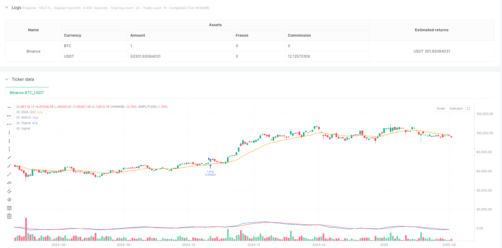
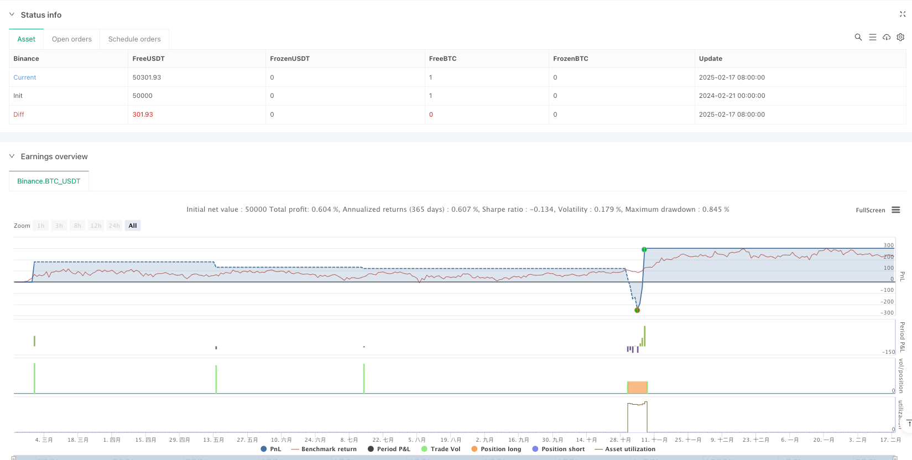

> Name

Trend-Following-Trading-Strategy-Based-on-Granville-and-MACD-Multiple-Signal-Confirmation
> Author

ianzeng123

> Strategy Description





[trans]
#### Overview
This strategy is a multiple signal confirmation trading system that combines Granville trend reversal theory and the MACD indicator. The core idea of ​​the strategy is to judge potential trend reversal through the relationship between price and moving average, and use the multiple signal verification of the MACD indicator to ensure the reliability of the transaction. This method not only effectively identifies the starting point of a trend, but also reduces the risk of false signals through a multiple confirmation mechanism.
#### Strategy Principle
The strategy execution process is divided into four key steps:
1. Granville reversal signal confirmation: Monitor if the price breaks out from below the EMA to above it, which indicates a possible trend reversal.
2. MACD's first golden cross confirmation: After the Granville reversal signal appears, wait for the MACD indicator to appear golden cross, which is the second confirmation of the trend change.
3. MACD breakthrough verification: It is confirmed that the MACD line has broken through the high point of the first golden cross, which indicates that the upward momentum continues to increase.
4. MACD steps back for the second time: Wait for MACD to step back after breaking through and cross the signal line again. This is the final entry signal.
The stop-profit and stop-loss settings adopt a dynamic adjustment method based on the amplitude of the reversal K-line. The stop-loss is set at the low point of the reversal K-line, and the take-profit is set to 1.618 times the amplitude of the reversal K-line, which is in line with the Fibonacci expansion principle.
#### Strategic Advantages
1. Multiple confirmation mechanism: By combining price action, trend indicators and momentum indicators, the risk of false signals is greatly reduced.
2. Dynamic risk management: Set stop-profit and stop-loss based on actual market fluctuations to make risk management more adaptable.
3. Trend continuity verification: Through the multiple signal confirmation of MACD, the accuracy of capturing the sustainable trend is improved.
4. Strong adaptability: strategy parameters can be optimized and adjusted according to different market conditions and time periods.
#### Strategy Risk
1. Signal lag: The multiple confirmation mechanism may lead to a relative lag in entry timing, affecting some potential returns.
2. Range market performance: In a sideways market, frequent false breakthroughs may lead to continuous stop losses.
3. Over-reliance on technical indicators: When market sentiment fluctuates violently, pure technical analysis may fail.
4. Parameter sensitivity: Frequent adjustments to parameters may be required under different market environments to maintain the effectiveness of the strategy.
#### Strategy optimization direction
1. Market environment classification: introduce volatility indicators and use different parameter configurations in different market environments.
2. Optimization of entry timing: You can consider increasing trading volume confirmation when MACD falls back for the second time to improve signal reliability.
3. Dynamic adjustment of take-profit and stop-loss: The take-profit and stop-loss multiples can be dynamically adjusted according to market volatility.
4. Increase market sentiment factors: Combined with market sentiment indicators, adjust the aggressiveness of the strategy during periods of extreme sentiment.
#### Summary
This strategy builds a relatively complete trading system by combining classic technical analysis theory and modern quantitative trading methods. The multiple signal confirmation mechanism provides better transaction reliability, and the dynamic risk management method also makes the strategy adaptable. Although there is a certain hysteresis problem, through continuous optimization and parameter adjustment, the strategy still has good practical value and development potential. ||

#### Overview
This strategy combines Granville's trend reversal theory with MACD indicator for multiple signal confirmation. The core concept involves identifying potential trend reversals through price-moving average relationships and validating trades using multiple MACD signals. This approach effectively identifies trend initiation points while reducing false signal risks through multiple confirmation mechanisms.

#### Strategy Principles
The strategy execution follows four key steps:
1. Granville Reversal Signal: Monitors price crossing above EMA from below, indicating potential trend reversal.
2. Initial MACD Golden Cross: Waits for MACD golden cross after Granville reversal signal as secondary trend confirmation.
3. MACD Breakout Verification: Confirms MACD line breaks above initial golden cross level, indicating continued momentum.
4. MACD Retest: Waits for MACD to retest and cross signal line again for final entry signal.

Stop loss and take profit levels are dynamically adjusted based on reversal candlestick range, with stop loss at reversal bar low and take profit at 1.618 times the reversal bar range, following Fibonacci extension principles.

#### Strategy Advantages
1. Multiple Confirmation Mechanism: Combines price action, trend indicators, and momentum indicators to significantly reduce false signals.
2. Dynamic Risk Management: Sets stop loss and take profit based on actual market volatility for adaptive risk management.
3. Trend Continuation Verification: Improves accuracy in capturing sustained trends through multiple MACD confirmations.
4. High Adaptability: Strategy parameters can be optimized for different market conditions and timeframes.

#### Strategy Risks
1. Signal Lag: Multiple confirmation requirements may delay entry points, affecting potential returns.
2. Range-bound Market Performance: Frequent false breakouts in sideways markets may lead to consecutive losses.
3. Over-reliance on Technical Indicators: Pure technical analysis may fail during extreme market sentiment shifts.
4. Parameter Sensitivity: Different market environments may require frequent parameter adjustments to maintain strategy effectiveness.

#### Strategy Optimization Directions
1. Market Environment Classification: Introduce volatility indicators for different parameter configurations in various market conditions.
2. Entry Timing Optimization: Consider adding volume confirmation during MACD retest to improve signal reliability.
3. Dynamic Stop Loss/Take Profit Adjustment: Adjust multipliers based on market volatility.
4. Market Sentiment Integration: Incorporate sentiment indicators to adjust strategy aggressiveness during extreme sentiment periods.

#### Summary
This strategy builds a comprehensive trading system by combining classical technical analysis theories with modern quantitative trading methods. The multiple signal confirmation mechanism provides reliable trade signals, while dynamic risk management methods ensure strategy adaptability. Despite some lag issues, continuous optimization and parameter adjustment give the strategy practical value and development potential.[/trans]


> Source (PineScript)

``` pinescript
/*backtest
start: 2024-02-21 00:00:00
end: 2025-02-18 08:00:00
period: 1d
basePeriod: 1d
exchanges: [{"eid":"Binance","currency":"BTC_USDT"}]
*/

//@version=5
strategy("Granville + MACD Strategy", overlay=true, initial_capital=100000, default_qty_type=strategy.percent_of_equity, default_qty_value=10)

// ■ Parameter Settings
emaPeriod = input.int(20, "EMA Period for Granville", minval=1)
fastLen   = input.int(12, "MACD Fast Period", minval=1)
slowLen   = input.int(26, "MACD Slow Period", minval=1)
signalLen = input.int(9,  "MACD Signal Period", minval=1)

// ■ Calculate EMA (for Granville reversal detection)
ema_val = ta.ema(close, emaPeriod)

// ■ Granville Reversal Detection (e.g., price crosses above EMA from below)
granvilleReversal = ta.crossover(close, ema_val)

// ■ Calculate MACD
[macdLine, signalLine, _] = ta.macd(close, fastLen, slowLen, signalLen)

// ■ State management variables (to manage state transitions)
var bool   granvilleDone   = false    // Reversal bar confirmed flag
var float  granvilleLow    = na       // Low of the reversal bar (used for SL)
var float  granvilleRange  = na       // Range of the reversal bar (used for TP calculation)
var bool   macdGC_done     = false    // First MACD Golden Cross confirmed
var int    goldenCrossBar  = na       // Bar index of the first MACD Golden Cross
var float  initialMacdHigh = na       // MACD value at the Golden Cross (used for break detection)
var bool   breakoutDone    = false    // MACD line breaks the initial Golden Cross MACD value

// ■ (1) Granville Reversal Detection
if granvilleReversal
    granvilleDone  := true
    granvilleLow   := low             // Low of the reversal bar (SL)
    granvilleRange := high - low      // Range of the reversal bar (used for TP calculation)
    // Reset MACD-related states
    macdGC_done     := false
    breakoutDone    := false
    initialMacdHigh := na
    goldenCrossBar  := na

// ■ (2) MACD Golden Cross (first signal) detection
if granvilleDone and (not macdGC_done) and ta.crossover(macdLine, signalLine)
    macdGC_done    := true
    goldenCrossBar := bar_index
    initialMacdHigh:= macdLine

// ■ (3) Check if MACD line breaks the initial MACD value at the Golden Cross
if macdGC_done and (not breakoutDone) and (macdLine > initialMacdHigh)
    breakoutDone := true

// ■ (4) When MACD retests and crosses above the signal line again, it's the entry timing
// ※ Check for a crossover after the first Golden Cross bar
entryCondition = granvilleDone and macdGC_done and breakoutDone and (bar_index > goldenCrossBar) and ta.crossover(macdLine, signalLine)

// ■ TP and SL settings at entry
if entryCondition
    entryPrice = close
    tpPrice = entryPrice + granvilleRange * 1.618
    slPrice = granvilleLow
    strategy.entry("Long", strategy.long)
    strategy.exit("Exit Long", from_entry="Long", stop=slPrice, limit=tpPrice)
    // Reset states after entry (for the next entry)
    granvilleDone   := false
    macdGC_done     := false
    breakoutDone    := false
    initialMacdHigh := na
    goldenCrossBar  := na

// ■ Plotting (for reference)
// Display the EMA on the price chart (with fixed title)
plot(ema_val, color=color.orange, title="EMA (20)")

// Plot MACD and Signal in a separate window (with fixed titles)
plot(macdLine, color=color.blue, title="MACD")
plot(signalLine, color=color.red, title="Signal")

```

> Detail

https://www.fmz.com/strategy/482803

> Last Modified

2025-02-27 17:46:54
