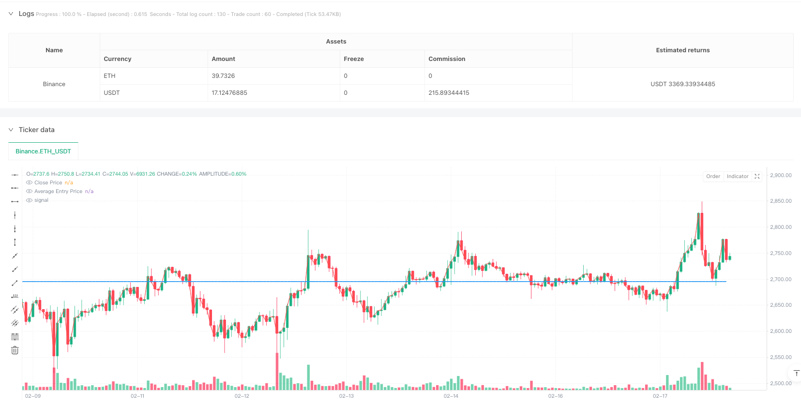
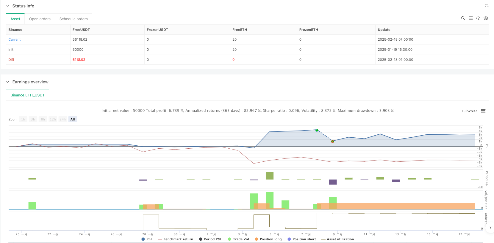

> Name

Grid-based-Position-Accumulation-Strategy-Based-on-Martinale-Theory
> Author

ianzeng123

> Strategy Description




[trans]
#### Overview
This strategy is a grid-based position-adding strategy model based on Martingale theory, which balances costs by dynamically adjusting the position size when prices fall. The core of the strategy is to increase the position every time the price drops by 8%, and the amount of each increase is twice the previous time, and a profit target of 5% is set at the same time. This strategy is particularly suitable for capturing price reversion opportunities in volatile markets.
#### Strategy Principle
The strategy uses several key technical indicators and parameter settings:
1. Drop monitoring: Use 15 K lines as the lookback period, and calculate the ratio of the current price to the highest price to measure the drop.
2. Position addition mechanism: When the price drops by 8%, a position increase is triggered, and the amount of each increase is twice that of the previous one.
3. Cost calculation: dynamically calculate the weighted average cost through accumulated costs and quantities
4. Take profit condition: When the price rises to 105% of the average cost, the position will be automatically closed for profit
5. Risk control mechanism: Set the maximum number of positions to 10 times, and the position will be forced to close and stop the loss after exceeding the limit.
#### Strategic Advantages
1. Cost balance: quickly reduce average costs and increase profit probability through multiplication of positions.
2. Risk controllable: Set the maximum number of positions to avoid unlimited lock-in
3. Automatic execution: The strategy logic is clear and suitable for automated trading systems
4. Stable income: perform well in volatile markets and can continue to obtain small amounts of stable income.
5. Strong adaptability: parameters can be flexibly adjusted according to market conditions
#### Strategy Risk
1. Funding requirements: Doubling the position requires a larger capital reserve
2. Retracement risk: Continuous falling market may lead to larger retracement
3. Execution risk: High-frequency trading may face slippage and handling fees
4. Systemic risk: Severe market fluctuations may trigger frequent transactions
Solution:
- Set a reasonable initial position and capital ratio
- Added trend filter to avoid counter-trend trades
- Optimize transaction frequency and handling fee control
- Improve the risk control mechanism and increase monitoring of market fluctuations
#### Strategy optimization direction
1. Dynamic parameter adjustment:
- Automatically adjust the drawdown threshold based on market volatility
- Adjust the position increase multiple based on changes in trading volume
2. Trend filtering:
- Add trend indicators to avoid reverse operations in strong trends
- Combined with multi-period analysis to optimize entry timing
3. Improved risk control:
-Add retracement limits and total position control
- Implement dynamic stop loss based on volatility
4. Transaction optimization:
- Optimize order execution strategies to reduce slippage
- Realize intelligent warehouse management
#### Summary
This strategy realizes a highly adaptive trading system through the combination of Martingale theory and grid trading. The strategy performs well in volatile markets and can achieve stable returns through scientific position management and risk control. However, you need to pay attention to the adaptability of fund management and market environment when using it. It is recommended to conduct sufficient backtest verification before using it in real time. ||
#### Overview
This strategy is a grid-based position accumulation model based on Martingale theory, which balances costs by dynamically adjusting position sizes during price declines. The core strategy involves increasing positions when price drops by 8%, with each new position being twice the size of the previous one, while setting a 5% profit target. This strategy is particularly suitable for capturing price regression opportunities in oscillating markets.

#### Strategy Principle
The strategy employs several key technical indicators and parameter settings:
1. Drop monitoring: Uses 15 candlesticks as lookback period to measure price decline by comparing current price to highest price
2. Position accumulation mechanism: Triggers position increase when price drops 8%, doubling the size each time
3. Cost calculation: Dynamically calculates weighted average cost through cumulative cost and quantity
4. Take profit condition: Automatically closes position when price rises to 105% of average cost
5. Risk control mechanism: Sets maximum position accumulation times to 10, forcing position closure after exceeding

#### Strategy Advantages
1. Cost balancing: Quickly reduces average cost through exponential position increase, improving profit probability
2. Controllable risk: Sets maximum accumulation times to avoid infinite position trapping
3. Automatic execution: Clear strategy logic suitable for automated trading systems
4. Stable returns: Excellent performance in oscillating markets, capable of continuous small stable returns
5. Strong adaptability: Parameters can be flexibly adjusted according to market conditions

#### Strategy Risks
1. Capital requirement: Exponential position increase requires large capital reserves
2. Drawdown risk: Continuous downtrend may lead to significant drawdowns
3. Execution risk: High-frequency trading may face slippage and fee impacts
4. System risk: Drastic market fluctuations may trigger frequent trades
Solutions:
- Set reasonable initial position and capital ratio
- Add trend filters to avoid counter-trend trading
- Optimize trading frequency and fee control
- Improve risk control mechanism, enhance market volatility monitoring

#### Strategy Optimization Directions
1. Dynamic parameter adjustment:
- Automatically adjust drop threshold based on market volatility
- Adjust accumulation multiplier based on volume changes
2. Trend filtering:
- Add trend indicators to avoid counter-trend operations in strong trends
- Optimize entry timing through multi-timeframe analysis
3. Risk control improvement:
- Add drawdown limits and total position control
- Implement volatility-based dynamic stop loss
4. Trading optimization:
- Optimize order execution strategy to reduce slippage
- Implement intelligent position management

#### Summary
This strategy combines Martingale theory with grid trading to create a highly adaptive trading system. The strategy performs excellently in oscillating markets and can achieve stable returns through scientific position management and risk control. However, attention must be paid to capital management and market environment compatibility when using it, and thorough backtesting is recommended before live implementation.[/trans]


> Source (PineScript)

``` pinescript
/*backtest
start: 2025-01-19 16:30:00
end: 2025-02-18 08:00:00
period: 1h
basePeriod: 1h
exchanges: [{"eid":"Binance","currency":"ETH_USDT"}]
*/

//@version=5
strategy("Lila Rai's doubling strategy", overlay=true)

// Input for price drop thresholds
dropPercent = 0.95  // 8% drop (100% - 8%)
takeProfitPercent = 1.05  // 5% TP above avg entry

var float avgPrice = na
var int qty = 1  // Start with 1 lot
var float totalCost = 0
var float totalQty = 0
var int doublingCount = 0  // To count the number of times the position size is doubled

// Calculate price movement
lookbackBars = 15  // Assuming 1-minute chart
priceChange = close / ta.highest(close, lookbackBars)

// Buy condition: price drops 8%
if (priceChange < dropPercent)
    totalCost := totalCost + close * qty  // Add cost of new position
    totalQty := totalQty + qty  // Update total quantity
    avgPrice := totalCost / totalQty  // Compute weighted average price
    strategy.order("DCA Buy", strategy.long, qty)
    qty := qty * 2  // Double the next position size
    doublingCount := doublingCount + 1  // Increase the doubling count

// Condition for selling in loss after 5 doublings
if (doublingCount >= 10)
    strategy.close("DCA Buy")  // Close the position at market price
    doublingCount := 0  // Reset the doubling count after selling
    qty := 1  // Reset qty to 1 for fresh buying

// Take Profit Condition: 5% above avg price
if (not na(avgPrice))
    takeProfit = avgPrice * takeProfitPercent
    strategy.exit("Take Profit", from_entry="DCA Buy", limit=takeProfit)

// Reset qty if take profit is hit
if (strategy.position_size == 0)  
    qty := 1  // Reset qty after exiting in profit

// Plot indicators
plot(avgPrice, title="Average Entry Price", color=color.blue, linewidth=2)
plot(close, title="Close Price", color=color.red, linewidth=1)

```

> Detail

https://www.fmz.com/strategy/482783

> Last Modified

2025-02-20 15:00:44
