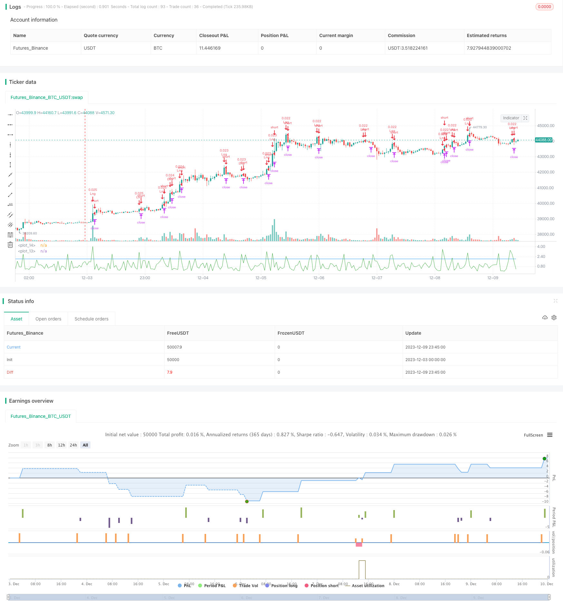

> Name

Mean-Reversion-Trend-Following-Strategy-Based-on-HA-Momentum-Breakout
> Author

ChaoZhang

> Strategy Description


[trans] 

## Overview
This strategy is a quantitative trading strategy that determines the general trend based on the direction of the moving average, and combines it with the HA momentum indicator to determine the breakthrough point to achieve trend tracking. The strategy is simple and easy to understand. It uses moving averages to determine the direction of the general trend, and then uses the HA momentum indicator to determine specific entry points.
## Strategy Principle
This strategy mainly implements trend following through moving averages and HA momentum indicators. The specific logic is:
1. Determine the direction of the general trend: Calculate the 20-day simple moving average and the 200-day simple moving average. When the 20-day line is higher (lower) than the 200-day line, it is judged to be an upward (downward) trend.
2. Determine the timing of entry: Calculate the HA momentum indicator, which determines strength by comparing the size of the real part. When the indicator is greater than the parameter HA\_Candle\_strength, it is regarded as momentum amplification and you can enter the market. In addition, check the closing price above/below the 20-day moving average to determine the direction of the breakout.
3. Set stop loss and take profit exits: The strategy sets stop loss and take profit based on the profit and loss number.
Through the above process, the strategy can capture the middle part when the trend occurs and implement the trend tracking operation.
## Advantage Analysis
This strategy has the following advantages:
1. The strategy logic is simple and clear, easy to understand and implement, and it is also convenient for parameter tuning.
2. Using moving averages to determine the general trend can effectively filter out some noise and lock in the main trend.
3. The HA momentum indicator determines the strength of the breakthrough and can avoid false breakthroughs.
4. Combined with the moving average direction and momentum indicators, the entry timing selection is more precise.
5. Set up stop-profit and stop-loss exits to control the risk of a single transaction.
## Risk Analysis
This strategy mainly involves the following risks:
1. When the market is consolidating, frequent crossovers are likely to occur, leading to wrong transactions.
2. Improper parameter settings (such as moving average parameters, HA intensity parameters) may lead to leakage.
3. It is unable to adapt to all types of trends in the market, and may suffer large losses during volatile trends.
4. Failure to accurately judge the turning point of the trend, and failure to stop losses in time may increase losses.
Corresponding solutions:
1. Combine with other indicators to filter invalid trading signals.
2. Test and optimize parameters to find the best parameter combination.
3. Combine with volatility indicators and other indicators to avoid wrong transactions in volatile scenarios.
4. Set a trailing stop to lock in profits.
## Optimization direction
Points where this strategy can be further optimized include:
1. Use adaptive moving average parameters instead of fixed parameters to better adapt to market changes.
2. Increase the filtering of indicators such as trading volume to avoid generating false signals when the market is down.
3. Automatically optimize parameters through machine learning methods to make the strategy more stable.
4. Set a dynamic stop loss to capture profits, rather than a simple static stop loss.
5. Combine with more other indicators to judge signal quality and market conditions, such as VIX indicators, etc.
## Summarize
Generally speaking, this strategy is a trend following strategy based on moving averages to determine the general trend, and the HA momentum indicator as the basis for entry. The strategy logic is simple and clear, and the indicators used to make accurate judgments can make part of the profits as the trend changes. At the same time, there are some limitations, which require further testing and optimization, and adding other auxiliary indicators to improve the quality of the strategy. Overall, this strategy provides a better learning case for quantitative trading beginners.
||

## Overview  

This is a quantitative trading strategy that tracks trends by judging the overall trend based on moving averages and determining breakout points using the HA momentum indicator. The strategy is simple and easy to understand, using moving averages to determine the direction of the major trend and then relying on the HA momentum indicator to identify specific entry points.  

## Strategy Logic

The core logic behind this strategy involves using moving averages and the HA momentum indicator to follow trends. Specifically:

1. Judging Overall Trend: 20-day and 200-day simple moving averages are computed, when the 20-day moving average is above (below) the 200-day line, an upward (downward) trend is determined.  

2. Deciding Entry Timing: The HA momentum indicator is computed by comparing the size of candle body openings, values greater than the HA_Candle_strength parameter imply stronger momentum where positions can be entered. In addition, the closing price is checked to be above/below the 20-day moving average to determine the breakout direction.

3. Setting Stop Loss/Take Profit Exits: Strategy exits are defined based on profit/loss amounts.

Through this process, the strategy is able to capture intermediate parts of established trends and follow them.

## Advantage Analysis 

The advantages of this strategy include:

1. Simple and clear logic that is easy to understand/optimize.  

2. Moving averages filter noise and capture primary trend.

3. HA momentum avoids false breakouts by gauging breakout strength.  

4. Entry timing accuracy is improved via combination of trend direction and momentum.

5. Defined stop loss/take profit exits control single trade risk.

## Risk Analysis

Main risks faced by this strategy:

1. Frequent crossover signals may lead to bad trades in ranging markets.

2. Inappropriate parameter settings could lead to missed trades or false signals.  

3. Unable to adapt across all market regime types, may face larger losses in choppy sideways markets.

4. Failure to identify trend reversal points in a timely manner could lead to amplified losses.

Corresponding solutions:

1. Additional filters to eliminate invalid signals.  

2. Parameter optimization testing to find ideal parameter combinations.

3. Incorporate volatility metrics to avoid mistakes in choppy markets. 

4. Use adaptive stop loss orders to lock in profits.

## Enhancement Opportunities 

Further improvements for this strategy:

1. Employ adaptive moving average periods instead of fixed values to improve robustness.  

2. Add volume filter to avoid signals when market conviction weak.

3. Auto-optimize parameters via machine learning for increased stability.  

4. Dynamic trailing stop loss instead of static stop loss to capture profits.

5. Incorporate more indicators judging quality and market conditions.

## Conclusion

In summary, this is a trend following strategy based on determining the direction of the prevailing trend with moving averages and using HA momentum for timing entry signals. The logic is simple and clear, providing precise signal generation during trend progression. There are some limitations that need to be addressed via further optimization and additional filters, but overall this strategy serves as a good introductory example for aspiring quant traders to learn from.

[/trans]

> Strategy Arguments


|Argument|Default|Description|
|----|----|----|
|v_input_1|200|MA for trend direction|
|v_input_2|2|HA candle strength|


> Source (PineScript)

``` pinescript
/*backtest
start: 2023-12-03 00:00:00
end: 2023-12-10 00:00:00
period: 45m
basePeriod: 5m
exchanges: [{"eid":"Futures_Binance","currency":"BTC_USDT"}]
*/

//@version=3
strategy("HA Trend Following", overlay=false, default_qty_type = strategy.percent_of_equity, default_qty_value = 2)


//parameters input
Trend_DIR_MA   = input(defval = 200, title = "MA for trend direction")
HA_Candle_strength   = input(defval = 2, title = "HA candle strength")

Rng = abs(open - close)

// HA_Momentum - size of break out body
HA_Momentum = sma(Rng, 1) / sma(Rng, 5)
plot(HA_Momentum, color=green, linewidth=1, style=line)
plot(HA_Candle_strength, color= blue)

// open position
longCondition = close > sma(close, 20) and (sma(close, 20) > sma(close, Trend_DIR_MA) )and HA_Momentum > HA_Candle_strength and close - open > 0
if (longCondition)
    strategy.entry(id = "Lng", long = true)

ShortCondition = close < sma(close, 20) and (sma(close, 20) < sma(close, Trend_DIR_MA) ) and HA_Momentum > HA_Candle_strength and close - open < 0
if (ShortCondition)
    strategy.entry(id = "Shrt", long = false)


// close position
strategy.exit("ExL", from_entry = "Lng", loss = 500 , profit = 1500)
strategy.exit("ExS", from_entry = "Shrt", loss = 500 , profit = 1500)


```

> Detail

https://www.fmz.com/strategy/435017

> Last Modified

2023-12-11 16:56:47
