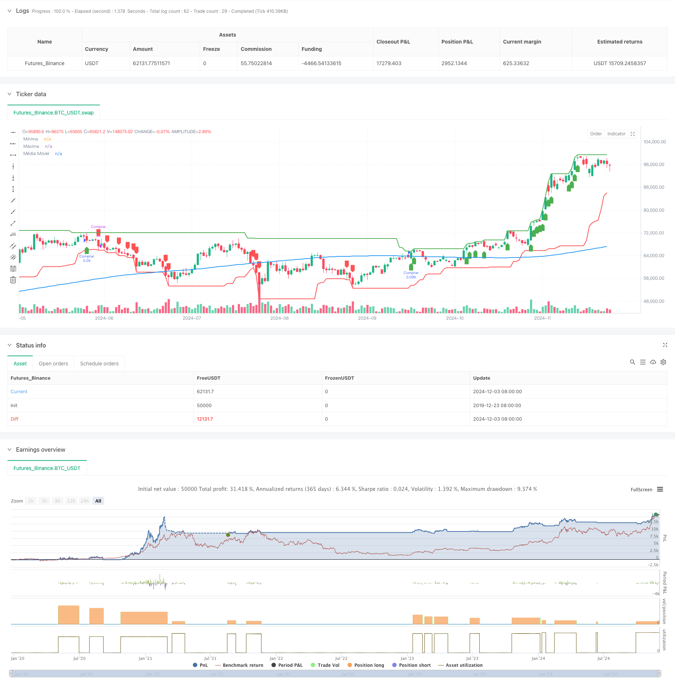

> Name

Historical-Breakout-Trend-System-with-Moving-Average-Filter-HBTS
> Author

ChaoZhang

> Strategy Description



[trans]
#### Overview
This strategy is a trend following system based on historical price breakouts and moving average filtering. It combines multi-period price breakout signals and moving averages to identify market trends, and captures mid- and long-term market trends through strict entry and exit rules. The strategy uses a 55-day price breakthrough as a long signal, a 20-day price breakthrough as a closing signal, and introduces a 200-day moving average as a trend filter to effectively reduce the risk of false breakthroughs.
#### Strategy Principle
The core logic of the strategy is based on price breakouts and trend following. Specifically:
1. Entry signal: When the price reaches a new 55-day high and the closing price is above the 200-day moving average, the system issues a long signal
2. Exit signal: When the price falls below the 20-day low, the system closes the position and ends the transaction.
3. Trend filtering: Use the 200-day moving average as the basis for judging the general trend, and only open positions above the moving average.
4. Position management: Use 10% of the account net value as the capital ratio for each transaction
5. Moving average selection: supports four moving average methods: SMA, EMA, WMA, and VWMA, which can be flexibly selected according to different market characteristics.
#### Strategic Advantages
1. The logic is simple and clear: the strategy uses classic price breakouts and moving average indicators, which are easy to understand and execute.
2. Improved risk control: Clear stop loss conditions are set, and risks are managed through moving average filtering and position control.
3. Strong adaptability: parameters can be adjusted to adapt to different market environments
4. Strong trend capturing ability: Confirm the trend direction through price breakthroughs in multiple time periods
5. High degree of automation: clear policy rules and easy programmatic implementation
#### Strategy Risk
1. Risk of volatile market: False breakthrough signals are prone to occur during the sideways consolidation phase.
2. Slippage risk: In less liquid markets, slippage on breakthroughs may be greater.
3. Trend reversal risk: There may be a large retracement near the turning point of the general trend.
4. Parameter sensitivity: There may be large differences in optimal parameters under different market environments.
5. Fund management risk: fixed ratio positions may be too risky in some circumstances
#### Strategy optimization direction
1. Signal confirmation mechanism: auxiliary indicators such as trading volume breakthroughs can be added to filter out false breakthroughs
2. Dynamic stop loss: Introduce volatility indicators such as ATR to achieve dynamic stop loss
3. Position management optimization: dynamically adjust position proportions based on market volatility
4. Multi-period analysis: Add more time period analysis to improve signal reliability
5. Market environment identification: Add trend strength indicators to determine the current market environment
#### Summary
This is a strategy system that combines the classic Turtle trading rules with modern technical analysis tools. Capture the trend through price breakthroughs, use moving average filtering to confirm the direction, and control risks with reasonable position management. The strategy logic is clear, practical, and has good scalability. Although it may perform poorly in volatile markets, through reasonable parameter optimization and risk control, you can still obtain stable returns in trending markets. It is recommended that traders need to adjust parameters according to specific market characteristics and establish a complete fund management system when applying it in real markets. ||
#### Overview
This strategy is a trend following system based on historical price breakouts and moving average filters. It combines multi-period price breakout signals with moving averages to identify market trends, using strict entry and exit rules to capture medium to long-term market movements. The strategy uses 55-day price breakouts for long signals, 20-day price breakouts for exits, and incorporates a 200-day moving average as a trend filter to effectively reduce false breakout risks.

#### Strategy Principles
The core logic is built on price breakouts and trend following. Specifically:
1. Entry Signal: System generates a long signal when price makes a 55-day high and closes above the 200-day moving average
2. Exit Signal: System closes positions when price breaks below the 20-day low
3. Trend Filter: Uses 200-day moving average as major trend indicator, only entering longs above the average
4. Position Management: Uses 10% of account equity for each trade
5. Moving Average Options: Supports SMA, EMA, WMA, VWMA, allowing flexibility based on market characteristics

#### Strategy Advantages
1. Clear Logic: Strategy uses classic price breakout and moving average indicators, easy to understand and execute
2. Robust Risk Control: Has clear stop-loss conditions, manages risk through moving average filters and position control
3. High Adaptability: Can be adjusted through parameters to suit different market environments
4. Strong Trend Capturing: Uses multiple timeframe price breakouts to confirm trend direction
5. High Automation: Clear strategy rules facilitate programmatic implementation

#### Strategy Risks
1. Choppy Market Risk: Prone to false breakouts during consolidation phases
2. Slippage Risk: May experience significant slippage in less liquid markets
3. Trend Reversal Risk: Potential for large drawdowns near major trend turning points
4. Parameter Sensitivity: Optimal parameters may vary significantly across different market environments
5. Money Management Risk: Fixed proportion positioning may be too risky in certain situations

#### Optimization Directions
1. Signal Confirmation: Can add volume breakout and other auxiliary indicators to filter false breakouts
2. Dynamic Stop Loss: Incorporate ATR and other volatility indicators for dynamic stop loss
3. Position Management: Dynamically adjust position size based on market volatility
4. Multi-timeframe Analysis: Add more timeframe analysis to improve signal reliability
5. Market Environment Recognition: Add trend strength indicators to judge current market conditions

#### Summary
This is a strategic system that combines classic turtle trading rules with modern technical analysis tools. It captures trends through price breakouts, confirms direction using moving averages, and controls risk with reasonable position management. The strategy logic is clear, practical, and has good scalability. While it may underperform in choppy markets, through proper parameter optimization and risk control, it can still achieve stable returns in trending markets. Traders are advised to adjust parameters based on specific market characteristics and establish comprehensive money management systems when applying to live trading.[/trans]


> Source (PineScript)

``` pinescript
/*backtest
start: 2019-12-23 08:00:00
end: 2024-12-04 00:00:00
period: 1d
basePeriod: 1d
exchanges: [{"eid":"Futures_Binance","currency":"BTC_USDT"}]
*/

//@version=5
strategy("Turtle Traders - Andrei", overlay=true, 
     default_qty_type=strategy.percent_of_equity, default_qty_value=10)

// ====== Inputs ======
// Período para a máxima das compras
lookback_buy = input.int(title="Período para Máxima de Compra", defval=55, minval=1)

// Período para a mínima das vendas
lookback_sell = input.int(title="Período para Mínima de Venda", defval=20, minval=1)

// Período da Média Móvel
ma_length = input.int(title="Período da Média Móvel", defval=200, minval=1)

// Tipo de Média Móvel
ma_type = input.string(title="Tipo de Média Móvel", defval="SMA", options=["SMA", "EMA", "WMA", "VWMA"])

// ====== Cálculos ======
// Cálculo da Média Móvel baseada no tipo selecionado
ma = switch ma_type
    "SMA" => ta.sma(close, ma_length)
    "EMA" => ta.ema(close, ma_length)
    "WMA" => ta.wma(close, ma_length)
    "VWMA" => ta.vwma(close, ma_length)

// Cálculo da máxima dos últimos 'lookback_buy' candles
highest_buy = ta.highest(high, lookback_buy)

// Cálculo da mínima dos últimos 'lookback_sell' candles
lowest_sell = ta.lowest(low, lookback_sell)

// ====== Condições de Negociação ======
// Condição de entrada: fechamento acima da máxima dos últimos 'lookback_buy' candles E acima da MA
longCondition = (high == highest_buy) and (close > ma)

if (longCondition)
    strategy.entry("Comprar", strategy.long)

// Condição de saída: fechamento abaixo da mínima dos últimos 'lookback_sell' candles
exitCondition = (low == lowest_sell)

if (exitCondition)
    strategy.close("Comprar")

// ====== Plotagens ======
// Plotar a máxima de 'lookback_buy' candles
plot(highest_buy, color=color.green, title="Máxima", linewidth=2)

// Plotar a mínima de 'lookback_sell' candles
plot(lowest_sell, color=color.red, title="Mínima", linewidth=2)

// Plotar a Média Móvel
plot(ma, color=color.blue, title="Média Móvel", linewidth=2)

// ====== Sinais Visuais ======
// Sinal de entrada
plotshape(series=longCondition, location=location.belowbar, color=color.green, 
          style=shape.labelup, title="Sinal de Compra", text="")

// Sinal de saída
plotshape(series=exitCondition, location=location.abovebar, color=color.red, 
          style=shape.labeldown, title="Sinal de Venda", text="")

```

> Detail

https://www.fmz.com/strategy/474020

> Last Modified

2024-12-05 14:40:05
