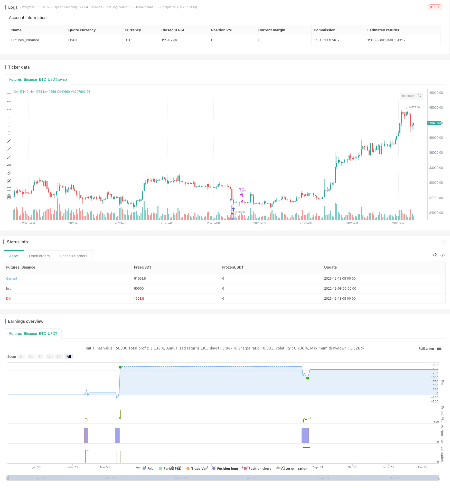

> Name

Qiming Double Offset Mean Reversion Trading Strategy HYE-Mean-Reversion-SMA-Strategy
> Author

ChaoZhang

> Strategy Description


 [trans]

## Overview
Qiming Double Offset Mean Reversion Trading Strategy (HYE Mean Reversion SMA Strategy) is a mean reversion trading strategy that uses simple moving averages and relative strength indicators. This strategy uses the RSI indicator to filter signals when the price deviates from the moving average to generate buy and sell signals, which is a short-term trading strategy.
## Strategy Principle
This strategy is mainly based on the following rules:
1. When the 2-period simple moving average falls by 3% relative to the 5-period simple moving average, the stock price is deemed to have deviated from the mean, and a buy signal is generated;
2. When the 2-period simple moving average crosses the 5-period simple moving average, it is deemed that the price has returned to the mean and a sell signal is generated;
3. Combined with the exponential moving average of the 5-period RSI indicator, a buy signal is generated only when the RSI is below 30, and a sell signal is generated when the RSI is above 70, thereby avoiding unnecessary transactions.
The main idea of ​​this strategy is to use short-term price fluctuations to capture mean reversion opportunities. Buy when the price drops by a certain amount, sell when the price returns to the moving average, and realize profits. At the same time, the RSI indicator can be used to identify overbought and oversold conditions and filter out some noisy trading signals.
## Strategic advantage analysis
This strategy has the following advantages:
1. Simple operation, easy implementation, and low monitoring cost;
2. Use the characteristics of price deviation from the moving average to capture short-term mean reversion opportunities, and the historical backtesting effect is good;
3. The RSI indicator can effectively filter out noise trading and avoid chasing highs and selling lows;
4. Parameters can be flexibly adjusted to adapt to different market environments;
5. You can only do long, only short or two-way transactions to meet different preferences.
## Risk Analysis
There are also some risks with this strategy:
1. Return trading relies on the price returning to the moving average. If the price changes drastically, the risk of stop loss is greater;
2. Improper parameter settings may lead to too frequent transactions or missed opportunities;
3. Strategy performance is highly correlated with the market, and performs poorly in sideways and volatile markets.
Countermeasures:
1. Set stop loss reasonably to control single loss;
2. Gradually optimize parameters and evaluate the return drawdown ratio;
3. Combine with stock index to enhance the adaptability of the strategy.
## Optimization direction
This strategy can be optimized from the following aspects:
1. Test different moving average combinations and find optimal parameters;
2. Try to combine other indicators to identify trends and improve the strategy winning rate;
3. Add a stop-loss mechanism and reduce the maximum drawdown of the strategy;
4. Optimize trading rules and improve profitability factors;
5. Combine with machine learning technology to establish adaptive parameters.
## Summarize
Qiming Double Offset Mean Reversion Trading Strategy is a simple and practical short-term mean reversion strategy. It uses the deviation of price relative to the moving average to generate trading signals, while using the RSI indicator to filter out noise and perform well in backtesting. This strategy is simple to operate and easy to implement. The parameters can be adjusted according to the market environment. It is suitable for investors who track mean reversion in the short term. However, we should also pay attention to the return uncertainty and stop loss risk, which need to be reasonably optimized to adapt to different market conditions. Overall, this strategy provides a mean reversion strategy template worthy of reference for quantitative trading.
||


## Overview  

The HYE Mean Reversion SMA Strategy is a mean reversion trading strategy using simple moving averages and the relative strength index (RSI). It generates buy and sell signals when the price deviates from the moving average by a certain percentage, combined with RSI indicator filtering. It is a short-term trading strategy.  

## Strategy Logic  

The strategy is mainly based on the following rules:  

1. When the 2-period simple moving average falls 3% below the 5-period simple moving average, it is considered the price deviates from the mean and a buy signal is generated.  

2. When the 2-period SMA crosses over the 5-period SMA, it is considered the price reverts to the mean and a sell signal is generated.
 
3. Combined with the exponential moving average of 5-period RSI, buy signals are only generated when RSI is below 30 and sell signals when RSI is above 70, to avoid unnecessary trading.  

The main idea is to capture mean reversion opportunities by using short-term price fluctuations. Buy when the price drops by a certain percentage, sell when the price reverts near the moving average, to make a profit. Meanwhile, the RSI indicator can identify overbought and oversold conditions to filter out some noisy trading signals.   

## Advantage Analysis   

The strategy has the following advantages:  

1. Simple to implement with low monitoring costs.  

2. Captures short-term mean reversion opportunities using price deviation from moving averages. Good backtest performances historically.
   
3. RSI indicator can effectively filter noise trading and avoid chasing peaks and killing valleys.  

4. Flexible parameter adjustment adaptable to different market environments. 

5. Supports long only, short only or both directions trading to suit different preferences.  

## Risk Analysis   

There are also some risks:   

1. Mean reversion relies on the price reverting to the moving average. There are high stop loss risks if drastic price changes occur.  

2. Improper parameter settings may lead to over-trading or missing opportunities.  

3. Performance is highly correlated with the market. Underperforms in range-bound and volatile markets.  

Countermeasures:  

1. Set proper stop loss to control single trade loss.  

2. Gradually optimize parameters and evaluate risk adjusted returns.

3. Combine with stock index to enhance adaptivity.  

## Optimization Directions    

The strategy can be optimized in the following aspects:  

1. Test different moving average combinations to find optimal parameters.  

2. Try incorporating other indicators to identify trends and improve win rate.   

3. Add stop loss mechanisms to reduce maximum drawdown. 

4. Optimize entry and exit rules to improve profit factors.  

5. Adopt machine learning techniques to build adaptive parameters.  

## Conclusion   

The HYE Mean Reversion SMA Strategy is a simple and practical short-term mean reversion strategy. It uses the price deviation from moving averages to generate trading signals, filtering out noise with RSI indicator. It demonstrated good backtest performances. The strategy is easy to implement with adjustable parameters adaptive to different market environments. But the uncertainty of reversion and stop loss risks should be noted, necessitating proper optimization for different market conditions. Overall, it provides a good reference mean reversion strategy template for quantitative trading.  
[/trans]

> Strategy Arguments


|Argument|Default|Description|
|----|----|----|
|v_input_1_close|0|Source: close|high|low|open|hl2|hlc3|hlcc4|ohlc4|
|v_input_2|0|Trade Direction: Long Only|Short Only|Both|
|v_input_3|2|Small Moving Average|
|v_input_4|5|Big Moving Average|
|v_input_5|3|Percent below to buy %|
|v_input_6|3|Percent above to sell %|
|v_input_7|2|Rsi Period|
|v_input_8|30|Maximum Rsi Level for Buy|
|v_input_9|70|Minimum Rsi Level for Sell|
|v_input_10|true|Start Date|
|v_input_11|true|Start Month|
|v_input_12|2020|Start Year|
|v_input_13|31|End Date|
|v_input_14|12|End Month|
|v_input_15|2021|End Year|


> Source (PineScript)

``` pinescript
/*backtest
start: 2022-12-08 00:00:00
end: 2023-12-14 00:00:00
period: 1d
basePeriod: 1h
exchanges: [{"eid":"Futures_Binance","currency":"BTC_USDT"}]
*/

// @version=4

strategy("HYE Mean Reversion SMA [Strategy]", overlay = true )
  
//Strategy inputs
source = input(title = "Source", defval = close)
tradeDirection = input(title="Trade Direction", type=input.string,
     options=["Long Only", "Short Only", "Both"], defval="Long Only") 
smallMAPeriod = input(title = "Small Moving Average", defval = 2)
bigMAPeriod = input(title = "Big Moving Average", defval = 5)
percentBelowToBuy = input(title = "Percent below to buy %", defval = 3)
percentAboveToSell = input(title = "Percent above to sell %", defval = 3)
rsiPeriod = input(title = "Rsi Period", defval = 2)
rsiLevelforBuy = input(title = "Maximum Rsi Level for Buy", defval = 30)
rsiLevelforSell = input(title = "Minimum Rsi Level for Sell", defval = 70)
     
longOK  = (tradeDirection == "Long Only") or (tradeDirection == "Both")
shortOK = (tradeDirection == "Short Only") or (tradeDirection == "Both")

// Make input options that configure backtest date range
startDate = input(title="Start Date", type=input.integer,
     defval=1, minval=1, maxval=31)
startMonth = input(title="Start Month", type=input.integer,
     defval=1, minval=1, maxval=12)
startYear = input(title="Start Year", type=input.integer,
     defval=2020, minval=1800, maxval=2100)

endDate = input(title="End Date", type=input.integer,
     defval=31, minval=1, maxval=31)
endMonth = input(title="End Month", type=input.integer,
     defval=12, minval=1, maxval=12)
endYear = input(title="End Year", type=input.integer,
     defval=2021, minval=1800, maxval=2100)
     
inDateRange = true

//Strategy calculation 
rsiValue = rsi(source, rsiPeriod)
rsiEMA   = ema(rsiValue, 5)
smallMA = sma(source, smallMAPeriod)
bigMA =  sma(source, bigMAPeriod) 
buyMA = ((100 - percentBelowToBuy) / 100) * sma(source, bigMAPeriod)[0]
sellMA = ((100 + percentAboveToSell) / 100) * sma(source, bigMAPeriod)[0]

if(crossunder(smallMA, buyMA) and rsiEMA < rsiLevelforBuy and inDateRange and longOK)
    strategy.entry("BUY", strategy.long) 

if(crossover(smallMA, bigMA) or not inDateRange)
    strategy.close("BUY")

if(crossover(smallMA, sellMA) and rsiEMA > rsiLevelforSell and inDateRange and shortOK)
    strategy.entry("SELL", strategy.short)

if(crossunder(smallMA, bigMA) or not inDateRange)
    strategy.close("SELL")


```

> Detail

https://www.fmz.com/strategy/435520

> Last Modified

2023-12-15 16:51:23
