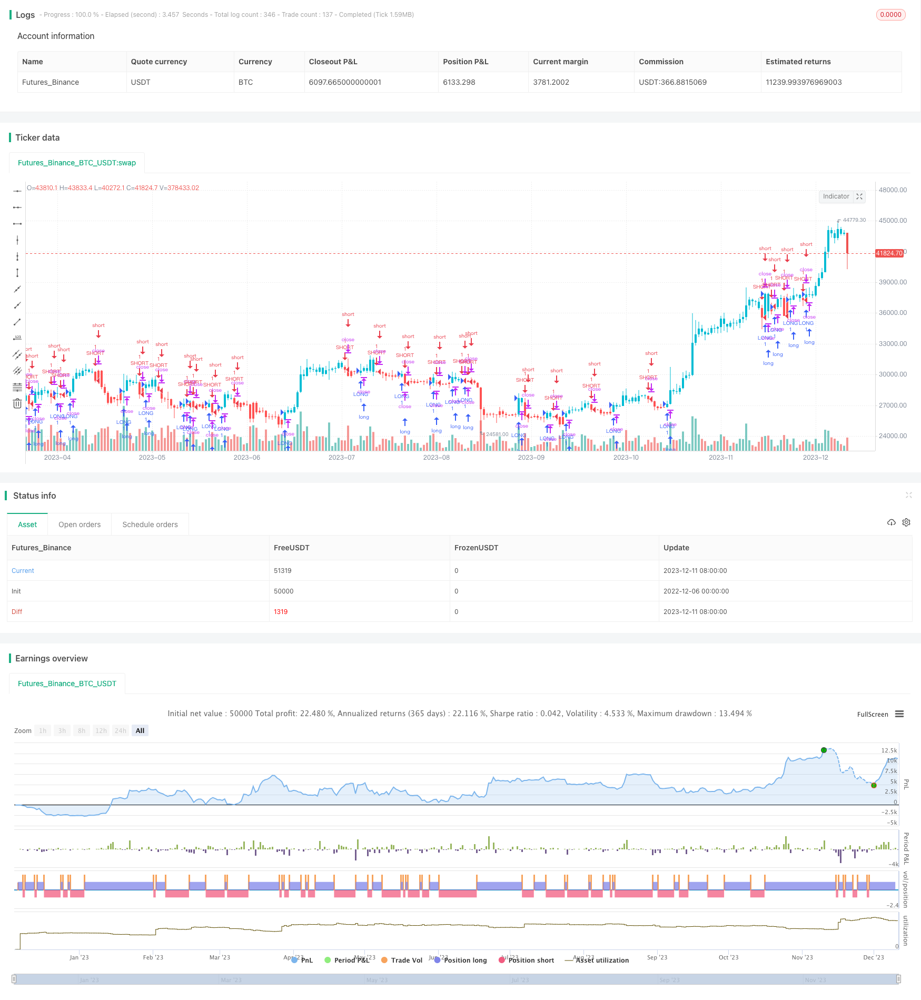

> Name

Smooth Heiken-Ashi-Crossover-Strategy
> Author

ChaoZhang

> Strategy Description



[trans]
## Overview
The smoothed Haijin crossover strategy is a quantitative trading strategy that applies both the Haijin cross principle and smoothing technology. This strategy generates a smoothed price by calculating the average price of 4 periods, and then calculates the Haijin cross based on the smoothed price to send a trading signal. Compared with the original Haijin Cross, this strategy can filter out short-term market noise through smoothing and avoid generating false signals.
## Strategy Principle
This strategy mainly applies the following principles:
1. Principle of Haijin Cross
The Haijin Cross generates a buy or sell signal when the short-term moving average crosses above or below the long-term moving average. In this strategy, the short-term moving average is the smoothed closing price (haclose), and the long-term moving average is the smoothed opening price (haopen).
2. Smoothing technology
In order to filter out noise, this strategy uses the average price of 4 periods to calculate the smoothed price. Right now:
   haclose = (open + high + low + close) / 4  

haopen = the average of the previous haopen + the current haclose
The Haijin cross calculated based on the above smoothed price can produce more reliable trading signals.
When haclose crosses haopen, it is a long signal; when haclose crosses haopen, it is a short signal.
## Advantage Analysis
Compared with the original Haijin crossover strategy, the smoothed Haijin crossover strategy has the following advantages:
1. Smoothing technology filters short-term market noise, avoids generating false signals, and improves signal quality.
2. Using the average price of 4 periods to calculate the smoothed price can better reflect the mid- and long-term trends and generate more reliable trading signals.
3. Combined with the fast crossing characteristics of the Haijin Cross, this strategy can capture the turning point of the mid- to long-term trend in a timely manner.
## Risk Analysis
There are also some risks with this strategy:
1. When the market fluctuates violently, smoothing technology may filter out some effective signals, resulting in missed trading opportunities.
2. The 4-period average calculation will also bring a certain degree of lag, and short-term opportunities may be missed.
3. This strategy has certain requirements for trading frequency and position holding time, and is not suitable for transactions that are too frequent or too long-term.
The above risks can be solved by appropriately optimizing smoothing parameters or combining other indicators.
## Optimization direction
This strategy can be optimized from the following directions:
1. Optimize smoothing parameters, such as adjusting the averaging period, etc., to find the best parameter combination.
2. Combine with other indicators, such as trading volume, Bollinger Bands, etc., to improve the accuracy of signals.
3. Add stop loss strategies to control risks, such as trailing stop loss, shrinking stop loss, etc.
4. Optimize fund management strategies, set reasonable position sizes and stop loss levels, and control single losses.
## Summarize
The smoothed Sea-Golden Cross strategy combines the Sea-Golden Cross principle and smoothing technology, which can effectively explore the turning points of medium and long-term trends and avoid being disturbed by short-term market noise. Compared with the original Haijin Cross strategy, this strategy filters out some noise through smoothing processing and can generate higher quality trading signals. If coupled with appropriate stop loss and capital management methods, this strategy can achieve relatively stable investment returns. However, traders also need to pay attention to guard against risks such as lagging and missing orders, and they need to customize and optimize their strategies.
||

## Overview  

The Heiken Ashi Crossover Strategy is a quantitative trading strategy that applies both the Heiken Ashi crossover principle and smoothing techniques. By calculating the average price over 4 periods to generate the smoothed price, and then computing the Heiken Ashi crossover based on the smoothed prices, it can issue reliable trading signals. Compared with the original Heiken Ashi crossover, this strategy can filter out short-term market noise and avoid wrong signals by using smoothing techniques.  

## Strategy Logic

The core logic behind this strategy includes:   

1. Heiken Ashi Crossover Principle

   Heiken Ashi crossover refers to the buy or sell signals generated when the short-term moving average crosses over or below the long-term moving average. In this strategy, the short-term MA is the smoothed closing price (haclose), while the long-term MA is the smoothed opening price (haopen).

2. Smoothing Techniques

   To filter out noise, this strategy adopts the average price over 4 periods to calculate the smoothed price:  

   haclose = (open + high + low + close) / 4

   haopen = (previous haopen + current haclose) / 2  

The Heiken Ashi crossover signals based on the smoothed prices above can provide more reliable trading signals. A buy signal is generated when haclose crosses over haopen, while a sell signal is triggered when haclose crosses below haopen.

## Advantage Analysis   

Compared with the original Heiken Ashi crossover strategy, the Smoothed Heiken Ashi Crossover Strategy has the following edges:

1. The smoothing techniques filter out short-term market noises and avoid wrong signals, thus improving the quality of trading signals.  

2. By adopting the 4-period average price to calculate the smoothed price, it can better reflect the medium-to-long term trend and generate more reliable trading signals.

3. Combined with the fast-crossover feature of Heiken Ashi, this strategy can timely capture the turning points of medium-to-long term trends.

## Risk Analysis

There are also some risks associated with this strategy:  

1. In periods of violent market fluctuation, the smoothing techniques may filter out some effective signals, thus missing potential trading opportunities.

2. The 4-period moving average calculation also introduces a certain degree of lag, which may result in missing short-term opportunities.  

3. This strategy has some requirements on trading frequency and holding period. It is not suitable for overly frequent or long-term trading.

To tackle the risks above, parameters tuning of the smoothing techniques and incorporating other technical indicators can be helpful solutions.

## Optimization Directions   

This strategy can be optimized in the following aspects:

1. Parameter tuning for the smoothing techniques, like adjusting the moving average period, to find the optimal parameter combination.  

2. Incorporating other indicators like volume, Bollinger Bands etc. to improve the accuracy of trading signals.

3. Adding stop loss strategies like trailing stop loss, pyramiding stop loss to control risks.

4. Optimizing money management by setting proper position sizing and stop loss levels to limit the loss of single trades.

## Conclusion  

The Heiken Ashi Crossover Strategy combines the Heiken Ashi crossover principle and smoothing techniques, which can effectively detect trend turning points in the medium-to-long term without being interfered by short-term market noises. Compared with the original Heiken Ashi crossover, this strategy filters out some noise by smoothing techniques and thus can generate higher quality trading signals. With proper stop loss and money management, this strategy can earn relatively steady returns from the market. However, traders should also be aware of the risks like lag and missing signals, and optimize the strategy accordingly.

[/trans]

> Strategy Arguments


|Argument|Default|Description|
|----|----|----|
|v_input_1|true|From Month|
|v_input_2|true|From Day|
|v_input_3|2017|From Year|
|v_input_4|true|To Month|
|v_input_5|true|To Day|
|v_input_6|9999|To Year|


> Source (PineScript)

``` pinescript
/*backtest
start: 2022-12-06 00:00:00
end: 2023-12-12 00:00:00
period: 1d
basePeriod: 1h
exchanges: [{"eid":"Futures_Binance","currency":"BTC_USDT"}]
*/

//@version=2
strategy("Heikin-Ashi Strategy", overlay=true)

// Plots Color Of Heikin-Ashi Bars while Viewing Candlestics or Bars
//Works on Candlesticks and OHLC Bars - Does now work on Heikin-Ashi bars - But I have verified its accuracy
// Created By User ChrisMoody 1-30-2014 with help from Alex in Tech Support

// === BACKTEST RANGE ===
FromMonth = input(defval = 1, title = "From Month", minval = 1)
FromDay   = input(defval = 1, title = "From Day", minval = 1)
FromYear  = input(defval = 2017, title = "From Year", minval = 1998)
ToMonth   = input(defval = 1, title = "To Month", minval = 1)
ToDay     = input(defval = 1, title = "To Day", minval = 1)
ToYear    = input(defval = 9999, title = "To Year", minval = 1998)


haclose = ((open + high + low + close)/4)//[smoothing]
haopen = na(haopen[1]) ? (open + close)/2 : (haopen[1] + haclose[1]) / 2

heikUpColor() => haclose > haopen
heikDownColor() => haclose <= haopen

barcolor(heikUpColor() ? aqua: heikDownColor() ? red : na)


if (heikUpColor() )
    strategy.entry("LONG", strategy.long, comment="LONG")
    
if (heikDownColor())
    strategy.entry("SHORT", strategy.short, comment="SHORT")


//plot(pos, title="pos", style=line, linewidth=1, color=red )
```

> Detail

https://www.fmz.com/strategy/435286

> Last Modified

2023-12-13 17:46:10
