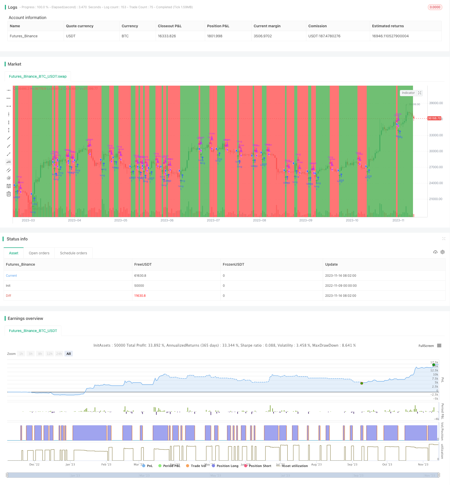

> Name

Heikin-Ashi-Reverse-Strategy
> Author

ChaoZhang

> Strategy Description


[trans]
### Overview
This strategy is mainly based on the improved HA moving average to identify the price turning point to capture relatively obvious trend changes, and is a short-term trading strategy. The strategy uses HA to calculate the opening, high, low, and closing prices of the K line, and determines the final K line color based on the price relationship. When the price rises, it is represented by a green columnar line, and when the price falls, it is represented by a red columnar line. The strategy uses the color change of the HA column line as a trading signal. It goes short when the green turns to red and goes long when the red turns to green. It is a typical reversal strategy.
### Strategy Principles
The core logic of the strategy is mainly to calculate the color change of the HA column line to determine price reversal.
First, choose whether to use HA to calculate the value of the K line based on the input parameters. If you choose to use it, the opening, high, low, and closing prices will be obtained from the HA data; if not, they will be obtained directly from the K-line original data.
```
haClose = UseHAcandles ? security(heikinashi(syminfo.tickerid), timeframe.period, close) : close

haOpen = UseHAcandles ? security(heikinashi(syminfo.tickerid), timeframe.period, open) : open  

haHigh = UseHAcandles ? security(heikinashi(syminfo.tickerid), timeframe.period, high) : high

haLow = UseHAcandles ? security(heikinashi(syminfo.tickerid), timeframe.period, low) : low
```

Then according to the HA calculation formula, the HA opening and closing prices of this period are obtained.
```
haclose = (haOpen + haHigh + haLow + haClose) / 4  

haopen := na(haopen[1]) ? (haOpen + haClose) / 2 : (haopen[1] + haclose[1]) / 2
```

Then calculate the highest and lowest price of HA based on the opening and closing prices of HA.
```
hahigh = max(haHigh, max(haopen, haclose))  

halow = min(haLow, min(haopen, haclose))
``` 

Determine the color of the HA column line in this cycle based on the HA opening and closing price relationship.
```
hacolor = haclose > haopen ? color.green : color.red
```

Determine the price reversal signal based on the HA color change for two consecutive periods.
```
turnGreen = haclose > haopen and haclose[1] <= haopen[1]  

turnRed = haclose <= haopen and haclose[1] > haopen[1]
```

Open long and short positions respectively when long and short signals occur.
```
strategy.entry("long", 1, when=turnGreen)  

strategy.entry("short", 0, when=turnRed)
```

Close the position when the opposite signal occurs.
```
strategy.close("long", when=turnRed)
```

In this way, by judging the change in color of the HA column line, the price reversal point can be captured and a reversal trading strategy can be implemented.
### Advantage Analysis
This strategy mainly has the following advantages:
1. Using improved HA to calculate K-line data can filter out some noise and identify trend reversal points more clearly.
2. Determine the reversal point based only on the simple color change of the HA column line. The strategy logic is simple and clear, and easy to understand and implement.
3. Using the reversal trading method, you can capture trend changes in time and obtain faster reversal profits.
4. It is configurable whether to use HA to calculate K-line data, which can be adjusted according to different markets.
5. Draw the pattern indicator candle to facilitate intuitive judgment of price reversal points.
6. It can be adjusted by optimizing parameters such as trading cycles, etc., and is suitable for different varieties.
### Risk Analysis
There are also some risks to be aware of with this strategy:
1. It is easy to get trapped in reversal trading, so it is necessary to ensure that the reversal signal has sufficient reliability.
2. In volatile markets, reversal signals may appear frequently, causing overtrading.
3. Unable to judge the length of the trend, it may continue the original trend after reversal and cause losses.
4. A single indicator is susceptible to false breakthroughs and should be used in combination with other indicators.
5. It is necessary to verify whether the parameters have been fully optimized to avoid overfitting.
Corresponding solutions:
1. Optimize parameters to ensure stable and reliable trading signals.
2. Combine with trend filtering to avoid volatile market transactions.
3. Set up a stop-loss exit mechanism to control single losses.
4. Combine other indicators for confirmation to avoid false signals.
5. Fully backtest and optimize parameters to prevent overfitting.
### Optimization direction
This strategy can be optimized from the following aspects:
1. Optimize the trading cycle parameters to adapt to the characteristics of different varieties.
2. Test whether to use HA value and choose according to the characteristics of the trading variety.
3. Add trend filter conditions to avoid shock market reversal.
4. Set dynamic stop loss and adjust the stop loss position according to market fluctuations.
5. Combine with other indicators to confirm trading signals.
6. Add fund management strategies and adjust positions.
7. Expand the implementation of multi-variety arbitrage transactions.
8. Correct parameters based on backtest results to prevent overfitting.
### Summarize
This strategy takes advantage of the improved HA moving average and finds possible price reversal points by judging the color changes of the HA column line. Compared with using K-line directly, HA moving average can filter out some noise and make the reversal signal clearer. The strategy implements reversal trading ideas in a simple and intuitive way, with simple and clear logic and easy real-time operation. However, reversal trading also involves the risk of being trapped, and signal accuracy needs to be further optimized. In addition, you can try to combine it with other factors such as trend judgment to form a more complete trading system. Generally speaking, this strategy provides an idea for discovering reversal points based on HA data, which can be expanded and optimized to develop a reversal trading strategy that suits you.
||

### Overview

This strategy mainly uses improved Heikin-Ashi candles to identify reversal points in price and catch significant trend changes. It belongs to short-term trading strategies. The strategy calculates open, high, low and close prices of candles using HA, and determines the final color based on price relationship. Green candles represent rising prices and red candles represent falling prices. The strategy uses HA candle color change as trading signals to go short on green to red change and go long on red to green change. It is a typical reversal strategy.

### Strategy Logic

The core logic of the strategy is to detect color change in HA candles to determine price reversal.

First, get open, high, low and close prices from HA data or original data based on input parameter.

```
haClose = UseHAcandles ? security(heikinashi(syminfo.tickerid), timeframe.period, close) : close

haOpen = UseHAcandles ? security(heikinashi(syminfo.tickerid), timeframe.period, open) : open  

haHigh = UseHAcandles ? security(heikinashi(syminfo.tickerid), timeframe.period, high) : high

haLow = UseHAcandles ? security(heikinashi(syminfo.tickerid), timeframe.period, low) : low
```

Then calculate current HA open and close according to formulas.

```
haclose = (haOpen + haHigh + haLow + haClose) / 4  

haopen := na(haopen[1]) ? (haOpen + haClose) / 2 : (haopen[1] + haclose[1]) / 2
```

Further get HA highest and lowest prices. 

```
hahigh = max(haHigh, max(haopen, haclose))

halow = min(haLow, min(haopen, haclose))  
```

Determine HA candle color based on open/close relationship.

```
hacolor = haclose > haopen ? color.green : color.red
```

Identify reversal signals based on HA color change between bars.

```
turnGreen = haclose > haopen and haclose[1] <= haopen[1]  

turnRed = haclose <= haopen and haclose[1] > haopen[1] 
```

Open long/short positions when signals trigger.

```
strategy.entry("long", 1, when=turnGreen)
  
strategy.entry("short", 0, when=turnRed) 
```

Close positions on opposite signals.

```
strategy.close("long", when=turnRed)
```

By detecting HA candle color changes, the strategy captures price reversal points for reversal trading.

### Advantages

The main advantages of this strategy are:

1. Using improved HA candles filters noise and identifies reversals more clearly.

2. Simple logic based on HA color change, easy to understand and implement.

3. Reversal trading captures trend changes quickly for profit. 

4. Customizable to use HA candles or not for different markets.

5. Candlestick arrows visually indicate reversals.

6. Parameters like timeframe can be optimized for different products.

### Risks

There are also some risks to note:

1. Reversal trading can be vulnerable to traps. Signals need solid reliability.

2. Frequent whipsaws may occur in ranging markets.

3. Unable to determine trend duration, may reverse then continue trend.

4. Single indicator prone to false signals, should combine with others. 

5. Overfitting needs to be avoided through optimization.

Solutions:

1. Optimize parameters for reliable signals.

2. Add trend filter to avoid ranging markets.

3. Use stop loss to control loss per trade.

4. Confirm signals with other indicators to avoid false signals.

5. Thoroughly backtest to optimize parameters and prevent overfitting.

### Improvement

The strategy can be improved in the following ways:

1. Optimize timeframe for different products.

2. Test HA candle usage per product characteristics.

3. Add trend filter to avoid whipsaws in ranging markets. 

4. Implement dynamic stops based on market volatility.

5. Confirm signals with additional indicators.

6. Incorporate position sizing based on risk management.

7. Expand for multi-product arbitrage trading. 

8. Adjust parameters based on backtest results to prevent overfitting.

### Conclusion

This strategy leverages the strengths of improved HA candles to discover potential reversal points through HA color changes. Compared to regular candles, HA filters noise for cleaner signals. The strategy implements reversal trading logic in a simple and intuitive way that is easy to use for live trading. But reversal trades face trapping risks and should be optimized for greater signal accuracy. Combining with trend analysis and other factors can form a more complete system. Overall, this strategy provides an approach to identifying reversals using HA data and can be expanded on for robust reversal trading strategies.

[/trans]

> Strategy Arguments


|Argument|Default|Description|
|----|----|----|
|v_input_1|true|Use Heikin Ashi Candles in Algo Calculations|


> Source (PineScript)

``` pinescript
/*backtest
start: 2022-11-09 00:00:00
end: 2023-11-15 00:00:00
period: 1d
basePeriod: 1h
exchanges: [{"eid":"Futures_Binance","currency":"BTC_USDT"}]
*/

//@version=4
strategy("Heikin-Ashi Change Strategy", overlay=true)

UseHAcandles    = input(true, title="Use Heikin Ashi Candles in Algo Calculations")
//
// === /INPUTS ===

// === BASE FUNCTIONS ===

haClose = UseHAcandles ? security(heikinashi(syminfo.tickerid), timeframe.period, close) : close
haOpen  = UseHAcandles ? security(heikinashi(syminfo.tickerid), timeframe.period, open) : open
haHigh  = UseHAcandles ? security(heikinashi(syminfo.tickerid), timeframe.period, high) : high
haLow   = UseHAcandles ? security(heikinashi(syminfo.tickerid), timeframe.period, low) : low

// Calculation HA Values 
haopen = 0.0
haclose = (haOpen + haHigh + haLow + haClose) / 4
haopen := na(haopen[1]) ? (haOpen + haClose) / 2 : (haopen[1] + haclose[1]) / 2
hahigh = max(haHigh, max(haopen, haclose))
halow = min(haLow, min(haopen, haclose))

// HA colors
hacolor = haclose > haopen ? color.green : color.red

// Signals
turnGreen = haclose > haopen and haclose[1] <= haopen[1]
turnRed = haclose <= haopen and haclose[1] > haopen[1]

// Plotting
bgcolor(hacolor)

plotshape(turnGreen, style=shape.arrowup, location=location.belowbar, color=color.green)
plotshape(turnRed, style=shape.arrowdown, location=location.abovebar, color=color.red)

// Alerts
alertcondition(turnGreen, "ha_green", "ha_green")
alertcondition(turnRed, "ha_red", "ha_red")

strategy.entry("long", 1, when=turnGreen)
//strategy.entry("short", 0, when=turnRed)
strategy.close("long", when=turnRed)

```

> Detail

https://www.fmz.com/strategy/432333

> Last Modified

2023-11-16 15:44:14
