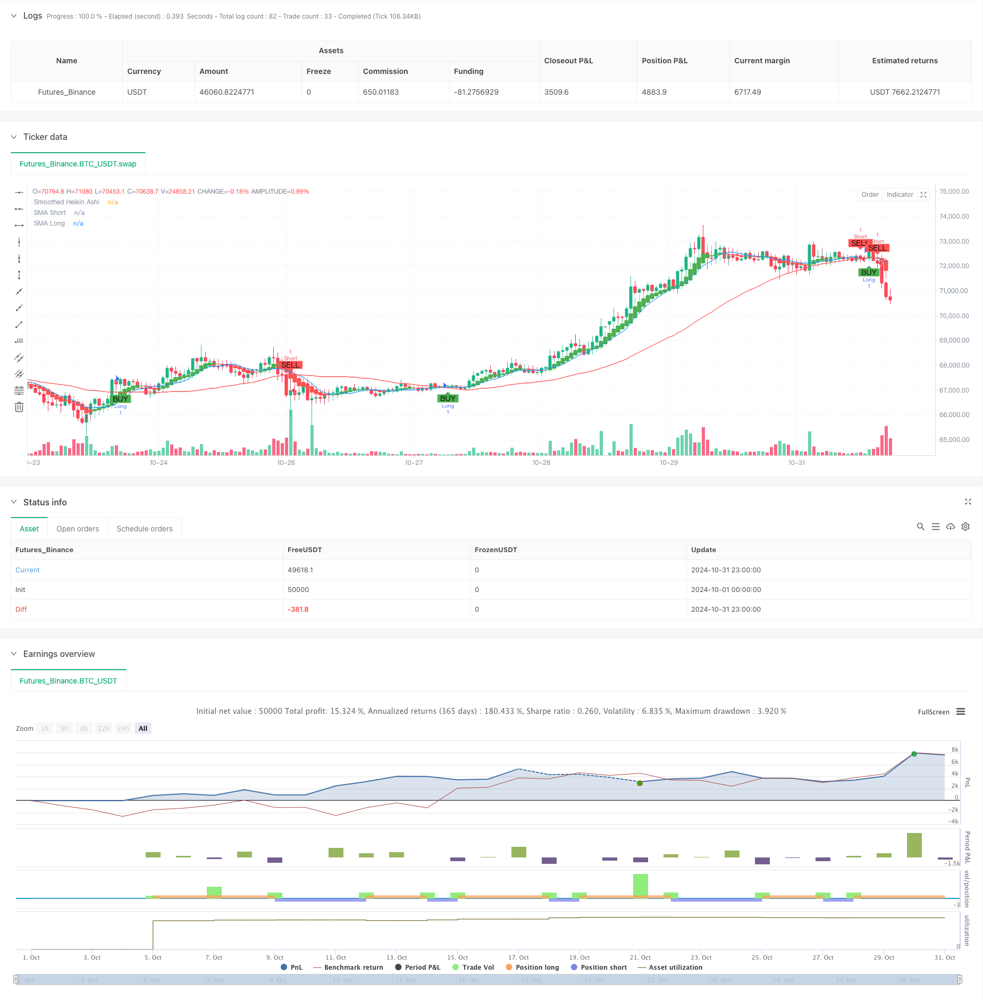

> Name

Smoothed-Heikin-Ashi-with-SMA-Crossover-Trend-Following-Strategy
> Author

ChaoZhang

> Strategy Description



[trans]
#### Overview
This strategy is a trend following system based on smoothed Heikin-Ashi candlesticks and simple moving average (SMA) crossovers. The strategy identifies trend changes through the intersection of the EMA smoothed Heikin-Ashi candle chart and the 44-period SMA, thereby capturing the market's main trend opportunities. The strategy is designed with a dynamic position management mechanism that will automatically close positions when the price is too close to the long-term moving average to avoid the risk of market consolidation.
#### Strategy Principle
The core logic of the strategy contains three key elements: first, the traditional K-line is converted into a Heikin-Ashi candle chart, and the market noise is filtered by calculating the arithmetic mean of the four opening, high and low closing prices; secondly, the 6-period EMA is used to smooth the Heikin-Ashi to further improve the reliability of the signal; finally, the smoothed Heikin-Ashi closing price is combined with the 44-period SMA to generate a long signal through an upward crossing and a short signal through a downward crossing. At the same time, the concept of "no position threshold" is introduced. When the distance between the price and the long-term moving average is less than the threshold, a closing signal is triggered, effectively avoiding frequent transactions caused by sideways market conditions.
#### Strategic Advantages
1. The signal filtering mechanism is perfect, and the possibility of false breakthroughs is significantly reduced through dual smoothing of Heikin-Ashi and EMA.
2. The trend tracking logic is clear and can effectively capture the big trend market.
3. Designed a dynamic stop loss mechanism to exit the market promptly during sideways trading.
4. The parameters are set reasonably, and the ratio of the short-term moving average of 11 periods and the long-term moving average of 44 periods is in line with the rules of market operation.
5. Excellent visualization effect, clear and intuitive trading signals
#### Strategy Risk
1. There may be a certain lag in the early stage of trend reversal, resulting in a slight delay in entry timing.
2. In a highly volatile market environment, false cross signals may be generated
3. It is sensitive to parameter settings, and different varieties may require targeted adjustments.
4. Frequent trading may occur in a market that lacks an obvious trend
#### Strategy optimization direction
1. It is recommended to add a trend strength filter, such as the ADX indicator, and only open a position when the trend is obvious.
2. A transaction confirmation mechanism that coordinates volume and price can be introduced to improve signal reliability.
3. Consider adding an anti-slip point mechanism to avoid frequent transactions near important prices.
4. A dynamic stop-profit and stop-loss mechanism can be designed and automatically adjusted according to market volatility.
5. It is recommended to add a position management module and dynamically adjust the position ratio according to the strength of the trend.
#### Summary
This strategy builds a robust trend-following trading system by combining the Heikin-Ashi candlestick chart and the SMA moving average system. The strategy has a complete signal generation mechanism and reasonable risk control, and is particularly suitable for application in markets with obvious trend characteristics. Through the suggested optimization direction, the actual combat effect of the strategy can be further improved. Overall, this is a well-designed and logical trend following strategy. ||
#### Overview
This strategy is a trend following system based on smoothed Heikin-Ashi candlesticks and Simple Moving Average (SMA) crossovers. It identifies trend changes through the intersection of EMA-smoothed Heikin-Ashi candlesticks with a 44-period SMA to capture major trend opportunities in the market. The strategy incorporates a dynamic position management mechanism that automatically closes positions when prices are too close to the long-term moving average, avoiding oscillation risks in consolidating markets.

#### Strategy Principles
The core logic consists of three key elements: First, converting traditional candlesticks into Heikin-Ashi candlesticks by calculating the arithmetic mean of open, high, low, and close prices to filter market noise; Second, using a 6-period EMA to smooth the Heikin-Ashi, further enhancing signal reliability; Finally, combining the smoothed Heikin-Ashi closing price with a 44-period SMA, generating long signals on upward crosses and short signals on downward crosses. The concept of a "no position threshold" is introduced, triggering position closure when the price-to-long-term-average distance is below the threshold, effectively avoiding frequent trades during consolidation phases.

#### Strategy Advantages
1. Comprehensive signal filtering mechanism, significantly reducing false breakouts through dual smoothing with Heikin-Ashi and EMA
2. Clear trend following logic capable of effectively capturing major trend movements
3. Dynamic stop-loss mechanism designed to exit timely during consolidation
4. Reasonable parameter settings with 11-period short-term and 44-period long-term moving averages aligning with market patterns
5. Excellent visualization with clear and intuitive trading signals

#### Strategy Risks
1. Potential lag in initial trend reversal phases leading to slightly delayed entries
2. Possibility of false crossover signals in highly volatile market conditions
3. Sensitivity to parameter settings requiring specific adjustments for different instruments
4. Potential frequent trading in markets lacking clear trends

#### Strategy Optimization Directions
1. Recommend adding trend strength filters like ADX indicator, trading only in clear trends
2. Can introduce volume-price confirmation mechanisms to improve signal reliability
3. Consider implementing anti-slippage mechanisms to avoid frequent trading near key price levels
4. Can design dynamic profit/loss mechanisms that adjust automatically based on market volatility
5. Suggest adding position management modules to dynamically adjust holding ratios based on trend strength

#### Summary
The strategy constructs a robust trend following trading system by combining Heikin-Ashi candlesticks with SMA systems. It features comprehensive signal generation mechanisms and reasonable risk control, particularly suitable for markets with distinct trend characteristics. The strategy's practical effectiveness can be further enhanced through the suggested optimization directions. Overall, it represents a well-designed trend following strategy with clear logic.[/trans]


> Source (PineScript)

``` pinescript
/*backtest
start: 2024-10-01 00:00:00
end: 2024-10-31 23:59:59
period: 1h
basePeriod: 1h
exchanges: [{"eid":"Futures_Binance","currency":"BTC_USDT"}]
*/

//@version=5
strategy("Smoothed Heikin Ashi with SMA Strategy", overlay=true)

// Input parameters for SMAs
s1 = input.int(11, title="Short SMA Period")
s2 = input.int(44, title="Long SMA Period")
noPositionThreshold = input.float(0.001, title="No Position Threshold", step=0.0001)

// Calculate the original Heikin-Ashi values
haClose = (open + high + low + close) / 4
var float haOpen = na
haOpen := na(haOpen[1]) ? (open + close) / 2 : (haOpen[1] + haClose[1]) / 2
haHigh = math.max(high, math.max(haOpen, haClose))
haLow = math.min(low, math.min(haOpen, haClose))

// Smoothing using exponential moving averages
smoothLength = input.int(6, title="Smoothing Length")
smoothedHaClose = ta.ema(haClose, smoothLength)
smoothedHaOpen = ta.ema(haOpen, smoothLength)
smoothedHaHigh = ta.ema(haHigh, smoothLength)
smoothedHaLow = ta.ema(haLow, smoothLength)

// Calculate SMAs
smaShort = ta.sma(close, s1)
smaLong = ta.sma(close, s2)

// Plotting the smoothed Heikin-Ashi values
plotcandle(smoothedHaOpen, smoothedHaHigh, smoothedHaLow, smoothedHaClose, color=(smoothedHaClose >= smoothedHaOpen ? color.green : color.red), title="Smoothed Heikin Ashi")
plot(smaShort, color=color.blue, title="SMA Short")
plot(smaLong, color=color.red, title="SMA Long")

// Generate buy/sell signals based on SHA crossing 44 SMA
longCondition = ta.crossover(smoothedHaClose, smaLong)
shortCondition = ta.crossunder(smoothedHaClose, smaLong)
noPositionCondition = math.abs(smoothedHaClose - smaLong) < noPositionThreshold

// Strategy logic
if (longCondition)
    strategy.entry("Long", strategy.long)
if (shortCondition)
    strategy.entry("Short", strategy.short)
if (noPositionCondition and strategy.position_size != 0)
    strategy.close_all("No Position")

// Plot buy/sell signals
plotshape(series=longCondition, location=location.belowbar, color=color.green, style=shape.labelup, text="BUY", size=size.small)
plotshape(series=shortCondition, location=location.abovebar, color=color.red, style=shape.labeldown, text="SELL", size=size.small)
plotshape(series=noPositionCondition and strategy.position_size != 0, location=location.belowbar, color=color.yellow, style=shape.labeldown, text="EXIT", size=size.small)
```

> Detail

https://www.fmz.com/strategy/473398

> Last Modified

2024-11-29 16:39:12
