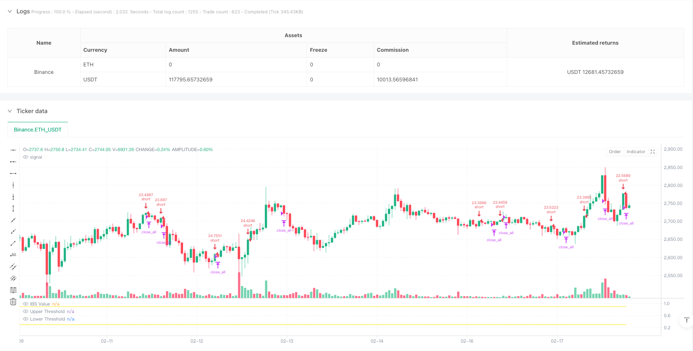
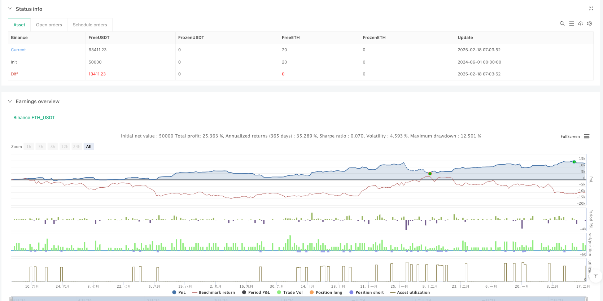

> Name

High-Position-Internal-Bar-Strength-Based-Mean-Reversion-Short-Strategy
> Author

ianzeng123

> Strategy Description





[trans]
#### Overview
This is a short-selling strategy based on the Internal Bar Strength (IBS) indicator, which mainly identifies trading opportunities by monitoring the closing price within the intraday price range. When the IBS indicator shows an overbought status, the strategy will open a short position if certain conditions are met, and close the position when the IBS reaches an oversold level. This strategy is specifically designed for daily level trading in the stock and ETF markets.
#### Strategy Principle
The core of the strategy is to use the IBS indicator to measure the position of the closing price within the high and low range of the day. The calculation formula of IBS is: (closing price-lowest price)/(highest price-lowest price). When the IBS value is greater than or equal to 0.9, it indicates that the closing price is close to the highest point of the day, and is considered to be overbought; when the IBS value is less than or equal to 0.3, it indicates that the closing price is close to the lowest point of the day, and is considered to be oversold. The strategy enters the market and goes short when all the following conditions are met:
1. The IBS value reaches or exceeds the upper limit threshold (default 0.9)
2. The closing price is higher than the highest price of the previous K line
3. The current time is within the set trading time window
When the IBS value drops below the lower threshold (default 0.3), the strategy will close all positions.
#### Strategic Advantages
1. The strategy logic is clear and simple, with fewer parameters and easy to understand and implement.
2. The IBS indicator can effectively capture the opportunity for price decline after overshooting.
3. Set time window limits to avoid trading at inappropriate time periods
4. The entry conditions are combined with the confirmation of the breakthrough of the previous day's high point, which improves the reliability of the signal.
5. Percentage-based position management makes risk control more flexible
#### Strategy Risk
1. In a strong trending market, the mean reversion strategy may face continued losses.
2. Using the IBS indicator alone may lead to false signals
3. There is no stop-loss mechanism, which may cause large losses in extreme market conditions.
4. The strategy relies on the stability of the intraday price fluctuation range
5. Transaction frequency may be high, resulting in larger transaction costs
#### Strategy optimization direction
1. Introduce trend filters to avoid counter-trend transactions in strong trend environments
2. Increase auxiliary indicators such as trading volume or volatility to improve signal quality
3. Design dynamic IBS thresholds to adapt to different market environments
4. Add a stop-loss mechanism to control the risk of a single transaction
5. Optimize the position management system and adjust positions according to market fluctuations
6. Consider adding multi-cycle analysis to improve signal reliability
#### Summary
This is a short-selling strategy based on the idea of mean reversion, which uses the IBS indicator to capture the opportunity for price decline after overbought. The strategy design is simple and the operation is clear, but it still needs to be optimized according to the specific transaction types and market environment. It is recommended to fully test different parameter combinations and combine with other technical indicators to improve the stability of the strategy before real trading. At the same time, attention must be paid to risk control, especially when applied in strong markets. ||

#### Overview
This is a short-only mean reversion strategy based on the Internal Bar Strength (IBS) indicator, which identifies trading opportunities by monitoring the closing price's position within the daily price range. The strategy initiates short positions when the IBS indicates overbought conditions and exits when IBS reaches oversold levels. It is specifically designed for daily timeframe trading in stocks and ETF markets.

#### Strategy Principle
The core of the strategy lies in using the IBS indicator to measure where the closing price falls within the day's high-low range. IBS is calculated as: (Close - Low)/(High - Low). When IBS is greater than or equal to 0.9, it indicates the closing price is near the day's high, suggesting overbought conditions; when IBS is less than or equal to 0.3, it indicates the closing price is near the day's low, suggesting oversold conditions. The strategy enters a short position when all of the following conditions are met:
1. IBS value reaches or exceeds the upper threshold (default 0.9)
2. Closing price is higher than the previous bar's high
3. Current time is within the specified trading window
The strategy closes all positions when the IBS value drops below the lower threshold (default 0.3).

#### Strategy Advantages
1. Clear and simple logic with few parameters, easy to understand and implement
2. Effectively captures price reversion opportunities after overbought conditions
3. Time window restrictions help avoid trading during unfavorable periods
4. Entry conditions include previous day's high breakout confirmation, improving signal reliability
5. Percentage-based position management allows for flexible risk control

#### Strategy Risks
1. May face continuous losses in strong trending markets
2. Using IBS indicator alone might generate false signals
3. Lack of stop-loss mechanism could lead to significant losses in extreme market conditions
4. Strategy relies on the stability of intraday price ranges
5. Trading frequency might be high, resulting in substantial transaction costs

#### Strategy Optimization Directions
1. Incorporate trend filters to avoid counter-trend trading in strong trends
2. Add volume or volatility filters to improve signal quality
3. Design dynamic IBS thresholds that adapt to different market conditions
4. Implement stop-loss mechanisms to control single-trade risk
5. Optimize position management system to adjust holdings based on market volatility
6. Consider multi-timeframe analysis to enhance signal reliability

#### Summary
This is a short-only mean reversion strategy that uses the IBS indicator to capture price pullback opportunities after overbought conditions. While the strategy design is concise and operations are clear, it requires optimization based on specific trading instruments and market conditions. It is recommended to thoroughly test different parameter combinations and incorporate other technical indicators to improve strategy stability before live trading. Additionally, risk control must be emphasized, especially when applying the strategy in strong trending markets.[/trans]


> Source (PineScript)

``` pinescript
/*backtest
start: 2024-06-01 00:00:00
end: 2025-02-18 08:00:00
period: 1h
basePeriod: 1h
exchanges: [{"eid":"Binance","currency":"ETH_USDT"}]
*/

// This Pine Script™ code is subject to the terms of the Mozilla Public License 2.0 at https://mozilla.org/MPL/2.0/
// © Botnet101

//@version=6
strategy('[SHORT ONLY] Internal Bar Strength (IBS) Mean Reversion Strategy', overlay = false, default_qty_value = 100, default_qty_type = strategy.percent_of_equity, margin_long = 5, margin_short = 5, process_orders_on_close = true, precision = 4)

//#region INPUTS SECTION
// ============================================


//#region IBS Thresholds
upperThresholdInput = input.float(defval = 0.9, title = 'Upper Threshold', step = 0.1, maxval=1, group = 'IBS Settings')
lowerThresholdInput = input.float(defval = 0.3, title = 'Lower Threshold', step = 0.1, minval=0, group = 'IBS Settings')
//#endregion
//#endregion

//#region IBS CALCULATION
// ============================================
// IBS Value Calculation
// ============================================
internalBarStrength  = (close - low) / (high - low)
//#endregion

//#region TRADING CONDITIONS
// ============================================
// Entry/Exit Logic
// ============================================
shortCondition = internalBarStrength  >= upperThresholdInput and close>high[1] 
exitCondition = internalBarStrength  <= lowerThresholdInput
//#endregion

//#region STRATEGY EXECUTION
// ============================================
// Order Management
// ============================================
if shortCondition
    strategy.entry('short', strategy.short)
if exitCondition
    strategy.close_all()
//#endregion

//#region PLOTTING
// ============================================
// Visual Components
// ============================================
plot(internalBarStrength, color = color.white, title = "IBS Value")
plot(upperThresholdInput, color = color.yellow, title = "Upper Threshold")
plot(lowerThresholdInput, color = color.yellow, title = "Lower Threshold")
//#endregion
```

> Detail

https://www.fmz.com/strategy/482784

> Last Modified

2025-02-20 15:00:16
