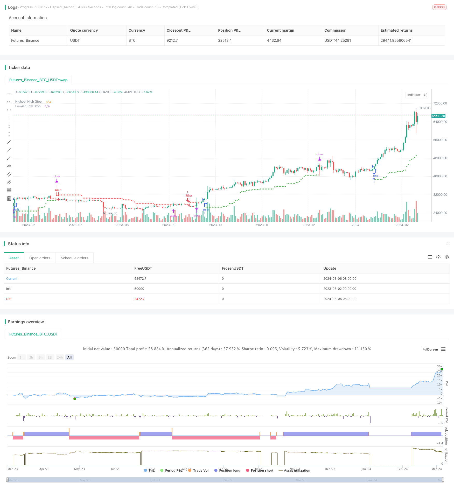

> Name

Highest-High-Lowest-Low-Stop-Strategy
> Author

ChaoZhang

> Strategy Description


[trans]

## Overview
This strategy sets stop loss points based on the recent highest and lowest prices to quickly enter the trend and strictly control risks. Open long orders when prices continue to rise, and open short orders when prices continue to fall. When holding a position, the stop loss position for long orders is the lowest price of the last few K lines, and the stop loss position for short orders is the highest price of the last few K lines. This dynamic stop loss method can efficiently capture trends while strictly limiting losses.
## Strategy Principle
1. Set the highest and lowest price reference periods `hiLen` and `loLen` ​​through the `input` function, the default is 20.
2. Use `ta.highest(high, hiLen)[1]` to calculate the highest price up to the previous K line `hiHighs`, and use `ta.lowest(low, loLen)[1]` to calculate the lowest price up to the previous K line `loLows`.
3. Draw the stop loss position. The stop loss position for long orders is `loLows`, and the stop loss position for short orders is `hiHighs`. It is not drawn when there is no position, which is convenient for visual confirmation.  
4. Define trading signal conditions:
   - The closing prices of the last three K-lines have risen continuously to `higherCloses`
   - The closing prices of the last three K-lines have fallen continuously to `lowerCloses`
   - There are currently no positions `isFlat`
5. Open a position: Open a long order when `isFlat` and `higherCloses` are met, and open a short order when `isFlat` and `lowerCloses` are met.
6. Stop loss: When holding a long position, the stop loss price is `loLows`. When holding a short position, the stop loss price is `hiHighs`.
In short, this strategy uses the recent highest and lowest prices to set a moving stop, quickly enter a strong trend and strictly limit losses, and can efficiently capture trend profits.
## Advantage Analysis
1. Simple and effective: The logic of this strategy is clear and simple. Stop loss is set based on the price itself, which can effectively capture the trend.
2. Quick entry: You can open a position by moving three consecutive K lines in the same direction, and you can quickly enter a new trend.
3. Strict stop loss: The stop loss position is the recent highest price or lowest price, which is closely related to the current price, and risk control is strict.
4. Trailing stop loss: The stop loss position will be continuously updated with the price, which can not only lock in profits but also retain the trend space.
5. Strong adaptability: suitable for various markets and varieties, and parameters can also be flexibly adjusted.
## Risk Analysis
1. Risk of market shock: A volatile market will lead to frequent opening and stopping of positions, resulting in poor strategy performance. The solution is to avoid volatile markets, or increase the opening conditions to filter.  
2. Risk at the end of the trend: When the trend is about to reverse, it is possible to encounter a reversal just after opening a position, resulting in losses. The solution is to cooperate with the trend judgment indicators and close the trade in time.
3. Extreme market risk: When there is an extreme rebound from an oversold market or a sell-off from an overpriced market, the trailing stop may not be able to protect the position well. The solution is to set a fixed stop loss.
4. Parameter risk: Improper parameter settings will lead to too frequent opening and stopping of positions. The solution is to optimize parameters.
## Optimization direction
1. Trend judgment: Add trend judgment indicators, such as moving averages, and only open positions in the direction of the general trend to increase the winning rate.
2. Combined with fluctuations: Adjust parameters according to fluctuation indicators such as ATR to cope with different fluctuations.
3. Momentum confirmation: Add momentum indicator confirmation, such as MACD, and only open positions with momentum support.
4. Optimize stop loss: You can combine percentage stop loss to avoid extreme market conditions; you can also add protective stop loss to reduce single losses. 
5. Position management: Position management can be optimized, such as adjusting positions according to risk levels to improve the risk-return ratio.
## Summarize
This maximum and minimum price stop loss strategy sets dynamic stop loss based on the price itself, which can efficiently capture strong trends and strictly control risks. Its advantages are simple and effective, fast entry, strict stop loss, and strong adaptability. However, it performs poorly in volatile markets, late trends, and extreme market conditions, and parameter settings also need to be paid attention to. In the future, it can be improved by increasing trend and momentum judgment, optimizing stop loss and position management. Overall, this is a simple and effective strategy that takes into account trend capture and risk control, and is worthy of in-depth study and optimization in practice.
|| 

## Overview

This strategy sets stop-loss points based on recent highest highs and lowest lows to quickly enter trends and strictly control risks. It enters long positions when prices rise consecutively and short positions when prices fall consecutively. When holding positions, the stop-loss level for long positions is the lowest low of the recent few bars, and the stop-loss level for short positions is the highest high. This dynamic stop-loss approach can efficiently capture trends while strictly limiting losses.

## Strategy Principles

1. Use the `input` function to set the lookback periods `hiLen` and `loLen` for highest highs and lowest lows, defaulting to 20. 
2. Calculate the highest high `hiHighs` up to the previous bar using `ta.highest(high, hiLen)[1]`, and the lowest low `loLows` using `ta.lowest(low, loLen)[1]`.
3. Plot the stop-loss levels, with `loLows` for long positions and `hiHighs` for short positions. Don't plot when flat for easy confirmation.
4. Define trade signal conditions:
   - `higherCloses`: the last 3 bars have consecutively higher closes
   - `lowerCloses`: the last 3 bars have consecutively lower closes  
   - `isFlat`: no current position
5. Entry: enter long when `isFlat` and `higherCloses`, enter short when `isFlat` and `lowerCloses`.
6. Stop-loss: for long positions, stop out at `loLows`; for short positions, stop out at `hiHighs`.

In short, this strategy uses recent highest highs and lowest lows to set trailing stops, quickly entering strong trends and strictly limiting losses, thus efficiently capturing trend profits.

## Advantage Analysis

1. Simple and effective: the strategy has clear and simple logic, setting stops based on prices themselves to effectively capture trends.
2. Quick entry: entering on 3 consecutive bars moving in the same direction allows quickly entering new trends.
3. Strict stops: stops are set at recent extreme prices, closely tied to current prices for strict risk control.
4. Trailing stops: stop levels are continuously updated with prices, both locking in profits and retaining trend room.
5. Highly adaptable: suitable for various markets and instruments, with flexibly adjustable parameters.

## Risk Analysis

1. Choppy market risk: choppy markets can cause frequent entries and stops, degrading performance. Avoid choppy markets or increase entry conditions to filter.
2. Trend end risk: when a trend is about to reverse, a new entry may immediately face reversal and loss. Use trend identification indicators to exit in time.  
3. Extreme movement risk: in extreme oversold bounces or overbought drops, trailing stops may not protect positions well. Set fixed stop levels.
4. Parameter risk: improper parameters can cause overly frequent entries and exits. Perform parameter optimization.

## Optimization Directions

1. Trend identification: add trend indicators like moving averages and only trade in the major trend direction to improve win rate.
2. Incorporate volatility: adjust parameters based on volatility indicators like ATR to adapt to different volatilities.
3. Momentum confirmation: add momentum indicators like MACD to confirm entries only with momentum support.
4. Optimize stops: combine with percentage stops for extreme moves; add protective stops to reduce per-trade losses.
5. Position sizing: optimize position sizing, e.g. adjust size based on risk levels to improve risk-reward ratio.

## Summary

This highest high/lowest low stop strategy sets dynamic stops based on prices themselves to efficiently capture strong trends and strictly control risks. Its advantages are simplicity, effectiveness, quick entries, strict stops, and high adaptability. However, it performs poorly in choppy markets, trend ends, and extreme movements, and requires attention to parameter settings. Future improvements can add trend and momentum confirmation, optimize stops and position sizing. Overall, it is a simple and effective strategy balancing trend-capturing and risk control that deserves in-depth research and optimization in practice.

[/trans]

> Strategy Arguments


|Argument|Default|Description|
|----|----|----|
|v_input_int_1|20|Highest High Lookback|
|v_input_int_2|20|Lowest Low Lookback|


> Source (PineScript)

``` pinescript
/*backtest
start: 2023-03-02 00:00:00
end: 2024-03-07 00:00:00
period: 1d
basePeriod: 1h
exchanges: [{"eid":"Futures_Binance","currency":"BTC_USDT"}]
*/

//@version=5
strategy(title="Highest high/lowest low stop", overlay=true)

// STEP 1:
// Make inputs for length of highest high and lowest low
hiLen = input.int(20, title="Highest High Lookback", minval=2)
loLen = input.int(20, title="Lowest Low Lookback", minval=2)

// STEP 2:
// Calculate recent extreme high and low
hiHighs = ta.highest(high, hiLen)[1]
loLows  = ta.lowest(low, loLen)[1]

// Plot stop values for visual confirmation
plot(strategy.position_size > 0 ? loLows : na,
     style=plot.style_circles, color=color.green, linewidth=3,
     title="Lowest Low Stop")

plot(strategy.position_size < 0 ? hiHighs : na,
     style=plot.style_circles, color=color.red, linewidth=3,
     title="Highest High Stop")

// Trading conditions for this example strategy
higherCloses = close > close[1] and
     close[1] > close[2] and 
     close[2] > close[3]

lowerCloses = close < close[1] and
     close[1] < close[2] and 
     close[2] < close[3]

isFlat = strategy.position_size == 0

// Submit entry orders
if isFlat and higherCloses
    strategy.entry("EL", strategy.long)

if isFlat and lowerCloses
    strategy.entry("ES", strategy.short)

// STEP 3:
// Submit stops based on highest high and lowest low
if strategy.position_size > 0
    strategy.exit("XL HH", stop=loLows)

if strategy.position_size < 0
    strategy.exit("XS LL", stop=hiHighs)
```

> Detail

https://www.fmz.com/strategy/443993

> Last Modified

2024-03-08 14:32:30
