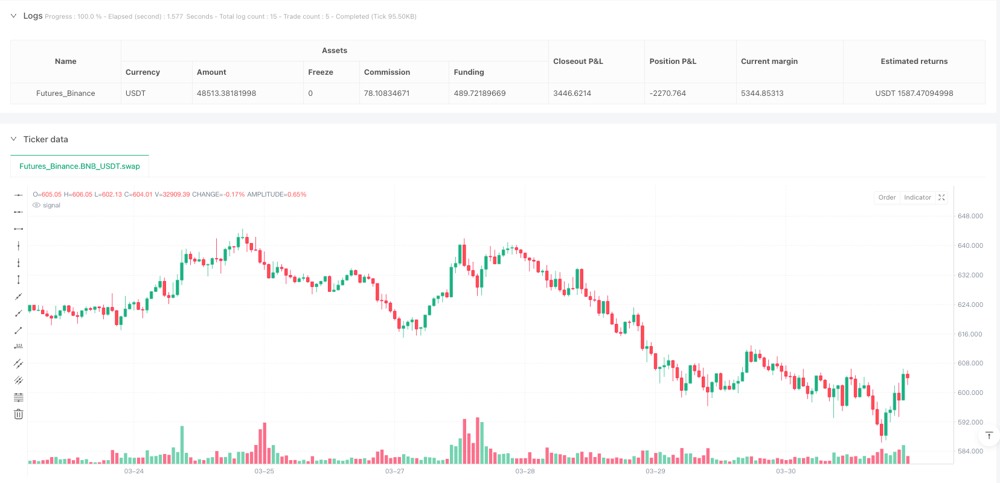
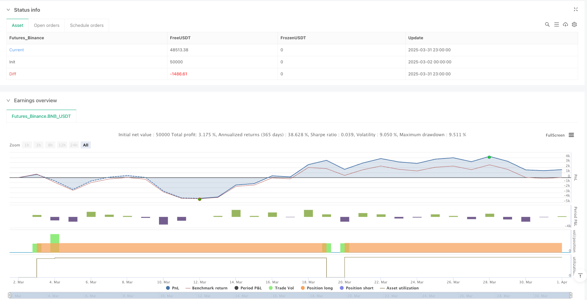

> Name

Hourly-Open-Close-Price-Differential-Smart-Comparison-Quantitative-Trading-System
> Author

ianzeng123

> Strategy Description





[trans]

## Overview
The hourly period price opening strategy is a quantitative trading system based on price action analysis, focusing on capturing the momentum changes between the market's opening price and the closing price of the previous period. This strategy identifies potential upward price trends by comparing the opening price of the current period to the closing price of the previous period and opens a long position when certain conditions are met. The system sets a fixed percentage profit target (3%). Once the target price is reached, the strategy automatically closes the position and locks in profits. The core advantage of this strategy is its simplicity and execution, making it ideal for short-term traders and day traders.
## Strategy Principle
The core principles of the hourly price opening strategy are based on market price action and momentum theory. Specifically, the strategy follows the following logical flow:
1. Judgment of buying conditions: The strategy first checks whether the opening price of the current period is higher than the closing price of the previous period (open > close[1]), and also ensures that there are currently no positions (strategy.position_size == 0). When these two conditions are met at the same time, the system identifies it as a buy signal.
2. Execute a buy order: When the buy conditions are met, the system executes a long entry through the strategy.entry("Buy", strategy.long) command. At the same time, mark the buying point on the price chart and display the specific buying price.
3. Set profit target: After entering the market, the system immediately calculates the profit target price and sets it to 103% of the purchase price (targetPrice = strategy.position_avg_price * 1.03), which is equivalent to a 3% take-profit level.
4. Monitoring of closing conditions: The strategy continuously monitors the current market price. Once the closing price reaches or exceeds the target price (close >= targetPrice) and a long position is held (strategy.position_size > 0), the system automatically performs the closing operation.
5. Visualized trading: In order to visually display trading activities, the strategy draws buy and sell signals on the chart, allowing traders to clearly track strategy execution.
This strategy takes advantage of the continuity principle of price momentum. When the opening price is higher than the closing price of the previous period, it often means that there is upward momentum in the market. This momentum may continue in the short term, thus bringing profit opportunities.
## Strategic Advantages
An in-depth analysis of the code implementation of this strategy can summarize the following significant advantages:
1. Simple and clear entry logic: The strategy uses simple and easy-to-understand price comparisons as entry signals and does not rely on complex indicators or parameter settings, reducing the risk of over-fitting.
2. Clear profit target: A fixed 3% take-profit setting provides clear profit expectations and helps maintain a good risk-reward ratio.
3. Automated execution: The strategy is completely automated, from signal recognition to entry to closing, reducing the impact of human intervention and emotional decision-making.
4. Fund management integration: By setting the default_qty_type=strategy.percent_of_equity and default_qty_value=100 parameters, the strategy invests 100% of the total account value in each transaction, simplifying fund management.
5. Visualized transaction records: By marking buying and selling points on the chart, traders can visually review strategy execution, which is helpful for subsequent analysis and strategy adjustments.
6. Prevent repeated entries: By checking the current position status (strategy.position_size == 0), the strategy ensures that there will be no repeated entries when there is an existing position, thus avoiding unnecessary risk accumulation.
7. Suitable for highly liquid markets: The strategy operates on the hourly time frame, which is particularly suitable for market environments with high liquidity, ensuring the execution of trading signals.
## Strategy Risk
Despite the simplicity of this strategy's design, there are still some potential risks:
1. Lack of stop-loss mechanism: The current strategy only sets profit-taking conditions and does not have a clear stop-loss mechanism. If the market develops in an unfavorable direction, it may result in larger losses. It is recommended to add stop loss conditions, such as time or price based stop loss settings.
2. Limitations of the fixed percentage target: The 3% fixed take-profit target may not be able to adapt to different market environments and volatility. It can be too high in a low volatility market and too low in a high volatility market.
3. The fragility of a single entry condition: Relying only on the comparison between the opening price and the closing price of the previous period as an entry signal may lead to misleading signals when market noise is high.
4. Lack of trend filtering: The strategy does not consider the broader market trend environment and may also send out buy signals during a downward trend, increasing the risk of counter-trend trading.
5. Fund management risk: By default, 100% of the account equity is used for transactions, and the position size is not adjusted according to market volatility or risk level, which may lead to excessive risk concentration.
6. Time frame dependence: Strategies focus on hourly periods and may not be able to capture price fluctuations in shorter time frames or longer-term market trends.
7. Backtesting bias risk: Using the closing price as the condition to trigger liquidation may lead to execution slippage in actual transactions, because in practice it may be necessary to wait until the closing price is confirmed before execution.
## Strategy optimization direction
Based on an in-depth analysis of the strategy code, we can propose the following optimization directions:
1. Introduce a stop-loss mechanism: Add stop-loss conditions based on time or price, such as setting a maximum position time or a stop-loss level based on ATR (true fluctuation range) to limit the maximum loss of a single transaction.
2. Dynamic profit target: Change the fixed 3% take-profit target to a dynamic target based on market volatility, such as using multiples of ATR as the basis for target price calculation.
3. Add entry filter conditions: Combine with other technical indicators (such as moving averages, RSI or MACD) as confirmation signals to improve the quality and reliability of entry signals.
4. Add trend direction filtering: introduce long-term moving averages or other trend indicators to ensure that you only enter the market when the overall trend direction is consistent.
5. Optimize fund management: implement dynamic position management and adjust the fund proportion of each transaction based on market conditions, account equity and risk levels.
6. Multi-time frame analysis: Integrate the market analysis results of higher time frames and only execute transactions when the trends of high and low time frames are consistent.
7. Introduce time filtering: add trading time window restrictions to avoid market periods with too low or too high volatility.
8. Optimize execution logic: Consider using limit orders instead of market orders to execute transactions to reduce slippage and execution costs.
The implementation of these optimization directions will help improve the robustness and adaptability of the strategy, enabling it to maintain relatively stable performance in different market environments.
## Summarize
The hourly price opening strategy is a simple and practical trading system that uses the relationship between the opening price and the closing price of the previous period to capture short-term price momentum. With its simple logic and clear execution rules, this strategy provides traders with a trading method that is easy to understand and implement. Although there are some potential risks, such as the lack of a stop-loss mechanism and the limitations of a single entry condition, the robustness and profit potential of the strategy can be significantly improved by introducing optimization measures such as stop-loss strategies, dynamic profit target settings, and additional entry filter conditions.
This strategy is particularly suitable for short-term traders and day traders, especially in moderately volatile market environments. Through continuous backtesting and optimization, traders can adjust parameters based on specific markets and personal risk preferences to further improve strategy performance. Ultimately, whether used as a stand-alone trading system or as part of a more complex trading strategy, the hourly price opening strategy demonstrates the potential and value of quantitative trading methods based on price action analysis. ||
## Overview

The Hourly Open-Close Price Differential Smart Comparison Quantitative Trading System is a price action-based quantitative trading strategy that focuses on capturing momentum shifts between the current period's open price and the previous period's close price. The strategy identifies potential upward price trends by comparing the current period's opening price with the previous period's closing price, establishing long positions when specific conditions are met. The system incorporates a fixed percentage profit target (3%), automatically closing positions when the target price is reached to secure profits. The core advantage of this strategy lies in its simplicity and executability, making it an ideal choice for short-term traders and intraday traders.

## Strategy Principles

The Hourly Open-Close Price Differential strategy is based on market price action and momentum theory. Specifically, the strategy follows this logical process:

1. Buy Condition Evaluation: The strategy first checks if the current period's opening price is higher than the previous period's closing price (open > close[1]), while ensuring no current position exists (strategy.position_size == 0). When both conditions are satisfied, the system identifies a buy signal.

2. Buy Order Execution: When the buy condition is met, the system executes a long entry through the strategy.entry("Buy", strategy.long) command. Simultaneously, it marks the buy point on the price chart, displaying the specific entry price.

3. Profit Target Setting: After entry, the system immediately calculates the profit target price, set at 103% of the purchase price (targetPrice = strategy.position_avg_price * 1.03), equivalent to a 3% take-profit level.

4. Exit Condition Monitoring: The strategy continuously monitors the current market price, and once the closing price reaches or exceeds the target price (close >= targetPrice) while holding a long position (strategy.position_size > 0), the system automatically executes the closing operation.

5. Trade Visualization: To intuitively display trading activity, the strategy plots buy and sell signals on the chart, allowing traders to clearly track strategy execution.

This strategy leverages the principle of price momentum continuity, where an opening price higher than the previous period's closing price often indicates market upward momentum that may continue in the short term, creating profit opportunities.

## Strategy Advantages

Through deep analysis of the strategy's code implementation, the following significant advantages can be summarized:

1. Clear and Concise Entry Logic: The strategy uses a simple and easy-to-understand price comparison as the entry signal, without relying on complex indicators or parameter settings, reducing the risk of overfitting.

2. Defined Profit Targets: The fixed 3% take-profit setting provides clear profit expectations, helping to maintain a good risk-reward ratio.

3. Automated Execution: The strategy is fully automated from signal identification to entry and exit, reducing human intervention and emotional decision-making.

4. Integrated Fund Management: Through default_qty_type=strategy.percent_of_equity and default_qty_value=100 parameter settings, the strategy invests 100% of the account value in each trade, simplifying fund management.

5. Visualized Trading Records: By marking buy and sell points on the chart, traders can visually review strategy execution, facilitating subsequent analysis and strategy adjustments.

6. Prevention of Duplicate Entries: By checking the current position status (strategy.position_size == 0), the strategy ensures no re-entry when a position already exists, avoiding unnecessary risk accumulation.

7. Suitability for High Liquidity Markets: The strategy operates on an hourly timeframe, particularly suitable for high liquidity market environments, ensuring the executability of trading signals.

## Strategy Risks

Despite the strategy's concise design, there are several potential risks:

1. Lack of Stop-Loss Mechanism: The current strategy only sets take-profit conditions without a clear stop-loss mechanism. If the market moves unfavorably, it could lead to significant losses. It is recommended to add stop-loss conditions, such as time-based or price-based stop-loss settings.

2. Limitations of Fixed Percentage Targets: The fixed 3% take-profit target may not adapt to different market environments and volatilities. It may be too high in low-volatility markets and too low in high-volatility markets.

3. Vulnerability of Single Entry Condition: Relying solely on the comparison between opening price and previous period's closing price as an entry signal may lead to misleading signals when market noise is significant.

4. Lack of Trend Filtering: The strategy does not consider the broader market trend environment and may issue buy signals even in downtrends, increasing the risk of counter-trend trading.

5. Fund Management Risk: The default uses 100% of account equity for trading without adjusting position size based on market volatility or risk level, potentially leading to excessive risk concentration.

6. Timeframe Dependence: The strategy focuses on the hourly period and may fail to capture price fluctuations in shorter timeframes or longer-term market trends.

7. Backtest Bias Risk: Using the closing price as a trigger for closing positions may lead to execution slippage in actual trading, as one might need to wait for closing price confirmation before execution.

## Strategy Optimization Directions

Based on in-depth analysis of the strategy code, we can propose the following optimization directions:

1. Introduce Stop-Loss Mechanism: Add time-based or price-based stop-loss conditions, such as setting maximum holding time or ATR-based (Average True Range) stop-loss levels to limit maximum loss per trade.

2. Dynamic Profit Targets: Change the fixed 3% take-profit target to a volatility-based dynamic target, such as using multiples of ATR as the basis for target price calculation.

3. Add Entry Filtering Conditions: Combine other technical indicators (such as moving averages, RSI, or MACD) as confirmation signals to improve the quality and reliability of entry signals.

4. Add Trend Direction Filtering: Introduce long-term moving averages or other trend indicators to ensure entries only when the overall trend direction is consistent.

5. Optimize Fund Management: Implement dynamic position management, adjusting the proportion of funds for each trade based on market conditions, account equity, and risk levels.

6. Multi-Timeframe Analysis: Integrate market analysis results from higher timeframes, executing trades only when trends across different timeframes align.

7. Introduce Time Filtering: Add trading time window restrictions to avoid market periods with too low or too high volatility.

8. Optimize Execution Logic: Consider using limit orders instead of market orders to execute trades, reducing slippage and execution costs.

Implementing these optimization directions will help improve the strategy's robustness and adaptability, enabling it to maintain relatively stable performance across different market environments.

## Summary

The Hourly Open-Close Price Differential Smart Comparison Quantitative Trading System is a concise and practical trading system that captures short-term price momentum by utilizing the relationship between opening prices and previous period closing prices. With its simple logic and clear execution rules, the strategy provides traders with an easy-to-understand and implement trading method. Despite some potential risks, such as the lack of a stop-loss mechanism and limitations of single entry conditions, the strategy's robustness and profit potential can be significantly enhanced through optimizations like introducing stop-loss strategies, dynamic profit target settings, and additional entry filtering conditions.

This strategy is particularly suitable for short-term traders and day traders, especially in markets with moderate volatility. Through continuous backtesting and optimization, traders can adjust parameters according to specific markets and personal risk preferences to further improve strategy performance. Ultimately, whether as an independent trading system or as a component of more complex trading strategies, the Hourly Open-Close Price Differential strategy demonstrates the potential and value of quantitative trading methods based on price action analysis.[/trans]


> Source (PineScript)

``` pinescript
/*backtest
start: 2025-03-02 00:00:00
end: 2025-04-01 00:00:00
period: 1h
basePeriod: 1h
exchanges: [{"eid":"Futures_Binance","currency":"BNB_USDT"}]
*/

//@version=6

strategy("1 Hour Open vs Close Buy Strategy", overlay=true, default_qty_type=strategy.percent_of_equity, default_qty_value=100)


// Define the buy condition: current open is higher than the previous close

buyCondition = open > close[1] and strategy.position_size == 0 // Only buy if there is no active position


// Execute the buy order and plot buy price

if (buyCondition)

    strategy.entry("Buy", strategy.long)

    label.new(x=bar_index, y=low, text="Buy at: " + str.tostring(open), style=label.style_label_up, color=color.green, size=size.normal, textcolor=color.white)


// Define the sell condition based on 3% profit target from the buy price

targetPrice = strategy.position_avg_price * 1.03


// Check if the current price has reached the target price and close the position

if (strategy.position_size > 0 and close >= targetPrice)

    strategy.close("Buy")

    label.new(x=bar_index, y=high, text="Sell at: " + str.tostring(close), style=label.style_label_down, color=color.red, size=size.normal, textcolor=color.white)


// Plotting to visualize entries and exits on the chart

plotshape(series=buyCondition, location=location.belowbar, color=color.green, style=shape.labelup, text="Buy")

plotshape(series=(strategy.position_size > 0 and close >= targetPrice), location=location.abovebar, color=color.red, style=shape.labeldown, text="Sell")
```

> Detail

https://www.fmz.com/strategy/489153

> Last Modified

2025-04-02 11:15:52
