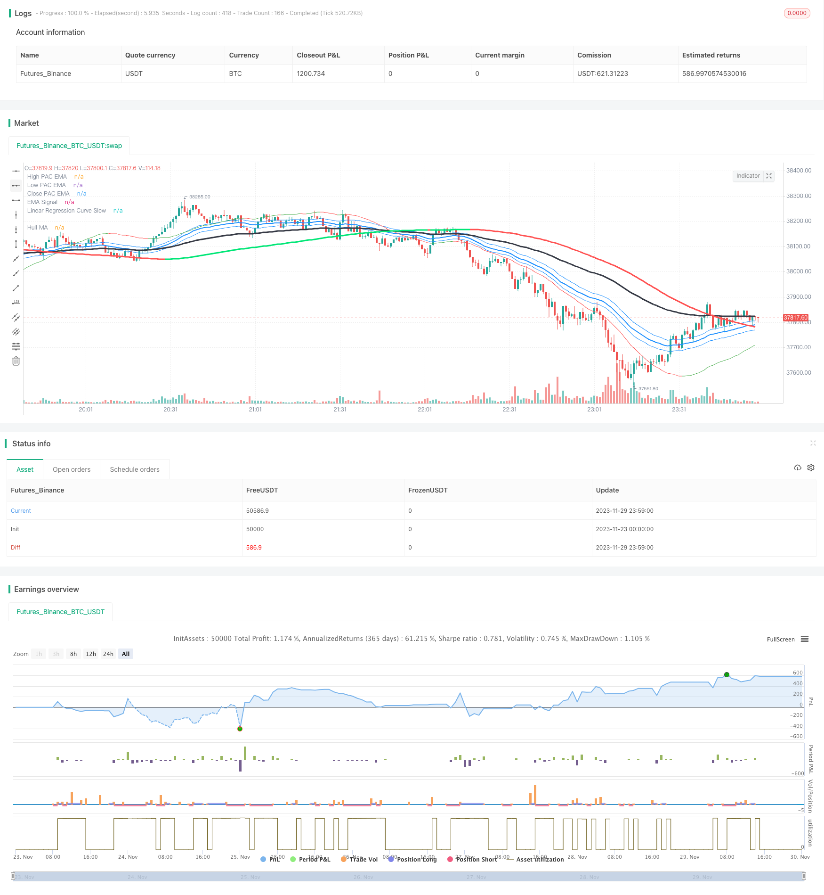

> Name

Hull-MA-Channel-and-Linear-Regression-Swing-Trading-Strategy Based on Channel and Linear Regression
> Author

ChaoZhang

> Strategy Description


[trans]

## Overview
This strategy is a swing trading strategy that combines Hull MA, price channels, EMA signals and linear regression. This strategy uses Hull MA to determine the direction of the market trend, price channels and linear regression to determine the bottom area, and EMA signals to determine the timing of market entry to capture short- and medium-term trends.
## Strategy Principle
This strategy mainly consists of the following indicators:
1. Hull MA
   - The general parameter period of Hull MA is 337, which represents the medium and long-term trend direction.
   - When 2 times the 18-period WMA is higher than the 337-period WMA, it is a long market, and vice versa, it is a short market.
2. Price Channel
   - The price channel consists of high and low price EMAs, which represent areas where support and resistance are likely to form.
3. EMA signal
   - The EMA signal period is generally 89 periods, representing short-term trends and market entry signals
4. Linear regression
   - Fast line 6 periods, determine the bottom and breakthrough
   - Slow line 89 period, determine the medium and long-term trend direction
Entry logic:
Bullish entry: Hull MA is up and price is above the upper rail, linear regression crosses short-term EMA upwards
Short entry: Hull MA is down and price is below the lower rail, linear regression crosses short-term EMA downwards
Appearance logic:
Long exit: price is below the lower track and crosses the linear regression downwards
Short exit: price is above the upper track and crosses the linear regression upward
## Advantage Analysis
This strategy has the following advantages:
1. Multi-indicator combination makes judgment more accurate
   - Hull MA determines the main trend, channel determines the support pressure, and EMA determines the entry opportunity.
2. Swing trading to capture short- and medium-term trends
   - The strategy is a reversal-based swing trading strategy that can capture the trend of each short- and medium-term cycle
3. Risks are controllable and drawdown is small
   - The strategy only sends signals in high-probability areas to avoid chasing highs and selling lows.
## Risk Analysis
This strategy also has certain risks:
1. Limited space for parameter optimization
   - Main parameters such as EMA period are relatively fixed and there is little room for optimization.
2. Possible losses during volatile market conditions
   - Stop loss may be triggered when the price fluctuates sideways.
3. A certain technical analysis foundation is required
   -Strategy ideas require certain knowledge of price action and indicators and are not suitable for everyone
It can be optimized from the following points:
1. Adjust the stop loss strategy, such as aftershock stop loss
2. Optimize entry and exit logic
3. Add other indicator filters, such as MACD
## Summarize
This strategy comprehensively uses multiple indicators such as Hull MA, price channel, EMA and linear regression to form a relatively complete medium and short-term swing trading strategy. Compared with a single indicator, this strategy can greatly improve the accuracy of judgment and capture profits in trends and reversals. But there are also certain risks, which require a technical analysis foundation. Through parameter adjustment and entry and exit logic optimization, the stability of the strategy can be further improved.
||


## Overview

This is a swing trading strategy that combines Hull MA, price channel, EMA signal and linear regression. It uses Hull MA to determine market trend direction, price channel and linear regression to identify bottom area, EMA signal to time market entry, in order to capture medium-term trends.  

## Strategy Logic

The strategy consists of the following main indicators:

1. Hull MA 
   - Typical period of Hull MA is 337, representing medium to long term trend direction  
   - When 2 times 18-period WMA is above 337-period WMA, it's a bull market, otherwise it's a bear market
2. Price Channel
   - Price channel plots EMA high and EMA low, representing support and resistance area  
3. EMA Signal
   - Typical period is 89, representing short-term trend and entry signal
4. Linear Regression
   - Fast line of 6 period for bottom and breakout
   - Slow line of 89 period for medium to long term trend  

Entry Logic:  

Long Entry: Hull MA pointing up and price above upper band, linear regression crossing up EMA signal
Short Entry: Hull MA pointing down and price below lower band, linear regression crossing down EMA signal
  

Exit Logic:

Long Exit: Price below lower band and crossing down linear regression 
Short Exit: Price above upper band and crossing up linear regression

## Advantage Analysis

The strategy has the following advantages:

1. Higher accuracy with multiple indicators
   - Hull MA for main trend, channel for support/resistance, EMA for entry  
2. Swing trading to capture medium-term trends 
   - Strategy mainly reversals to capture each medium-term cycle
3. Controllable risk and smaller drawdown
   - Signal only generated at high probability area, avoiding chase high kill low

## Risk Analysis  

There are also some risks:   

1. Limited optimization space
   - Main parameters like EMA period is fixed, with small optimization space
2. May lose in range-bound market
   - Stop loss may be triggered in sideways range  
3. Need some technical analysis knowledge
   - Strategy logic needs price action and indicator knowledge, not suitable for everyone  

Improvements:

1. Adjust stop loss strategy, e.g. trailing stop loss
2. Optimize entry and exit logic  
3. Add other filter indicators like MACD

## Summary

The strategy combines Hull MA, price channel, EMA and linear regression for a complete medium-term swing trading strategy. Compared to single indicator strategies, it improves accuracy significantly in catching trends and reversals. But there are still risks, requiring technical analysis knowledge. Further improvements on parameters and logic can enhance stability.  


[/trans]

> Strategy Arguments


|Argument|Default|Description|
|----|----|----|
|v_input_1|377|HullMA Period|
|v_input_2|89|EMA Signal|
|v_input_3|34|High Low channel Length|
|v_input_4|89|Linear Regression Length|


> Source (PineScript)

``` pinescript
/*backtest
start: 2023-11-23 00:00:00
end: 2023-11-30 00:00:00
period: 1m
basePeriod: 1m
exchanges: [{"eid":"Futures_Binance","currency":"BTC_USDT"}]
*/

//@version=2
strategy("Swing Hull/SonicR/EMA/Linear Regression Strategy", overlay=true)
//Hull MA
n=input(title="HullMA Period",defval=377)
//
n2ma=2*wma(close,round(n/2))
nma=wma(close,n)
diff=n2ma-nma
sqn=round(sqrt(n))
//
n2ma1=2*wma(close[1],round(n/2))
nma1=wma(close[1],n)
diff1=n2ma1-nma1
sqn1=round(sqrt(n))
//
n1=wma(diff,sqn)
n2=wma(diff1,sqn)
condDown = n2 >= n1
condUp = condDown != true
col =condUp ? lime : condDown ? red : yellow
plot(n1,title="Hull MA", color=col,linewidth=3)
// SonicR + Line reg
EMA = input(defval=89, title="EMA Signal")
HiLoLen     = input(34, minval=2,title="High Low channel Length")
lr     = input(89, minval=2,title="Linear Regression Length")
pacC        = ema(close,HiLoLen)
pacL        = ema(low,HiLoLen)
pacH        = ema(high,HiLoLen)
DODGERBLUE = #1E90FFFF
// Plot the Price Action Channel (PAC) base on EMA high,low and close//
L=plot(pacL, color=DODGERBLUE, linewidth=1, title="High PAC EMA",transp=90)
H=plot(pacH, color=DODGERBLUE, linewidth=1, title="Low PAC EMA",transp=90)
C=plot(pacC, color=DODGERBLUE, linewidth=2, title="Close PAC EMA",transp=80)
//Moving Average//
signalMA =ema(close,EMA)
plot(signalMA,title="EMA Signal",color=black,linewidth=3,style=line)
linereg = linreg(close, lr, 0)
lineregf = linreg(close, HiLoLen, 0)
cline=linereg>linereg[1]?green:red
cline2= lineregf>lineregf[1]?green:red
plot(linereg, color = cline, title = "Linear Regression Curve Slow", style = line, linewidth = 1)
//plot(lineregf, color = cline2, title = "Linear Regression Curve Fast", style = line, linewidth = 1)
longCondition = n1>n2
shortCondition = longCondition != true
closeLong =  lineregf-pacH>(pacH-pacL)*2 and close<lineregf and linereg>signalMA
closeShort = pacL-lineregf>(pacH-pacL)*2 and close>lineregf and linereg<signalMA
if shortCondition    
    if (close[0] < signalMA[0] and close[1] > pacL[1] and linereg>pacL and close<n1 and pacL<n1) //cross entry
        strategy.entry("SHORT", strategy.short, comment="Short")
strategy.close("SHORT", when=closeShort) //output logic
if longCondition // swing condition          
    if (close[0] > signalMA[0] and close[1] < pacH[1] and linereg<pacH and close>n1 and pacH>n1) //cross entry
        strategy.entry("LONG", strategy.long, comment="Long")
strategy.close("LONG", when=closeLong) //output logic

```

> Detail

https://www.fmz.com/strategy/433948

> Last Modified

2023-12-01 16:47:01
