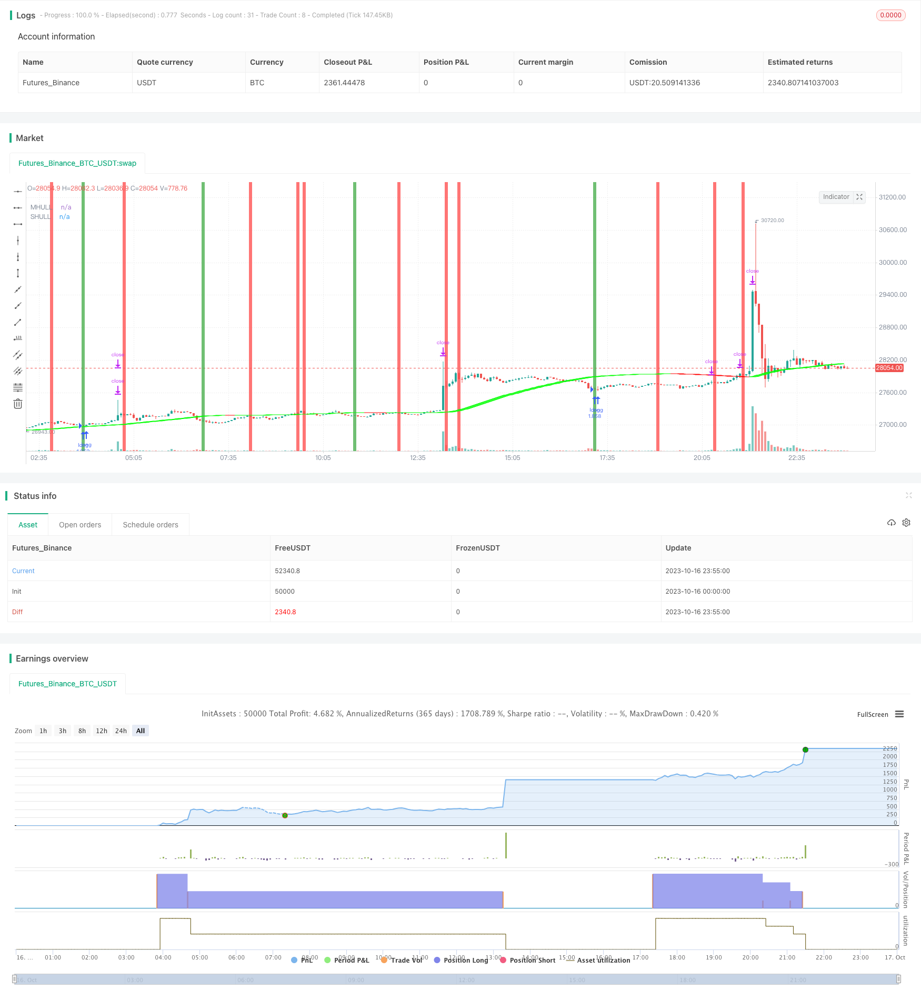

> Name

Hull-Moving-Average-and-Stochastic-RSI-Combination-Trading-Strategy
> Author

ChaoZhang

> Strategy Description



[trans]

## Overview
This strategy uses the Hall indicator to determine the trend direction, and then combines it with the stochastic indicator to enter the market. When the Hall middle rail crosses above and below the lower rail, the market will be bullish and when it crosses below, the market will be bearish. At the same time, go long when the K line of the stochastic indicator crosses the D line from the overbought zone, and go short when it crosses the oversold zone.
## Strategy Principle
This trading strategy mainly uses the Hall indicator to determine the market trend direction, and then uses the stochastic indicator for specific entry.
First of all, the calculation method of the Hall indicator is defined in the strategy, including the calculation formulas of the middle track, upper track and lower track. The middle rail is calculated using the weighted moving average WMA, and the upper rail and lower rail are the offsets of the middle rail respectively.
Then, judge the trend direction based on the relationship between the middle rail and the upper and lower rails. When the middle rail crosses above the lower rail, it means that buying is strong and the trend is bullish; when the middle rail crosses below the upper rail, selling is strong and it is a bearish trend.
In addition, the strategy also defines the calculation method of the random indicator, including the calculation formulas of K value and D value. The K value uses the SMA smoothing of the RSI, and the D value uses the SMA smoothing of the K value again.
After judging the trend direction, if it is bullish, go long when the K line of the stochastic indicator crosses the D line from the oversold area; if it is short, go short when the K line crosses the D line from the overbought area.
In this way, by combining the trend judgment of the Hall indicator and the overbought and oversold judgment of the stochastic indicator, a relatively stable and accurate entry can be made.
## Advantage Analysis
The biggest advantage of this strategy is that it can conduct multi-dimensional analysis of the market by combining trend judgment and overbought and oversold judgment, and its entry accuracy is high.
Specifically, it has the following main advantages:
1. Hall indicators can effectively judge the direction of market trends and carry out large-level positioning;
2. The stochastic indicator determines overbought and oversold, allowing you to grasp changes in buying and selling power and grasp better entry opportunities;
3. When used together, the two can give full play to their respective advantages, verify each other's signals, and reduce false signals;
4. Through parameter adjustment, it can flexibly adapt to different varieties and time periods, and has strong applicability;
5. Use the offset of the middle rail to form the upper and lower rails to build a trading channel, and you can find potential support and resistance.
6. STOP LOSS, EXIT ON TARGETS percent used to scale positions large position control
7.  Use of hull data Dictionary gives multiple asset class flexibility

8. The selected optimization direction can improve strategy stability and profitability.
## Risk Analysis
This strategy also has certain risks that need to be noted, mainly including:
1. The Hall indicator has hysteresis and may miss trend turning points, resulting in unnecessary losses.
2. Improper setting of stochastic indicator parameters may produce redundant signals, and the cross signals of K line and D line should be appropriately screened.
3. The Hall indicator is used in conjunction with the stochastic indicator. If the parameters are not matched properly, an error signal may occur.
4. If the width of the upper and lower rails is too large or too small, it will affect the quality of the trading signal. Careful testing is required to find the best parameters.
5. The recent market situation is unstable, and the medium and long-term indicators may not be effective.
6. Data mismatches between hull and stoch causing false signals

7. Sharp trend changes not caught by hull can cause losses

8. Testing on more timeframes/symbols needed to verify robustness

To address these risks, optimization can be done from the following points:
1. Appropriately shorten the length of the Hall indicator to improve sensitivity to trend changes.
2. Optimize the parameters of the stochastic indicator to reduce false signals.
3. Adjust the upper and lower rail parameters to find the optimal channel width.
4. Add other indicator verification signals, such as MACD, etc.
5. Add a stop loss strategy to control risks.
## Optimization direction
This strategy can also be optimized from the following aspects:
1. Test more varieties and more time period parameters to verify the stability of the strategy.
2. Add a stop loss mechanism. Such as trailing stop loss, trailing stop loss, etc., which can better control risks.
3. Optimize the entry condition logic, set more stringent filtering conditions, and reduce false signals.
4. Research how to use the Hall indicator channel to better determine support and resistance levels.
5. Explore whether you can add verification signals from other indicators.
6. Parameter optimization. Such as the optimization of Hall indicator length, stochastic indicator K, D smoothing parameters, etc.
7. Add position management function. Adjust position size based on drawdowns, winning streaks, etc.
8. Added stop loss and take profit rules. A firm offer is a must.
9. Optimize hull length parameter for better trend sensitivity

10. Add additional filters or confirming indicators to improve signal quality 

11. Explore using hull bands to identify dynamic support/resistance levels

12. Parameter optimization for stoch RSI lengths, overbought/oversold levels

13. Introduce better position sizing and risk management rules

## Summarize
Overall, this strategy integrates trend judgment and overbought and oversold judgment to enter the market, which is an effective idea. However, due to problems with the indicator itself, its trading signals are not completely reliable and need further optimization. If the best parameter combination can be found, supplemented by other verification indicators and risk control methods, the effect of this strategy can still be expected. In short, more testing and optimization are needed in terms of parameter adjustment, stop loss mechanism, position management, etc. to make the strategy stable and reliable and profitable in real markets.
||

## Overview

This strategy uses the Hull Moving Average to determine the trend direction and combines it with the Stochastic RSI for entry signals. Long trades are taken when the HMA middle line crosses above the lower line, and short trades when it crosses below the upper line. In addition, long trades are entered when the Stochastic RSI K line crosses below the D line from the overbought zone, while short trades are entered on crosses above from the oversold zone.

## Strategy Logic

The key components of this strategy are the Hull Moving Average for trend direction and the Stochastic RSI for timing entry signals.

Firstly, the Hull MA calculation includes formulas for the middle, upper and lower bands. The middle band uses a Weighted Moving Average, while the upper and lower bands are offset from the middle line.

The trend direction is determined by the relationship between the middle band and the upper/lower bands. An upward crossover of the middle line indicates buying pressure and an uptrend, while a downward crossover signals increased selling pressure and a downtrend.

The Stochastic RSI calculation is also defined, including the Smoothed K and D values. The K value uses an SMA smoothing on the RSI, while the D value is a second SMA smoothing on the K. 

After the trend direction is determined, long trades are taken when the Stoch RSI K line crosses below the D line from the overbought zone during an uptrend. Short trades are taken when the K line crosses above the D line from the oversold area during a downtrend.

Combining the Hull trend filter and Stoch RSI overbought/oversold analysis provides a robust multi-factor approach to entering trades.

## Advantages

The key benefits of this strategy are:

1. The Hull MA effectively identifies the overall market trend direction.

2. The Stoch RSI determines overbought/oversold levels to time entries. 

3. Using both together reduces false signals and combines strengths.

4. Flexibility to optimize parameters for different symbols and timeframes.

5. Hull bands identify potential dynamic support and resistance. 

6. Incorporates position sizing and risk management rules.

7. Multi-asset capability through hull data dictionary.

8. Optimizable components to improve profitability and reduce drawdowns.

## Risks

Some risks to consider:

1. Hull MA has lag and may miss trend changes.

2. Stoch RSI may generate excessive signals if parameters not optimized.

3. Mismatch between Hull and Stoch parameters can cause bad signals.

4. Hull bands too wide or narrow will impact signal quality.

5. Recent volatile markets challenge medium/long-term indicators. 

6. Data mismatches between Hull and Stoch causing false signals. 

7. Sharp trend changes not caught by Hull can cause losses.

8. Need expanded testing on multiple timeframes and symbols.

Some ways to address these:

1. Shorten Hull MA length for greater trend sensitivity.

2. Optimize Stoch RSI to filter out false crosses. 

3. Find optimal Hull band channel width.

4. Add additional confirming indicators like MACD.

5. Incorporate stop loss strategies to control risk.

## Optimization Opportunities

Some ways this strategy could be improved:

1. Test on more symbols across various timeframes to verify robustness.

2. Incorporate stop loss mechanics like trailing stops or moving averages.

3. Optimize entry rules, set stricter filters to reduce false signals.

4. Explore using Hull bands to better define support and resistance. 

5. Evaluate additional confirming indicators to improve signal reliability. 

6. Parameter optimization for lengths, overbought/oversold levels, etc.

7. Introduce better position sizing and risk management.

8. Added entry, stop loss and take profit rules essential for live trading.

9. Optimize Hull length for better trend sensitivity.

10. Add filters or confirming indicators to improve signal quality.

11. Explore Hull bands for dynamic support/resistance levels.

12. Optimize Stoch RSI parameters like length, overbought/oversold. 

13. Implement advanced position sizing and risk management.

## Conclusion

Overall this is an effective approach combining trend and momentum. However, inherent indicator weaknesses mean signals should not be blindly trusted without further optimization and risk controls. With refined parameters, additional filters, and stop losses, this strategy offers potential. More extensive testing is needed for parameters, risk management, and position sizing to make it robust and profitable for live trading.

[/trans]

> Strategy Arguments


|Argument|Default|Description|
|----|----|----|
|v_input_1|0|Strategy Direction: all|short|long|
|v_input_2|2016|Backtest Start Year|
|v_input_3|true|Backtest Start Month|
|v_input_4|true|Backtest Start Day|
|v_input_5|2030|Backtest Stop Year|
|v_input_6|12|Backtest Stop Month|
|v_input_7|30|Backtest Stop Day|
|v_input_8|88|Stoch Upper Threshold|
|v_input_9|5|Stoch Lower Threshold|
|v_input_10|0.7|SL %|
|v_input_11|2.1|TP %|
|v_input_12_close|0|Source: close|high|low|open|hl2|hlc3|hlcc4|ohlc4|
|v_input_13|0|Hull Variation: Hma|Thma|Ehma|
|v_input_14|180|Length(180-200 for floating S/R , 55 for swing entry)|
|v_input_15|true|Color Hull according to trend?|
|v_input_16|false|Color candles based on Hull's Trend?|
|v_input_17|true|Show as a Band?|
|v_input_18|true|Line Thickness|
|v_input_19|40|Band Transparency|


> Source (PineScript)

``` pinescript
/*backtest
start: 2023-10-16 00:00:00
end: 2023-10-17 00:00:00
period: 5m
basePeriod: 1m
exchanges: [{"eid":"Futures_Binance","currency":"BTC_USDT"}]
*/

//@version=4
//Basic Hull Ma Pack tinkered by InSilico 
//Converted to Strategy by DashTrader
strategy("Hull Suite + Stoch RSI Strategy v1.1", overlay=true, pyramiding=1, initial_capital=100, default_qty_type= strategy.percent_of_equity, default_qty_value = 100, calc_on_order_fills=false, slippage=0,commission_type=strategy.commission.percent,commission_value=0.023)
strat_dir_input = input(title="Strategy Direction", defval="all", options=["long", "short", "all"])
strat_dir_value = strat_dir_input == "long" ? strategy.direction.long : strat_dir_input == "short" ? strategy.direction.short : strategy.direction.all
strategy.risk.allow_entry_in(strat_dir_value)
//////////////////////////////////////////////////////////////////////
// Testing Start dates
testStartYear = input(2016, "Backtest Start Year")
testStartMonth = input(1, "Backtest Start Month")
testStartDay = input(1, "Backtest Start Day")
testPeriodStart = timestamp(testStartYear,testStartMonth,testStartDay,0,0)
//Stop date if you want to use a specific range of dates
testStopYear = input(2030, "Backtest Stop Year")
testStopMonth = input(12, "Backtest Stop Month")
testStopDay = input(30, "Backtest Stop Day")
testPeriodStop = timestamp(testStopYear,testStopMonth,testStopDay,0,0)

stoch_upper_input = input(88, "Stoch Upper Threshold", type=input.float)
stoch_lower_input = input(5, "Stoch Lower Threshold", type=input.float)
sl = input(0.7, "SL %", type=input.float, step=0.1)
tp = input(2.1, "TP %", type=input.float, step=0.1)
// slowEMA = ema(close, slowEMA_input)

// vwap = vwap(close)
// rsi = rsi(close, rsi_input)


// stoch rsi
smoothK = 3
smoothD = 3
lengthRSI = 14
lengthStoch = 14
rsi1 = rsi(close, 14)
k = sma(stoch(rsi1, rsi1, rsi1, lengthStoch), smoothK)
d = sma(k, smoothD)

testPeriod() =>
    time >= testPeriodStart and time <= testPeriodStop ? true : false
// Component Code Stop
//////////////////////////////////////////////////////////////////////
//INPUT
src = input(close, title="Source")
modeSwitch = input("Hma", title="Hull Variation", options=["Hma", "Thma", "Ehma"])
length = input(180, title="Length(180-200 for floating S/R , 55 for swing entry)")
switchColor = input(true, "Color Hull according to trend?")
candleCol = input(false,title="Color candles based on Hull's Trend?")
visualSwitch  = input(true, title="Show as a Band?")
thicknesSwitch = input(1, title="Line Thickness")
transpSwitch = input(40, title="Band Transparency",step=5)

//FUNCTIONS
//HMA
HMA(_src, _length) =>  wma(2 * wma(_src, _length / 2) - wma(_src, _length), round(sqrt(_length)))
//EHMA    
EHMA(_src, _length) =>  ema(2 * ema(_src, _length / 2) - ema(_src, _length), round(sqrt(_length)))
//THMA    
THMA(_src, _length) =>  wma(wma(_src,_length / 3) * 3 - wma(_src, _length / 2) - wma(_src, _length), _length)
    
//SWITCH
Mode(modeSwitch, src, len) =>
      modeSwitch == "Hma"  ? HMA(src, len) :
      modeSwitch == "Ehma" ? EHMA(src, len) : 
      modeSwitch == "Thma" ? THMA(src, len/2) : na
      
//OUT
HULL = Mode(modeSwitch, src, length)
MHULL = HULL[0]
SHULL = HULL[2]

//COLOR
hullColor = switchColor ? (HULL > HULL[2] ? #00ff00 : #ff0000) : #ff9800

//PLOT
///< Frame
Fi1 = plot(MHULL, title="MHULL", color=hullColor, linewidth=thicknesSwitch, transp=50)
Fi2 = plot(visualSwitch ? SHULL : na, title="SHULL", color=hullColor, linewidth=thicknesSwitch, transp=50)
///< Ending Filler
fill(Fi1, Fi2, title="Band Filler", color=hullColor, transp=transpSwitch)
///BARCOLOR
barcolor(color = candleCol ? (switchColor ? hullColor : na) : na)

bgcolor(color = k < stoch_lower_input  and crossover(k, d) ? color.green : na)
bgcolor(color = d > stoch_upper_input and crossover(d, k) ? color.red : na)

notInTrade = strategy.position_size == 0

if notInTrade and HULL[0] > HULL[2] and testPeriod() and k < stoch_lower_input and crossover(k, d)
// if HULL[0] > HULL[2] and testPeriod()
    stopLoss = close * (1 - sl / 100) 
    profit25 = close * (1 + (tp / 100) * 0.25)
    profit50 = close * (1 + (tp / 100) * 0.5)
    takeProfit = close * (1 + tp / 100)
    
    
    strategy.entry("long", strategy.long, alert_message="buy")
    strategy.exit("exit long 25%", "long", stop=stopLoss, limit=profit25, qty_percent=25, alert_message="profit_25")
    strategy.exit("exit long 50%", "long", stop=stopLoss, limit=profit50, qty_percent=25, alert_message="profit_50")
    strategy.exit("exit long", "long", stop=stopLoss, limit=takeProfit)
    
    // line.new(bar_index, profit25, bar_index + 4, profit25, color=color.green)
    // line.new(bar_index, profit50, bar_index + 4, profit50, color=color.green)
    // box.new(bar_index, stopLoss, bar_index + 4, close, border_color=color.red, bgcolor=color.new(color.red, 80))
    // box.new(bar_index, close, bar_index + 4, takeProfit, border_color=color.green, bgcolor=color.new(color.green, 80))

    
if notInTrade and HULL[0] < HULL[2] and testPeriod() and d > stoch_upper_input and crossover(d, k)
// if HULL[0] < HULL[2] and testPeriod()
    stopLoss = close * (1 + sl / 100)
    profit25 = close * (1 - (tp / 100) * 0.25)
    profit50 = close * (1 - (tp / 100) * 0.5)
    takeProfit = close * (1 - tp / 100)
    
    

    strategy.entry("short", strategy.short, alert_message="sell")
    strategy.exit("exit short 25%", "short", stop=stopLoss, limit=profit25, qty_percent=25, alert_message="profit_25")
    strategy.exit("exit short 50%", "short", stop=stopLoss, limit=profit50, qty_percent=25, alert_message="profit_50")
    strategy.exit("exit short", "short", stop=stopLoss, limit=takeProfit)
    
    // line.new(bar_index, profit25, bar_index + 4, profit25, color=color.green)
    // line.new(bar_index, profit50, bar_index + 4, profit50, color=color.green)
    // box.new(bar_index, stopLoss, bar_index + 4, close, border_color=color.red, bgcolor=color.new(color.red, 80))
    // box.new(bar_index, close, bar_index + 4, takeProfit, border_color=color.green, bgcolor=color.new(color.green, 80))

// var table winrateDisplay = table.new(position.bottom_right, 1, 1)
// table.cell(winrateDisplay, 0, 0, "Winrate: " + tostring(strategy.wintrades / strategy.closedtrades * 100, '#.##')+" %", text_color=color.white)
```

> Detail

https://www.fmz.com/strategy/429581

> Last Modified

2023-10-18 12:40:23
